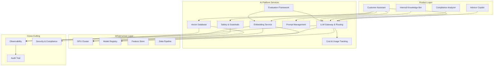

# AI Platform Design for Banking

## Overview

An AI platform in banking provides the foundational infrastructure and services for building, deploying, and operating GenAI applications. It abstracts the complexity of LLM management, embedding generation, vector storage, prompt engineering, safety guardrails, and observability into a cohesive, reusable platform that multiple product teams can consume.

---

## AI Platform Architecture



---

## LLM Gateway and Router

```python
# platform/llm_gateway/router.py
"""
LLM Gateway routes requests to the optimal provider and model.
Handles failover, load balancing, and cost optimization.
"""
from dataclasses import dataclass, field
from typing import List, Dict, Optional
from enum import Enum
import time
import random

class ProviderStatus(Enum):
    HEALTHY = "healthy"
    DEGRADED = "degraded"
    UNHEALTHY = "unhealthy"

@dataclass
class ProviderConfig:
    name: str
    base_url: str
    api_key: str
    models: List[str]
    status: ProviderStatus = ProviderStatus.HEALTHY
    cost_per_1k_tokens: float = 0.0
    avg_latency_ms: float = 0.0
    error_rate: float = 0.0
    weight: float = 1.0  # Load balancing weight
    last_health_check: float = 0.0

@dataclass
class RoutingDecision:
    provider: str
    model: str
    reason: str
    estimated_cost: float
    estimated_latency_ms: float

class LLMRouter:
    """
    Route LLM requests to the optimal provider/model combination.
    Considers: cost, latency, availability, and request requirements.
    """

    def __init__(self, providers: List[ProviderConfig]):
        self.providers = {p.name: p for p in providers}
        self.health_check_interval = 60  # seconds

    def route(self, request: dict) -> RoutingDecision:
        """
        Route a request to the best provider/model.
        Decision factors:
        1. Provider health
        2. Model availability
        3. Cost (within budget)
        4. Latency (within SLA)
        5. Load balancing (distribute traffic)
        """
        candidates = self._get_healthy_candidates(request.get("required_model"))

        if not candidates:
            raise NoHealthyProviderError("No healthy providers available")

        # Score each candidate
        scored = []
        for name, provider in candidates.items():
            score = self._score_provider(
                provider,
                max_cost=request.get("max_cost", float("inf")),
                max_latency=request.get("max_latency_ms", float("inf")),
            )
            if score is not None:
                scored.append((name, provider, score))

        if not scored:
            raise NoSuitableProviderError("No provider meets the requirements")

        # Select the best candidate
        best_name, best_provider, best_score = max(scored, key=lambda x: x[2])

        return RoutingDecision(
            provider=best_name,
            model=best_provider.models[0],  # Primary model
            reason=f"Best score: {best_score:.2f}",
            estimated_cost=best_provider.cost_per_1k_tokens,
            estimated_latency_ms=best_provider.avg_latency_ms,
        )

    def _get_healthy_candidates(self, required_model: str = None) -> Dict[str, ProviderConfig]:
        """Get all healthy providers, optionally filtered by model."""
        candidates = {}
        for name, provider in self.providers.items():
            if provider.status == ProviderStatus.UNHEALTHY:
                continue

            # Check health staleness
            if time.time() - provider.last_health_check > self.health_check_interval:
                continue

            if required_model and required_model not in provider.models:
                continue

            candidates[name] = provider

        return candidates

    def _score_provider(self, provider: ProviderConfig,
                        max_cost: float, max_latency: float) -> Optional[float]:
        """Score a provider based on weighted factors."""
        # Cost score (lower is better)
        cost_score = 1.0 - min(provider.cost_per_1k_tokens / max_cost, 1.0)

        # Latency score (lower is better)
        latency_score = 1.0 - min(provider.avg_latency_ms / max_latency, 1.0)

        # Reliability score (lower error rate is better)
        reliability_score = 1.0 - provider.error_rate

        # Combined score with weights
        weights = {
            "cost": 0.2,
            "latency": 0.3,
            "reliability": 0.5,  # Most important in banking
        }

        score = (
            weights["cost"] * cost_score +
            weights["latency"] * latency_score +
            weights["reliability"] * reliability_score
        )

        return score * provider.weight

    async def health_check(self):
        """Check health of all providers and update status."""
        import aiohttp

        for name, provider in self.providers.items():
            try:
                async with aiohttp.ClientSession() as session:
                    start = time.time()
                    async with session.post(
                        f"{provider.base_url}/health",
                        headers={"Authorization": f"Bearer {provider.api_key}"},
                        timeout=aiohttp.ClientTimeout(total=10),
                    ) as resp:
                        latency = (time.time() - start) * 1000

                        if resp.status == 200:
                            provider.status = ProviderStatus.HEALTHY
                            provider.avg_latency_ms = (
                                0.9 * provider.avg_latency_ms + 0.1 * latency
                            )  # EMA
                        else:
                            provider.status = ProviderStatus.DEGRADED

            except Exception:
                provider.status = ProviderStatus.UNHEALTHY
                provider.error_rate = min(provider.error_rate + 0.1, 1.0)

            provider.last_health_check = time.time()
```

---

## Prompt Management Service

```python
# platform/prompt_management/registry.py
"""
Central prompt registry with versioning, A/B testing, and governance.
"""
from dataclasses import dataclass, field
from datetime import datetime
from typing import Dict, List, Optional
from enum import Enum

class PromptStatus(Enum):
    DRAFT = "draft"
    REVIEW = "review"
    APPROVED = "approved"
    DEPRECATED = "deprecated"

@dataclass
class PromptTemplate:
    id: str
    name: str
    version: int
    template: str
    variables: List[str]
    model: str
    status: PromptStatus
    created_by: str
    created_at: datetime
    approved_by: Optional[str] = None
    approved_at: Optional[datetime] = None
    tags: List[str] = field(default_factory=list)
    metadata: Dict = field(default_factory=dict)

class PromptRegistry:
    """
    Manage prompt templates with versioning and approval workflow.
    """

    def __init__(self):
        self.prompts: Dict[str, Dict[int, PromptTemplate]] = {}
        self.current_versions: Dict[str, int] = {}  # prompt_id -> current version

    def create_prompt(self, name: str, template: str, variables: List[str],
                     model: str, created_by: str, tags: List[str] = None) -> str:
        """Create a new prompt template."""
        import uuid
        prompt_id = str(uuid.uuid4())

        prompt = PromptTemplate(
            id=prompt_id,
            name=name,
            version=1,
            template=template,
            variables=variables,
            model=model,
            status=PromptStatus.DRAFT,
            created_by=created_by,
            created_at=datetime.utcnow(),
            tags=tags or [],
        )

        self.prompts[prompt_id] = {1: prompt}
        self.current_versions[prompt_id] = 1

        return prompt_id

    def approve_prompt(self, prompt_id: str, approved_by: str) -> bool:
        """Approve a prompt for production use."""
        if prompt_id not in self.prompts:
            return False

        current_version = self.current_versions[prompt_id]
        prompt = self.prompts[prompt_id][current_version]

        if prompt.status != PromptStatus.REVIEW:
            return False

        prompt.status = PromptStatus.APPROVED
        prompt.approved_by = approved_by
        prompt.approved_at = datetime.utcnow()

        return True

    def render(self, prompt_id: str, variables: Dict[str, str],
               version: int = None) -> str:
        """Render a prompt template with variables."""
        if prompt_id not in self.prompts:
            raise PromptNotFoundError(prompt_id)

        v = version or self.current_versions[prompt_id]
        template = self.prompts[prompt_id][v]

        if template.status != PromptStatus.APPROVED:
            raise PromptNotApprovedError(f"Prompt {prompt_id} v{v} is not approved")

        # Validate variables
        missing = set(template.variables) - set(variables.keys())
        if missing:
            raise MissingVariablesError(f"Missing variables: {missing}")

        return template.template.format(**variables)

    def get_ab_test_config(self, prompt_ids: List[str]) -> Dict:
        """Get A/B test configuration for multiple prompts."""
        # In practice, this uses a feature flag system
        return {
            prompt_id: {"weight": 1.0 / len(prompt_ids)}
            for prompt_id in prompt_ids
        }
```

---

## Safety and Guardrails Service

```python
# platform/safety/guardrails.py
"""
Multi-layer safety guardrails for GenAI outputs.
"""
from dataclasses import dataclass
from typing import List, Optional
from enum import Enum

class ViolationType(Enum):
    PII_LEAKAGE = "pii_leakage"
    TOXIC_CONTENT = "toxic_content"
    HALLUCINATION = "hallucination"
    REGULATORY_VIOLATION = "regulatory_violation"
    INAPPROPRIATE_ADVICE = "inappropriate_advice"
    PROMPT_INJECTION = "prompt_injection"

@dataclass
class SafetyViolation:
    violation_type: ViolationType
    severity: str  # critical, high, medium, low
    description: str
    confidence: float  # 0-1
    flagged_text: str
    suggestion: str

class SafetyGuard:
    """
    Multi-layer safety guard that validates LLM outputs.
    Layers: PII detection, toxicity filter, hallucination check,
    regulatory compliance, and prompt injection detection.
    """

    def __init__(self):
        self.pii_detector = PIIDetector()
        self.toxicity_filter = ToxicityFilter()
        self.hallucination_checker = HallucinationChecker()
        self.regulatory_checker = RegulatoryComplianceChecker()

    def validate_output(self, output: str, context: dict = None) -> List[SafetyViolation]:
        """Validate LLM output against all safety layers."""
        violations = []

        # Layer 1: PII Detection
        pii_violations = self.pii_detector.detect(output)
        violations.extend(pii_violations)

        # Layer 2: Toxicity Check
        toxic_violations = self.toxicity_filter.check(output)
        violations.extend(toxic_violations)

        # Layer 3: Hallucination Check
        if context:
            hallucinations = self.hallucination_checker.check(output, context)
            violations.extend(hallucinations)

        # Layer 4: Regulatory Compliance
        if context and context.get("domain") == "banking":
            regulatory = self.regulatory_checker.check(output)
            violations.extend(regulatory)

        return violations

    def sanitize(self, output: str, violations: List[SafetyViolation]) -> str:
        """Sanitize output by removing or replacing violating content."""
        sanitized = output

        for violation in violations:
            if violation.violation_type == ViolationType.PII_LEAKAGE:
                sanitized = sanitized.replace(violation.flagged_text, "[REDACTED]")
            elif violation.violation_type in (ViolationType.TOXIC_CONTENT,
                                              ViolationType.REGULATORY_VIOLATION):
                return self._get_safe_fallback(violation.violation_type)

        return sanitized

    def _get_safe_fallback(self, violation_type: ViolationType) -> str:
        """Return a safe fallback message for critical violations."""
        fallbacks = {
            ViolationType.PII_LEAKAGE: "I apologize, but I need to ensure your data is protected. Let me rephrase my response.",
            ViolationType.TOXIC_CONTENT: "I want to provide helpful and respectful information. Let me address your question differently.",
            ViolationType.REGULATORY_VIOLATION: "I can provide general information about banking products, but I recommend consulting with a licensed advisor for personalized advice.",
            ViolationType.HALLUCINATION: "I'm not fully confident about that information. Let me connect you with a banking specialist who can provide accurate details.",
        }
        return fallbacks.get(violation_type, "I'm unable to provide a complete answer at this time.")


class PIIDetector:
    """Detect PII in LLM outputs using regex and ML."""
    import re

    PII_PATTERNS = {
        "ssn": r"\b\d{3}-\d{2}-\d{4}\b",
        "credit_card": r"\b(?:4\d{3}|5[1-5]\d{2}|3[47]\d{2})\d{12}\b",
        "account_number": r"\b\d{8,17}\b",
        "email": r"\b[A-Za-z0-9._%+-]+@[A-Za-z0-9.-]+\.[A-Z|a-z]{2,}\b",
    }

    def detect(self, text: str) -> List[SafetyViolation]:
        violations = []
        for pii_type, pattern in self.PII_PATTERNS.items():
            matches = re.finditer(pattern, text)
            for match in matches:
                violations.append(SafetyViolation(
                    violation_type=ViolationType.PII_LEAKAGE,
                    severity="critical",
                    description=f"Detected {pii_type} in output",
                    confidence=0.95,
                    flagged_text=match.group(),
                    suggestion="Replace with [REDACTED]",
                ))
        return violations
```

---

## Platform Observability

```yaml
# platform/monitoring/dashboards/llm-gateway.json
{
  "dashboard": {
    "title": "LLM Gateway - Real-time Monitoring",
    "panels": [
      {
        "title": "Request Rate by Provider",
        "type": "timeseries",
        "query": "rate(llm_requests_total{provider=~\".+\"}[5m])",
        "description": "Requests per second by LLM provider"
      },
      {
        "title": "P95 Latency by Provider",
        "type": "timeseries",
        "query": "histogram_quantile(0.95, rate(llm_response_duration_seconds_bucket[5m])) * 1000",
        "description": "P95 response time in milliseconds"
      },
      {
        "title": "Token Consumption Rate",
        "type": "timeseries",
        "query": "rate(llm_tokens_total[5m])",
        "description": "Tokens consumed per second across all providers"
      },
      {
        "title": "Cost Per Hour",
        "type": "stat",
        "query": "sum(rate(llm_cost_total[1h])) * 3600",
        "description": "Estimated hourly cost across all providers"
      },
      {
        "title": "Safety Violation Rate",
        "type": "timeseries",
        "query": "rate(safety_violations_total[5m])",
        "description": "Safety violations per second"
      },
      {
        "title": "Provider Health Status",
        "type": "stat",
        "query": "llm_provider_health{provider=~\".+\"}",
        "description": "Health status of each LLM provider (1=healthy, 0=unhealthy)"
      },
      {
        "title": "Error Rate by Type",
        "type": "piechart",
        "query": "sum by (error_type) (rate(llm_errors_total[5m]))",
        "description": "Distribution of error types"
      }
    ],
    "alerts": [
      {
        "name": "Provider Down",
        "condition": "llm_provider_health == 0 for 1m",
        "severity": "critical",
        "action": "Route traffic to backup provider"
      },
      {
        "name": "High Latency",
        "condition": "histogram_quantile(0.95, rate(llm_response_duration_seconds_bucket[5m])) > 5",
        "severity": "warning",
        "action": "Investigate provider performance"
      },
      {
        "name": "Cost Spike",
        "condition": "sum(rate(llm_cost_total[1h])) * 3600 > 100",
        "severity": "warning",
        "action": "Check for unusual query patterns"
      },
      {
        "name": "Safety Violation Spike",
        "condition": "rate(safety_violations_total[5m]) > 0.1",
        "severity": "critical",
        "action": "Review recent prompt/response pairs"
      }
    ]
  }
}
```

---

## Interview Questions

1. **How do you decide which LLM providers to include in the platform?**
   - Evaluate on: (1) Quality on banking-specific tasks (factual accuracy, regulatory compliance), (2) Cost per token, (3) Latency, (4) Data privacy (SOC 2, GDPR compliance), (5) Reliability (SLA, historical uptime), (6) Rate limits. Always have at least 2 providers for failover.

2. **What is the difference between a prompt registry and a prompt template?**
   - A prompt template is the raw text with variable placeholders. A prompt registry manages templates with versioning, approval workflows, A/B testing configuration, usage tracking, and deprecation. The registry ensures only approved prompts reach production.

3. **How do you prevent a single bad prompt from affecting all users?**
   - Use progressive deployment: draft -> review -> approved -> canary (5%) -> full rollout. Each stage requires validation. The prompt registry tracks which version is deployed to which percentage of traffic. Rollback is instant -- revert to the previous approved version.

4. **What metrics should every AI platform track?**
   - Usage: queries/day, tokens/day, active users. Quality: confidence scores, safety violation rate, user satisfaction. Cost: cost/query, cost/day, cost by provider. Performance: P50/P95/P99 latency, error rate, provider health. Business: resolution rate, escalation rate, customer impact.

---

## Cross-References

- See [architecture/shared-platform-design.md](./shared-platform-design.md) for platform team API design
- See [genai-platforms/](../genai-platforms/) for specific GenAI platform patterns
- See [infrastructure/gpu-management.md](../infrastructure/gpu-management.md) for GPU infrastructure
- See [testing-and-quality/llm-evaluation.md](../testing-and-quality/llm-evaluation.md) for evaluation framework
