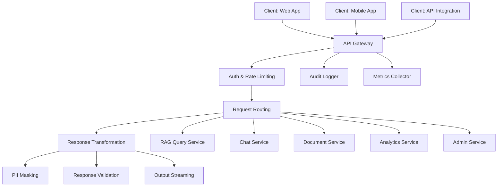

# API Gateway Design in Banking GenAI Systems

## Overview

The API gateway is the single entry point for all client requests to the banking GenAI platform. It handles routing, authentication, rate limiting, transformation, and observability. In banking, the gateway also enforces regulatory controls: request logging, data masking, and audit trail initiation.

For GenAI systems specifically, the gateway must also manage:
- **LLM cost control**: Rate limiting by token usage, not just request count
- **Model routing**: Directing requests to the appropriate model based on complexity
- **Streaming support**: Server-Sent Events (SSE) and WebSocket for token streaming
- **Prompt governance**: Validation, sanitization, and logging of all prompts
- **Output filtering**: Response validation for PII, toxic content, and hallucination detection

---

## Gateway Architecture



---

## Gateway Implementation (Kong/Go)

### Kong Gateway Configuration

```yaml
# gateway/kong.yaml
_format_version: "3.0"

services:
  - name: rag-query
    url: http://rag-query-service:8080
    routes:
      - name: rag-query-route
        paths:
          - /api/v1/rag/query
        methods:
          - POST
        strip_path: false

  - name: chat
    url: http://chat-service:8080
    routes:
      - name: chat-route
        paths:
          - /api/v1/chat
          - /api/v1/chat/completions
        methods:
          - POST
        strip_path: false

  - name: document-service
    url: http://document-service:8080
    routes:
      - name: document-route
        paths:
          - /api/v1/documents
        methods:
          - GET
          - POST
          - DELETE
        strip_path: false

plugins:
  # Authentication
  - name: jwt
    config:
      key_claim_name: iss
      secret_is_base64: false
      claims_to_verify:
        - exp
        - nbf

  # Rate limiting
  - name: rate-limiting-advanced
    config:
      limit:
        - 100
      window_size:
        - 60
      window_type: sliding
      strategy: redis
      redis:
        host: redis-gateway
        port: 6379
      identifier: consumer

  # Request transformation
  - name: request-transformer
    config:
      add:
        headers:
          - X-Request-ID:$(uuid)
          - X-Gateway-Version:2.3.0
      remove:
        headers:
          - X-Internal-Debug

  # Response transformation
  - name: response-transformer
    config:
      add:
        headers:
          - X-Response-Source:banking-genai-gateway
      remove:
        headers:
          - X-Internal-Server-ID

  # Request size limiting
  - name: request-size-limiting
    config:
        allowed_payload_size: 10  # MB
        require_content_length: false

  # IP restriction (for admin endpoints)
  - name: ip-restriction
    config:
      allow:
        - 10.0.0.0/8
        - 172.16.0.0/12
    route: admin-route
```

---

## Custom Gateway (Go)

```go
// gateway/main.go
/*
Custom API Gateway for Banking GenAI Platform.
Handles: auth, routing, rate limiting, audit logging, response filtering.
*/
package main

import (
    "encoding/json"
    "log"
    "net/http"
    "net/http/httputil"
    "net/url"
    "strings"
    "time"
)

// Gateway orchestrates all middleware and routing
type Gateway struct {
    authMiddleware    AuthMiddleware
    rateLimiter       RateLimiter
    auditLogger       AuditLogger
    promptValidator   PromptValidator
    responseFilter    ResponseFilter
    routes            map[string]*url.URL
    metricsCollector  MetricsCollector
}

func NewGateway(config Config) *Gateway {
    return &Gateway{
        authMiddleware:    NewAuthMiddleware(config.Auth),
        rateLimiter:       NewRateLimiter(config.Redis),
        auditLogger:       NewAuditLogger(config.Audit),
        promptValidator:   NewPromptValidator(),
        responseFilter:    NewResponseFilter(),
        metricsCollector:  NewMetricsCollector(),
        routes: map[string]*url.URL{
            "/api/v1/rag/query":       mustParse(config.RAGServiceURL),
            "/api/v1/chat":            mustParse(config.ChatServiceURL),
            "/api/v1/chat/completions": mustParse(config.ChatServiceURL),
            "/api/v1/documents":       mustParse(config.DocumentServiceURL),
            "/api/v1/analytics":       mustParse(config.AnalyticsServiceURL),
            "/api/v1/admin":           mustParse(config.AdminServiceURL),
        },
    }
}

func (g *Gateway) ServeHTTP(w http.ResponseWriter, r *http.Request) {
    startTime := time.Now()
    requestID := generateRequestID()

    // Add request ID to all responses
    w.Header().Set("X-Request-ID", requestID)

    // 1. Authentication
    if !strings.HasPrefix(r.URL.Path, "/health") {
        if err := g.authMiddleware.Authenticate(r); err != nil {
            g.metricsCollector.RecordError("auth_failed")
            g.auditLogger.LogFailedAuth(r, requestID, err)
            http.Error(w, "Unauthorized", http.StatusUnauthorized)
            return
        }
    }

    // 2. Rate limiting
    customerID := extractCustomerID(r)
    if !g.rateLimiter.Allow(customerID) {
        g.metricsCollector.RecordError("rate_limited")
        w.Header().Set("Retry-After", "60")
        http.Error(w, "Rate limit exceeded", http.StatusTooManyRequests)
        return
    }

    // 3. Prompt validation (for AI endpoints)
    if strings.HasPrefix(r.URL.Path, "/api/v1/rag") ||
       strings.HasPrefix(r.URL.Path, "/api/v1/chat") {
        body, err := g.promptValidator.Validate(r)
        if err != nil {
            g.metricsCollector.RecordError("prompt_validation_failed")
            g.auditLogger.LogPromptValidationFailure(r, requestID, err)
            http.Error(w, "Invalid prompt", http.StatusBadRequest)
            return
        }
        // Replace body with validated version
        r.Body = body
    }

    // 4. Route to backend service
    target, ok := g.findRoute(r.URL.Path)
    if !ok {
        http.NotFound(w, r)
        return
    }

    // 5. Proxy request
    proxy := httputil.NewSingleHostReverseProxy(target)

    // Custom error handler
    proxy.ErrorHandler = func(w http.ResponseWriter, r *http.Request, err error) {
        log.Printf("Proxy error: %v", err)
        g.metricsCollector.RecordError("backend_error")
        http.Error(w, "Service temporarily unavailable", http.StatusBadGateway)
    }

    // Custom response handler for filtering
    originalDirector := proxy.Director
    proxy.Director = func(req *http.Request) {
        originalDirector(req)
        req.Header.Set("X-Request-ID", requestID)
        req.Header.Set("X-Customer-ID", customerID)
    }

    // Wrap response writer for filtering
    wrappedWriter := &responseWrapper{
        ResponseWriter: w,
        filter:         g.responseFilter,
        requestID:      requestID,
        auditLogger:    g.auditLogger,
    }

    proxy.ServeHTTP(wrappedWriter, r)

    // 6. Audit log and metrics
    duration := time.Since(startTime)
    g.metricsCollector.RecordRequest(r.URL.Path, duration)
    g.auditLogger.LogRequest(r, requestID, duration)
}

// responseWrapper intercepts the response to apply filtering
type responseWrapper struct {
    http.ResponseWriter
    filter         *ResponseFilter
    requestID      string
    auditLogger    AuditLogger
    statusCode     int
    body           []byte
}

func (rw *responseWrapper) Write(b []byte) (int, error) {
    rw.body = append(rw.body, b...)
    return len(b), nil
}

func (rw *responseWrapper) WriteHeader(statusCode int) {
    rw.statusCode = statusCode
}

func (rw *responseWrapper) FlushResponse() {
    // Apply response filtering
    filtered, err := rw.filter.Apply(rw.body, rw.statusCode)
    if err != nil {
        log.Printf("Response filter error: %v", err)
        rw.ResponseWriter.WriteHeader(http.StatusInternalServerError)
        rw.ResponseWriter.Write([]byte(`{"error":"Response processing error"}`))
        return
    }

    rw.ResponseWriter.WriteHeader(rw.statusCode)
    rw.ResponseWriter.Write(filtered)

    // Audit log the response (with PII masking)
    rw.auditLogger.LogResponse(rw.requestID, rw.statusCode, filtered)
}
```

---

## Model Routing Based on Query Complexity

```python
# gateway/model_router.py
"""
Intelligent model routing: route queries to the appropriate model
based on complexity, cost, and latency requirements.
"""
from enum import Enum
from dataclass import dataclass
from typing import Dict

class ModelTier(Enum):
    FAST = "fast"          # Small model, low cost, low latency
    BALANCED = "balanced"  # Medium model, medium cost
    PREMIUM = "premium"    # Large model, high cost, high accuracy

@dataclass
class RoutingDecision:
    model: str
    tier: ModelTier
    reason: str
    estimated_cost: float
    estimated_latency_ms: float

class ModelRouter:
    """Route queries to the optimal model based on complexity analysis."""

    MODEL_CONFIG = {
        ModelTier.FAST: {
            "model": "gpt-3.5-turbo",
            "max_cost_per_query": 0.002,
            "target_latency_ms": 500,
            "use_cases": ["greeting", "simple_factual", "navigation"],
        },
        ModelTier.BALANCED: {
            "model": "gpt-4-turbo",
            "max_cost_per_query": 0.01,
            "target_latency_ms": 1500,
            "use_cases": ["account_inquiry", "product_comparison", "policy_explanation"],
        },
        ModelTier.PREMIUM: {
            "model": "gpt-4-turbo",
            "max_cost_per_query": 0.05,
            "target_latency_ms": 3000,
            "use_cases": ["regulatory_advice", "complex_analysis", "compliance_check"],
        },
    }

    def route(self, query: str, context: dict = None) -> RoutingDecision:
        """Determine the optimal model for a query."""
        complexity = self._assess_complexity(query, context or {})

        if complexity["score"] < 0.3:
            tier = ModelTier.FAST
            reason = "Simple query -- fast model sufficient"
        elif complexity["score"] < 0.7:
            tier = ModelTier.BALANCED
            reason = "Moderate complexity -- balanced model recommended"
        else:
            tier = ModelTier.PREMIUM
            reason = "Complex query -- premium model required"

        # Override based on context
        if context.get("regulatory", False):
            tier = ModelTier.PREMIUM
            reason = "Regulatory context -- premium model required"

        if context.get("priority") == "low_latency":
            tier = min(tier, ModelTier.BALANCED)
            reason = "Low latency requirement -- using faster model"

        config = self.MODEL_CONFIG[tier]
        return RoutingDecision(
            model=config["model"],
            tier=tier,
            reason=reason,
            estimated_cost=config["max_cost_per_query"],
            estimated_latency_ms=config["target_latency_ms"],
        )

    def _assess_complexity(self, query: str, context: dict) -> dict:
        """Assess query complexity using heuristic rules."""
        score = 0.0
        reasons = []

        # Length-based complexity
        word_count = len(query.split())
        if word_count > 50:
            score += 0.3
            reasons.append("long query")
        elif word_count > 20:
            score += 0.1

        # Keyword-based complexity
        complex_keywords = [
            "compare", "analyze", "explain why", "calculate",
            "regulation", "compliance", "BSA", "AML", "Regulation",
        ]
        for keyword in complex_keywords:
            if keyword.lower() in query.lower():
                score += 0.2
                reasons.append(f"complex keyword: {keyword}")
                break

        # Multi-part question
        if "?" in query and query.count("?") > 1:
            score += 0.2
            reasons.append("multi-part question")

        # Financial calculations
        if any(kw in query.lower() for kw in ["interest", "payment", "amortization", "apr"]):
            score += 0.15
            reasons.append("financial calculation")

        return {
            "score": min(score, 1.0),
            "reasons": reasons,
        }
```

---

## Token-Based Rate Limiting

```python
# gateway/token_rate_limiter.py
"""
Rate limit based on token usage, not just request count.
Critical for cost control in GenAI systems.
"""
import time
from dataclasses import dataclass
import redis

@dataclass
class TokenBudget:
    daily_limit: int       # Max tokens per day
    minute_limit: int      # Max tokens per minute
    remaining_daily: int
    remaining_minute: int

class TokenRateLimiter:
    """Enforce token-based rate limiting per customer."""

    def __init__(self, redis_url: str):
        self.redis = redis.from_url(redis_url)

    def check_and_consume(self, customer_id: str, estimated_tokens: int) -> TokenBudget:
        """Check if the customer has token budget and consume it."""
        now = int(time.time())
        minute_window = now // 60
        day_window = now // 86400

        daily_key = f"token_daily:{customer_id}:{day_window}"
        minute_key = f"token_minute:{customer_id}:{minute_window}"

        # Get current usage
        daily_used = int(self.redis.get(daily_key) or 0)
        minute_used = int(self.redis.get(minute_key) or 0)

        daily_limit = 100_000  # 100K tokens per day
        minute_limit = 10_000  # 10K tokens per minute

        if daily_used + estimated_tokens > daily_limit:
            raise TokenBudgetExceeded(f"Daily token limit exceeded: {daily_used}/{daily_limit}")
        if minute_used + estimated_tokens > minute_limit:
            raise TokenBudgetExceeded(f"Minute token limit exceeded: {minute_used}/{minute_limit}")

        # Consume tokens
        pipe = self.redis.pipeline()
        pipe.incrby(daily_key, estimated_tokens)
        pipe.expire(daily_key, 86400)
        pipe.incrby(minute_key, estimated_tokens)
        pipe.expire(minute_key, 60)
        pipe.execute()

        return TokenBudget(
            daily_limit=daily_limit,
            minute_limit=minute_limit,
            remaining_daily=daily_limit - daily_used - estimated_tokens,
            remaining_minute=minute_limit - minute_used - estimated_tokens,
        )
```

---

## Interview Questions

1. **Why would you build a custom gateway instead of using Kong or APISIX?**
   - Custom gateways are justified when you need deep integration with banking-specific logic: custom audit logging formats, proprietary authentication schemes, model routing based on query complexity, or token-based rate limiting that standard gateways do not support. For most teams, Kong or APISIX with custom plugins is the right choice.

2. **How do you handle streaming responses through an API gateway?**
   - The gateway must support bidirectional streaming (SSE or WebSocket). It cannot buffer the full response. In Kong, use the `proxy_buffering off` directive. In a custom gateway, use `http.Flusher` in Go or streaming response middleware in Node.js.

3. **What is model routing and why is it important for cost control?**
   - Model routing directs simple queries to cheaper, faster models and complex queries to expensive, accurate models. Without routing, all queries use the premium model, wasting 60-80% of inference costs on queries that could be handled by smaller models.

4. **How do you enforce rate limiting in a distributed gateway deployment?**
   - Use Redis as the shared state store for rate limit counters. The sliding window algorithm (or token bucket) ensures accurate rate limiting across multiple gateway instances. Each gateway instance checks and increments the same Redis key.

---

## Cross-References

- See [architecture/monolith-vs-microservices.md](./monolith-vs-microservices.md) for service topology
- See [architecture/service-boundaries.md](./service-boundaries.md) for service contracts
- See [genai-platforms/model-routing.md](../genai-platforms/model-routing.md) for model routing strategies
- See [infrastructure/rate-limiting.md](../infrastructure/rate-limiting.md) for rate limiting patterns
