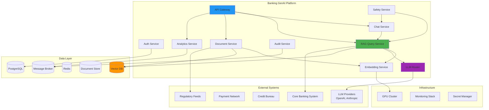
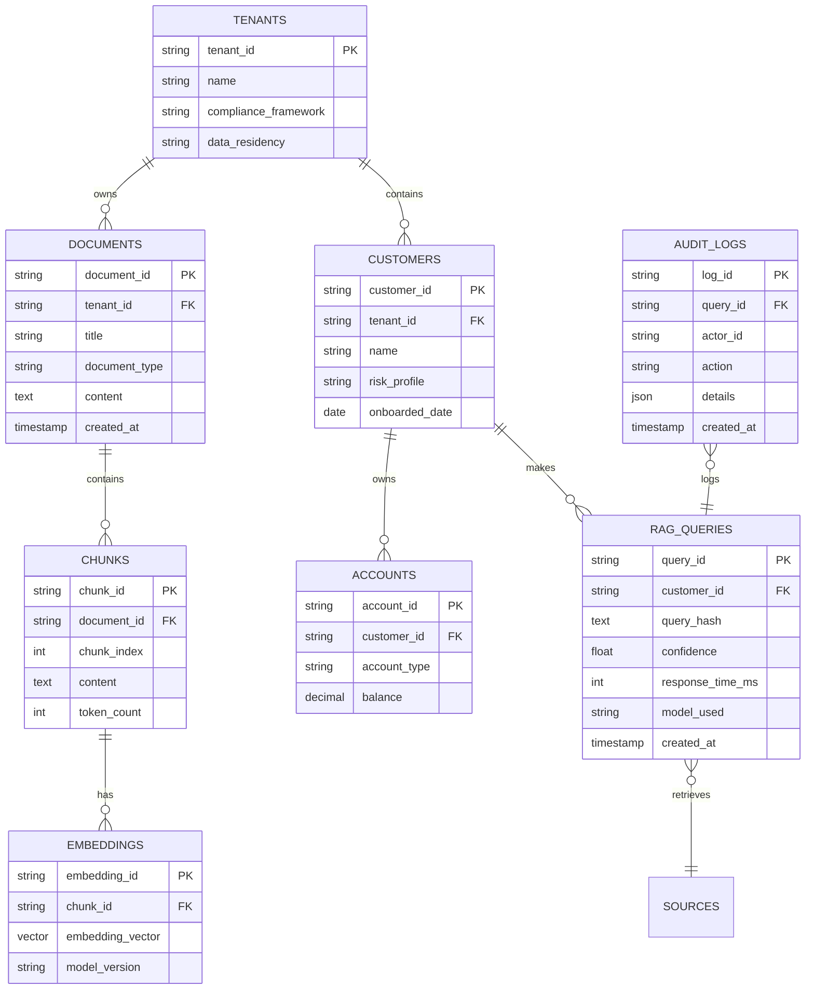
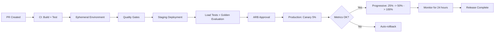

# Architecture Example: Full GenAI Platform for Banking

## Overview

This document presents a complete, production-grade architecture for a banking GenAI platform. It integrates all patterns described throughout this academy into a single cohesive system serving retail banking, wealth management, compliance, and operations teams.

---

## System Context



---

## Component Details

### 1. API Gateway (Kong)

```yaml
# gateway/configuration.yaml
services:
  - name: rag-query
    url: http://rag-query-service:8080
    routes:
      - paths: [/api/v1/rag/query]
        methods: [POST]
        strip_path: false

  - name: chat
    url: http://chat-service:8080
    routes:
      - paths: [/api/v1/chat, /api/v1/chat/completions]
        methods: [POST]

  - name: documents
    url: http://document-service:8080
    routes:
      - paths: [/api/v1/documents]
        methods: [GET, POST, DELETE]

  - name: analytics
    url: http://analytics-service:8080
    routes:
      - paths: [/api/v1/analytics]
        methods: [GET]

plugins:
  - name: jwt
  - name: rate-limiting-advanced
    config:
      limit: [100]
      window_size: [60]
      strategy: redis
  - name: prometheus
  - name: request-transformer
    config:
      add:
        headers:
          - X-Request-ID:$(uuid)
          - X-Gateway-Version:3.0.0
```

### 2. RAG Query Service

```python
# services/rag-query/app.py
"""
RAG Query Service: the core of the banking GenAI platform.
Handles: retrieval, ranking, generation, safety validation.
"""
from fastapi import FastAPI, Depends, HTTPException
from pydantic import BaseModel, Field
from typing import List, Optional

app = FastAPI(title="Banking RAG Query Service", version="3.0.0")

class QueryRequest(BaseModel):
    query: str = Field(..., min_length=1, max_length=4000)
    customer_id: str = Field(..., pattern=r"^CUST-\d{3,}$")
    tenant: str = Field(..., enum=["retail-banking", "wealth-management", "compliance", "operations"])
    max_tokens: int = Field(default=512, ge=64, le=4096)
    temperature: float = Field(default=0.0, ge=0.0, le=1.0)
    session_id: Optional[str] = None

class Source(BaseModel):
    document_id: str
    title: str
    relevance_score: float
    content_snippet: str

class QueryResponse(BaseModel):
    answer: str
    confidence: float = Field(..., ge=0.0, le=1.0)
    sources: List[Source]
    metadata: dict

@app.post("/api/v1/rag/query", response_model=QueryResponse)
async def query(
    request: QueryRequest,
    auth=Depends(auth_middleware),
    safety=Depends(safety_middleware),
):
    """
    Execute a RAG query with full safety, audit, and quality validation.

    Flow:
    1. Authenticate and authorize
    2. Validate input safety
    3. Generate query embedding
    4. Retrieve top-k relevant documents
    5. Rerank documents
    6. Construct prompt with context
    7. Call LLM (with model routing)
    8. Validate output safety
    9. Audit log
    10. Return response
    """
    # Step 1: Auth done by middleware

    # Step 2: Safety check input
    safety_result = await safety.check_input(request.query)
    if safety_result.blocked:
        raise HTTPException(status_code=400, detail=safety_result.reason)

    # Step 3: Embed query
    query_embedding = await embedding_service.embed(request.query)

    # Step 4: Retrieve relevant documents
    documents = await vector_db.search(
        collection=f"documents-{request.tenant}",
        query_vector=query_embedding,
        top_k=10,
        filter={"tenant_id": request.tenant},
    )

    # Step 5: Rerank
    reranked = await reranker.rank(request.query, documents, top_k=5)

    # Step 6: Construct prompt
    prompt = build_rag_prompt(
        query=request.query,
        context=[doc["text"] for doc in reranked],
        system_prompt=load_system_prompt(request.tenant),
    )

    # Step 7: Route and call LLM
    routing = llm_router.route(request, prompt)
    response = await llm_client.complete(
        provider=routing.provider,
        model=routing.model,
        prompt=prompt,
        max_tokens=request.max_tokens,
        temperature=request.temperature,
    )

    # Step 8: Validate output
    output_safety = await safety.check_output(response["text"])
    if output_safety.violations:
        response["text"] = safety.sanitize(response["text"], output_safety.violations)

    # Step 9: Audit
    await audit_service.log_query({
        "query_hash": hash_query(request.query),
        "customer_id": request.customer_id,
        "tenant": request.tenant,
        "response_time_ms": response["processing_time_ms"],
        "confidence": response["confidence"],
        "model": routing.model,
        "token_count": response["token_count"],
    })

    # Step 10: Return
    return QueryResponse(
        answer=response["text"],
        confidence=response["confidence"],
        sources=[Source(**doc) for doc in reranked],
        metadata=response.get("metadata", {}),
    )
```

### 3. LLM Router

```python
# services/llm-router/router.py
"""
Multi-provider LM router with cost optimization, failover, and load balancing.
"""
from dataclasses import dataclass

@dataclass
class ProviderConfig:
    name: str
    base_url: str
    models: dict
    cost_per_1k: float
    max_rpm: int
    status: str = "healthy"
    weight: float = 1.0

PROVIDERS = {
    "openai": ProviderConfig(
        name="openai",
        base_url="https://api.openai.com/v1",
        models={"primary": "gpt-4-turbo", "fallback": "gpt-3.5-turbo"},
        cost_per_1k=0.01,
        max_rpm=10000,
    ),
    "anthropic": ProviderConfig(
        name="anthropic",
        base_url="https://api.anthropic.com/v1",
        models={"primary": "claude-3-sonnet", "fallback": "claude-3-haiku"},
        cost_per_1k=0.008,
        max_rpm=5000,
    ),
    "self-hosted": ProviderConfig(
        name="self-hosted",
        base_url="http://llama-inference:8080/v1",
        models={"primary": "llama-3-70b", "fallback": "mistral-7b"},
        cost_per_1k=0.002,  # Infrastructure cost allocated per token
        max_rpm=2000,
    ),
}
```

### 4. Data Architecture



### 5. Infrastructure (Kubernetes)

```yaml
# infrastructure/production/namespace.yaml
apiVersion: v1
kind: Namespace
metadata:
  name: banking-genai
  labels:
    environment: production
    compliance: SOC2-GDPR
---
# infrastructure/production/deployments.yaml
apiVersion: apps/v1
kind: Deployment
metadata:
  name: rag-query-service
  namespace: banking-genai
spec:
  replicas: 5
  strategy:
    type: RollingUpdate
    rollingUpdate:
      maxSurge: 1
      maxUnavailable: 0
  selector:
    matchLabels:
      app: rag-query
  template:
    metadata:
      labels:
        app: rag-query
      annotations:
        prometheus.io/scrape: "true"
        prometheus.io/port: "8080"
        prometheus.io/path: "/metrics"
    spec:
      serviceAccountName: rag-query-sa
      securityContext:
        runAsNonRoot: true
        fsGroup: 1000
      containers:
        - name: rag-query
          image: registry.banking-genai.internal/rag-query:v3.2.1
          ports:
            - containerPort: 8080
          resources:
            requests:
              cpu: "2"
              memory: "4Gi"
            limits:
              cpu: "4"
              memory: "8Gi"
          env:
            - name: VECTOR_DB_URL
              valueFrom:
                configMapKeyRef:
                  name: platform-config
                  key: vector_db_url
            - name: LLM_ROUTER_URL
              valueFrom:
                configMapKeyRef:
                  name: platform-config
                  key: llm_router_url
            - name: SAFETY_SERVICE_URL
              valueFrom:
                configMapKeyRef:
                  name: platform-config
                  key: safety_url
            - name: EMBEDDING_MODEL
              value: "text-embedding-3-large"
            - name: LOG_LEVEL
              value: "info"
          readinessProbe:
            httpGet:
              path: /health
              port: 8080
            initialDelaySeconds: 10
            periodSeconds: 5
          livenessProbe:
            httpGet:
              path: /health
              port: 8080
            initialDelaySeconds: 30
            periodSeconds: 15
      affinity:
        podAntiAffinity:
          preferredDuringSchedulingIgnoredDuringExecution:
            - weight: 100
              podAffinityTerm:
                labelSelector:
                  matchExpressions:
                    - key: app
                      operator: In
                      values:
                        - rag-query
                topologyKey: kubernetes.io/hostname
---
# GPU deployment for embedding service
apiVersion: apps/v1
kind: Deployment
metadata:
  name: embedding-service
  namespace: banking-genai
spec:
  replicas: 3
  selector:
    matchLabels:
      app: embedding-service
  template:
    spec:
      containers:
        - name: embedding-service
          image: registry.banking-genai.internal/embedding-service:v2.1.0
          resources:
            requests:
              nvidia.com/gpu: 1
              cpu: "4"
              memory: "16Gi"
            limits:
              nvidia.com/gpu: 1
              cpu: "8"
              memory: "32Gi"
      nodeSelector:
        gpu-type: a100-80gb
      tolerations:
        - key: nvidia.com/gpu
          operator: Exists
          effect: NoSchedule
```

### 6. Monitoring and Observability

```yaml
# monitoring/grafana-dashboard.json
{
  "dashboard": {
    "title": "Banking GenAI Platform -- Overview",
    "panels": [
      {
        "title": "Query Volume",
        "type": "timeseries",
        "targets": [
          {"expr": "rate(rag_query_total[5m])", "legend": "Queries/sec"}
        ]
      },
      {
        "title": "Response Time (P50, P95, P99)",
        "type": "timeseries",
        "targets": [
          {"expr": "histogram_quantile(0.50, rate(rag_query_duration_bucket[5m]))", "legend": "P50"},
          {"expr": "histogram_quantile(0.95, rate(rag_query_duration_bucket[5m]))", "legend": "P95"},
          {"expr": "histogram_quantile(0.99, rate(rag_query_duration_bucket[5m]))", "legend": "P99"}
        ]
      },
      {
        "title": "Confidence Distribution",
        "type": "histogram",
        "targets": [
          {"expr": "rag_query_confidence", "legend": "Confidence"}
        ]
      },
      {
        "title": "Error Rate",
        "type": "timeseries",
        "targets": [
          {"expr": "rate(rag_query_errors_total[5m]) / rate(rag_query_total[5m])", "legend": "Error Rate"}
        ]
      },
      {
        "title": "LLM Provider Usage",
        "type": "piechart",
        "targets": [
          {"expr": "sum by (provider) (rate(llm_calls_total[1h]))", "legend": "{{provider}}"}
        ]
      },
      {
        "title": "Cost Per Hour",
        "type": "stat",
        "targets": [
          {"expr": "sum(rate(llm_cost_total[1h])) * 3600", "legend": "$/hr"}
        ]
      },
      {
        "title": "Safety Violations",
        "type": "timeseries",
        "targets": [
          {"expr": "rate(safety_violations_total[5m])", "legend": "Violations/sec"}
        ]
      },
      {
        "title": "GPU Utilization",
        "type": "timeseries",
        "targets": [
          {"expr": "DCGM_FI_DEV_GPU_UTIL", "legend": "GPU {{gpu}}"}
        ]
      }
    ]
  }
}
```

---

## Deployment Strategy



---

## Key Design Decisions

| Decision | Choice | Rationale |
|---|---|---|
| Vector Database | Qdrant (self-hosted) | Best latency, data sovereignty, multi-tenant support |
| LLM Strategy | Multi-provider (OpenAI + Anthropic + self-hosted) | Failover, cost optimization, data sovereignty |
| Embedding Model | text-embedding-3-large (primary), all-MiniLM (fallback) | Quality vs. cost tradeoff |
| API Gateway | Kong | Mature ecosystem, plugin architecture |
| Message Broker | RabbitMQ | Reliable delivery, dead letter queues |
| Cache | Redis with semantic search | High hit rate for repetitive banking queries |
| Database | PostgreSQL 16 | Mature, strong consistency, row-level security |
| Orchestration | Kubernetes + OpenShift | Banking standard, built-in security |
| Observability | Prometheus + Grafana + OpenTelemetry | Industry standard, GPU metrics support |

---

## Interview Questions

1. **How would this architecture handle a 10x traffic spike during a market event?**
   - HPA scales the stateless services (RAG Query, Chat) from 5 to 50 pods within 2 minutes. The GPU-embedding service scales more slowly (GPU provisioning takes time), so the LLM router routes embedding requests to the cloud provider as overflow. Redis cache absorbs repeated queries. Vector DB read replicas handle the increased search load. If the LLM provider rate limits, the circuit breaker fails over to the backup provider.

2. **What is the single point of failure in this architecture?**
   - The PostgreSQL primary for the write path. Mitigation: synchronous replication to a standby node with automatic failover. The API Gateway is another potential SPOF -- mitigated by deploying Kong in high-availability mode with multiple replicas behind a load balancer.

3. **How do you isolate a misbehaving tenant from affecting others?**
   - Per-tenant rate limiting at the gateway. Per-tenant circuit breakers for LLM calls. Network policies isolate tenant data. Resource quotas limit GPU and memory usage per tenant. If a tenant exceeds their budget, hard limits block further usage.

4. **What would you change if building this architecture today vs. 2 years ago?**
   - Use structured outputs (JSON mode) from LLMs instead of parsing unstructured text. Use smaller, specialized models (7B-13B) that now match 70B models from 2 years ago. Implement prompt caching at the provider level (OpenAI now supports this). Use serverless GPU inference for spiky workloads.

---

## Cross-References

- See [architecture/monolith-vs-microservices.md](./monolith-vs-microservices.md) for service topology decisions
- See [architecture/ai-platform-design.md](./ai-platform-design.md) for platform layer design
- See [architecture/multi-tenant-design.md](./multi-tenant-design.md) for tenant isolation
- See [architecture/security.md](./zero-trust-architecture.md) for security implementation
