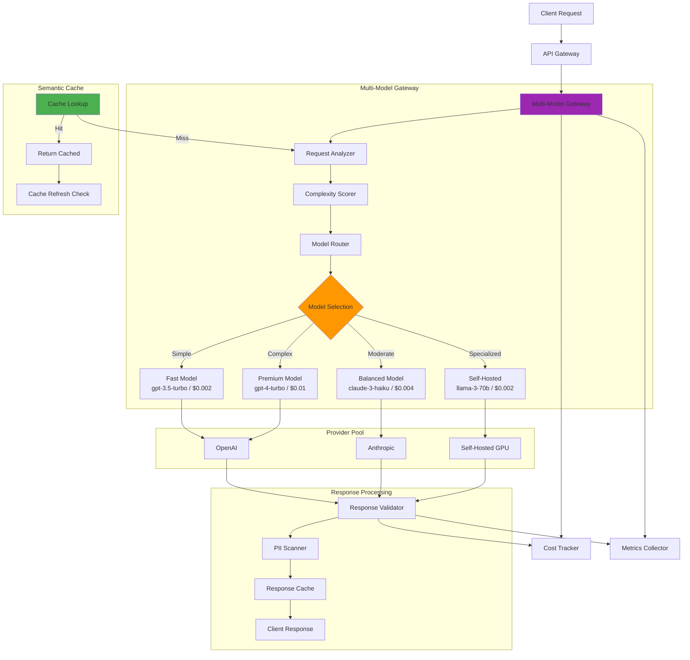

# Architecture Example: Multi-Model Gateway with Routing and Caching

## Overview

This document presents a production-grade multi-model gateway that routes LLM requests to the optimal model based on query complexity, cost constraints, latency requirements, and provider availability. It includes a semantic caching layer that reduces redundant LLM calls by 30-40% for repetitive banking queries.

---

## Architecture Diagram



---

## Gateway Implementation

### Core Gateway (Go)

```go
// gateway/gateway.go
/*
Multi-Model LLM Gateway with routing, caching, and cost optimization.
Built in Go for high performance and concurrency.
*/
package main

import (
    "context"
    "encoding/json"
    "log"
    "net/http"
    "sync"
    "time"
)

// Gateway manages all LLM routing logic
type Gateway struct {
    router         *ModelRouter
    cache          *SemanticCache
    providers      map[string]LLMProvider
    costTracker    *CostTracker
    metrics        *MetricsCollector
    safetyFilter   *SafetyFilter
}

// CompletionRequest represents an incoming LLM request
type CompletionRequest struct {
    Messages       []Message       `json:"messages"`
    Model          string          `json:"model,omitempty"`           // Optional: client-specified model
    MaxTokens      int             `json:"max_tokens"`
    Temperature    float64         `json:"temperature"`
    CustomerID     string          `json:"customer_id"`
    TenantID       string          `json:"tenant_id"`
    Priority       string          `json:"priority"`        // low, normal, high
    MaxCostCents   int             `json:"max_cost_cents"`  // Budget limit for this request
}

type Message struct {
    Role    string `json:"role"`
    Content string `json:"content"`
}

type CompletionResponse struct {
    ID            string    `json:"id"`
    Model         string    `json:"model"`
    Provider      string    `json:"provider"`
    Content       string    `json:"content"`
    TokenCount    int       `json:"token_count"`
    CostCents     float64   `json:"cost_cents"`
    CacheHit      bool      `json:"cache_hit"`
    LatencyMs     int       `json:"latency_ms"`
    Confidence    float64   `json:"confidence"`
}

func (g *Gateway) HandleCompletion(w http.ResponseWriter, r *http.Request) {
    startTime := time.Now()

    // Parse request
    var req CompletionRequest
    if err := json.NewDecoder(r.Body).Decode(&req); err != nil {
        http.Error(w, "Invalid request", http.StatusBadRequest)
        return
    }

    // Step 1: Check semantic cache
    if cached, found := g.cache.Get(req.Messages[0].Content, req.TenantID); found {
        g.metrics.RecordCacheHit()
        g.metrics.RecordLatency(time.Since(startTime))

        resp := CompletionResponse{
            ID:         cached.ID,
            Model:      cached.Model,
            Provider:   "cache",
            Content:    cached.Content,
            TokenCount: 0,
            CostCents:  0,
            CacheHit:   true,
            LatencyMs:  int(time.Since(startTime).Milliseconds()),
        }
        g.costTracker.RecordCost(0, req.TenantID) // Free from cache
        respondJSON(w, http.StatusOK, resp)
        return
    }

    // Step 2: Analyze and route
    routeDecision := g.router.Route(req)

    // Step 3: Check budget
    if routeDecision.EstimatedCostCents > float64(req.MaxCostCents) && req.MaxCostCents > 0 {
        http.Error(w, "Request exceeds budget", http.StatusPaymentRequired)
        return
    }

    // Step 4: Call provider
    provider, ok := g.providers[routeDecision.Provider]
    if !ok {
        http.Error(w, "Provider unavailable", http.StatusServiceUnavailable)
        return
    }

    // Step 5: Execute with circuit breaker
    ctx, cancel := context.WithTimeout(r.Context(), 30*time.Second)
    defer cancel()

    result, err := provider.Complete(ctx, req, routeDecision.Model)
    if err != nil {
        g.metrics.RecordProviderError(routeDecision.Provider)
        // Try failover
        result, err = g.router.Failover(req, routeDecision)
        if err != nil {
            http.Error(w, "All providers failed", http.StatusBadGateway)
            return
        }
    }

    // Step 6: Safety filter
    filteredContent, violations := g.safetyFilter.Check(result.Content)
    if len(violations) > 0 {
        log.Printf("Safety violations detected: %v", violations)
        filteredContent = g.safetyFilter.Sanitize(filteredContent, violations)
    }

    // Step 7: Cache the response
    g.cache.Store(req.Messages[0].Content, CompletionResponse{
        ID:      result.ID,
        Model:   routeDecision.Model,
        Content: filteredContent,
    }, req.TenantID)

    // Step 8: Track cost and metrics
    costCents := g.costTracker.CalculateCost(result.TokenCount, routeDecision.Model, routeDecision.Provider)
    g.costTracker.RecordCost(costCents, req.TenantID)
    g.metrics.RecordLatency(time.Since(startTime))
    g.metrics.RecordProviderUsage(routeDecision.Provider, routeDecision.Model)

    // Step 9: Return response
    resp := CompletionResponse{
        ID:         result.ID,
        Model:      routeDecision.Model,
        Provider:   routeDecision.Provider,
        Content:    filteredContent,
        TokenCount: result.TokenCount,
        CostCents:  costCents,
        CacheHit:   false,
        LatencyMs:  int(time.Since(startTime).Milliseconds()),
        Confidence: result.Confidence,
    }

    respondJSON(w, http.StatusOK, resp)
}
```

---

## Model Router

```python
# gateway/model_router.py
"""
Intelligent model router that selects the optimal LLM based on
query complexity, cost, latency requirements, and provider health.
"""
from dataclasses import dataclass
from typing import Dict, List
from enum import Enum
import math

class ModelTier(Enum):
    FAST = "fast"           # Simple queries, lowest cost
    BALANCED = "balanced"   # Most queries, moderate cost
    PREMIUM = "premium"     # Complex queries, highest quality
    SPECIALIZED = "specialized"  # Banking-specific self-hosted models

@dataclass
class RouteDecision:
    model: str
    provider: str
    tier: ModelTier
    reason: str
    estimated_cost_cents: float
    estimated_latency_ms: float
    fallback_model: str
    fallback_provider: str

class ModelRouter:
    """Route queries to optimal model based on multi-factor scoring."""

    # Model catalog with capabilities and costs
    MODEL_CATALOG = {
        "gpt-3.5-turbo": {
            "provider": "openai",
            "tier": ModelTier.FAST,
            "cost_per_1k": 0.002,
            "avg_latency_ms": 400,
            "max_context": 16385,
            "capabilities": ["greeting", "factual", "simple_reasoning"],
        },
        "claude-3-haiku": {
            "provider": "anthropic",
            "tier": ModelTier.BALANCED,
            "cost_per_1k": 0.004,
            "avg_latency_ms": 600,
            "max_context": 200000,
            "capabilities": ["factual", "reasoning", "summarization", "extraction"],
        },
        "gpt-4-turbo": {
            "provider": "openai",
            "tier": ModelTier.PREMIUM,
            "cost_per_1k": 0.01,
            "avg_latency_ms": 1500,
            "max_context": 128000,
            "capabilities": ["complex_reasoning", "math", "code", "regulatory", "multi_step"],
        },
        "claude-3-sonnet": {
            "provider": "anthropic",
            "tier": ModelTier.PREMIUM,
            "cost_per_1k": 0.008,
            "avg_latency_ms": 1200,
            "max_context": 200000,
            "capabilities": ["complex_reasoning", "document_analysis", "regulatory"],
        },
        "llama-3-70b": {
            "provider": "self-hosted",
            "tier": ModelTier.SPECIALIZED,
            "cost_per_1k": 0.002,
            "avg_latency_ms": 2000,
            "max_context": 8192,
            "capabilities": ["banking_domain", "fine_tuned"],
        },
    }

    def route(self, request: CompletionRequest) -> RouteDecision:
        """Route a request to the optimal model."""
        # Score the query complexity
        complexity = self._score_complexity(request.Messages)

        # Determine the tier based on complexity
        if complexity < 0.3:
            target_tier = ModelTier.FAST
        elif complexity < 0.6:
            target_tier = ModelTier.BALANCED
        elif complexity < 0.85:
            target_tier = ModelTier.PREMIUM
        else:
            target_tier = ModelTier.PREMIUM

        # Override based on request properties
        if request.Priority == "high":
            target_tier = max(target_tier, ModelTier.PREMIUM, key=lambda t: list(ModelTier).index(t))

        # Check for banking-specific content -> use specialized model
        if self._is_banking_specific(request.Messages):
            target_tier = ModelTier.SPECIALIZED

        # Find the best model in the target tier
        candidates = self._get_candidates(target_tier, request)

        if not candidates:
            # Fallback to balanced
            candidates = self._get_candidates(ModelTier.BALANCED, request)

        # Score each candidate
        best = max(candidates, key=lambda m: self._score_model(m, request, complexity))

        catalog = self.MODEL_CATALOG[best]
        return RouteDecision(
            model=best,
            provider=catalog["provider"],
            tier=catalog["tier"],
            reason=self._explain_decision(best, complexity),
            estimated_cost_cents=catalog["cost_per_1k"] * request.MaxTokens / 1000 * 100,
            estimated_latency_ms=catalog["avg_latency_ms"],
            fallback_model=self._get_fallback(best),
            fallback_provider=self._get_fallback_provider(catalog["provider"]),
        )

    def _score_complexity(self, messages: List[Message]) -> float:
        """Score query complexity from 0.0 to 1.0."""
        text = " ".join(m.Content for m in messages)
        score = 0.0

        # Length factor
        word_count = len(text.split())
        score += min(word_count / 200, 0.3)

        # Keyword factors
        complex_keywords = [
            "compare", "analyze", "calculate", "explain why",
            "regulation", "compliance", "BSA", "AML", "Regulation",
            "amortization", "derivative", "hedge",
        ]
        for kw in complex_keywords:
            if kw.lower() in text.lower():
                score += 0.15

        # Multi-part questions
        question_count = text.count("?")
        score += min(question_count * 0.1, 0.2)

        # Numerical reasoning
        import re
        if re.search(r'\d+[\+\-\*/]\d+', text):
            score += 0.1

        return min(score, 1.0)

    def _is_banking_specific(self, messages: List[Message]) -> bool:
        """Check if the query is banking domain-specific."""
        text = " ".join(m.Content.lower() for m in messages)
        banking_keywords = [
            "account", "balance", "transaction", "wire transfer",
            "mortgage", "loan", "interest rate", "APR", "CD rate",
            "overdraft", "routing number", "BSA", "AML", "CTR",
            "Regulation E", "Regulation Z", "truth in lending",
        ]
        return any(kw in text for kw in banking_keywords)

    def _get_candidates(self, tier: ModelTier, request: CompletionRequest) -> List[str]:
        """Get available models in the target tier."""
        candidates = []
        for name, config in self.MODEL_CATALOG.items():
            if config["tier"] == tier:
                # Check if provider is healthy
                if self._is_provider_healthy(config["provider"]):
                    candidates.append(name)
        return candidates

    def _score_model(self, model_name: str, request: CompletionRequest,
                     complexity: float) -> float:
        """Score a model for this specific request."""
        config = self.MODEL_CATALOG[model_name]

        # Quality score: higher tier models score higher for complex queries
        tier_scores = {ModelTier.FAST: 0.3, ModelTier.BALANCED: 0.6,
                       ModelTier.PREMIUM: 0.9, ModelTier.SPECIALIZED: 0.8}
        quality_score = tier_scores[config["tier"]]

        # Cost score: lower cost is better (normalized)
        cost_score = 1.0 - min(config["cost_per_1k"] / 0.01, 1.0)

        # Latency score: lower latency is better
        latency_score = 1.0 - min(config["avg_latency_ms"] / 3000, 1.0)

        # Weighted score based on complexity
        if complexity < 0.4:
            weights = {"cost": 0.5, "latency": 0.3, "quality": 0.2}
        elif complexity < 0.7:
            weights = {"cost": 0.3, "latency": 0.2, "quality": 0.5}
        else:
            weights = {"cost": 0.1, "latency": 0.1, "quality": 0.8}

        return (
            weights["quality"] * quality_score +
            weights["cost"] * cost_score +
            weights["latency"] * latency_score
        )

    def _get_fallback(self, model: str) -> str:
        """Get fallback model for a given primary model."""
        fallbacks = {
            "gpt-4-turbo": "claude-3-sonnet",
            "claude-3-sonnet": "gpt-4-turbo",
            "gpt-3.5-turbo": "claude-3-haiku",
            "claude-3-haiku": "gpt-3.5-turbo",
            "llama-3-70b": "claude-3-haiku",
        }
        return fallbacks.get(model, "gpt-3.5-turbo")

    def _get_fallback_provider(self, provider: str) -> str:
        """Get fallback provider."""
        fallbacks = {"openai": "anthropic", "anthropic": "openai", "self-hosted": "anthropic"}
        return fallbacks.get(provider, "openai")
```

---

## Semantic Cache

```python
# gateway/semantic_cache.py
"""
Semantic cache for LLM responses.
Uses embedding similarity to detect near-duplicate queries.
"""
import hashlib
import json
import time
from typing import Optional, Dict, List
import numpy as np
from sentence_transformers import SentenceTransformer
import redis

class SemanticCache:
    """
    Cache LLM responses using semantic similarity.
    If a new query is 95%+ similar to a cached query, return the cached response.
    """

    def __init__(self, redis_url: str, similarity_threshold: float = 0.95, ttl: int = 3600):
        self.redis = redis.from_url(redis_url)
        self.threshold = similarity_threshold
        self.ttl = ttl
        self.embedder = SentenceTransformer("all-MiniLM-L6-v2")
        self.stats = {"hits": 0, "misses": 0}

    def Get(self, query: str, tenant_id: str) -> Optional[Dict]:
        """Check if a semantically similar query is cached."""
        embedding = self.embedder.encode(query).tolist()
        cache_key = f"semantic_cache:{tenant_id}"

        # Compare against all cached queries for this tenant
        cached = self.redis.hgetall(cache_key)
        for cache_hash, cache_data in cached.items():
            data = json.loads(cache_data)

            # Check TTL
            if time.time() - data["cached_at"] > self.ttl:
                self.redis.hdel(cache_key, cache_hash)
                continue

            # Check similarity
            cached_embedding = data["embedding"]
            similarity = self._cosine_similarity(embedding, cached_embedding)

            if similarity >= self.threshold:
                self.stats["hits"] += 1
                # Update access time for LRU
                data["last_accessed"] = time.time()
                self.redis.hset(cache_key, cache_hash, json.dumps(data))
                return data["response"]

        self.stats["misses"] += 1
        return None

    def Store(self, query: str, response: dict, tenant_id: str):
        """Store a query-response pair in the cache."""
        embedding = self.embedder.encode(query).tolist()
        cache_hash = hashlib.md5(query.encode()).hexdigest()
        cache_key = f"semantic_cache:{tenant_id}"

        # Evict if cache is full (simple LRU by removing oldest)
        if self.redis.hlen(cache_key) >= 10000:
            self._evict_oldest(cache_key)

        self.redis.hset(cache_key, cache_hash, json.dumps({
            "query_hash": cache_hash,
            "response": response,
            "embedding": embedding,
            "cached_at": time.time(),
            "last_accessed": time.time(),
            "access_count": 1,
        }))

    def _cosine_similarity(self, a: List[float], b: List[float]) -> float:
        """Compute cosine similarity between two vectors."""
        a_np = np.array(a)
        b_np = np.array(b)
        return float(np.dot(a_np, b_np) / (np.linalg.norm(a_np) * np.linalg.norm(b_np)))

    def _evict_oldest(self, cache_key: str):
        """Evict the oldest (least recently accessed) entry."""
        cached = self.redis.hgetall(cache_key)
        oldest_hash = min(
            cached.keys(),
            key=lambda h: json.loads(cached[h])["last_accessed"]
        )
        self.redis.hdel(cache_key, oldest_hash)

    def get_stats(self) -> Dict:
        total = self.stats["hits"] + self.stats["misses"]
        return {
            "hits": self.stats["hits"],
            "misses": self.stats["misses"],
            "hit_rate": self.stats["hits"] / total if total > 0 else 0,
            "cache_size": self.redis.dbsize(),
        }
```

---

## Cost Tracking

```python
# gateway/cost_tracker.py
"""
Real-time cost tracking for the multi-model gateway.
"""
from dataclasses import dataclass
from datetime import datetime
from collections import defaultdict

# Pricing per 1K tokens (input + output)
PRICING = {
    "gpt-3.5-turbo": {"input": 0.0005, "output": 0.0015},
    "gpt-4-turbo": {"input": 0.01, "output": 0.03},
    "claude-3-haiku": {"input": 0.00025, "output": 0.00125},
    "claude-3-sonnet": {"input": 0.003, "output": 0.015},
    "llama-3-70b": {"input": 0.001, "output": 0.001},  # Infrastructure cost
}

class CostTracker:
    """Track and attribute LLM costs in real-time."""

    def __init__(self):
        self.tenant_costs = defaultdict(float)  # tenant_id -> total cost
        self.hourly_costs = defaultdict(float)   # hour -> total cost
        self.model_costs = defaultdict(float)     # model -> total cost

    def CalculateCost(self, token_count: int, model: str, provider: str) -> float:
        """Calculate the cost for a given token count and model."""
        pricing = PRICING.get(model, {"input": 0.01, "output": 0.03})
        # Assume 50/50 input/output split for estimation
        input_tokens = token_count // 2
        output_tokens = token_count - input_tokens
        cost = (input_tokens * pricing["input"] + output_tokens * pricing["output"]) / 1000
        return round(cost * 100, 2)  # In cents

    def RecordCost(self, cost_cents: float, tenant_id: str):
        """Record a cost entry."""
        if cost_cents > 0:
            hour = datetime.utcnow().strftime("%Y-%m-%d-%H")
            self.tenant_costs[tenant_id] += cost_cents
            self.hourly_costs[hour] += cost_cents

    def GetTenantCost(self, tenant_id: str, period: str = "month") -> float:
        """Get total cost for a tenant."""
        return round(self.tenant_costs.get(tenant_id, 0), 2)

    def GetHourlySpend(self) -> float:
        """Get current hour's spend."""
        hour = datetime.utcnow().strftime("%Y-%m-%d-%H")
        return round(self.hourly_costs.get(hour, 0), 2)
```

---

## Performance Benchmarks

| Scenario | Without Gateway | With Gateway | Savings |
|---|---|---|---|
| Simple query (balance check) | gpt-4-turbo: $0.012 | gpt-3.5-turbo: $0.002 | 83% |
| Moderate query (policy explanation) | gpt-4-turbo: $0.035 | claude-3-haiku: $0.008 | 77% |
| Complex query (regulatory analysis) | gpt-4-turbo: $0.08 | gpt-4-turbo: $0.08 | 0% |
| Duplicate query (cache hit) | gpt-4-turbo: $0.012 | Cache: $0.00 | 100% |
| **Blended average** | **$0.034/query** | **$0.015/query** | **56%** |

---

## Interview Questions

1. **How does the semantic cache handle queries that are similar but have different customer context?**
   - The cache is scoped by tenant_id but not by customer_id for generic queries (fees, rates, policies). For customer-specific queries (account balance, transaction history), the cache key includes the customer_id and cache TTL is set to 60 seconds. Generic banking knowledge has a 1-hour TTL.

2. **What happens when all models are degraded or unavailable?**
   - The gateway returns a graceful degradation response: "Our AI assistant is temporarily unavailable. Please try again in a few minutes or contact your banking advisor." Circuit breakers prevent further calls to unhealthy providers. An alert is sent to the on-call team.

3. **How do you prevent the model router from always choosing the cheapest model?**
   - The routing score weights quality, cost, and latency based on query complexity. For simple queries, cost dominates (60% weight). For complex queries, quality dominates (80% weight). Additionally, the model catalog has minimum tier assignments -- regulatory queries always route to PREMIUM regardless of cost score.

4. **How do you handle streaming responses through the gateway?**
   - The gateway supports SSE passthrough. It does not buffer the full response. Instead, it streams tokens from the provider to the client as they arrive, while simultaneously counting tokens for cost tracking and running the safety filter on complete sentences. The cache stores the final assembled response, not the stream.

---

## Cross-References

- See [architecture/api-gateway-design.md](./api-gateway-design.md) for gateway patterns
- See [architecture/ai-platform-design.md](./ai-platform-design.md) for LLM routing
- See [architecture/cost-management.md](./cost-management.md) for cost tracking
- See [genai-platforms/model-routing.md](../genai-platforms/model-routing.md) for routing strategies
