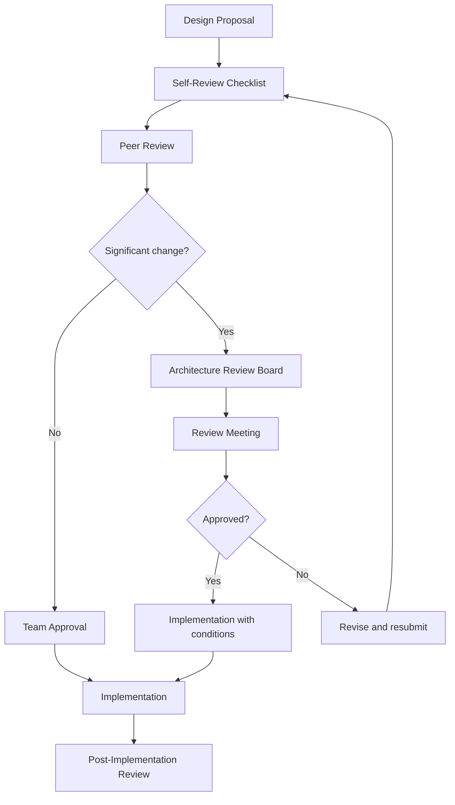

# Architecture Reviews for Banking GenAI Systems

## Overview

Architecture reviews are the systematic evaluation of system designs before implementation begins. In banking GenAI systems, architecture reviews are critical because:

- **Decisions are expensive to reverse**: GPU infrastructure, model choices, and data architectures cost significant money and time to change
- **Regulatory impact**: Architecture choices affect compliance posture, auditability, and data governance
- **Cross-team dependencies**: The GenAI platform serves multiple product teams with different requirements
- **Security implications**: AI systems introduce unique attack surfaces that must be addressed at design time

---

## Architecture Review Process



---

## Architecture Decision Records (ADRs)

Every significant architectural decision must be documented as an ADR.

```markdown
# ADR-0042: Use Qdrant as Vector Database

## Status
Accepted

## Context
We need a vector database for storing and searching document embeddings
at scale. Requirements:
- 50M+ vectors with sub-100ms query latency
- Multi-tenant isolation
- Horizontal scalability
- Open-source or commercially supported
- Python SDK

Options evaluated:
1. Qdrant (Rust-based, open-source)
2. Milvus (Go-based, open-source)
3. Pinecone (managed service)
4. Weaviate (Go-based, open-source)
5. pgvector (PostgreSQL extension)

## Decision
We selected Qdrant for the following reasons:
- Best query latency in our benchmarks (P95: 45ms at 10M vectors)
- Built-in multi-tenant support via collection namespaces
- Strong Python SDK with async support
- Can be self-hosted (data sovereignty requirement)
- Active development community
- Filtering support for metadata-based queries

## Consequences
- Positive: Low latency, full control over data, no vendor lock-in
- Negative: Self-hosting requires operational expertise
- Risk: Qdrant's cross-region replication is still maturing
- Mitigation: Implement application-level replication (see multi-region-design.md)

## Alternatives Considered
- Pinecone: Easier to operate but data leaves bank network (compliance blocker)
- pgvector: Simpler ops but 10x slower at our scale
- Milvus: Comparable performance but more complex deployment

## References
- Benchmark results: /benchmarks/vector-db-comparison-2026-q1.md
- Security review: /security/vector-db-assessment.md
```

---

## Architecture Review Checklist

### Functional Requirements

- [ ] All user stories are mapped to system components
- [ ] Edge cases identified and handled
- [ ] Error scenarios defined for each component
- [ ] Fallback behavior specified for every external dependency
- [ ] Data flow diagram complete and reviewed

### Non-Functional Requirements

- [ ] Performance targets defined (P50, P95, P99 latency)
- [ ] Scalability plan documented (horizontal, vertical)
- [ ] Availability target and SLOs defined
- [ ] Capacity estimates with 30% headroom
- [ ] Cost estimate and budget allocation

### Security

- [ ] Threat model completed (STRIDE or equivalent)
- [ ] Authentication and authorization design reviewed
- [ ] Data encryption in transit and at rest
- [ ] PII handling design (masking, redaction, tokenization)
- [ ] Prompt injection mitigations specified
- [ ] Output validation design (PII detection, toxicity filter)
- [ ] Secrets management approach defined
- [ ] Network segmentation plan

### Data

- [ ] Data model reviewed (normalization, indexing)
- [ ] Data retention policy defined
- [ ] Backup and restore strategy documented
- [ ] Data migration plan (if applicable)
- [ ] Multi-tenant isolation verified
- [ ] Data residency requirements addressed

### GenAI-Specific

- [ ] Model selection justified (quality, cost, latency, compliance)
- [ ] Prompt management design (versioning, governance, A/B testing)
- [ ] Safety guardrails defined (input validation, output filtering)
- [ ] Evaluation strategy (golden dataset, red team, adversarial)
- [ ] LLM provider failover design
- [ ] Token cost estimation and budget
- [ ] Embedding model selection and versioning
- [ ] Vector database schema and indexing strategy
- [ ] Context window management (truncation, summarization)
- [ ] Hallucination mitigation strategy

### Operations

- [ ] Monitoring and alerting design
- [ ] Logging strategy (structured logging, log levels)
- [ ] Runbook or operational procedure drafted
- [ ] Deployment strategy (blue-green, canary, rolling)
- [ ] Rollback procedure defined and tested
- [ ] Disaster recovery plan
- [ ] Incident response procedure updated

### Compliance

- [ ] Regulatory impact assessed
- [ ] Audit trail design (what, where, how long)
- [ ] Model risk management documentation
- [ ] Privacy impact assessment
- [ ] Data processing agreements (for external providers)
- [ ] Fair lending / bias analysis (if applicable)

---

## Architecture Review Board (ARB)

### ARB Composition

| Role | Responsibility | Voting |
|---|---|---|
| Principal Engineer | Technical feasibility, scalability | Yes |
| Security Architect | Security posture, threat model | Yes (veto) |
| SRE Lead | Operational impact, reliability | Yes |
| Data Architect | Data model, governance | Yes |
| Compliance Representative | Regulatory compliance | Yes (veto) |
| Platform Team Lead | Platform impact | Yes |
| Product Manager | Business impact | Advisory |
| Proposing Team | Design presentation | No (presents) |

### ARB Meeting Agenda

| Time | Activity |
|---|---|
| 0-5 min | Introduction and scope |
| 5-20 min | Design presentation by proposing team |
| 20-35 min | Questions and discussion |
| 35-45 min | Risk assessment and mitigation review |
| 45-55 min | Voting and decision |
| 55-60 min | Action items and next steps |

### ARB Decision Outcomes

| Outcome | Meaning | Next Steps |
|---|---|---|
| **Approved** | Design meets all requirements | Proceed to implementation |
| **Approved with Conditions** | Design is sound but requires specific changes | Address conditions, no re-review needed |
| **Deferred** | Design has merit but needs more analysis | Complete analysis, resubmit next cycle |
| **Rejected** | Design has fundamental issues | Redesign and resubmit |

---

## Post-Implementation Review

```markdown
# Post-Implementation Review: RAG Architecture v2

## Summary
The RAG architecture v2 was deployed on 2026-03-01. This review assess
whether the implementation matched the design and identifies lessons learned.

## Design vs. Implementation

| Design Decision | Implemented As Planned? | Notes |
|---|---|---|
| Use Qdrant for vector DB | Yes | Deployed v1.7.0 as planned |
| Semantic caching layer | Partially | Implemented with Redis, but similarity threshold is 0.90 (design said 0.95) |
| Multi-model routing | Yes | OpenAI primary, Anthropic failover working |
| Safety guardrails | Yes | All 4 layers implemented |
| Streaming responses | No | Deferred to v2.1 due to gateway limitations |

## Metrics vs. Projections

| Metric | Projected | Actual | Variance |
|---|---|---|---|
| P95 Latency | 2,500ms | 1,800ms | -28% (better) |
| Cost per Query | $0.035 | $0.042 | +20% (worse) |
| Cache Hit Rate | 30% | 25% | -17% (worse) |
| Availability | 99.95% | 99.97% | +0.02% (better) |

## Lessons Learned

1. **Underestimated cost**: The multi-model routing adds overhead. Need to optimize token usage.
2. **Cache hit rate lower than expected**: Banking queries are more diverse than anticipated. Lower threshold to 0.90 was correct.
3. **Gateway streaming delay**: The API gateway does not handle SSE well. This should have been identified during the architecture review.
4. **Vector DB scaling**: Qdrant scaled better than expected -- good choice.

## Action Items

1. [ ] Optimize token usage to reduce cost per query (Team: Platform, Target: Sprint 22)
2. [ ] Add SSE support to API gateway (Team: Infrastructure, Target: Sprint 23)
3. [ ] Update architecture review checklist to include streaming capability validation (Team: ARB, Target: Next cycle)
4. [ ] Revisit cost projections for v3 architecture (Team: Platform, Target: Sprint 24)
```

---

## Interview Questions

1. **What should an architecture review catch that code review does not?**
   - Architecture reviews evaluate system-level design: component boundaries, data flow, failure modes, security posture, scalability, cost, and compliance. Code reviews evaluate implementation correctness within a single component. Architecture reviews happen before coding; code reviews happen during/after.

2. **How do you prevent architecture reviews from becoming bottlenecks?**
   - Tier the review process: small changes get lightweight peer review, major changes go to the ARB. Set SLAs for review turnaround (48 hours for peer review, 1 week for ARB). Provide self-service checklists so teams can self-assess before submitting. Track review cycle time as a metric.

3. **What is the most important GenAI-specific question in an architecture review?**
   - "What happens when the LLM gives a wrong answer?" This forces the team to think about safety guardrails, output validation, user-facing error handling, audit trail, and feedback loops. It covers quality, security, compliance, and user experience in one question.

4. **How do you handle disagreement within the ARB?**
   - The proposing team addresses each concern with either a design change or a documented risk acceptance. If consensus cannot be reached, escalate to the engineering director. Never let a design with unresolved security or compliance concerns proceed. Time-box the discussion to avoid analysis paralysis.

---

## Cross-References

- See [architecture/architecture-decision-records.md](./architecture-decision-records.md) for ADR templates
- See [architecture/technical-debt-management.md](./technical-debt-management.md) for debt tracking
- See [engineering-culture/architecture-reviews.md](../engineering-culture/architecture-reviews.md) for review culture
- See [testing-and-quality/release-readiness.md](../testing-and-quality/release-readiness.md) for release validation
