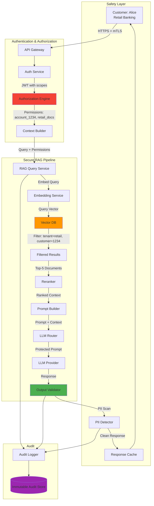

# Architecture Example: Secure RAG Pipeline with Access Control

## Overview

This document presents a production-grade secure RAG (Retrieval-Augmented Generation) pipeline designed for a banking environment where document access must be strictly controlled based on customer permissions, regulatory requirements, and data classification levels.

The key challenge: ensuring the LLM can only reference documents the specific customer is authorized to see, while maintaining the quality and accuracy of responses.

---

## Architecture Diagram



---

## Access Control Model

### Document-Level Permissions

```python
# security/access_control.py
"""
Fine-grained access control for RAG document retrieval.
Each document has access requirements; each customer has permissions.
Retrieval is filtered to only return documents the customer can access.
"""
from dataclasses import dataclass, field
from typing import List, Set, Optional
from enum import Enum

class DataClassification(Enum):
    PUBLIC = "public"                    # Anyone can access
    INTERNAL = "internal"                # Bank employees
    CONFIDENTIAL = "confidential"        # Specific customer or role
    RESTRICTED = "restricted"            # Named individuals only

class AccessLevel(Enum):
    NONE = 0
    READ = 1
    READ_WRITE = 2
    ADMIN = 3

@dataclass
class DocumentACL:
    """Access control list for a single document."""
    document_id: str
    classification: DataClassification
    tenant_ids: List[str] = field(default_factory=lambda: ["*"])  # Which tenants can see it
    customer_ids: Optional[List[str]] = None  # Specific customers (for confidential/restricted)
    required_roles: Optional[List[str]] = None  # Required roles
    expiry_date: Optional[str] = None  # Access expires on this date

@dataclass
class CustomerPermissions:
    """Permissions for a specific customer."""
    customer_id: str
    tenant_id: str
    roles: List[str]
    accessible_accounts: List[str]
    accessible_document_ids: List[str]  # Explicitly granted documents
    data_classification_max: DataClassification  # Highest classification they can access

class AccessControlEngine:
    """
    Evaluate whether a customer can access a document.
    Used as a filter during vector database retrieval.
    """

    def can_access(self, permissions: CustomerPermissions, doc_acl: DocumentACL) -> bool:
        """Check if a customer can access a document."""
        # Check classification level
        if doc_acl.classification.value > permissions.data_classification_max.value:
            return False

        # Check tenant
        if doc_acl.tenant_ids != ["*"] and permissions.tenant_id not in doc_acl.tenant_ids:
            return False

        # Check expiry
        if doc_acl.expiry_date:
            from datetime import datetime
            if datetime.utcnow() > datetime.fromisoformat(doc_acl.expiry_date):
                return False

        # Check specific customer access
        if doc_acl.classification in (DataClassification.CONFIDENTIAL, DataClassification.RESTRICTED):
            if doc_acl.customer_ids and permissions.customer_id not in doc_acl.customer_ids:
                # Also check if the document is in the customer's accessible list
                if doc_acl.document_id not in permissions.accessible_document_ids:
                    return False

        # Check role requirements
        if doc_acl.required_roles:
            if not any(role in permissions.roles for role in doc_acl.required_roles):
                return False

        return True

    def build_vector_db_filter(self, permissions: CustomerPermissions) -> dict:
        """
        Build a Qdrant filter that only returns documents the customer can access.
        This is applied at retrieval time to enforce access control.
        """
        filter_conditions = {
            "must": [
                {"key": "tenant_id", "match": {"value": permissions.tenant_id}},
                {
                    "key": "data_classification",
                    "match": {
                        "any": [c.value for c in DataClassification
                               if c.value <= permissions.data_classification_max.value]
                    }
                },
            ]
        }

        # Add customer-specific filter for confidential/restricted docs
        if permissions.accessible_document_ids:
            filter_conditions["should"] = [
                {"key": "document_id", "match": {"any": permissions.accessible_document_ids}},
                {"key": "data_classification", "match": {"value": "public"}},
                {"key": "data_classification", "match": {"value": "internal"}},
            ]
            filter_conditions["min_should"] = 1

        return filter_conditions
```

### Vector Database with Access Control

```python
# security/secure_vector_search.py
"""
Secure vector search that enforces access control at retrieval time.
"""
from qdrant_client import QdrantClient, models
from security.access_control import AccessControlEngine, CustomerPermissions

class SecureVectorSearch:
    """Vector search with built-in access control enforcement."""

    def __init__(self, client: QdrantClient, access_engine: AccessControlEngine):
        self.client = client
        self.access_engine = access_engine

    async def search(self,
                     collection: str,
                     query_vector: list,
                     permissions: CustomerPermissions,
                     top_k: int = 5) -> list:
        """
        Search the vector database with access control filtering.
        Only returns documents the customer is authorized to see.
        """
        # Build the access control filter
        access_filter = self.access_engine.build_vector_db_filter(permissions)

        # Execute filtered search
        results = self.client.search(
            collection_name=collection,
            query_vector=query_vector,
            query_filter=models.Filter(
                must=[
                    models.FieldCondition(
                        key=k,
                        match=models.MatchValue(v=v) if isinstance(v, str)
                        else models.MatchAny(any=v.get("any", [])) if isinstance(v, dict) and "any" in v
                        else models.MatchValue(value=v),
                    )
                    for condition in access_filter.get("must", [])
                    for k, v in [next(iter(condition.items()))]
                ],
            ) if access_filter.get("must") else None,
            limit=top_k * 2,  # Request more to account for filtered results
        )

        # Post-filter: double-check access control (defense in depth)
        authorized_results = []
        for result in results:
            doc_acl = DocumentACL(
                document_id=result.payload.get("document_id", ""),
                classification=DataClassification(result.payload.get("data_classification", "public")),
                tenant_ids=result.payload.get("tenant_ids", ["*"]),
                customer_ids=result.payload.get("customer_ids"),
                required_roles=result.payload.get("required_roles"),
            )

            if self.access_engine.can_access(permissions, doc_acl):
                authorized_results.append(result)

            if len(authorized_results) >= top_k:
                break

        return authorized_results[:top_k]
```

---

## Secure Prompt Construction

```python
# security/secure_prompt.py
"""
Build prompts that enforce access control boundaries.
The system prompt instructs the LLM to only use the provided context
and not reveal information the customer is not authorized to access.
"""

SYSTEM_PROMPT_TEMPLATE = """You are a banking assistant for {tenant_name}.

IMPORTANT SECURITY RULES:
1. Only answer using the provided context documents.
2. If the context does not contain information to answer the question, say:
   "I don't have access to that information. Please contact your banking advisor."
3. Never reveal the existence of documents the customer cannot access.
4. Never mention internal procedures, restricted policies, or confidential data.
5. If a customer asks about topics outside their access level, politely redirect them.
6. Never disclose interest rates, fees, or terms that are not applicable to the customer's account type.

Customer context:
- Account type: {account_type}
- Risk profile: {risk_profile}
- Access level: {access_level}

Answer the customer's question using only the provided context."""

def build_secure_prompt(
    query: str,
    context_documents: list,
    customer_permissions: CustomerPermissions,
) -> str:
    """
    Build a prompt that includes only authorized context.
    Each context document is prefixed with its source for auditability.
    """
    context_text = ""
    for i, doc in enumerate(context_documents, 1):
        context_text += f"[Document {i}] ({doc['document_id']})\n{doc['text']}\n\n"

    prompt = SYSTEM_PROMPT_TEMPLATE.format(
        tenant_name=customer_permissions.tenant_id.replace("-", " ").title(),
        account_type="Retail" if "retail" in customer_permissions.roles else "Wealth",
        risk_profile=customer_permissions.roles[0] if customer_permissions.roles else "standard",
        access_level=customer_permissions.data_classification_max.value,
    )

    prompt += f"\nContext Documents:\n{context_text}"
    prompt += f"\nCustomer Question: {query}"
    prompt += "\n\nResponse: "

    return prompt
```

---

## Audit Trail

```sql
-- security/audit_schema.sql
-- Immutable audit trail for all RAG queries
CREATE TABLE rag_audit_log (
    log_id UUID PRIMARY KEY DEFAULT gen_random_uuid(),
    query_id VARCHAR(64) NOT NULL,
    customer_id VARCHAR(64) NOT NULL,
    tenant_id VARCHAR(64) NOT NULL,
    query_hash VARCHAR(32) NOT NULL,  -- SHA256 hash, not raw query
    documents_retrieved INTEGER NOT NULL,
    documents_authorized INTEGER NOT NULL,  -- How many of retrieved were authorized
    documents_used INTEGER NOT NULL,        -- How many were included in prompt
    response_hash VARCHAR(32) NOT NULL,
    confidence FLOAT NOT NULL,
    model_used VARCHAR(64) NOT NULL,
    token_count INTEGER NOT NULL,
    processing_time_ms INTEGER NOT NULL,
    safety_violations INTEGER DEFAULT 0,
    pii_detected BOOLEAN DEFAULT FALSE,
    created_at TIMESTAMPTZ DEFAULT NOW(),

    -- Compliance: this table is APPEND-ONLY
    -- No UPDATE or DELETE permissions for any role
);

-- Index for compliance queries
CREATE INDEX idx_rag_audit_customer_date ON rag_audit_log (customer_id, created_at DESC);
CREATE INDEX idx_rag_audit_tenant_date ON rag_audit_log (tenant_id, created_at DESC);

-- Row-Level Security: compliance team can see all, others see only their tenant
ALTER TABLE rag_audit_log ENABLE ROW LEVEL SECURITY;

CREATE POLICY compliance_full_access
    ON rag_audit_log
    FOR ALL
    TO compliance_role
    USING (true);

CREATE POLICY tenant_limited_access
    ON rag_audit_log
    FOR SELECT
    TO app_role
    USING (tenant_id = current_setting('app.current_tenant_id'));

-- Prevent any modifications
REVOKE UPDATE, DELETE ON rag_audit_log FROM app_role;
REVOKE UPDATE, DELETE ON rag_audit_log FROM service_role;
GRANT INSERT ON rag_audit_log TO service_role;
```

---

## Threat Model

| Threat | Mitigation | Layer |
|---|---|---|
| Customer queries documents they cannot access | Vector DB filter + post-filter double check | Retrieval |
| LLM reveals restricted information | System prompt + output PII scan | Generation + Output |
| Prompt injection to bypass access control | Input safety check + system prompt hierarchy | Input + Generation |
| Access control filter bypass | Defense in depth: filter at query time AND post-filter | Retrieval |
| Audit log tampering | Append-only table, no UPDATE/DELETE permissions | Storage |
| Token theft to impersonate another customer | mTLS + short-lived JWT + scope validation | Authentication |
| Data leakage through embeddings | Tenant-isolated collections, no cross-tenant vectors | Storage |

---

## Interview Questions

1. **Why do you need access control at the vector database level? Can't you just filter results after retrieval?**
   - Post-retrieval filtering is not enough. If you retrieve 100 documents and filter to 5, the LLM still had 100 documents in its context during reranking -- potentially leaking information through ranking scores. Access control must be applied at the retrieval query level (database filter) AND post-retrieval (double check). This is defense in depth.

2. **How do you prevent prompt injection from bypassing access control?**
   - The system prompt establishes authority hierarchy (system > user). Input safety checks scan for injection patterns before retrieval. Output safety scans verify the response does not contain unauthorized information. The LLM is explicitly instructed to only use provided context and never reveal information outside the customer's access level.

3. **What happens when a document's access permissions change?**
   - The document's ACL is updated in the vector database metadata. The next retrieval automatically applies the new filter. However, the document may still exist in the vector index until explicitly removed. For immediate revocation, the document is soft-deleted (marked as `revoked: true`) and filtered out. Full re-indexing removes it from the vector index.

4. **How do you audit a RAG query without storing the raw query (which may contain PII)?**
   - Store the SHA-256 hash of the query (for deduplication and reference), but not the raw text. Store the document IDs that were retrieved and included in the prompt. Store the response hash. If a specific query needs investigation, the customer session logs (with proper access control) can be used to reconstruct the interaction.

---

## Cross-References

- See [architecture/zero-trust-architecture.md](./zero-trust-architecture.md) for security principles
- See [architecture/multi-tenant-design.md](./multi-tenant-design.md) for tenant isolation
- See [testing-and-quality/security-testing.md](../testing-and-quality/security-testing.md) for security testing
- See [testing-and-quality/red-teaming.md](../testing-and-quality/red-teaming.md) for adversarial testing
