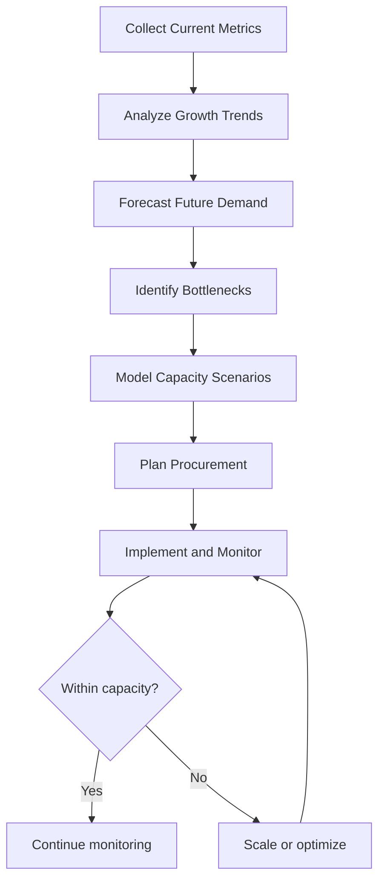

# Capacity Planning for Banking GenAI Systems

## Overview

Capacity planning ensures the GenAI platform has sufficient compute, memory, storage, and network resources to handle current and projected demand without over-provisioning. In banking GenAI systems, capacity planning is uniquely complex because:

- **GPU resources are scarce and expensive**: A100/H100 GPUs cost $10K-$40K each
- **LLM token costs are variable**: Output length varies per query, making cost prediction difficult
- **Traffic patterns are unpredictable**: Market events, rate changes, and tax seasons cause spikes
- **Model upgrades change capacity needs**: Larger models require more GPU memory and compute
- **Regulatory headroom**: Must maintain 30-50% headroom for regulatory-mandated availability SLAs

---

## Capacity Planning Methodology



---

## Current Capacity Assessment

### Resource Inventory

```python
# capacity/inventory.py
"""
Current capacity inventory for the banking GenAI platform.
"""
from dataclasses import dataclass
from typing import Dict, List

@dataclass
class GPUResource:
    instance_type: str
    gpu_type: str          # A100, H100, L4
    gpu_count: int
    gpu_memory_gb: int     # Per GPU
    vcpu: int
    memory_gb: int
    region: str
    utilization: float     # Current average utilization

@dataclass
class ServiceCapacity:
    service: str
    current_rps: float     # Current requests per second
    max_rps: float         # Maximum tested RPS
    p95_latency_ms: float  # Current P95 latency
    cpu_utilization: float
    memory_utilization: float
    gpu_utilization: float
    token_rate_per_second: float
    concurrent_connections: int

def assess_current_capacity() -> dict:
    """Assess current platform capacity."""
    return {
        "gpu_resources": [
            GPUResource(
                instance_type="p4d.24xlarge",
                gpu_type="A100",
                gpu_count=8,
                gpu_memory_gb=80,
                vcpu=96,
                memory_gb=1152,
                region="us-east-1",
                utilization=0.65,
            ),
            GPUResource(
                instance_type="p4d.24xlarge",
                gpu_type="A100",
                gpu_count=8,
                gpu_memory_gb=80,
                vcpu=96,
                memory_gb=1152,
                region="eu-west-1",
                utilization=0.45,
            ),
        ],
        "services": {
            "rag-query": ServiceCapacity(
                current_rps=150,
                max_rps=500,
                p95_latency_ms=1800,
                cpu_utilization=0.35,
                memory_utilization=0.55,
                gpu_utilization=0.65,  # Embedding generation on GPU
                token_rate_per_second=5000,
                concurrent_connections=300,
            ),
            "embedding-service": ServiceCapacity(
                current_rps=200,
                max_rps=800,
                p95_latency_ms=150,
                cpu_utilization=0.40,
                memory_utilization=0.60,
                gpu_utilization=0.70,
                token_rate_per_second=15000,
                concurrent_connections=100,
            ),
            "document-ingestion": ServiceCapacity(
                current_rps=20,
                max_rps=100,
                p95_latency_ms=5000,
                cpu_utilization=0.25,
                memory_utilization=0.40,
                gpu_utilization=0.30,
                token_rate_per_second=3000,
                concurrent_connections=50,
            ),
        },
        "vector_db": {
            "total_vectors": 15_000_000,
            "max_capacity_vectors": 50_000_000,
            "storage_used_gb": 120,
            "storage_total_gb": 500,
            "query_p95_ms": 45,
        },
        "llm_providers": {
            "openai": {
                "rate_limit_tpm": 1_000_000,    # tokens per minute
                "current_tpm": 350_000,
                "utilization": 0.35,
            },
            "anthropic": {
                "rate_limit_tpm": 500_000,
                "current_tpm": 120_000,
                "utilization": 0.24,
            },
        },
    }
```

---

## Demand Forecasting

```python
# capacity/forecast.py
"""
Forecast future demand based on historical trends and business projections.
"""
import numpy as np
from datetime import datetime, timedelta
from scipy import stats

def forecast_demand(historical_data: list, business_projections: dict,
                    months_ahead: int = 12) -> dict:
    """
    Forecast demand for the next N months.
    Combines historical trend analysis with business growth projections.
    """
    # Historical trend (linear regression on past 12 months)
    x = np.arange(len(historical_data))
    slope, intercept, r_value, p_value, std_err = stats.linregress(x, historical_data)

    # Project future based on trend
    future_months = np.arange(len(historical_data), len(historical_data) + months_ahead)
    trend_forecast = slope * future_months + intercept

    # Apply business growth multiplier
    growth_rate = business_projections.get("user_growth_rate", 0.10)  # 10% per month
    growth_forecast = trend_forecast * (1 + growth_rate) ** np.arange(months_ahead)

    # Apply seasonal adjustments
    seasonal_factors = get_seasonal_factors()
    adjusted_forecast = growth_forecast * seasonal_factors[:months_ahead]

    # Add uncertainty bands (±20%)
    upper_bound = adjusted_forecast * 1.2
    lower_bound = adjusted_forecast * 0.8

    return {
        "forecast": adjusted_forecast.tolist(),
        "upper_bound": upper_bound.tolist(),
        "lower_bound": lower_bound.tolist(),
        "trend_slope": slope,
        "growth_rate": growth_rate,
        "confidence": r_value ** 2,  # R-squared
    }


def get_seasonal_factors() -> list:
    """
    Seasonal factors for banking GenAI queries.
    Based on historical banking traffic patterns.
    """
    return [
        0.90,  # January (post-holiday lull)
        0.95,  # February
        1.00,  # March
        1.05,  # April (tax season)
        1.10,  # May
        1.00,  # June
        0.95,  # July
        0.95,  # August
        1.05,  # September (back to business)
        1.10,  # October
        1.15,  # November (year-end planning)
        1.10,  # December
    ]


def calculate_peak_multiplier(average_rps: float) -> float:
    """
    Calculate the peak-to-average ratio for capacity planning.
    Banking GenAI typically sees 3-5x peak vs. average.
    """
    # Based on historical data
    return 4.0  # Peak is 4x average


def project_gpu_requirements(forecast: dict, current_gpu_count: int,
                              tokens_per_query: float) -> dict:
    """
    Project GPU requirements based on demand forecast.
    """
    monthly_tokens = [rps * 3600 * tokens_per_query * 24 for rps in forecast["forecast"]]

    # Each A100 can process ~1000 tokens/second for inference
    tokens_per_gpu_per_month = 1000 * 3600 * 24 * 30

    gpu_needed = [
        max(0, int(tokens / tokens_per_gpu_per_month) - current_gpu_count)
        for tokens in monthly_tokens
    ]

    # Add 30% headroom for regulatory SLA
    gpu_needed = [int(g * 1.3) for g in gpu_needed]

    return {
        "monthly_gpu_additions": gpu_needed,
        "total_gpu_by_month": [current_gpu_count + sum(gpu_needed[:i+1])
                               for i in range(len(gpu_needed))],
        "tokens_per_gpu_per_month": tokens_per_gpu_per_month,
    }
```

---

## Capacity Planning Scenarios

### Scenario 1: Organic Growth (10% Monthly)

| Month | Queries/Day | GPU Utilization | Action Required |
|---|---|---|---|
| Current | 500K | 65% | None |
| Month 3 | 665K | 75% | Monitor closely |
| Month 6 | 886K | 88% | Provision 4 additional GPUs |
| Month 9 | 1.18M | 95% | CRITICAL: Provision 8 GPUs |
| Month 12 | 1.57M | 110% | Over capacity -- urgent action needed |

### Scenario 2: New Product Launch (3x Traffic Spike)

| Metric | Before Launch | After Launch | Gap |
|---|---|---|---|
| Queries/Day | 500K | 1.5M | +1M |
| Peak RPS | 600 | 1,800 | +1,200 |
| GPU Utilization | 65% | ~100% | +35% |
| LLM Token Rate | 350K TPM | 1.05M TPM | +700K |
| Vector DB Queries/s | 200 | 600 | +400 |

**Action Plan:**
1. 4 weeks before launch: Provision 12 additional GPUs
2. 2 weeks before launch: Increase LLM provider rate limits
3. 1 week before launch: Load test at 2x expected peak
4. Launch day: On-call team on high alert, auto-scaling enabled

---

## Auto-Scaling Configuration

```yaml
# capacity/auto-scaling.yaml
apiVersion: autoscaling/v2
kind: HorizontalPodAutoscaler
metadata:
  name: rag-query-hpa
spec:
  scaleTargetRef:
    apiVersion: apps/v1
    kind: Deployment
    name: rag-query-service
  minReplicas: 3
  maxReplicas: 30
  metrics:
    - type: Resource
      resource:
        name: cpu
        target:
          type: Utilization
          averageUtilization: 65
    - type: Resource
      resource:
        name: memory
        target:
          type: Utilization
          averageUtilization: 75
    - type: Pods
      pods:
        metric:
          name: queries_per_second
        target:
          type: AverageValue
          averageValue: "50"
  behavior:
    scaleUp:
      stabilizationWindowSeconds: 60
      policies:
        - type: Pods
          value: 5
          periodSeconds: 60
        - type: Percent
          value: 50
          periodSeconds: 60
    scaleDown:
      stabilizationWindowSeconds: 300
      policies:
        - type: Pods
          value: 2
          periodSeconds: 120

---
# GPU node pool auto-scaling (cluster autoscaler)
apiVersion: v1
kind: ConfigMap
metadata:
  name: cluster-autoscaler-config
  namespace: kube-system
data:
  # Scale up when pods are pending due to GPU resources
  scale-up-enabled: "true"
  # Scale down only after 30 minutes of under-utilization
  scale-down-delay-after-add: 30m
  # Maximum GPU nodes in the cluster
  max-gpu-nodes: "20"
  # Minimum GPU nodes (always-on capacity)
  min-gpu-nodes: "2"
```

---

## Capacity Planning Dashboard

```python
# capacity/dashboard.py
"""
Generate a capacity planning dashboard report.
"""
def generate_capacity_report() -> str:
    """Generate a monthly capacity planning report."""
    inventory = assess_current_capacity()
    forecast = forecast_demand(
        historical_data=get_historical_rps(),
        business_projections={"user_growth_rate": 0.10},
        months_ahead=6,
    )

    report = f"""
# Monthly Capacity Planning Report

## Executive Summary
- Current GPU utilization: {inventory['services']['rag-query'].gpu_utilization:.0%}
- LLM provider utilization: {max(p['utilization'] for p in inventory['llm_providers'].values()):.0%}
- Projected capacity breach: {get_breach_month(forecast)} months

## Current Utilization
| Service | CPU | Memory | GPU | RPS Current | RPS Max |
|---|---|---|---|---|---|
"""
    for name, svc in inventory['services'].items():
        report += f"| {name} | {svc.cpu_utilization:.0%} | {svc.memory_utilization:.0%} | {svc.gpu_utilization:.0%} | {svc.current_rps:.0f} | {svc.max_rps:.0f} |\n"

    report += f"""
## Demand Forecast (Next 6 Months)
| Month | Forecast RPS | Upper Bound | Lower Bound |
|---|---|---|---|
"""
    for i, (f, u, l) in enumerate(zip(
        forecast['forecast'], forecast['upper_bound'], forecast['lower_bound']
    )):
        report += f"| +{i+1}M | {f:.0f} | {u:.0f} | {l:.0f} |\n"

    report += f"""
## Recommendations
1. {'URGENT: GPU capacity will be exceeded within 3 months' if get_breach_month(forecast) <= 3 else 'Monitor: Capacity is sufficient for 6+ months'}
2. Consider negotiating higher rate limits with LLM providers
3. Evaluate self-hosted models to reduce dependency on external providers
4. Review auto-scaling policies for optimal response to traffic spikes
"""

    return report
```

---

## Interview Questions

1. **How do you plan capacity for a GenAI system with unpredictable query complexity?**
   - Model based on token consumption, not query count. Each query consumes a variable number of tokens (input + output). Track average tokens per query and the distribution (P50, P95, P99). Capacity plan for the P95 token count, not the average. Use auto-scaling for the variable portion.

2. **What is the right GPU utilization target for capacity planning?**
   - 60-70% average utilization. Below 60% is over-provisioned (wasting money). Above 75% leaves insufficient headroom for traffic spikes and violates the 30% regulatory headroom requirement. GPU provisioning should target 65% with auto-scaling to handle peaks.

3. **How do you handle the 3-6 month GPU procurement lead time?**
   - Maintain a rolling 6-month capacity forecast. When the forecast shows utilization exceeding 75% within 6 months, initiate procurement immediately. In the interim, use cloud bursting (on-demand GPU instances from cloud providers) to cover the gap. Negotiate reserved instance pricing for predictable baseline demand.

4. **Your LLM provider increases prices by 40%. How does this affect capacity planning?**
   - First, model the cost impact at current usage levels. Then evaluate: (1) Can we optimize token usage (shorter prompts, shorter outputs)? (2) Can we route more queries to cheaper models/providers? (3) Should we accelerate self-hosted model deployment? (4) Can we negotiate volume discounts? The capacity plan must include cost-per-query trending, not just resource utilization.

---

## Cross-References

- See [architecture/cost-management.md](./cost-management.md) for cost tracking and optimization
- See [architecture/reliability-engineering.md](./reliability-engineering.md) for SRE practices
- See [infrastructure/gpu-management.md](../infrastructure/gpu-management.md) for GPU infrastructure
- See [testing-and-quality/performance-testing.md](../testing-and-quality/performance-testing.md) for performance baselines
