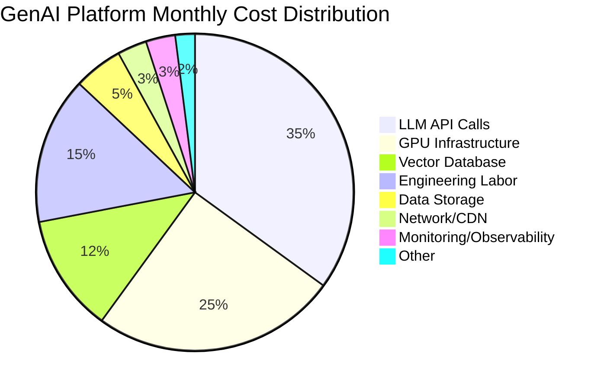
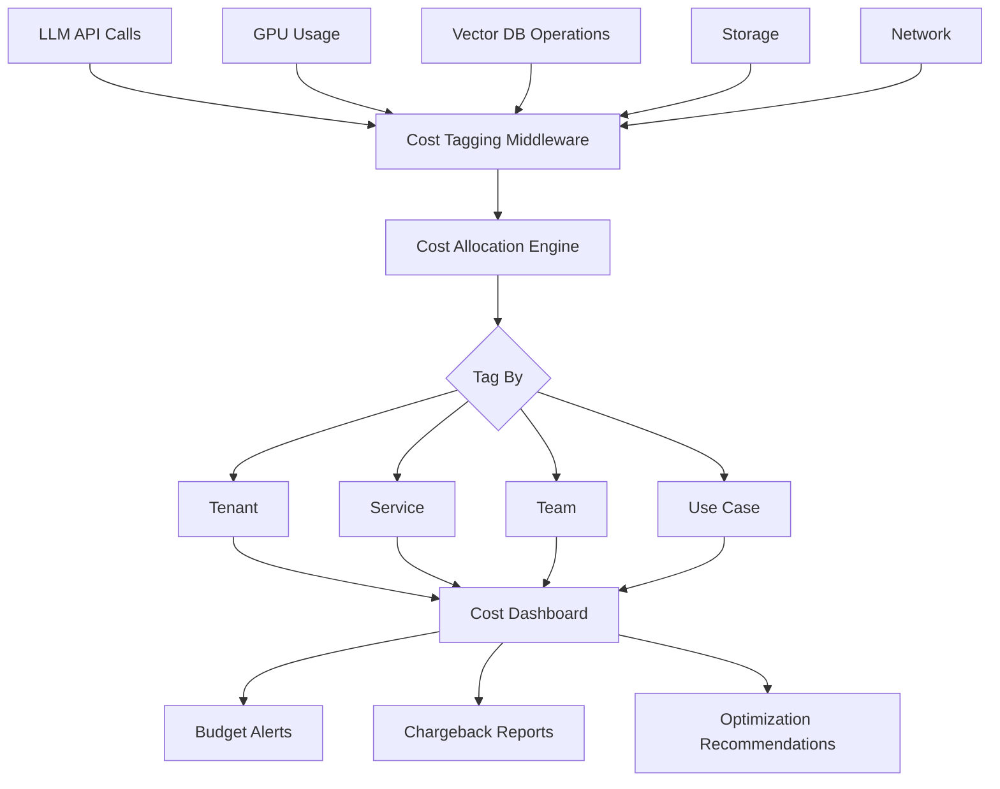

# Cost Management and FinOps for Banking GenAI Systems

## Overview

GenAI systems are among the most expensive software infrastructure to operate. LLM API calls, GPU instances, vector databases, and embedding generation all contribute to substantial and often unpredictable costs. In banking, cost management must balance innovation spending with fiduciary responsibility and regulatory expectations for operational efficiency.

FinOps (Financial Operations) brings financial accountability to the variable spend model of cloud and AI services.

---

## Cost Breakdown



---

## Cost Tracking Architecture



---

## Cost Allocation and Tagging

```python
# cost/tracking.py
"""
Track and allocate GenAI costs across tenants, services, and teams.
Every LLM call, GPU hour, and vector DB operation is tagged and recorded.
"""
from dataclasses import dataclass, field
from datetime import datetime
from typing import Dict, List
from enum import Enum
import json

class CostCategory(Enum):
    LLM_API = "llm_api"
    GPU_COMPUTE = "gpu_compute"
    VECTOR_DB = "vector_db"
    EMBEDDING = "embedding"
    STORAGE = "storage"
    NETWORK = "network"
    MONITORING = "monitoring"

@dataclass
class CostRecord:
    """A single cost record with full allocation context."""
    timestamp: datetime
    category: CostCategory
    tenant_id: str
    service: str
    team: str
    use_case: str
    amount: float
    currency: str = "USD"
    quantity: float = 0.0  # tokens, GPU-hours, storage-GB
    unit: str = ""
    metadata: Dict = field(default_factory=dict)

class CostTracker:
    """Track and allocate GenAI costs in real-time."""

    def __init__(self, db_url: str):
        self.db_url = db_url
        self._pool = None

    async def record_cost(self, record: CostRecord):
        """Record a cost entry."""
        import asyncpg
        if not self._pool:
            self._pool = await asyncpg.create_pool(self.db_url)

        async with self._pool.acquire() as conn:
            await conn.execute("""
                INSERT INTO genai_costs (
                    timestamp, category, tenant_id, service, team, use_case,
                    amount, currency, quantity, unit, metadata
                ) VALUES ($1, $2, $3, $4, $5, $6, $7, $8, $9, $10, $11)
            """,
                record.timestamp,
                record.category.value,
                record.tenant_id,
                record.service,
                record.team,
                record.use_case,
                record.amount,
                record.currency,
                record.quantity,
                record.unit,
                json.dumps(record.metadata),
            )

    async def get_costs(self, tenant_id: str = None, service: str = None,
                        team: str = None, date_from: str = None,
                        date_to: str = None, category: str = None) -> List[CostRecord]:
        """Query costs with filters."""
        import asyncpg
        if not self._pool:
            self._pool = await asyncpg.create_pool(self.db_url)

        query = "SELECT * FROM genai_costs WHERE 1=1"
        params = []
        param_count = 1

        if tenant_id:
            query += f" AND tenant_id = ${param_count}"
            params.append(tenant_id)
            param_count += 1
        if service:
            query += f" AND service = ${param_count}"
            params.append(service)
            param_count += 1
        if team:
            query += f" AND team = ${param_count}"
            params.append(team)
            param_count += 1
        if category:
            query += f" AND category = ${param_count}"
            params.append(category)
            param_count += 1
        if date_from:
            query += f" AND timestamp >= ${param_count}"
            params.append(date_from)
            param_count += 1
        if date_to:
            query += f" AND timestamp <= ${param_count}"
            params.append(date_to)
            param_count += 1

        query += " ORDER BY timestamp DESC"

        async with self._pool.acquire() as conn:
            rows = await conn.fetch(query, *params)

        return [
            CostRecord(
                timestamp=row["timestamp"],
                category=CostCategory(row["category"]),
                tenant_id=row["tenant_id"],
                service=row["service"],
                team=row["team"],
                use_case=row["use_case"],
                amount=row["amount"],
                currency=row["currency"],
                quantity=row["quantity"],
                unit=row["unit"],
                metadata=json.loads(row["metadata"]),
            )
            for row in rows
        ]

    async def get_cost_summary(self, tenant_id: str = None,
                                date_from: str = None,
                                date_to: str = None) -> Dict:
        """Get a cost summary with breakdowns."""
        costs = await self.get_costs(
            tenant_id=tenant_id, date_from=date_from, date_to=date_to
        )

        total = sum(c.amount for c in costs)

        # By category
        by_category = {}
        for c in costs:
            by_category[c.category.value] = by_category.get(c.category.value, 0) + c.amount

        # By service
        by_service = {}
        for c in costs:
            by_service[c.service] = by_service.get(c.service, 0) + c.amount

        # By team
        by_team = {}
        for c in costs:
            by_team[c.team] = by_team.get(c.team, 0) + c.amount

        # Cost per query
        query_count = len([c for c in costs if c.use_case == "rag_query"])
        cost_per_query = total / query_count if query_count > 0 else 0

        # Cost per token
        token_count = sum(c.quantity for c in costs if c.category == CostCategory.LLM_API)
        cost_per_1k_tokens = (total / token_count * 1000) if token_count > 0 else 0

        return {
            "total_cost": round(total, 2),
            "by_category": {k: round(v, 2) for k, v in by_category.items()},
            "by_service": {k: round(v, 2) for k, v in by_service.items()},
            "by_team": {k: round(v, 2) for k, v in by_team.items()},
            "cost_per_query": round(cost_per_query, 4),
            "cost_per_1k_tokens": round(cost_per_1k_tokens, 4),
            "record_count": len(costs),
            "period": f"{date_from} to {date_to}",
        }
```

---

## Budget Alerts

```python
# cost/budget_alerts.py
"""
Monitor costs against budgets and send alerts when thresholds are exceeded.
"""
from dataclasses import dataclass
from typing import Dict, List

@dataclass
class Budget:
    tenant_id: str
    monthly_limit: float
    warning_threshold: float = 0.75    # 75% of budget
    critical_threshold: float = 0.90   # 90% of budget
    hard_limit: float = 1.0            # 100% -- block further usage
    currency: str = "USD"

class BudgetEnforcer:
    """Enforce budgets with warnings and hard limits."""

    def __init__(self, cost_tracker: CostTracker):
        self.cost_tracker = cost_tracker
        self.budgets: Dict[str, Budget] = {}

    def set_budget(self, tenant_id: str, monthly_limit: float, **kwargs):
        """Set a budget for a tenant."""
        self.budgets[tenant_id] = Budget(
            tenant_id=tenant_id,
            monthly_limit=monthly_limit,
            **kwargs,
        )

    async def check_budget(self, tenant_id: str) -> dict:
        """Check budget utilization for a tenant."""
        if tenant_id not in self.budgets:
            return {"status": "no_budget_set"}

        budget = self.budgets[tenant_id]
        now = datetime.utcnow()
        month_start = now.replace(day=1, hour=0, minute=0, second=0)

        costs = await self.cost_tracker.get_cost_summary(
            tenant_id=tenant_id,
            date_from=month_start.isoformat(),
            date_to=now.isoformat(),
        )

        spent = costs["total_cost"]
        utilization = spent / budget.monthly_limit
        remaining = budget.monthly_limit - spent
        days_remaining = (month_start.replace(month=month_start.month % 12 + 1) - now).days

        status = "ok"
        if utilization >= budget.hard_limit:
            status = "exceeded"
        elif utilization >= budget.critical_threshold:
            status = "critical"
        elif utilization >= budget.warning_threshold:
            status = "warning"

        result = {
            "tenant_id": tenant_id,
            "budget": budget.monthly_limit,
            "spent": round(spent, 2),
            "remaining": round(remaining, 2),
            "utilization": round(utilization, 2),
            "status": status,
            "days_remaining": days_remaining,
            "daily_run_rate": round(spent / max(now.day, 1), 2),
            "projected_month_end": round(
                spent / max(now.day, 1) * days_in_month(now), 2
            ),
        }

        return result

    async def should_block(self, tenant_id: str) -> bool:
        """Check if a tenant should be blocked for exceeding budget."""
        check = await self.check_budget(tenant_id)
        return check.get("status") == "exceeded"


def days_in_month(dt: datetime) -> int:
    """Return the number of days in the given month."""
    import calendar
    return calendar.monthrange(dt.year, dt.month)[1]
```

---

## Cost Optimization Strategies

### 1. Model Routing for Cost Optimization

```python
# cost/model_router.py
def route_by_cost_benefit(query: str, budget_remaining: float) -> str:
    """Route to the most cost-effective model that meets quality requirements."""
    complexity = assess_query_complexity(query)

    if complexity < 0.3 and budget_remaining < 100:
        return "gpt-3.5-turbo"      # $0.002/1K tokens
    elif complexity < 0.7 and budget_remaining < 500:
        return "claude-3-haiku"     # $0.004/1K tokens
    elif complexity < 0.7:
        return "gpt-4-turbo"        # $0.01/1K tokens
    else:
        return "gpt-4-turbo"        # Premium model for complex queries
```

### 2. Response Caching

```python
# cost/response_cache.py
"""
Cache identical or near-identical queries to avoid redundant LLM calls.
Banking queries are often repetitive ("What is my balance?", "What are your fees?").
"""
import hashlib
from datetime import datetime, timedelta
from sentence_transformers import SentenceTransformer, util
import redis

class SemanticCache:
    """Cache LLM responses with semantic similarity matching."""

    def __init__(self, redis_url: str, similarity_threshold: float = 0.95):
        self.redis = redis.from_url(redis_url)
        self.threshold = similarity_threshold
        self.embedder = SentenceTransformer("all-MiniLM-L6-v2")
        self.ttl = 3600  # 1 hour cache TTL

    def get_cached(self, query: str) -> dict:
        """Check if a semantically similar query is in cache."""
        query_embedding = self.embedder.encode(query)

        # Search for similar cached queries
        cached = self.redis.hgetall("query_cache")
        for cache_key, cache_data in cached.items():
            data = json.loads(cache_data)
            cache_embedding = data["embedding"]

            similarity = util.cos_sim(
                query_embedding, cache_embedding
            ).item()

            if similarity >= self.threshold:
                # Check TTL
                if datetime.fromisoformat(data["timestamp"]) > datetime.utcnow() - timedelta(seconds=self.ttl):
                    return data["response"]

        return None

    def store(self, query: str, response: dict):
        """Cache a query-response pair."""
        embedding = self.embedder.encode(query).tolist()
        cache_key = hashlib.md5(query.encode()).hexdigest()

        self.redis.hset("query_cache", cache_key, json.dumps({
            "query": query,
            "response": response,
            "embedding": embedding,
            "timestamp": datetime.utcnow().isoformat(),
            "cost_saved": estimate_cost(response),
        }))
```

### 3. Batch Embedding Generation

```python
# cost/batch_embeddings.py
"""
Batch embedding generation during off-peak hours for cost optimization.
Instead of generating embeddings on-demand, pre-generate during low-cost periods.
"""
async def batch_embed_documents(documents: list, batch_size: int = 128):
    """
    Generate embeddings in batches for cost efficiency.
    Many providers offer lower per-token costs for batch requests.
    """
    embeddings = []
    for i in range(0, len(documents), batch_size):
        batch = documents[i:i + batch_size]
        batch_embeddings = await embedding_service.embed_batch(
            texts=[doc["content"] for doc in batch],
            batch_size=batch_size,
        )
        embeddings.extend(batch_embeddings)

        # Rate limiting to avoid provider throttling
        await asyncio.sleep(0.1)

    return embeddings
```

---

## FinOps Dashboard

| Metric | Current | Monthly Trend | Target |
|---|---|---|---|
| Total Monthly Cost | $45,230 | +12% | <$50,000 |
| Cost per Query | $0.034 | -5% | <$0.03 |
| Cost per 1K Tokens | $0.008 | -8% | <$0.007 |
| Cache Hit Rate | 32% | +10% | >40% |
| Budget Utilization | 78% | +5% | 70-85% |
| GPU Utilization | 65% | Stable | 60-70% |
| Wasted Spend (idle GPUs) | $2,100 | -15% | <$1,000 |

---

## Interview Questions

1. **What is the biggest cost driver in a GenAI system?**
   - LLM API calls (token consumption) are typically the largest cost driver, accounting for 30-50% of total costs. This is followed by GPU infrastructure for self-hosted models and embedding generation. The key insight is that cost scales with usage, not with infrastructure size.

2. **How do you charge back GenAI costs to different teams or tenants?**
   - Tag every cost record with tenant_id, team, service, and use_case. Generate monthly chargeback reports showing each team's consumption. Include both direct costs (LLM tokens, GPU hours) and shared costs (vector DB, infrastructure) allocated proportionally.

3. **What is the most effective cost optimization for GenAI systems?**
   - Semantic caching. Banking queries are highly repetitive -- the same questions about fees, rates, and procedures are asked thousands of times. A semantic cache with 95% similarity threshold can reduce LLM costs by 30-40% with no quality degradation.

4. **How do you set budgets for GenAI services that are still experimental?**
   - Start with a conservative budget based on proof-of-concept usage. Set warning alerts at 50%, 75%, and 90%. Use hard limits that block further usage when exceeded (with override capability). Review budgets weekly during the experimental phase. As usage patterns stabilize, move to monthly budgets.

---

## Cross-References

- See [architecture/capacity-planning.md](./capacity-planning.md) for capacity planning
- See [genai-platforms/cost-tracking.md](../genai-platforms/cost-tracking.md) for cost tracking implementation
- See [infrastructure/gpu-management.md](../infrastructure/gpu-management.md) for GPU cost optimization
- See [architecture/reliability-engineering.md](./reliability-engineering.md) for SRE practices
