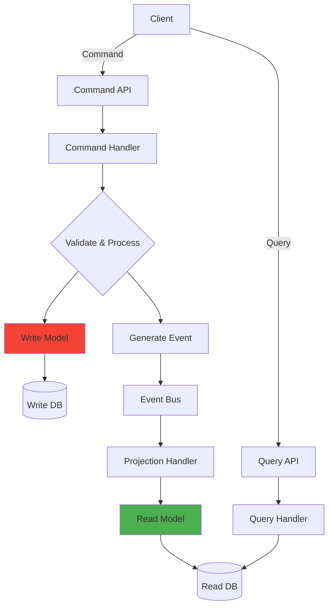
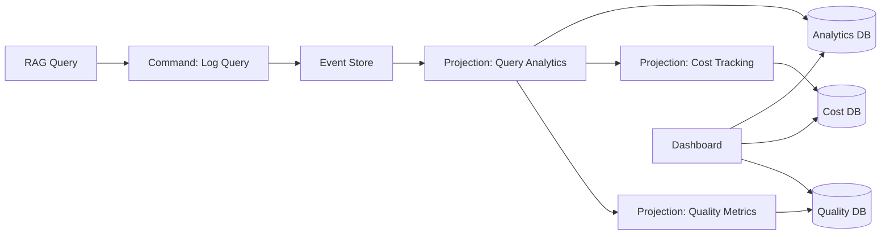

# CQRS (Command Query Responsibility Segregation)

## Overview

CQRS separates the write (command) and read (query) models of a system. Instead of using the same data model for both operations, CQRS maintains distinct models optimized for their specific purpose.

In banking GenAI systems, CQRS is particularly valuable because:
- **Write patterns are infrequent but complex**: Document ingestion, model updates, policy changes
- **Read patterns are frequent but simple**: Query retrieval, dashboard loading, report generation
- **Different scaling needs**: Read traffic vastly exceeds write traffic
- **Regulatory requirements**: Audit trails (write) and compliance reports (read) have different data models
- **Performance optimization**: Read models can be denormalized, cached, and indexed independently

---

## CQRS Architecture



---

## Implementation Example: Document Management

### Command Side

```python
# cqrs/commands/document_commands.py
"""
Command side: handles document creation, updates, and deletion.
The write model is normalized, consistent, and transactional.
"""
from dataclasses import dataclass
from datetime import datetime
from typing import Optional
import uuid

@dataclass
class IngestDocumentCommand:
    customer_id: str
    document_type: str
    title: str
    content: str
    metadata: dict
    tenant_id: str

@dataclass
class UpdateDocumentCommand:
    document_id: str
    title: Optional[str] = None
    metadata: Optional[dict] = None
    tenant_id: str = None

@dataclass
class DeleteDocumentCommand:
    document_id: str
    tenant_id: str

class DocumentCommandHandler:
    """
    Process commands and produce events.
    The command handler does NOT return data -- it returns events.
    """

    def __init__(self, event_store, document_repository):
        self.event_store = event_store
        self.repository = document_repository

    async def handle_ingest(self, command: IngestDocumentCommand) -> str:
        """
        Process the ingest document command.
        1. Validate the command
        2. Create the document in the write model
        3. Generate and store events
        4. Return the document ID
        """
        # Validate
        if not command.content:
            raise ValidationError("Document content is required")
        if len(command.content) > 10_000_000:  # 10MB limit
            raise ValidationError("Document content exceeds maximum size")

        # Create document
        document_id = str(uuid.uuid4())
        document = Document(
            id=document_id,
            customer_id=command.customer_id,
            document_type=command.document_type,
            title=command.title,
            content=command.content,
            metadata=command.metadata,
            tenant_id=command.tenant_id,
            status="ingesting",
            created_at=datetime.utcnow(),
        )

        await self.repository.save(document)

        # Generate event
        event = CloudEvent(
            source="document-service",
            type="com.banking.document.ingested",
            tenant_id=command.tenant_id,
            customer_id=command.customer_id,
            correlation_id=str(uuid.uuid4()),
            data={
                "document_id": document_id,
                "document_type": command.document_type,
                "title": command.title,
                "page_count": estimate_page_count(command.content),
            },
        )

        await self.event_store.append(event)

        return document_id

    async def handle_update(self, command: UpdateDocumentCommand):
        """Process the update document command."""
        document = await self.repository.get(command.document_id)
        if not document:
            raise DocumentNotFoundError(command.document_id)

        if command.tenant_id and document.tenant_id != command.tenant_id:
            raise UnauthorizedError("Cannot modify document in different tenant")

        if command.title:
            document.title = command.title
        if command.metadata:
            document.metadata.update(command.metadata)

        await self.repository.save(document)

        # Generate event
        event = CloudEvent(
            source="document-service",
            type="com.banking.document.updated",
            tenant_id=command.tenant_id or document.tenant_id,
            customer_id=document.customer_id,
            data={
                "document_id": command.document_id,
                "changes": {k: v for k, v in [
                    ("title", command.title),
                    ("metadata", command.metadata),
                ] if v is not None},
            },
        )

        await self.event_store.append(event)
```

### Read Side

```python
# cqrs/queries/document_queries.py
"""
Query side: handles document searches, retrieval, and reporting.
The read model is denormalized, optimized for queries, and eventually consistent.
"""
from typing import List, Dict, Optional
from dataclasses import dataclass
from elasticsearch import AsyncElasticsearch

@dataclass
class DocumentSearchQuery:
    tenant_id: str
    query_text: Optional[str] = None
    document_type: Optional[str] = None
    customer_id: Optional[str] = None
    date_from: Optional[str] = None
    date_to: Optional[str] = None
    page: int = 1
    page_size: int = 20

@dataclass
class DocumentSearchResult:
    documents: List[dict]
    total: int
    page: int
    page_size: int

class DocumentQueryHandler:
    """
    Process queries against the read model.
    The read model is denormalized and optimized for search.
    """

    def __init__(self, elasticsearch: AsyncElasticsearch):
        self.es = elasticsearch

    async def search(self, query: DocumentSearchQuery) -> DocumentSearchResult:
        """
        Search documents using Elasticsearch.
        The read model is fully denormalized for fast searching.
        """
        search_query = {
            "query": {
                "bool": {
                    "must": [],
                    "filter": [
                        {"term": {"tenant_id": query.tenant_id}},
                    ],
                }
            },
            "sort": [{"created_at": "desc"}],
            "from": (query.page - 1) * query.page_size,
            "size": query.page_size,
        }

        # Add optional filters
        if query.query_text:
            search_query["query"]["bool"]["must"].append({
                "multi_match": {
                    "query": query.query_text,
                    "fields": ["title^3", "content", "metadata.tags"],
                }
            })
        if query.document_type:
            search_query["query"]["bool"]["filter"].append({
                "term": {"document_type": query.document_type}
            })
        if query.customer_id:
            search_query["query"]["bool"]["filter"].append({
                "term": {"customer_id": query.customer_id}
            })
        if query.date_from:
            search_query["query"]["bool"]["filter"].append({
                "range": {"created_at": {"gte": query.date_from}}
            })
        if query.date_to:
            search_query["query"]["bool"]["filter"].append({
                "range": {"created_at": {"lte": query.date_to}}
            })

        response = await self.es.search(
            index="documents-read-model",
            body=search_query,
        )

        return DocumentSearchResult(
            documents=[hit["_source"] for hit in response["hits"]["hits"]],
            total=response["hits"]["total"]["value"],
            page=query.page,
            page_size=query.page_size,
        )

    async def get_by_id(self, document_id: str, tenant_id: str) -> Optional[dict]:
        """Get a single document by ID from the read model."""
        try:
            response = await self.es.get(
                index="documents-read-model",
                id=document_id,
            )
            doc = response["_source"]
            if doc["tenant_id"] != tenant_id:
                return None
            return doc
        except Exception:
            return None

    async def get_statistics(self, tenant_id: str) -> dict:
        """
        Get document statistics -- a query that would be expensive
        on the write model but trivial on the denormalized read model.
        """
        response = await self.es.search(
            index="documents-read-model",
            body={
                "size": 0,
                "query": {"term": {"tenant_id": tenant_id}},
                "aggs": {
                    "by_type": {
                        "terms": {"field": "document_type"}
                    },
                    "by_month": {
                        "date_histogram": {
                            "field": "created_at",
                            "calendar_interval": "month",
                        }
                    },
                    "avg_pages": {
                        "avg": {"field": "page_count"}
                    },
                },
            },
        )

        return {
            "by_type": {b["key"]: b["doc_count"] for b in response["aggregations"]["by_type"]["buckets"]},
            "by_month": [{"date": b["key_as_string"], "count": b["doc_count"]}
                        for b in response["aggregations"]["by_month"]["buckets"]],
            "avg_pages": response["aggregations"]["avg_pages"]["value"],
        }
```

### Projection Handler

```python
# cqrs/projections/document_projection.py
"""
Projection: transforms events into the read model.
Runs asynchronously and maintains the denormalized read model.
"""
from events.consumer import EventConsumer
from events.envelope import CloudEvent
from elasticsearch import AsyncElasticsearch

class DocumentProjection:
    """
    Project document events into the Elasticsearch read model.
    Handles: DocumentIngested, DocumentUpdated, DocumentDeleted.
    """

    def __init__(self, elasticsearch: AsyncElasticsearch):
        self.es = elasticsearch

    async def handle_event(self, event: CloudEvent):
        """Process a single event and update the read model."""
        if event.type == "com.banking.document.ingested":
            await self._handle_ingested(event)
        elif event.type == "com.banking.document.updated":
            await self._handle_updated(event)
        elif event.type == "com.banking.document.deleted":
            await self._handle_deleted(event)

    async def _handle_ingested(self, event: CloudEvent):
        """Index a new document in the read model."""
        doc = {
            "document_id": event.data["document_id"],
            "document_type": event.data["document_type"],
            "title": event.data.get("title", ""),
            "page_count": event.data.get("page_count", 0),
            "tenant_id": event.tenant_id,
            "customer_id": event.customer_id,
            "created_at": event.time.isoformat(),
            "updated_at": event.time.isoformat(),
        }

        await self.es.index(
            index="documents-read-model",
            id=event.data["document_id"],
            document=doc,
        )

    async def _handle_updated(self, event: CloudEvent):
        """Update a document in the read model."""
        updates = {
            "doc": event.data.get("changes", {}),
            "doc_as_upsert": False,
        }

        await self.es.update(
            index="documents-read-model",
            id=event.data["document_id"],
            body=updates,
        )

    async def _handle_deleted(self, event: CloudEvent):
        """Remove a document from the read model."""
        await self.es.delete(
            index="documents-read-model",
            id=event.data["document_id"],
        )
```

---

## CQRS for RAG Query Analytics



```python
# cqrs/projections/rag_analytics_projection.py
"""
Project RAG query events into analytics tables for dashboards.
"""
import asyncpg
from events.envelope import CloudEvent
from datetime import datetime

class RAGAnalyticsProjection:
    """Project RAG events into analytics tables."""

    def __init__(self, db_url: str):
        self.db_url = db_url
        self._pool = None

    async def connect(self):
        self._pool = await asyncpg.create_pool(self.db_url)

    async def handle_event(self, event: CloudEvent):
        if event.type == "com.banking.rag.query.completed":
            await self._record_query(event)
        elif event.type == "com.banking.rag.query.failed":
            await self._record_failure(event)

    async def _record_query(self, event: CloudEvent):
        """Record a completed query in the analytics table."""
        data = event.data
        async with self._pool.acquire() as conn:
            await conn.execute("""
                INSERT INTO rag_query_analytics (
                    query_id, tenant_id, customer_id,
                    response_time_ms, documents_retrieved,
                    confidence_score, model_used, token_count,
                    query_hash, timestamp
                ) VALUES ($1, $2, $3, $4, $5, $6, $7, $8, $9, $10)
            """,
                event.data.get("query_id"),
                event.tenant_id,
                event.customer_id,
                data.get("response_time_ms"),
                data.get("documents_retrieved"),
                data.get("confidence_score"),
                data.get("model_used"),
                data.get("token_count"),
                data.get("query_hash"),
                event.time,
            )

    async def get_daily_summary(self, tenant_id: str, date: str) -> dict:
        """Get a daily summary for the dashboard."""
        async with self._pool.acquire() as conn:
            row = await conn.fetchrow("""
                SELECT
                    COUNT(*) as total_queries,
                    AVG(response_time_ms) as avg_response_time,
                    PERCENTILE_CONT(0.95) WITHIN GROUP (ORDER BY response_time_ms) as p95_response_time,
                    AVG(confidence_score) as avg_confidence,
                    SUM(token_count) as total_tokens,
                    COUNT(DISTINCT customer_id) as unique_customers,
                    AVG(documents_retrieved) as avg_documents_retrieved
                FROM rag_query_analytics
                WHERE tenant_id = $1
                  AND DATE(timestamp) = $2
            """, tenant_id, date)

            return dict(row)
```

---

## When to Use CQRS

| Scenario | Use CQRS? | Rationale |
|---|---|---|
| Simple CRUD app | No | Over-engineering for simple cases |
| Read-heavy, write-light | Yes | Different scaling needs |
| Complex read queries on normalized data | Yes | Denormalized read model simplifies queries |
| Audit trail required | Yes | Event sourcing naturally complements CQRS |
| Real-time dashboards | Yes | Read model optimized for aggregations |
| Eventual consistency acceptable | Yes | Read model can lag behind write model |
| Strict consistency required | No | CQRS introduces eventual consistency |
| Small team, simple domain | No | Added complexity may not be justified |

---

## Interview Questions

1. **What is the main tradeoff of CQRS?**
   - Eventual consistency. The read model is updated asynchronously after the write model, so there is a delay (typically milliseconds to seconds) before writes are visible in queries. This is acceptable for most GenAI use cases but not for financial transactions.

2. **How does CQRS differ from having separate read and write databases?**
   - CQRS specifically uses events to transform the write model into the read model through projections. Simply having separate databases without event-driven synchronization is just read/write splitting, not CQRS.

3. **Can you use CQRS without event sourcing?**
   - Yes, but you lose the audit trail and the ability to rebuild the read model from scratch. The write model becomes the source of truth, and the read model is synchronized via change data capture or dual writes.

4. **How do you handle a read model that falls behind the write model?**
   - Monitor the projection lag. If it exceeds a threshold, alert the team. The read model can be rebuilt from the event store at any time. For critical queries, fall back to the write model with a warning about stale data.

---

## Cross-References

- See [architecture/event-driven-architecture.md](./event-driven-architecture.md) for event patterns
- See [architecture/saga-pattern.md](./saga-pattern.md) for distributed transactions
- See [databases/read-replicas.md](../databases/read-replicas.md) for read/write splitting
- See [architecture/ai-platform-design.md](./ai-platform-design.md) for analytics architecture
