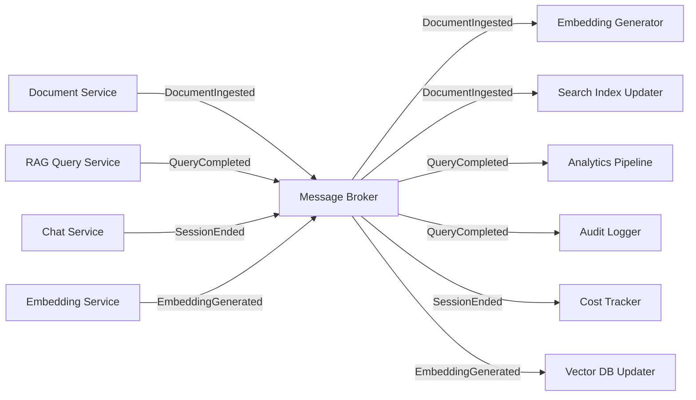
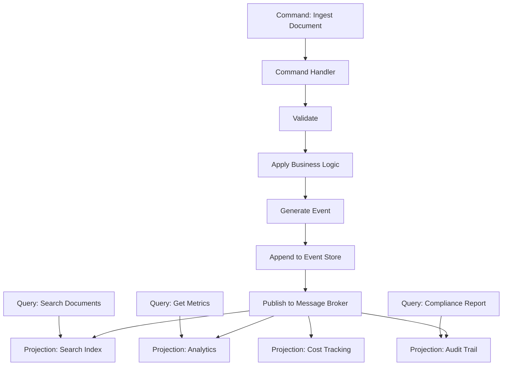

# Event-Driven Architecture in Banking GenAI Systems

## Overview

Event-driven architecture (EDA) decouples services by communicating through events rather than direct API calls. In banking GenAI systems, EDA is essential for:
- **Asynchronous processing**: Document ingestion, embedding generation, and model fine-tuning are naturally async
- **Audit trail**: Every AI interaction generates events for compliance logging
- **Real-time analytics**: Usage patterns, quality metrics, and cost tracking stream in real-time
- **System resilience**: Services continue operating even when downstream consumers are unavailable
- **Regulatory reporting**: Events provide an immutable, ordered record of all system activity

---

## Event-Driven Architecture Patterns



---

## Event Schema Design

### Event Envelope

```python
# events/envelope.py
"""
Standard event envelope for all banking GenAI events.
Ensures consistency across all services and enables generic tooling.
"""
from dataclasses import dataclass, field
from datetime import datetime
from typing import Any, Dict, Optional
import uuid

@dataclass
class CloudEvent:
    """
    CloudEvents specification compliant event.
    See: https://cloudevents.io/
    """
    # Required CloudEvents attributes
    id: str = field(default_factory=lambda: str(uuid.uuid4()))
    source: str = ""              # Identifies the service that produced the event
    type: str = ""                # Event type (e.g., "com.banking.rag.query.completed")
    specversion: str = "1.0"
    time: datetime = field(default_factory=datetime.utcnow)

    # Banking GenAI extensions
    tenant_id: str = ""           # Multi-tenant isolation
    customer_id: str = ""         # Customer context (if applicable)
    correlation_id: str = ""      # Traces related events across services
    causation_id: str = ""        # The event that caused this event
    data_classification: str = "internal"  # public, internal, confidential, restricted

    # Event data
    data: Dict[str, Any] = field(default_factory=dict)

    def to_dict(self) -> dict:
        """Serialize to dictionary for message broker publishing."""
        return {
            "id": self.id,
            "source": self.source,
            "type": self.type,
            "specversion": self.specversion,
            "time": self.time.isoformat(),
            "tenant_id": self.tenant_id,
            "customer_id": self.customer_id,
            "correlation_id": self.correlation_id,
            "causation_id": self.causation_id,
            "data_classification": self.data_classification,
            "data": self.data,
        }

    @classmethod
    def from_dict(cls, d: dict) -> 'CloudEvent':
        """Deserialize from dictionary."""
        d = d.copy()
        d["time"] = datetime.fromisoformat(d["time"])
        return cls(**d)
```

### Banking GenAI Event Types

```python
# events/banking_events.py
"""
All event types used to the banking GenAI platform.
Each event type has a well-defined schema that consumers depend on.
"""
from events.envelope import CloudEvent
from datetime import datetime

# === Document Events ===

def document_ingested_event(
    document_id: str,
    document_type: str,
    page_count: int,
    customer_id: str,
    correlation_id: str,
    tenant_id: str,
) -> CloudEvent:
    """A document has been fully ingested and is ready for processing."""
    return CloudEvent(
        source="document-service",
        type="com.banking.document.ingested",
        tenant_id=tenant_id,
        customer_id=customer_id,
        correlation_id=correlation_id,
        data_classification="confidential",
        data={
            "document_id": document_id,
            "document_type": document_type,
            "page_count": page_count,
            "customer_id": customer_id,
        },
    )

def document_chunking_completed_event(
    document_id: str,
    chunk_count: int,
    total_tokens: int,
    correlation_id: str,
    tenant_id: str,
) -> CloudEvent:
    """Document has been chunked and is ready for embedding."""
    return CloudEvent(
        source="document-service",
        type="com.banking.document.chunking.completed",
        tenant_id=tenant_id,
        correlation_id=correlation_id,
        data_classification="internal",
        data={
            "document_id": document_id,
            "chunk_count": chunk_count,
            "total_tokens": total_tokens,
        },
    )

# === RAG Events ===

def rag_query_completed_event(
    query_id: str,
    query: str,
    customer_id: str,
    response_time_ms: float,
    documents_retrieved: int,
    confidence_score: float,
    model_used: str,
    token_count: int,
    tenant_id: str,
    correlation_id: str,
) -> CloudEvent:
    """A RAG query has been completed."""
    return CloudEvent(
        source="rag-query-service",
        type="com.banking.rag.query.completed",
        tenant_id=tenant_id,
        customer_id=customer_id,
        correlation_id=correlation_id,
        data_classification="restricted",
        data={
            "query_id": query_id,
            "query_hash": hash_query(query),  # Hash, not raw query, for privacy
            "response_time_ms": response_time_ms,
            "documents_retrieved": documents_retrieved,
            "confidence_score": confidence_score,
            "model_used": model_used,
            "token_count": token_count,
        },
    )

def rag_query_failed_event(
    query_id: str,
    error_type: str,
    error_message: str,
    customer_id: str,
    tenant_id: str,
    correlation_id: str,
) -> CloudEvent:
    """A RAG query failed to complete."""
    return CloudEvent(
        source="rag-query-service",
        type="com.banking.rag.query.failed",
        tenant_id=tenant_id,
        customer_id=customer_id,
        correlation_id=correlation_id,
        data_classification="internal",
        data={
            "query_id": query_id,
            "error_type": error_type,
            "error_message": mask_sensitive(error_message),
        },
    )

# === Audit Events ===

def audit_log_event(
    action: str,
    actor_id: str,
    resource_type: str,
    resource_id: str,
    outcome: str,
    details: dict,
    tenant_id: str,
) -> CloudEvent:
    """An auditable action has occurred."""
    return CloudEvent(
        source="audit-service",
        type="com.banking.audit.log",
        tenant_id=tenant_id,
        data_classification="restricted",
        data={
            "action": action,
            "actor_id": actor_id,
            "resource_type": resource_type,
            "resource_id": resource_id,
            "outcome": outcome,
            "details": details,
            "timestamp": datetime.utcnow().isoformat(),
        },
    )

def hash_query(query: str) -> str:
    """Hash a query for privacy-preserving tracking."""
    import hashlib
    return hashlib.sha256(query.encode()).hexdigest()[:16]

def mask_sensitive(message: str) -> str:
    """Mask potentially sensitive information in error messages."""
    import re
    # Mask account numbers
    message = re.sub(r'\b\d{8,17}\b', '****', message)
    # Mask SSNs
    message = re.sub(r'\b\d{3}-\d{2}-\d{4}\b', '***-**-****', message)
    return message
```

---

## Event Publishing and Consumption

### Publisher (Python with RabbitMQ)

```python
# events/publisher.py
"""
Event publisher with retry, dead letter queue, and idempotency support.
"""
import json
import aio_pika
import asyncio
from typing import Optional
from events.envelope import CloudEvent

class EventPublisher:
    """Publish events to RabbitMQ with guaranteed delivery."""

    def __init__(self, broker_url: str, exchange_name: "banking-genai-events"):
        self.broker_url = broker_url
        self.exchange_name = exchange_name
        self.connection: Optional[aio_pika.Connection] = None
        self.channel: Optional[aio_pika.Channel] = None
        self.exchange: Optional[aio_pika.Exchange] = None

    async def connect(self):
        """Establish connection to the message broker."""
        self.connection = await aio_pika.connect_robust(self.broker_url)
        self.channel = await self.connection.channel()
        await self.channel.set_qos(prefetch_count=100)

        # Declare topic exchange
        self.exchange = await self.channel.declare_exchange(
            self.exchange_name,
            aio_pika.ExchangeType.TOPIC,
            durable=True,
        )

    async def publish(self, event: CloudEvent, routing_key: str = None):
        """
        Publish an event with guaranteed delivery.
        Routing key is derived from event type if not provided.
        """
        if not self.connection:
            await self.connect()

        routing_key = routing_key or event.type.replace(".", ".")

        message = aio_pika.Message(
            body=json.dumps(event.to_dict()).encode(),
            content_type="application/json",
            message_id=event.id,
            timestamp=event.time,
            delivery_mode=aio_pika.DeliveryMode.PERSISTENT,
            headers={
                "event_type": event.type,
                "source": event.source,
                "tenant_id": event.tenant_id,
                "data_classification": event.data_classification,
            },
        )

        await self.exchange.publish(message, routing_key=routing_key)

    async def close(self):
        if self.connection:
            await self.connection.close()
```

### Consumer (Python with Dead Letter Queue)

```python
# events/consumer.py
"""
Event consumer with retry, dead letter queue, and idempotency.
"""
import json
import aio_pika
from typing import Callable, Awaitable
from events.envelope import CloudEvent

class EventConsumer:
    """
    Consume events from RabbitMQ with processing guarantees.
    Supports: retry with backoff, dead letter queue, idempotent processing.
    """

    def __init__(self, broker_url: str, exchange_name: str, queue_name: str):
        self.broker_url = broker_url
        self.exchange_name = exchange_name
        self.queue_name = queue_name
        self.connection = None
        self.channel = None

    async def connect(self):
        self.connection = await aio_pika.connect_robust(self.broker_url)
        self.channel = await self.connection.channel()
        await self.channel.set_qos(prefetch_count=10)

        # Declare main exchange
        exchange = await self.channel.declare_exchange(
            self.exchange_name,
            aio_pika.ExchangeType.TOPIC,
            durable=True,
        )

        # Declare dead letter exchange
        dlx_exchange = await self.channel.declare_exchange(
            f"{self.exchange_name}.dlx",
            aio_pika.ExchangeType.TOPIC,
            durable=True,
        )

        # Declare dead letter queue
        dlq = await self.channel.declare_queue(
            f"{self.queue_name}.dead-letter",
            durable=True,
        )
        await dlq.bind(dlx_exchange, routing_key="#")

        # Declare main queue with dead letter routing
        queue = await self.channel.declare_queue(
            self.queue_name,
            durable=True,
            arguments={
                "x-dead-letter-exchange": f"{self.exchange_name}.dlx",
                "x-message-ttl": 60000,  # 1 minute before retry
                "x-max-retry-count": 3,
            },
        )

        self.queue = queue
        self.exchange = exchange

    async def subscribe(self, routing_key: str, handler: Callable[[CloudEvent], Awaitable[None]]):
        """Subscribe to events matching the routing key."""
        await self.queue.bind(self.exchange, routing_key=routing_key)

        async with self.queue.iterator() as queue_iter:
            async for message in queue_iter:
                async with message.process():
                    try:
                        event = CloudEvent.from_dict(json.loads(message.body))
                        await handler(event)
                    except Exception as e:
                        # On failure, message will be routed to dead letter queue
                        # after the TTL expires
                        message.reject(requeue=False)
```

---

## Event Sourcing for Audit Trail

```python
# events/event_store.py
"""
Event store for audit trail -- every state change is an event.
Enables full reconstruction of system state at any point in time.
"""
import json
from typing import List, Optional
from datetime import datetime
import psycopg2
from events.envelope import CloudEvent

class EventStore:
    """
    Append-only event store for audit compliance.
    Every event is persisted and can be replayed to reconstruct state.
    """

    def __init__(self, dsn: str):
        self.conn = psycopg2.connect(dsn)
        self._init_schema()

    def _init_schema(self):
        """Create the events table if it doesn't exist."""
        with self.conn.cursor() as cur:
            cur.execute("""
                CREATE TABLE IF NOT EXISTS events (
                    id UUID PRIMARY KEY,
                    type VARCHAR(255) NOT NULL,
                    source VARCHAR(255) NOT NULL,
                    time TIMESTAMP NOT NULL,
                    tenant_id VARCHAR(100),
                    customer_id VARCHAR(100),
                    correlation_id VARCHAR(100),
                    data_classification VARCHAR(50),
                    data JSONB NOT NULL,
                    created_at TIMESTAMP DEFAULT NOW()
                );

                -- Index for efficient querying
                CREATE INDEX IF NOT EXISTS idx_events_type ON events (type);
                CREATE INDEX IF NOT EXISTS idx_events_time ON events (time);
                CREATE INDEX IF NOT EXISTS idx_events_tenant ON events (tenant_id);
                CREATE INDEX IF NOT EXISTS idx_events_customer ON events (customer_id);
                CREATE INDEX IF NOT EXISTS idx_events_correlation ON events (correlation_id);

                -- Compliance: prevent event deletion
                -- This table should NEVER have DELETE or UPDATE permissions
            """)
            self.conn.commit()

    def append(self, event: CloudEvent):
        """Append an event to the store."""
        with self.conn.cursor() as cur:
            cur.execute("""
                INSERT INTO events (id, type, source, time, tenant_id, customer_id,
                                   correlation_id, data_classification, data)
                VALUES (%s, %s, %s, %s, %s, %s, %s, %s, %s)
            """, (
                event.id,
                event.type,
                event.source,
                event.time,
                event.tenant_id,
                event.customer_id,
                event.correlation_id,
                event.data_classification,
                json.dumps(event.data),
            ))
            self.conn.commit()

    def get_events(self,
                   event_type: str = None,
                   tenant_id: str = None,
                   customer_id: str = None,
                   since: datetime = None,
                   limit: int = 100) -> List[CloudEvent]:
        """Query events with filters."""
        query = "SELECT * FROM events WHERE 1=1"
        params = []

        if event_type:
            query += " AND type = %s"
            params.append(event_type)
        if tenant_id:
            query += " AND tenant_id = %s"
            params.append(tenant_id)
        if customer_id:
            query += " AND customer_id = %s"
            params.append(customer_id)
        if since:
            query += " AND time >= %s"
            params.append(since)

        query += " ORDER BY time ASC LIMIT %s"
        params.append(limit)

        with self.conn.cursor() as cur:
            cur.execute(query, params)
            rows = cur.fetchall()

        events = []
        for row in rows:
            events.append(CloudEvent(
                id=row[0],
                source=row[2],
                type=row[1],
                time=row[3],
                tenant_id=row[4],
                customer_id=row[5],
                correlation_id=row[6],
                data_classification=row[7],
                data=row[8],
            ))

        return events
```

---

## CQRS with Event Sourcing



---

## Interview Questions

1. **What is the difference between event notification and event-carried state transfer?**
   - Event notification says "something happened" (e.g., `DocumentIngested`) and consumers must call back to get details. Event-carried state transfer includes all relevant data in the event itself, so consumers do not need to make additional calls. For banking GenAI, use event-carried state transfer for analytics and notification for actions that require real-time data.

2. **How do you handle event ordering in a distributed system?**
   - Use logical timestamps (Lamport clocks or vector clocks) rather than wall-clock time. Within a single service, use a monotonic sequence number. Across services, use the `correlation_id` to group related events and sort by the event store's append order.

3. **When would you use event sourcing vs. traditional CRUD?**
   - Event sourcing is essential for audit trails, compliance, and debugging. Every state change is recorded as an event, enabling full reconstruction and point-in-time queries. Use traditional CRUD for simple data where history is not important (e.g., user preferences, cached configurations).

4. **How do you prevent event schema breaking changes?**
   - Treat event schemas as API contracts. Add fields only (never remove or rename). Use schema registries (like Confluent Schema Registry) to validate backward compatibility. Version event types when breaking changes are unavoidable: `com.banking.rag.query.v2.completed`.

---

## Cross-References

- See [architecture/cqrs.md](./cqrs.md) for Command Query Responsibility Segregation
- See [architecture/service-boundaries.md](./service-boundaries.md) for inter-service communication
- See [architecture/saga-pattern.md](./saga-pattern.md) for distributed transactions with events
- See [databases/event-sourcing.md](../databases/event-sourcing.md) for event store implementation
