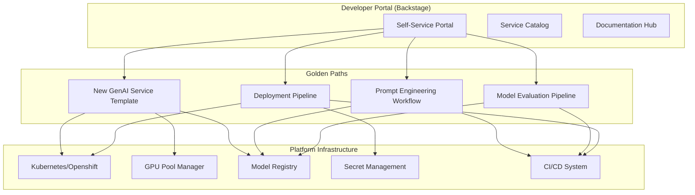

# Internal Developer Platforms (IDP) for Banking GenAI

## Overview

An Internal Developer Platform (IDP) is a self-service layer that abstracts infrastructure complexity and provides standardized workflows for developers. For banking GenAI systems, the IDP handles the unique complexity of AI development: GPU provisioning, model management, prompt versioning, evaluation pipelines, and compliance gates.

The IDP enables product teams to focus on banking domain problems rather than infrastructure configuration.

---

## IDP Architecture



---

## Golden Paths

Golden paths (paved roads) are the recommended, supported ways to accomplish common development tasks. They are not mandatory, but they come with built-in best practices, security compliance, and operational support.

### Golden Path: New GenAI Microservice

```yaml
# scaffolder/templates/genai-service/template.yaml
apiVersion: scaffolder.backstage.io/v1beta3
kind: Template
metadata:
  name: genai-service
  title: New GenAI Microservice
  description: Scaffold a new GenAI microservice with all best practices built in
  tags:
    - genai
    - microservice
    - python

spec:
  owner: team:{{ parameters.owner }}
  type: service

  parameters:
    - title: Service Information
      required:
        - serviceName
        - description
        - owner
      properties:
        serviceName:
          title: Service Name
          type: string
          description: Unique name for your service (kebab-case)
          ui:autofocus: true
        description:
          title: Description
          type: string
          description: What does this service do?
        owner:
          title: Owner
          type: string
          ui:field: OwnerPicker
          description: The team that owns this service

    - title: Service Configuration
      required:
        - llmProvider
        - needsGPU
        - dataClassification
      properties:
        llmProvider:
          title: LLM Provider
          type: string
          enum:
            - openai
            - anthropic
            - self-hosted-llama
            - self-hosted-mistral
          default: openai
        needsGPU:
          title: Needs GPU?
          type: boolean
          description: Does this service run local model inference?
          default: false
        dataClassification:
          title: Data Classification
          type: string
          enum:
            - public
            - internal
            - confidential
            - restricted
          default: internal
          description: Highest classification of data this service handles

  steps:
    - id: fetch-base
      name: Fetch Base Template
      action: fetch:template
      input:
        url: "./genai-service-base"
        values:
          serviceName: {{ parameters.serviceName }}
          description: {{ parameters.description }}
          owner: {{ parameters.owner }}
          llmProvider: {{ parameters.llmProvider }}
          needsGPU: {{ parameters.needsGPU }}
          dataClassification: {{ parameters.dataClassification }}

    - id: publish
      name: Publish to GitHub
      action: publish:github
      input:
        repoUrl: "github.com?owner=banking-genai&repo={{ parameters.serviceName }}"
        defaultBranch: main
        protectDefaultBranch: true
        requireCodeOwners: true

    - id: register
      name: Register in Catalog
      action: catalog:register
      input:
        repoContentsUrl: {{ steps.publish.output.remoteUrl }}
        catalogInfoPath: "/catalog-info.yaml"

    - id: create-ci-pipeline
      name: Create CI Pipeline
      action: genai:create-ci-pipeline
      input:
        serviceName: {{ parameters.serviceName }}
        llmProvider: {{ parameters.llmProvider }}
        needsGPU: {{ parameters.needsGPU }}

    - id: provision-infra
      name: Provision Infrastructure
      action: genai:provision-infra
      input:
        serviceName: {{ parameters.serviceName }}
        environment: staging
        needsGPU: {{ parameters.needsGPU }}
        dataClassification: {{ parameters.dataClassification }}
```

### Generated Service Structure

```
my-genai-service/
├── catalog-info.yaml           # Backstage catalog registration
├── README.md
├── src/
│   ├── __init__.py
│   ├── main.py                 # FastAPI application entry point
│   ├── config.py               # Configuration with validation
│   ├── models.py               # Pydantic models for API
│   ├── routes/
│   │   ├── __init__.py
│   │   ├── query.py            # Query endpoint
│   │   └── health.py           # Health check
│   ├── services/
│   │   ├── __init__.py
│   │   ├── rag.py              # RAG service
│   │   └── llm.py              # LLM client with failover
│   └── middleware/
│       ├── __init__.py
│       ├── auth.py             # Authentication middleware
│       ├── audit.py            # Audit logging
│       └── safety.py           # Safety guard middleware
├── tests/
│   ├── __init__.py
│   ├── test_query.py
│   ├── test_golden.py          # Golden dataset evaluation
│   └── test_safety.py          # Safety tests
├── deployments/
│   ├── kubernetes/
│   │   ├── deployment.yaml     # K8s deployment template
│   │   ├── service.yaml
│   │   ├── hpa.yaml            # Auto-scaling
│   │   └── network-policy.yaml
│   └── helm/
│       ├── Chart.yaml
│       └── values.yaml
├── monitoring/
│   ├── dashboards.json         # Grafana dashboard definition
│   └── alerts.yaml             # Alert rules
├── test_data/
│   └── golden/
│       └── sample.jsonl        # Sample golden dataset
├── .github/
│   └── workflows/
│       ├── ci.yaml             # Continuous integration
│       ├── quality-gates.yaml  # Quality gate checks
│       └── deploy.yaml         # Deployment pipeline
├── Dockerfile
├── docker-compose.yaml
├── pyproject.toml
└── Makefile
```

---

## Self-Service Infrastructure Provisioning

```python
# idp/provisioner.py
"""
Self-service infrastructure provisioning through the IDP.
Teams can provision resources without writing Terraform.
"""
from dataclasses import dataclass
from typing import Optional
import boto3
import pulumi
from pulumi_aws import s3, rds, elasticache

@dataclass
class ResourceRequest:
    """A team's request for infrastructure resources."""
    service_name: str
    team_id: str
    environment: str  # dev, staging, production
    resource_type: str  # vector_db, postgres, redis, s3
    size: str  # small, medium, large
    data_classification: str
    multi_az: bool = False
    backup_retention_days: int = 7

class InfrastructureProvisioner:
    """Provision infrastructure resources based on team requests."""

    def __init__(self, aws_profile: str = "banking-genai"):
        self.aws_profile = aws_profile
        self._pulumi_stack = None

    def provision(self, request: ResourceRequest) -> dict:
        """Provision the requested resources."""
        if request.resource_type == "vector_db":
            return self._provision_qdrant(request)
        elif request.resource_type == "postgres":
            return self._provision_postgres(request)
        elif request.resource_type == "redis":
            return self._provision_redis(request)
        elif request.resource_type == "s3":
            return self._provision_s3(request)
        else:
            raise ValueError(f"Unknown resource type: {request.resource_type}")

    def _provision_qdrant(self, request: ResourceRequest) -> dict:
        """Provision a Qdrant vector database instance."""
        # In practice, use EKS with Qdrant Helm chart or managed Qdrant Cloud
        size_config = {
            "small": {"cpu": "2", "memory": "4Gi", "storage": "50Gi"},
            "medium": {"cpu": "4", "memory": "8Gi", "storage": "200Gi"},
            "large": {"cpu": "8", "memory": "16Gi", "storage": "500Gi"},
        }
        config = size_config[request.size]

        # Generate Terraform/Pulumi configuration
        resources = {
            "type": "qdrant",
            "service_name": request.service_name,
            "environment": request.environment,
            "config": config,
            "multi_az": request.multi_az,
            "backup_retention_days": request.backup_retention_days,
            "network_policy": {
                "allowed_services": [request.service_name],
                "data_classification": request.data_classification,
            },
        }

        return resources

    def _provision_postgres(self, request: ResourceRequest) -> dict:
        """Provision an RDS PostgreSQL instance."""
        size_config = {
            "small": {"instance_class": "db.t3.medium", "storage_gb": 50},
            "medium": {"instance_class": "db.r5.large", "storage_gb": 200},
            "large": {"instance_class": "db.r5.xlarge", "storage_gb": 500},
        }
        config = size_config[request.size]

        resources = {
            "type": "postgres",
            "engine_version": "16.2",
            "instance_class": config["instance_class"],
            "storage_gb": config["storage_gb"],
            "multi_az": request.multi_az,
            "backup_retention_days": request.backup_retention_days,
            "encryption": True,
            "network_policy": {
                "vpc": "banking-genai-vpc",
                "subnet_group": "private-db-subnets",
                "security_group": f"sg-{request.service_name}-db",
            },
            "tags": {
                "service": request.service_name,
                "team": request.team_id,
                "environment": request.environment,
                "data_classification": request.data_classification,
            },
        }

        return resources
```

---

## Developer Portal: Service Catalog

```yaml
# catalog-info.yaml
apiVersion: backstage.io/v1alpha1
kind: Component
metadata:
  name: banking-rag-assistant
  description: RAG-powered banking customer assistant
  annotations:
    github.com/project-slug: banking-genai/banking-rag-assistant
    backstage.io/techdocs-ref: dir:.
    genai.banking.llm-provider: openai
    genai.banking.model: gpt-4-turbo
    genai.banking.data-classification: restricted
    genai.banking.environment: production
  tags:
    - genai
    - rag
    - customer-facing
    - python
  links:
    - url: https://grafana.banking-genai.internal/d/rag-assistant
      title: Grafana Dashboard
      icon: dashboard
    - url: https://docs.banking-genai.internal/rag-assistant
      title: Documentation
      icon: docs

spec:
  type: service
  lifecycle: production
  owner: team-retail-banking
  system: banking-genai-platform
  dependsOn:
    - resource:qdrant-production
    - resource:redis-production
    - resource:openai-api
  providesApis:
    - banking-rag-query-api
```

---

## IDP Metrics and Success Measurement

| Metric | Target | Measurement |
|---|---|---|
| Time to first deployment | < 30 minutes | From service creation to staging deploy |
| Golden path adoption rate | > 80% | % of services using IDP templates |
| Infrastructure provisioning time | < 15 minutes | From request to resource ready |
| Developer satisfaction | > 4.0/5 | Quarterly survey |
| Self-service rate | > 90% | % of tasks completed without platform team help |
| Incident rate (IDP-managed) | < non-IDP | Compare incident rates between IDP and non-IDP services |
| Onboarding time (new team) | < 2 days | From team creation to first deployment |

---

## Interview Questions

1. **What is the difference between an IDP and a platform team?**
   - A platform team is an organizational construct (a team that provides shared capabilities). An IDP is a product that the platform team builds -- a self-service portal that abstracts infrastructure and standardizes workflows. You can have a platform team without an IDP (manual processes), but an effective platform team always builds an IDP.

2. **How do you encourage adoption of golden paths without mandating them?**
   - Make the golden path the easiest option. Include security compliance, monitoring, and CI/CD for free. Provide clear documentation and training. Track and publicize success metrics. Offer platform team support for teams using golden paths. Make the non-golden path possible but with explicit opt-out and additional responsibilities.

3. **What makes GenAI development different from standard microservice development in an IDP?**
   - GPU provisioning, model registry, prompt versioning, evaluation pipelines (golden datasets, red team tests), safety guard configuration, and cost tracking. A standard IDP does not handle these concerns, so a GenAI IDP must extend the typical developer experience.

4. **How do you handle the "golden path doesn't fit my use case" scenario?**
   - First, understand the gap. If it's a common need, add it to the golden path. If it's truly unique, allow the team to use the escape hatch (direct infrastructure access) but require them to implement equivalent security, monitoring, and compliance. Document the gap and prioritize it.

---

## Cross-References

- See [architecture/shared-platform-design.md](./shared-platform-design.md) for platform API design
- See [architecture/ai-platform-design.md](./ai-platform-design.md) for AI platform architecture
- See [cicd-devops/](../cicd-devops/) for CI/CD pipeline design
- See [kubernetes-openshift/](../kubernetes-openshift/) for Kubernetes deployment
