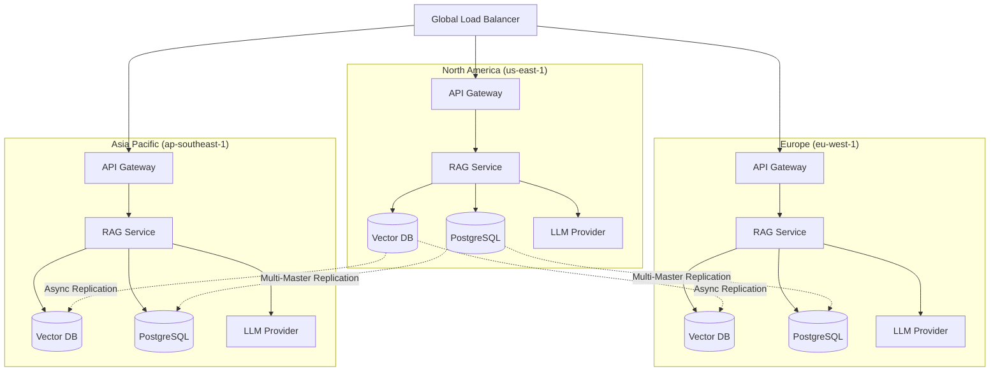
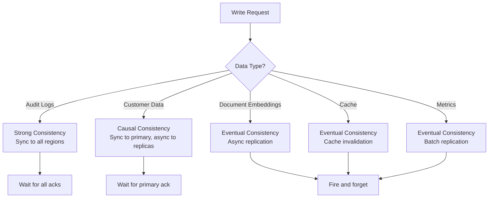

# Multi-Region Design for Banking GenAI Systems

## Overview

Multi-region architecture deploys the GenAI platform across geographically distributed data centers to achieve high availability, low latency for global users, and disaster recovery resilience. For banking GenAI systems, multi-region design is driven by:

- **Data residency requirements**: EU customer data must stay in EU regions (GDPR)
- **Latency targets**: Global users expect sub-500ms response times
- **Regulatory availability**: Banking systems must meet minimum availability SLAs
- **Disaster recovery**: Region-level failures must not cause data loss

---

## Multi-Region Topology



---

## Data Distribution Strategies

### Active-Active vs Active-Passive

| Pattern | Description | Write Latency | Read Latency | Complexity | Cost |
|---|---|---|---|---|---|
| **Active-Active** | All regions serve reads and writes | Low (local) | Low (local) | High | High |
| **Active-Passive** | Primary serves all traffic, DR is standby | High (cross-region) | Low (local) | Medium | Medium |
| **Read-Local, Write-Global** | Reads local, writes routed to primary | Medium | Low (local reads) | Medium | Medium |

For banking GenAI, **Active-Active for reads, single-writer for writes** is the recommended pattern:
- RAG queries are read-heavy and benefit from local vector databases
- Document writes are infrequent and can route to a single primary region
- Audit logs are written locally and replicated globally

### Vector Database Replication

```python
# multi_region/vector_replication.py
"""
Cross-region vector database replication.
Vectors are replicated asynchronously with conflict resolution.
"""
from qdrant_client import QdrantClient
from typing import List
import asyncio

class CrossRegionVectorReplicator:
    """
    Replicate vector database changes across regions.
    Since vectors are immutable (documents don't change their embeddings),
    conflict resolution is straightforward: last-write-wins by timestamp.
    """

    def __init__(self, regions: dict):
        """
        regions: {
            "us-east": QdrantClient(...),
            "eu-west": QdrantClient(...),
            "ap-southeast": QdrantClient(...),
        }
        """
        self.regions = regions
        self.primary_region = "us-east"

    async def upsert(self, collection: str, points: List[dict]):
        """
        Upsert vectors to all regions.
        Write to primary region first, then replicate to secondaries.
        """
        # Write to primary
        primary_client = self.regions[self.primary_region]
        await primary_client.upsert(collection_name=collection, points=points)

        # Replicate to secondaries asynchronously
        tasks = []
        for region_name, client in self.regions.items():
            if region_name != self.primary_region:
                tasks.append(self._replicate_to_region(client, collection, points))

        # Don't wait for replication (async, best-effort)
        asyncio.create_task(asyncio.gather(*tasks, return_exceptions=True))

    async def _replicate_to_region(self, client: QdrantClient,
                                    collection: str, points: List[dict]):
        """Replicate points to a secondary region."""
        max_retries = 3
        for attempt in range(max_retries):
            try:
                await client.upsert(collection_name=collection, points=points)
                return
            except Exception as e:
                if attempt == max_retries - 1:
                    # Log replication failure
                    logger.error(f"Failed to replicate to {client.url}: {e}")
                    # Alert for manual intervention
                    await alert_replication_failure(client.url, collection, points, e)
                await asyncio.sleep(2 ** attempt)

    async def search(self, region: str, collection: str,
                     query_vector: List[float], top_k: int = 5) -> List[dict]:
        """Search the local region's vector database."""
        client = self.regions[region]
        return await client.search(
            collection_name=collection,
            query_vector=query_vector,
            limit=top_k,
        )

    async def verify_replication(self, collection: str) -> dict:
        """Check replication lag across regions."""
        results = {}
        for region_name, client in self.regions.items():
            count = await client.count(collection_name=collection)
            results[region_name] = {"vector_count": count}

        # Check for discrepancies
        counts = [r["vector_count"] for r in results.values()]
        if len(set(counts)) > 1:
            results["replication_status"] = "lagging"
        else:
            results["replication_status"] = "consistent"

        return results
```

### PostgreSQL Multi-Region Replication

```yaml
# multi-region/postgres-config.yaml
# PostgreSQL multi-region setup using logical replication
primary:
  region: us-east-1
  connection: "postgresql://primary.banking-genai.internal:5432/banking"
  role: primary
  synchronous_commit: "on"  # Strong consistency for banking data

replicas:
  - region: eu-west-1
    connection: "postgresql://replica-eu.banking-genai.internal:5432/banking"
    role: replica
    replication_type: logical
    replication_slots:
      - name: eu_west_slot
        publication: "all_tables"
    read_only: true

  - region: ap-southeast-1
    connection: "postgresql://replica-ap.banking-genai.internal:5432/banking"
    role: replica
    replication_type: logical
    replication_slots:
      - name: ap_southeast_slot
        publication: "all_tables"
    read_only: true

# For tables that need multi-master (e.g., audit logs):
# Use conflict-free replicated data types (CRDTs) or application-level conflict resolution
multi_master_tables:
  - audit_logs  # Append-only, no conflicts possible
  - usage_metrics  # Time-series, partitioned by region

# Write routing: all writes go to primary
# Read routing: reads go to local replica
write_routing:
  primary: us-east-1
  failover: eu-west-1  # If primary is down, writes route here

read_routing:
  us-east-1: us-east-1  # Read local
  eu-west-1: eu-west-1
  ap-southeast-1: ap-southeast-1
  fallback: us-east-1  # If local replica is down
```

---

## Global Load Balancing

```yaml
# infrastructure/global-lb.yaml
# Route traffic to the nearest healthy region
apiVersion: gateway.networking.k8s.io/v1beta1
kind: Gateway
metadata:
  name: banking-genai-global
spec:
  gatewayClassName: global-lb
  listeners:
    - name: https
      protocol: HTTPS
      port: 443
      allowedRoutes:
        namespaces:
          from: All
---
# Traffic routing rules
apiVersion: gateway.networking.k8s.io/v1beta1
kind: HTTPRoute
metadata:
  name: banking-genai-routing
spec:
  rules:
    # Route by geographic proximity
    - matches:
        - headers:
            - name: CloudFront-Viewer-Country-Region
              value: US
      backendRefs:
        - name: banking-rag-api-us-east
          weight: 100

    - matches:
        - headers:
            - name: CloudFront-Viewer-Country-Region
              value: DE|FR|GB|NL|IT|ES
      backendRefs:
        - name: banking-rag-api-eu-west
          weight: 100

    - matches:
        - headers:
            - name: CloudFront-Viewer-Country-Region
              value: SG|JP|AU|IN
      backendRefs:
        - name: banking-rag-api-ap-southeast
          weight: 100

    # Data residency: EU customer data queries must go to EU region
    - matches:
        - headers:
            - name: X-Customer-Data-Residency
              value: EU
      backendRefs:
        - name: banking-rag-api-eu-west
          weight: 100

    # Default: route to nearest healthy region
    - backendRefs:
        - name: banking-rag-api-us-east
          weight: 33
        - name: banking-rag-api-eu-west
          weight: 33
        - name: banking-rag-api-ap-southeast
          weight: 34
      # Health check: only route to healthy regions
```

---

## Consistency Model



| Data Type | Consistency | Rationale |
|---|---|---|
| Audit Logs | Strong | Regulatory: no log entry can be lost |
| Customer PII | Causal | Banking data requires strong consistency for writes |
| Document Embeddings | Eventual | Vectors are immutable; slight replication lag is acceptable |
| Response Cache | Eventual | Stale cache entries are harmless |
| Usage Metrics | Eventual | Metrics are approximate by nature |

---

## Interview Questions

1. **How do you handle data residency requirements in a multi-region GenAI system?**
   - Tag all customer data with residency requirements (EU, US, etc.). Route queries based on the customer's residency tag. Store EU customer data only in EU regions. Use region-specific vector database collections and PostgreSQL schemas. The global load balancer checks the `X-Customer-Data-Residency` header and routes accordingly.

2. **What is the impact of multi-region on GenAI query latency?**
   - If the vector database and embedding service are deployed in each region, query latency is similar to single-region (local vector search). The only cross-region call is if the primary PostgreSQL is in another region (for writes). For read-heavy GenAI workloads, multi-region actually improves latency by serving users from the nearest region.

3. **How do you handle a scenario where regions have different LLM model availability?**
   - Model availability varies by region due to provider infrastructure. Use the LLM router to select from available models per region. If a region lacks a specific model, route the LLM call to a region that has it (accepting the latency penalty). Alternatively, deploy self-hosted models in all regions for guaranteed availability.

4. **What is the cost implication of multi-region deployment?**
   - Approximately 2-3x the single-region cost (one full set of infrastructure per active region). Optimization: use smaller instance sizes in non-primary regions, only scale up during failover. Cache aggressively to reduce cross-region API calls. Use spot instances for non-critical batch processing in secondary regions.

---

## Cross-References

- See [architecture/disaster-recovery.md](./disaster-recovery.md) for disaster recovery
- See [architecture/capacity-planning.md](./capacity-planning.md) for capacity planning
- See [architecture/cost-management.md](./cost-management.md) for cost optimization
- See [infrastructure/global-load-balancing.md](../infrastructure/global-load-balancing.md) for load balancing
