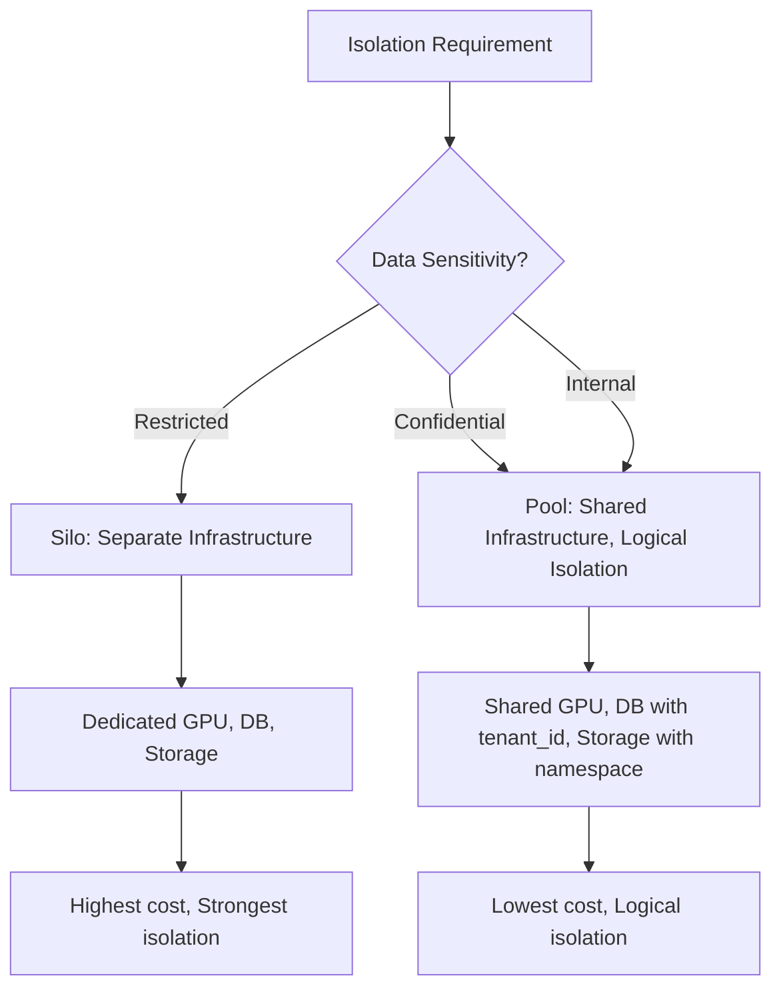

# Multi-Tenant Design in Banking GenAI Systems

## Overview

Multi-tenant architecture allows a single instance of the GenAI platform to serve multiple isolated groups (tenants). In banking, tenants represent different business units, subsidiaries, or even external clients. Each tenant's data, configurations, and usage must be completely isolated while sharing the underlying infrastructure for cost efficiency.

Regulatory requirements make multi-tenancy in banking more complex than typical SaaS applications:
- **Data residency**: Some tenants require data in specific geographic regions
- **Compliance isolation**: Different regulatory frameworks (OCC, ECB, MAS) per tenant
- **Audit separation**: Each tenant's audit trail must be independently queryable
- **Performance isolation**: One tenant's heavy usage must not degrade another tenant's experience

---

## Multi-Tenant Isolation Models



| Model | Isolation | Cost | Complexity | Use Case |
|---|---|---|---|---|
| **Silo** | Physical | High | Low | Regulated subsidiaries, external clients |
| **Pool** | Logical | Low | Medium | Internal business units |
| **Bridge** | Mixed | Medium | High | Mixed sensitivity within same tenant |

---

## Logical Isolation Implementation

### Tenant Context Propagation

```python
# platform/tenant/context.py
"""
Tenant context propagation ensures every operation is scoped to the correct tenant.
The tenant ID flows through: API Gateway -> Service -> Database -> Vector DB -> Logs.
"""
from contextvars import ContextVar
from dataclasses import dataclass
from typing import Optional
from fastapi import Request, HTTPException

@dataclass
class TenantContext:
    tenant_id: str
    tenant_name: str
    data_classification: str  # public, internal, confidential, restricted
    region: str  # us-east, eu-west, ap-south
    compliance_framework: str  # OCC, ECB, MAS, none
    resource_quota: dict

# Context variable that flows through async code
tenant_ctx: ContextVar[Optional[TenantContext]] = ContextVar("tenant_ctx", default=None)

class TenantMiddleware:
    """
    Extract tenant information from the request and set the context.
    Applied to every incoming request.
    """

    def __init__(self, tenant_registry):
        self.registry = tenant_registry

    async def __call__(self, request: Request, call_next):
        # Extract tenant ID from JWT token
        token = request.headers.get("Authorization", "").replace("Bearer ", "")
        tenant_id = self._extract_tenant_id(token)

        if not tenant_id:
            raise HTTPException(status_code=401, detail="Tenant identification required")

        # Load tenant context
        tenant = await self.registry.get_tenant(tenant_id)
        if not tenant:
            raise HTTPException(status_code=403, detail="Unknown tenant")

        # Check resource quota
        if await self._is_quota_exceeded(tenant):
            raise HTTPException(status_code=429, detail="Tenant resource quota exceeded")

        # Set tenant context for this request
        token_var = tenant_ctx.set(tenant)

        try:
            response = await call_next(request)
            response.headers["X-Tenant-ID"] = tenant_id
            return response
        finally:
            tenant_ctx.reset(token_var)

    def _extract_tenant_id(self, token: str) -> Optional[str]:
        """Extract tenant ID from JWT token."""
        import jwt
        try:
            payload = jwt.decode(token, options={"verify_signature": False})
            return payload.get("tenant_id")
        except Exception:
            return None

    async def _is_quota_exceeded(self, tenant: TenantContext) -> bool:
        """Check if the tenant has exceeded their resource quota."""
        import redis
        r = redis.from_url("redis://redis:6379")

        # Check token usage
        today = datetime.utcnow().strftime("%Y-%m-%d")
        token_key = f"tenant:{tenant.tenant_id}:tokens:{today}"
        tokens_used = int(r.get(token_key) or 0)

        if tokens_used >= tenant.resource_quota.get("daily_tokens", float("inf")):
            return True

        return False
```

### Database-Level Tenant Isolation

```python
# platform/database/tenant_isolation.py
"""
Ensure all database operations are scoped to the tenant.
Uses PostgreSQL Row-Level Security for defense-in-depth.
"""
import asyncpg
from platform.tenant.context import tenant_ctx

class TenantScopedDatabase:
    """
    Database wrapper that ensures tenant isolation at the query level.
    Every query automatically includes tenant_id filtering.
    """

    def __init__(self, pool: asyncpg.Pool):
        self.pool = pool

    async def fetch(self, query: str, *args, table: str = None) -> list:
        """Execute a SELECT query scoped to the current tenant."""
        tenant = tenant_ctx.get()
        if not tenant:
            raise RuntimeError("No tenant context set")

        # If table name is provided, automatically append tenant filter
        if table and "WHERE" in query.upper():
            query = query.rstrip(";") + f" AND {table}.tenant_id = ${{len(args) + 1}}"
        elif table:
            query = query.rstrip(";") + f" WHERE {table}.tenant_id = ${{len(args) + 1}}"

        return await self.pool.fetch(query, *args, tenant.tenant_id)

    async def execute(self, query: str, *args, table: str = None) -> str:
        """Execute a write query scoped to the current tenant."""
        tenant = tenant_ctx.get()
        if not tenant:
            raise RuntimeError("No tenant context set")

        # Automatically add tenant_id to INSERT statements
        if "INSERT INTO" in query.upper():
            # Add tenant_id to column list and values
            query = self._inject_tenant_id(query, tenant.tenant_id)

        return await self.pool.execute(query, *args)

    def _inject_tenant_id(self, query: str, tenant_id: str) -> str:
        """Inject tenant_id into INSERT queries."""
        import re
        # Match: INSERT INTO table (col1, col2) VALUES ($1, $2)
        pattern = r'INSERT INTO (\w+) \(([^)]+)\) VALUES \(([^)]+)\)'
        match = re.match(pattern, query, re.IGNORECASE)

        if match:
            table, columns, values = match.groups()
            new_query = query.replace(
                f"({columns})", f"({columns}, tenant_id)"
            ).replace(
                f"({values})", f"({values}, ${len(values.split(',')) + 1})"
            )
            return new_query

        return query
```

### PostgreSQL Row-Level Security

```sql
-- migrations/001_row_level_security.sql
-- Row-Level Security: defense-in-depth for tenant isolation

-- Enable RLS on all tenant-scoped tables
ALTER TABLE documents ENABLE ROW LEVEL SECURITY;
ALTER TABLE rag_queries ENABLE ROW LEVEL SECURITY;
ALTER TABLE embeddings ENABLE ROW LEVEL SECURITY;
ALTER TABLE audit_logs ENABLE ROW LEVEL SECURITY;

-- Create policies: users can only see rows matching their tenant_id
CREATE POLICY tenant_isolation_documents
    ON documents
    USING (tenant_id = current_setting('app.current_tenant_id'));

CREATE POLICY tenant_isolation_rag_queries
    ON rag_queries
    USING (tenant_id = current_setting('app.current_tenant_id'));

CREATE POLICY tenant_isolation_embeddings
    ON embeddings
    USING (tenant_id = current_setting('app.current_tenant_id'));

-- Audit logs: app can read, but no one can delete or update
CREATE POLICY tenant_isolation_audit_logs
    ON audit_logs
    USING (tenant_id = current_setting('app.current_tenant_id'));

CREATE POLICY audit_logs_immutable
    ON audit_logs
    FOR ALL
    USING (true)
    WITH CHECK (true);

-- Deny DELETE on audit logs (compliance requirement)
REVOKE DELETE ON audit_logs FROM app_user;

-- Set tenant ID at the start of each connection
-- The application middleware sets this via: SET app.current_tenant_id = 'tenant-123';
```

### Vector Database Tenant Isolation

```python
# platform/vector_db/tenant_isolation.py
"""
Tenant isolation for Qdrant vector database.
Each tenant gets a separate collection namespace.
"""
from qdrant_client import QdrantClient, models

class TenantScopedVectorDB:
    """Wrapper around Qdrant that enforces tenant isolation."""

    def __init__(self, client: QdrantClient):
        self.client = client

    def _collection_name(self, tenant_id: str, base_name: str) -> str:
        """Generate tenant-scoped collection name."""
        return f"{tenant_id}-{base_name}"

    async def search(self, tenant_id: str, collection: str,
                     query_vector: list, top_k: int = 5) -> list:
        """Search within tenant's collection."""
        full_collection = self._collection_name(tenant_id, collection)

        # Verify collection exists for this tenant
        collections = [c.name for c in self.client.get_collections().collections]
        if full_collection not in collections:
            raise CollectionNotFoundError(
                f"Collection '{collection}' not found for tenant '{tenant_id}'"
            )

        return self.client.search(
            collection_name=full_collection,
            query_vector=query_vector,
            limit=top_k,
        )

    async def upsert(self, tenant_id: str, collection: str,
                     points: list) -> bool:
        """Insert points into tenant's collection."""
        full_collection = self._collection_name(tenant_id, collection)

        # Ensure collection exists
        if not self._collection_exists(full_collection):
            self._create_collection(full_collection)

        return self.client.upsert(
            collection_name=full_collection,
            points=points,
        )

    def _collection_exists(self, name: str) -> bool:
        collections = [c.name for c in self.client.get_collections().collections]
        return name in collections

    def _create_collection(self, name: str):
        self.client.create_collection(
            collection_name=name,
            vectors_config=models.VectorParams(size=1536, distance=models.Distance.COSINE),
        )
```

---

## Silo Deployment for High-Security Tenants

```yaml
# deployments/silo-tenant.yaml
# Separate infrastructure for tenants requiring physical isolation
apiVersion: v1
kind: Namespace
metadata:
  name: tenant-acme-bank
  labels:
    tenant: acme-bank
    isolation: silo
    compliance: OCC
---
apiVersion: apps/v1
kind: Deployment
metadata:
  name: banking-rag-api
  namespace: tenant-acme-bank
spec:
  replicas: 3
  template:
    spec:
      # Dedicated GPU nodes for this tenant
      nodeSelector:
        tenant-dedicated: acme-bank
        gpu-type: a100-80gb
      # No network access to other tenant namespaces
      tolerations:
        - key: tenant-dedicated
          operator: Equal
          value: acme-bank
          effect: NoSchedule
---
# Network policy: isolate this tenant from all others
apiVersion: networking.k8s.io/v1
kind: NetworkPolicy
metadata:
  name: tenant-isolation
  namespace: tenant-acme-bank
spec:
  podSelector: {}
  policyTypes:
    - Ingress
    - Egress
  ingress:
    - from:
        - namespaceSelector:
            matchLabels:
              name: api-gateway
  egress:
    - to:
        - namespaceSelector:
            matchLabels:
              name: tenant-acme-bank
    - to:
        # Allow external LLM provider calls
        - ipBlock:
            cidr: 0.0.0.0/0
            except:
              - 10.0.0.0/8  # Block internal network
              - 172.16.0.0/12
              - 192.168.0.0/16
```

---

## Tenant Resource Quota Management

```python
# platform/tenant/quota_manager.py
"""
Manage tenant resource quotas and enforce limits.
"""
from dataclasses import dataclass
from datetime import datetime, timedelta
import redis

@dataclass
class TenantQuota:
    daily_tokens: int          # Max tokens per day
    monthly_documents: int     # Max documents per month
    max_document_size_mb: int  # Max single document size
    max_concurrent_queries: int  # Max simultaneous queries
    storage_gb: int            # Max vector storage
    gpu_hours_per_month: int   # Max GPU compute (for self-hosted models)

class QuotaEnforcer:
    """Enforce tenant resource quotas using Redis counters."""

    def __init__(self, redis_url: str):
        self.redis = redis.from_url(redis_url)

    async def check_and_consume(self, tenant_id: str, resource: str,
                                 amount: int, quota: TenantQuota) -> bool:
        """
        Check if consuming the requested amount would exceed the quota.
        If within limits, consume and return True.
        If exceeding, return False.
        """
        limit = getattr(quota, resource, None)
        if limit is None:
            return True  # No quota for this resource

        # Get the right time window
        now = datetime.utcnow()
        if "daily" in resource:
            window = now.strftime("%Y-%m-%d")
            ttl = 86400
        elif "monthly" in resource:
            window = now.strftime("%Y-%m")
            ttl = 86400 * 31
        else:
            window = "total"
            ttl = 0

        key = f"quota:{tenant_id}:{resource}:{window}"
        current = int(self.redis.get(key) or 0)

        if current + amount > limit:
            return False

        # Consume
        pipe = self.redis.pipeline()
        pipe.incrby(key, amount)
        if ttl:
            pipe.expire(key, ttl)
        pipe.execute()

        return True

    async def get_usage(self, tenant_id: str, resource: str) -> dict:
        """Get current resource usage vs. quota."""
        now = datetime.utcnow()
        key = f"quota:{tenant_id}:{resource}:{now.strftime('%Y-%m-%d')}"
        used = int(self.redis.get(key) or 0)

        return {
            "resource": resource,
            "used": used,
            "timestamp": now.isoformat(),
        }
```

---

## Interview Questions

1. **What is the difference between silo and pool multi-tenancy?**
   - Silo: each tenant has dedicated infrastructure (separate databases, GPU nodes, storage). Pool: all tenants share infrastructure with logical isolation (tenant_id filtering). Silo is more expensive but provides stronger isolation. Pool is cheaper but requires careful implementation to prevent data leakage.

2. **How do you prevent one tenant from affecting another tenant's performance in a pool model?**
   - Rate limiting per tenant, resource quotas (tokens/day, concurrent queries), query timeouts, and circuit breakers. Use weighted fair queuing in the LLM gateway to ensure no single tenant monopolizes the provider connection.

3. **What is Row-Level Security and why is it important for multi-tenancy?**
   - RLS is a database feature that automatically filters rows based on the current user/tenant context. It provides defense-in-depth: even if the application layer fails to add tenant_id to a query, the database will still enforce isolation. In banking, RLS is a regulatory expectation for multi-tenant data.

4. **How do you handle a tenant that needs to migrate from pool to silo?**
   - This is a data migration challenge. Create the silo infrastructure, migrate data with dual-write during transition, validate data integrity, switch traffic, and decommission the pool data. The tenant context and APIs should remain unchanged -- only the infrastructure moves.

---

## Cross-References

- See [architecture/zero-trust-architecture.md](./zero-trust-architecture.md) for security isolation
- See [kubernetes-openshift/network-policies.md](../kubernetes-openshift/network-policies.md) for network isolation
- See [databases/multi-tenant-databases.md](../databases/multi-tenant-databases.md) for database patterns
- See [architecture/multi-region-design.md](./multi-region-design.md) for geographic tenant placement
