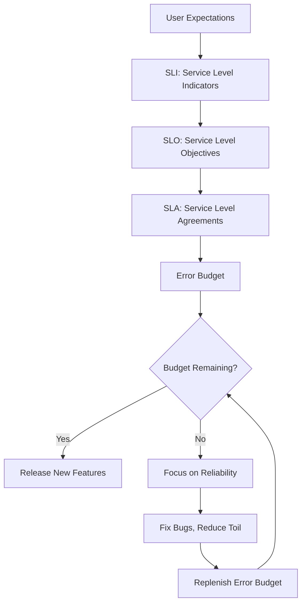

# Reliability Engineering for Banking GenAI Systems

## Overview

Reliability engineering ensures that the GenAI platform consistently delivers correct, available, and performant service to its users. In banking, reliability is not just an engineering goal -- it is a regulatory requirement and a trust imperative. A banking GenAI system that provides incorrect information about interest rates or fails during a fraud alert has consequences far beyond a typical software outage.

Site Reliability Engineering (SRE) provides the framework for measuring, monitoring, and improving reliability through Service Level Objectives (SLOs), error budgets, and systematic incident response.

---

## SRE Framework



---

## Service Level Indicators (SLIs)

SLIs are the measurable metrics that indicate service health.

```python
# reliability/slis.py
"""
Define and measure Service Level Indicators for the banking GenAI platform.
"""
from dataclasses import dataclass
from datetime import datetime
from typing import List, Dict
import time

@dataclass
class SLI:
    name: str
    description: str
    unit: str
    measurement: str  # How to measure

# Core SLIs for Banking GenAI
SLIs = {
    "availability": SLI(
        name="Availability",
        description="Percentage of successful requests (non-5xx responses)",
        unit="percentage",
        measurement="count(2xx+4xx) / count(total) * 100",
    ),
    "latency_p95": SLI(
        name="P95 Latency",
        description="95th percentile response time for RAG queries",
        unit="milliseconds",
        measurement="histogram_quantile(0.95, rag_query_duration_seconds)",
    ),
    "latency_p99": SLI(
        name="P99 Latency",
        description="99th percentile response time for RAG queries",
        unit="milliseconds",
        measurement="histogram_quantile(0.99, rag_query_duration_seconds)",
    ),
    "answer_quality": SLI(
        name="Answer Quality",
        description="Percentage of answers with confidence > 0.7",
        unit="percentage",
        measurement="count(confidence > 0.7) / count(total) * 100",
    ),
    "retrieval_recall": SLI(
        name="Retrieval Recall",
        description="Percentage of queries that retrieve relevant documents",
        unit="percentage",
        measurement="count(relevant_docs_retrieved) / count(total) * 100",
    ),
    "safety_compliance": SLI(
        name="Safety Compliance",
        description="Percentage of outputs that pass all safety checks",
        unit="percentage",
        measurement="count(passed_safety) / count(total) * 100",
    ),
    "token_accuracy": SLI(
        name="Token Accuracy",
        description="Percentage of generated tokens that are factually correct",
        unit="percentage",
        measurement="Human evaluation sample / total * 100",
    ),
    "document_freshness": SLI(
        name="Document Freshness",
        description="Percentage of documents indexed within SLA of ingestion",
        unit="percentage",
        measurement="count(indexed_within_60s) / count(total_ingested) * 100",
    ),
}
```

---

## Service Level Objectives (SLOs)

SLOs are the target values for each SLI.

| SLI | SLO Target | Measurement Window | Alert Threshold |
|---|---|---|---|
| Availability | 99.95% | Rolling 30-day | < 99.9% |
| P95 Latency | < 2,500ms | Per-hour | > 3,000ms for 15 min |
| P99 Latency | < 5,000ms | Per-hour | > 8,000ms for 10 min |
| Answer Quality | > 85% | Weekly | < 80% |
| Retrieval Recall | > 80% | Weekly | < 70% |
| Safety Compliance | 100% | Per-request | Any violation |
| Token Accuracy | > 95% | Monthly | < 90% |
| Document Freshness | > 95% within 60s | Daily | < 90% |

```yaml
# reliability/slo-config.yaml
slos:
  availability:
    target: 0.9995
    window: 30d
    measurement: prometheus
    query: |
      sum(rate(http_requests_total{code=~"2..|4..", job="rag-query"}[30d]))
      /
      sum(rate(http_requests_total{job="rag-query"}[30d]))
    alert_threshold: 0.999
    alert_duration: 5m

  latency_p95:
    target: 2500  # milliseconds
    window: 1h
    measurement: prometheus
    query: |
      histogram_quantile(0.95, rate(rag_query_duration_seconds_bucket[1h])) * 1000
    alert_threshold: 3000
    alert_duration: 15m

  answer_quality:
    target: 0.85
    window: 7d
    measurement: golden_dataset_evaluation
    query: "python tests/evaluate_golden.py"
    alert_threshold: 0.80
    alert_duration: immediate  # Alert on each evaluation run

  safety_compliance:
    target: 1.0
    window: per-request
    measurement: safety_guard
    alert_threshold: 0.999  # Allow for edge cases in measurement
    alert_duration: immediate
```

---

## Error Budget

The error budget is the allowable amount of unreliability. It is calculated as `1 - SLO`.

```python
# reliability/error_budget.py
"""
Error budget tracking and management.
"""
from dataclasses import dataclass
from datetime import datetime, timedelta

@dataclass
class ErrorBudget:
    slo_target: float        # e.g., 0.9995 (99.95%)
    window_days: int        # e.g., 30
    total_requests: int      # Total requests in the window
    failed_requests: int     # Failed requests in the window

    @property
    def budget_total(self) -> int:
        """Total allowable failures in the window."""
        return int(self.total_requests * (1 - self.slo_target))

    @property
    def budget_consumed(self) -> int:
        """Failures so far in the current window."""
        return self.failed_requests

    @property
    def budget_remaining(self) -> int:
        """Remaining error budget."""
        return max(0, self.budget_total - self.budget_consumed)

    @property
    def budget_consumed_percentage(self) -> float:
        """Percentage of budget consumed."""
        if self.budget_total == 0:
            return 100.0
        return min(100.0, (self.budget_consumed / self.budget_total) * 100)

    @property
    def burn_rate(self) -> float:
        """
        Current burn rate compared to acceptable rate.
        Burn rate of 1.0 = consuming budget at exactly the allowed rate.
        Burn rate of 14.4 = consuming 14.4x faster than allowed.
        """
        elapsed = self._elapsed_fraction()
        if elapsed == 0:
            return 0.0
        return (self.budget_consumed_percentage / 100) / elapsed

    def _elapsed_fraction(self) -> float:
        """What fraction of the window has elapsed."""
        # Simplified: assume window started at the beginning of the period
        return 0.5  # Placeholder

    def should_block_releases(self) -> bool:
        """
        Determine if releases should be blocked due to budget exhaustion.
        Google SRE recommends blocking releases when burn rate > 1.0 for
        sustained periods.
        """
        return self.burn_rate > 1.0 and self.budget_remaining <= 0

    def status(self) -> str:
        """Get the error budget status."""
        if self.budget_remaining <= 0:
            return "EXHAUSTED - Block all releases"
        if self.burn_rate > 14.4:
            return "CRITICAL - 14.4x burn rate"
        if self.burn_rate > 6:
            return "HIGH - 6x burn rate"
        if self.burn_rate > 3:
            return "ELEVATED - 3x burn rate"
        if self.burn_rate > 1:
            return "WARNING - Above normal burn rate"
        return "HEALTHY - Within budget"
```

### Multi-Window Burn Rate Alerts

```yaml
# reliability/burn-rate-alerts.yaml
# Google SRE multi-window, multi-burn-rate alerting
# Catches both fast-spikes and slow-grinding failures

alerts:
  # 14.4x burn rate: budget exhausted in 2 days
  - name: "ErrorBudgetBurn_14.4x"
    condition: |
      burn_rate(2h) > 14.4
      and
      burn_rate(5m) > 14.4
    severity: critical
    action: "Page on-call. Investigate immediately."
    rationale: "At this rate, monthly error budget is consumed in 2 days"

  # 6x burn rate: budget exhausted in 5 days
  - name: "ErrorBudgetBurn_6x"
    condition: |
      burn_rate(6h) > 6
      and
      burn_rate(30m) > 6
    severity: warning
    action: "Page on-call. Begin investigation."
    rationale: "At this rate, monthly error budget is consumed in 5 days"

  # 3x burn rate: budget exhausted in 10 days
  - name: "ErrorBudgetBurn_3x"
    condition: |
      burn_rate(1d) > 3
      and
      burn_rate(2h) > 3
    severity: warning
    action: "Notify on-call. Monitor closely."
    rationale: "At this rate, monthly error budget is consumed in 10 days"

  # 1x burn rate: budget exhausted in 30 days
  - name: "ErrorBudgetBurn_1x"
    condition: |
      burn_rate(3d) > 1
      and
      burn_rate(6h) > 1
    severity: info
    action: "Log for review. No page."
    rationale: "Budget consumed at normal rate over the month"
```

---

## Reliability Patterns

### Circuit Breaker

```python
# reliability/circuit_breaker.py
"""
Circuit breaker pattern for external service calls.
Prevents cascading failures when a dependency is unhealthy.
"""
import time
from enum import Enum
from typing import Callable, Awaitable

class CircuitState(Enum):
    CLOSED = "closed"      # Normal operation
    OPEN = "open"          # Failing, reject requests
    HALF_OPEN = "half_open"  # Testing if recovered

class CircuitBreaker:
    def __init__(self, failure_threshold: int = 5,
                 recovery_timeout: int = 60,
                 half_open_max_calls: int = 1):
        self.failure_threshold = failure_threshold
        self.recovery_timeout = recovery_timeout
        self.half_open_max_calls = half_open_max_calls

        self.state = CircuitState.CLOSED
        self.failure_count = 0
        self.last_failure_time = 0
        self.half_open_calls = 0

    async def call(self, func: Callable[..., Awaitable], *args, **kwargs):
        """Execute a function through the circuit breaker."""
        if self.state == CircuitState.OPEN:
            if time.time() - self.last_failure_time > self.recovery_timeout:
                self.state = CircuitState.HALF_OPEN
                self.half_open_calls = 0
            else:
                raise CircuitOpenError("Circuit breaker is open")

        if self.state == CircuitState.HALF_OPEN:
            if self.half_open_calls >= self.half_open_max_calls:
                raise CircuitOpenError("Circuit breaker is half-open, max calls reached")
            self.half_open_calls += 1

        try:
            result = await func(*args, **kwargs)
            self._on_success()
            return result
        except Exception as e:
            self._on_failure()
            raise

    def _on_success(self):
        self.failure_count = 0
        self.state = CircuitState.CLOSED

    def _on_failure(self):
        self.failure_count += 1
        self.last_failure_time = time.time()
        if self.failure_count >= self.failure_threshold:
            self.state = CircuitState.OPEN

class CircuitOpenError(Exception):
    pass
```

### Retry with Backoff

```python
# reliability/retry.py
"""
Exponential backoff retry with jitter for resilient service calls.
"""
import asyncio
import random
from functools import wraps

def retry_with_backoff(
    max_retries: int = 3,
    base_delay: float = 1.0,
    max_delay: float = 30.0,
    exponential_base: float = 2.0,
    retryable_exceptions: tuple = (Exception,),
):
    """
    Decorator that retries a function with exponential backoff and jitter.
    """
    def decorator(func):
        @wraps(func)
        async def wrapper(*args, **kwargs):
            last_exception = None
            for attempt in range(max_retries + 1):
                try:
                    return await func(*args, **kwargs)
                except retryable_exceptions as e:
                    last_exception = e
                    if attempt == max_retries:
                        break

                    # Exponential backoff with jitter
                    delay = min(
                        base_delay * (exponential_base ** attempt) + random.uniform(0, 1),
                        max_delay,
                    )
                    print(f"Attempt {attempt + 1} failed: {e}. Retrying in {delay:.1f}s")
                    await asyncio.sleep(delay)

            raise last_exception
        return wrapper
    return decorator
```

---

## SRE Toil Reduction

Toil is the operational work that scales linearly with service size and provides no lasting value.

| Toil Category | Current Effort | Target | Automation Strategy |
|---|---|---|---|
| Manual deployments | 4 hours/month | 0 | CI/CD pipeline |
| Incident investigation | 10 hours/month | 2 hours | Better observability |
| Certificate rotation | 2 hours/month | 0 | Cert-manager automation |
| Log analysis | 5 hours/month | 1 hour | Automated log analysis |
| Capacity planning | 8 hours/month | 4 hours | Automated forecasting |
| Model evaluation runs | 6 hours/month | 1 hour | Scheduled automated pipelines |

---

## Interview Questions

1. **What is the difference between an SLI, SLO, and SLA?**
   - SLI (Service Level Indicator) is the metric you measure (e.g., availability). SLO (Service Level Objective) is the target for that metric (e.g., 99.95% availability). SLA (Service Level Agreement) is the contractual commitment to customers, typically with penalties for violation (e.g., 99.9% availability or credit). SLO is always stricter than SLA to provide a safety buffer.

2. **What does a burn rate of 14.4x mean?**
   - It means the system is consuming the error budget 14.4 times faster than the allowed rate. At this rate, the entire monthly error budget would be consumed in approximately 2 days. Google SRE recommends this as the highest-priority alert -- page the on-call engineer immediately.

3. **How do you measure GenAI-specific SLIs like answer quality?**
   - Use the golden dataset evaluation pipeline. Run a representative sample of queries weekly and measure the pass rate. For real-time quality, use proxy metrics: confidence scores, retrieval recall, and safety check pass rates. Token accuracy requires periodic human evaluation.

4. **Your error budget is exhausted. What do you do?**
   - Block all non-critical releases. Focus the engineering team on reliability improvements: fix bugs, reduce toil, improve monitoring. Do not ship new features until the budget has replenished. This is not punitive -- it ensures that reliability debt is paid down before adding new risk.

---

## Cross-References

- See [architecture/disaster-recovery.md](./disaster-recovery.md) for disaster recovery
- See [incident-management/](../incident-management/) for incident response
- See [testing-and-quality/release-readiness.md](../testing-and-quality/release-readiness.md) for release criteria
- See [testing-and-quality/performance-testing.md](../testing-and-quality/performance-testing.md) for performance SLOs
