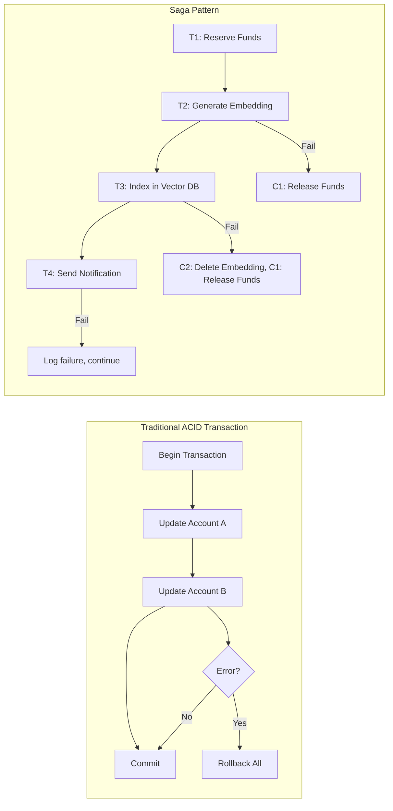

# Saga Pattern for Distributed Transactions

## Overview

The Saga pattern manages distributed transactions across multiple services by breaking them into a sequence of local transactions, each with a compensating action for rollback. In banking GenAI systems, Sagas are essential because operations often span multiple services (document ingestion, embedding, vector indexing, notification) that cannot participate in a traditional two-phase commit.

Unlike traditional banking transactions (ACID), Sagas provide **eventual consistency** with explicit compensation logic -- when one step fails, previously completed steps are undone by running their compensating actions in reverse order.

---

## Saga vs Traditional Transactions



| Aspect | ACID Transaction | Saga |
|---|---|---|
| Consistency | Immediate | Eventual |
| Isolation | Strong | None (concurrent sagas may interleave) |
| Rollback | Automatic (database) | Manual (compensating actions) |
| Duration | Milliseconds | Seconds to hours |
| Scope | Single database | Multiple services |
| Use Case | Fund transfers | Document ingestion pipeline |

---

## Saga Orchestration

### Orchestrator-Based Saga

The orchestrator is a central service that coordinates the saga steps.

```python
# saga/orchestrator.py
"""
Saga orchestrator for multi-step banking GenAI workflows.
Manages compensation logic for rollback on failure.
"""
from dataclasses import dataclass, field
from typing import List, Callable, Awaitable, Any, Dict
from enum import Enum
import asyncio

class SagaStatus(Enum):
    PENDING = "pending"
    RUNNING = "running"
    COMPLETED = "completed"
    COMPENSATING = "compensating"
    FAILED = "failed"

@dataclass
class SagaStep:
    name: str
    action: Callable[..., Awaitable[Any]]
    compensation: Callable[..., Awaitable[Any]]
    timeout_seconds: float = 30.0

@dataclass
class SagaContext:
    """Shared data across saga steps."""
    data: Dict[str, Any] = field(default_factory=dict)
    status: SagaStatus = SagaStatus.PENDING
    completed_steps: List[str] = field(default_factory=list)
    error: str = ""

class SagaOrchestrator:
    """
    Execute a saga with automatic compensation on failure.
    """

    def __init__(self, steps: List[SagaStep]):
        self.steps = steps
        self.context = SagaContext()

    async def execute(self, initial_data: Dict[str, Any] = None) -> SagaContext:
        """
        Execute all saga steps in order.
        If any step fails, compensate all completed steps in reverse.
        """
        self.context = SagaContext(data=initial_data or {})
        self.context.status = SagaStatus.RUNNING

        try:
            # Execute steps forward
            for step in self.steps:
                await self._execute_step(step)

            self.context.status = SagaStatus.COMPLETED
            return self.context

        except Exception as e:
            self.context.error = str(e)
            self.context.status = SagaStatus.COMPENSATING

            # Compensate completed steps in reverse
            for step in reversed(self.context.completed_steps):
                saga_step = next(s for s in self.steps if s.name == step)
                try:
                    await self._compensate_step(saga_step)
                except Exception as comp_error:
                    # Log compensation failure -- critical in banking
                    print(f"COMPENSATION FAILED for {step}: {comp_error}")
                    # In banking, failed compensation requires manual intervention
                    await self._alert_compensation_failure(step, comp_error)

            self.context.status = SagaStatus.FAILED
            raise SagaExecutionError(
                f"Step '{self._current_step}' failed: {e}. "
                f"Compensation {'completed' if self.context.status == SagaStatus.FAILED else 'failed'}."
            )

    async def _execute_step(self, step: SagaStep):
        """Execute a single saga step with timeout."""
        try:
            result = await asyncio.wait_for(
                step.action(self.context),
                timeout=step.timeout_seconds,
            )
            self.context.data[step.name] = result
            self.context.completed_steps.append(step.name)
        except asyncio.TimeoutError:
            raise TimeoutError(f"Step '{step.name}' timed out after {step.timeout_seconds}s")

    async def _compensate_step(self, step: SagaStep):
        """Execute the compensation for a step."""
        await asyncio.wait_for(
            step.compensation(self.context),
            timeout=step.timeout_seconds,
        )
        self.context.completed_steps.remove(step.name)

    async def _alert_compensation_failure(self, step_name: str, error: Exception):
        """Alert the team when compensation fails."""
        # Send to PagerDuty, Slack, etc.
        await send_alert(
            severity="critical",
            message=f"Saga compensation failed for step '{step_name}': {error}",
            context=self.context.data,
        )


async def send_alert(severity: str, message: str, context: dict):
    """Send critical alert to on-call team."""
    import aiohttp
    async with aiohttp.ClientSession() as session:
        await session.post(
            "https://events.pagerduty.com/v2/enqueue",
            json={
                "routing_key": "PAGERDUTY_KEY",
                "event_action": "trigger",
                "payload": {
                    "summary": message,
                    "severity": severity,
                    "source": "saga-orchestrator",
                    "custom_details": context,
                },
            },
        )


class SagaExecutionError(Exception):
    """Raised when a saga fails and compensation is complete."""
    pass
```

---

## Practical Example: Document Ingestion Saga

```python
# saga/document_ingestion_saga.py
"""
Document ingestion saga:
1. Reserve storage quota
2. Parse and chunk document
3. Generate embeddings
4. Store in vector database
5. Update search index
6. Send notification

Each step has a compensating action for rollback.
"""
from saga.orchestrator import SagaOrchestrator, SagaStep, SagaContext
from typing import Any, Dict

# === Step Actions ===

async def reserve_storage_quota(context: SagaContext) -> Dict[str, Any]:
    """Reserve storage quota for the document."""
    customer_id = context.data["customer_id"]
    storage_service = context.data["storage_service"]

    # Check and reserve quota
    result = await storage_service.reserve_quota(customer_id, context.data["estimated_size_mb"])
    return {"quota_reservation_id": result["reservation_id"]}

async def compensate_storage(context: SagaContext):
    """Release the reserved storage quota."""
    storage_service = context.data["storage_service"]
    reservation_id = context.data["reserve_storage_quota"]["quota_reservation_id"]
    await storage_service.release_quota(reservation_id)

async def parse_and_chunk(context: SagaContext) -> Dict[str, Any]:
    """Parse the document and split into chunks."""
    parser = context.data["parser_service"]
    content = context.data["content"]

    chunks = await parser.chunk(
        content=content,
        chunk_size=context.data.get("chunk_size", 512),
        overlap=context.data.get("chunk_overlap", 50),
    )
    return {"chunks": chunks, "chunk_count": len(chunks)}

async def compensate_parsing(context: SagaContext):
    """No compensation needed for parsing -- it's stateless."""
    pass

async def generate_embeddings(context: SagaContext) -> Dict[str, Any]:
    """Generate embeddings for each chunk."""
    embedding_service = context.data["embedding_service"]
    chunks = context.data["parse_and_chunk"]["chunks"]

    embeddings = []
    for chunk in chunks:
        embedding = await embedding_service.embed(chunk["text"])
        embeddings.append({
            "chunk_id": chunk["id"],
            "embedding": embedding,
            "text": chunk["text"],
        })

    return {"embeddings": embeddings}

async def compensate_embeddings(context: SagaContext):
    """No compensation needed -- embeddings are not stored yet."""
    pass

async def store_in_vector_db(context: SagaContext) -> Dict[str, Any]:
    """Store embeddings in the vector database."""
    vector_db = context.data["vector_db_client"]
    embeddings = context.data["generate_embeddings"]["embeddings"]
    document_id = context.data["document_id"]
    tenant_id = context.data["tenant_id"]

    vector_ids = []
    for emb in embeddings:
        vector_id = await vector_db.upsert(
            collection=f"documents-{tenant_id}",
            id=f"{document_id}-{emb['chunk_id']}",
            vector=emb["embedding"],
            payload={
                "document_id": document_id,
                "chunk_id": emb["chunk_id"],
                "text": emb["text"],
                "tenant_id": tenant_id,
            },
        )
        vector_ids.append(vector_id)

    return {"vector_ids": vector_ids}

async def compensate_vector_db(context: SagaContext):
    """Delete the stored vectors."""
    vector_db = context.data["vector_db_client"]
    tenant_id = context.data["tenant_id"]
    vector_ids = context.data["store_in_vector_db"]["vector_ids"]

    for vector_id in vector_ids:
        await vector_db.delete(
            collection=f"documents-{tenant_id}",
            id=vector_id,
        )

async def update_search_index(context: SagaContext) -> Dict[str, Any]:
    """Update the Elasticsearch index for full-text search."""
    es_client = context.data["elasticsearch_client"]
    document_id = context.data["document_id"]

    await es_client.index(
        index="documents",
        id=document_id,
        document={
            "document_id": document_id,
            "title": context.data.get("title", ""),
            "document_type": context.data.get("document_type", ""),
            "customer_id": context.data["customer_id"],
            "tenant_id": context.data["tenant_id"],
            "chunk_count": context.data["parse_and_chunk"]["chunk_count"],
            "created_at": context.data.get("created_at"),
        },
    )

    return {"indexed": True}

async def compensate_search_index(context: SagaContext):
    """Remove the document from the search index."""
    es_client = context.data["elasticsearch_client"]
    document_id = context.data["document_id"]

    try:
        await es_client.delete(index="documents", id=document_id)
    except Exception:
        # Document may not have been indexed yet -- log and continue
        print(f"Could not delete document {document_id} from search index")

async def send_notification(context: SagaContext) -> Dict[str, Any]:
    """Notify the customer that their document is ready."""
    notification_service = context.data["notification_service"]
    await notification_service.send(
        customer_id=context.data["customer_id"],
        channel="email",
        template="document_ingestion_complete",
        context={
            "document_title": context.data.get("title", "Your document"),
            "chunk_count": context.data["parse_and_chunk"]["chunk_count"],
        },
    )
    return {"notified": True}

async def compensate_notification(context: SagaContext):
    """Cannot unsend a notification -- log the discrepancy."""
    print(f"WARNING: Could not compensate notification for document {context.data['document_id']}")
    # In banking, this goes to an exception queue for manual review


# === Build and Execute the Saga ===

def create_document_ingestion_saga() -> SagaOrchestrator:
    """Create the document ingestion saga."""
    steps = [
        SagaStep(
            name="reserve_storage_quota",
            action=reserve_storage_quota,
            compensation=compensate_storage,
            timeout_seconds=10.0,
        ),
        SagaStep(
            name="parse_and_chunk",
            action=parse_and_chunk,
            compensation=compensate_parsing,
            timeout_seconds=60.0,
        ),
        SagaStep(
            name="generate_embeddings",
            action=generate_embeddings,
            compensation=compensate_embeddings,
            timeout_seconds=120.0,
        ),
        SagaStep(
            name="store_in_vector_db",
            action=store_in_vector_db,
            compensation=compensate_vector_db,
            timeout_seconds=30.0,
        ),
        SagaStep(
            name="update_search_index",
            action=update_search_index,
            compensation=compensate_search_index,
            timeout_seconds=10.0,
        ),
        SagaStep(
            name="send_notification",
            action=send_notification,
            compensation=compensate_notification,
            timeout_seconds=10.0,
        ),
    ]

    return SagaOrchestrator(steps)


# Usage
async def ingest_document(document_data: dict):
    """Ingest a document using the saga pattern."""
    saga = create_document_ingestion_saga()

    context_data = {
        "document_id": document_data["id"],
        "customer_id": document_data["customer_id"],
        "tenant_id": document_data["tenant_id"],
        "content": document_data["content"],
        "title": document_data.get("title", ""),
        "document_type": document_data.get("type", "general"),
        "estimated_size_mb": len(document_data["content"]) / (1024 * 1024),
        "storage_service": storage_service_client,
        "parser_service": parser_service_client,
        "embedding_service": embedding_service_client,
        "vector_db_client": vector_db_client,
        "elasticsearch_client": es_client,
        "notification_service": notification_service,
        "created_at": datetime.utcnow().isoformat(),
    }

    try:
        result = await saga.execute(context_data)
        return {"status": "completed", "document_id": document_data["id"]}
    except SagaExecutionError as e:
        return {"status": "failed", "error": str(e), "document_id": document_data["id"]}
```

---

## Saga Monitoring and Observability

```python
# saga/monitoring.py
"""
Saga monitoring for operational visibility.
"""
from dataclasses import dataclass
from datetime import datetime
from typing import Dict, List

@dataclass
class SagaMetric:
    saga_type: str
    step_name: str
    status: str  # completed, failed, compensated
    duration_ms: float
    timestamp: datetime

class SagaMonitor:
    """Track saga execution metrics for monitoring and alerting."""

    def __init__(self):
        self.metrics: List[SagaMetric] = []
        self.active_sagas: Dict[str, dict] = {}

    def record_step(self, saga_type: str, step_name: str,
                    status: str, duration_ms: float):
        """Record a saga step execution."""
        self.metrics.append(SagaMetric(
            saga_type=saga_type,
            step_name=step_name,
            status=status,
            duration_ms=duration_ms,
            timestamp=datetime.utcnow(),
        ))

    def get_failure_rate(self, saga_type: str, window_hours: int = 24) -> float:
        """Calculate the failure rate for a saga type."""
        cutoff = datetime.utcnow() - timedelta(hours=window_hours)
        relevant = [m for m in self.metrics
                    if m.saga_type == saga_type and m.timestamp > cutoff]

        if not relevant:
            return 0.0

        failures = sum(1 for m in relevant if m.status == "failed")
        return failures / len(relevant)

    def get_compensation_failure_rate(self, saga_type: str) -> float:
        """Calculate how often compensation fails (critical metric)."""
        relevant = [m for m in self.metrics
                    if m.saga_type == saga_type and m.status == "compensated"]

        if not relevant:
            return 0.0

        compensation_failures = sum(1 for m in relevant if m.status == "compensation_failed")
        return compensation_failures / len(relevant)
```

---

## Interview Questions

1. **When would you use choreography vs. orchestration for Sagas?**
   - Orchestration (central coordinator) is better for complex sagas with many steps and complex compensation logic. Choreography (event-driven, no coordinator) is simpler for 2-3 step sagas but becomes hard to debug as complexity grows. In banking, use orchestration for auditability.

2. **What happens if a compensation action fails?**
   - This is the most dangerous scenario in banking. The system is in an inconsistent state that cannot be automatically resolved. The failure must be alerted the on-call team, logged in the exception queue, and resolved manually. Design compensations to be as reliable as possible.

3. **How do you prevent concurrent sagas from corrupting shared state?**
   - Use optimistic concurrency control (version numbers) or pessimistic locking (distributed locks) for shared resources. For document quotas, use a reservation system with expiration. For vector DB writes, use per-document locks.

4. **What is the idempotency requirement for saga steps?**
   - Every saga step must be idempotent. If the orchestrator retries a step (due to a network timeout), running it twice must produce the same result as running it once. Use unique operation IDs and check-before-write patterns.

---

## Cross-References

- See [architecture/event-driven-architecture.md](./event-driven-architecture.md) for event patterns
- See [architecture/cqrs.md](./cqrs.md) for command/query separation
- See [databases/distributed-transactions.md](../databases/distributed-transactions.md) for transaction patterns
- See [banking-domain/payment-processing.md](../banking-domain/payment-processing.md) for banking transaction sagas
