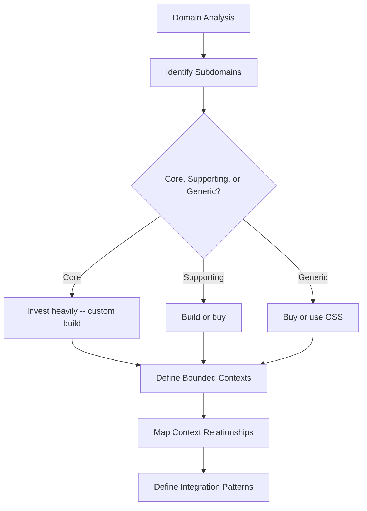
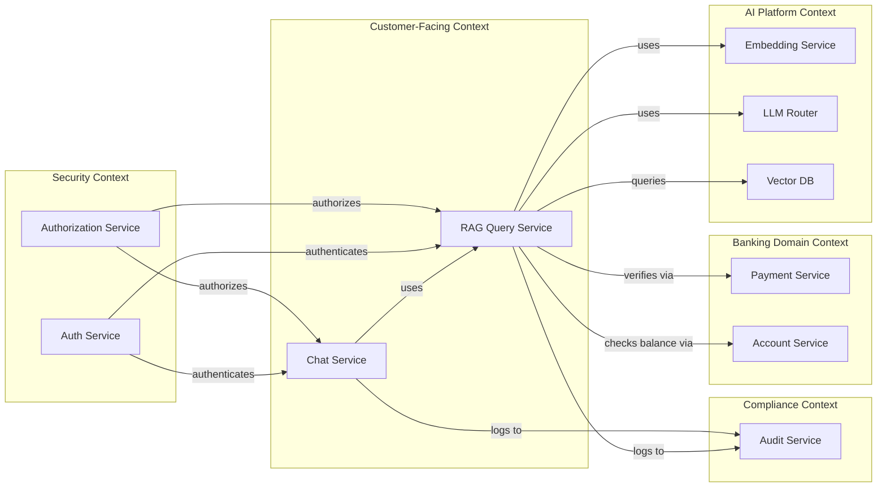

# Service Boundaries in Banking GenAI Systems

## Overview

Service boundaries define where one service ends and another begins. Getting boundaries wrong creates distributed monoliths (tight coupling over the network) or oversized services that negate microservice benefits. In banking GenAI systems, boundaries are further complicated by data governance requirements, GPU resource allocation, and the distinction between AI capabilities and business logic.

Domain-Driven Design (DDD) provides the primary framework for identifying boundaries through **bounded contexts** -- explicit boundaries within which a domain model is defined and applicable.

---

## Bounded Context Identification



---

## Banking GenAI Subdomains

| Subdomain | Type | Description | Owns Data? |
|---|---|---|---|
| **RAG Query** | Core | Retrieval-augmented generation for banking queries | Yes (query cache) |
| **Document Intelligence** | Core | Document parsing, chunking, embedding | Yes (document store) |
| **Embedding Generation** | Supporting | Text-to-vector transformation | No (stateless) |
| **LLM Routing** | Supporting | Multi-provider LLM routing and failover | No (stateless) |
| **Authentication** | Generic | OAuth2, SSO, MFA | Yes (credentials) |
| **Authorization** | Supporting | Role-based, tenant-based access control | Yes (policies) |
| **Audit Logging** | Core | All AI interactions logged for compliance | Yes (audit trail) |
| **Analytics** | Supporting | Usage metrics, quality dashboards | Yes (metrics) |
| **Notification** | Generic | Email, SMS, push notifications | No |
| **Payment Processing** | Core | Banking transaction execution | Yes (transactions) |

---

## Context Map



### Relationship Patterns

| Pattern | Direction | Description | Example |
|---|---|---|---|
| **Customer-Supplier** | Upstream -> Downstream | Upstream provides data, downstream consumes | Embedding Service -> RAG Query |
| **Conformist** | Downstream conforms to Upstream | Downstream has no choice but to adapt | RAG Query -> External LLM Provider |
| **Anti-Corruption Layer** | Downstream protects itself | Translation layer prevents domain contamination | RAG Query -> Core Banking System |
| **Open Host Service** | Upstream publishes protocol | Multiple downstream consumers | Embedding Service (REST API) |
| **Shared Kernel** | Both share code | Common libraries, models | Domain models, utility functions |

---

## Defining Service Contracts

### Embedding Service (Open Host Service)

```yaml
# contracts/embedding-service.yaml
openapi: "3.0.3"
info:
  title: Embedding Service
  version: "1.0.0"
  x-bounded-context: "AI Platform"
  x-relationship-type: "Open Host Service"

paths:
  /embed:
    post:
      summary: Generate embedding vector for text
      requestBody:
        required: true
        content:
          application/json:
            schema:
              type: object
              required:
                - text
              properties:
                text:
                  type: string
                  maxLength: 8192
                model:
                  type: string
                  enum: [text-embedding-3-small, text-embedding-3-large, all-MiniLM-L6-v2]
                  default: text-embedding-3-small
      responses:
        "200":
          description: Embedding vector
          content:
            application/json:
              schema:
                type: object
                properties:
                  embedding:
                    type: array
                    items:
                      type: number
                  dimensions:
                    type: integer
                  model:
                    type: string
                  processing_time_ms:
                    type: number
```

### RAG Query Service (Downstream Consumer)

```python
# services/rag_query/client/embedding_client.py
"""
Anti-corruption layer: The RAG Query service uses embeddings
without knowing the internal details of the Embedding Service.
"""
from dataclasses import dataclass
from typing import List
import httpx

@dataclass
class EmbeddingResult:
    vector: List[float]
    dimensions: int
    model: str

class EmbeddingClient:
    """
    Anti-corruption layer for the Embedding Service.
    Translates between the external embedding API and
    the internal representation used by the RAG service.
    """
    def __init__(self, base_url: str, api_key: str, timeout: float = 5.0):
        self.base_url = base_url
        self.api_key = api_key
        self.timeout = timeout

    async def generate_embedding(self, text: str, model: str = None) -> EmbeddingResult:
        """Generate embedding with internal domain representation."""
        async with httpx.AsyncClient() as client:
            response = await client.post(
                f"{self.base_url}/embed",
                json={"text": text, "model": model},
                headers={"Authorization": f"Bearer {self.api_key}"},
                timeout=self.timeout,
            )
            response.raise_for_status()
            data = response.json()

            # Translate to internal representation
            return EmbeddingResult(
                vector=data["embedding"],
                dimensions=data["dimensions"],
                model=data["model"],
            )

    async def generate_batch_embeddings(self, texts: List[str], model: str = None) -> List[EmbeddingResult]:
        """Batch embedding generation with retry logic."""
        results = []
        batch_size = 32  # Embedding service batch limit

        for i in range(0, len(texts), batch_size):
            batch = texts[i:i + batch_size]
            batch_results = await self._embed_batch(batch, model)
            results.extend(batch_results)

        return results

    async def _embed_batch(self, texts: List[str], model: str = None) -> List[EmbeddingResult]:
        """Embed a single batch with retry."""
        max_retries = 3
        for attempt in range(max_retries):
            try:
                async with httpx.AsyncClient() as client:
                    response = await client.post(
                        f"{self.base_url}/embed/batch",
                        json={"texts": texts, "model": model},
                        timeout=self.timeout * len(texts),
                    )
                    response.raise_for_status()
                    return [
                        EmbeddingResult(**item)
                        for item in response.json()["results"]
                    ]
            except httpx.HTTPError:
                if attempt == max_retries - 1:
                    raise
                await asyncio.sleep(2 ** attempt)  # Exponential backoff
```

---

## Event-Driven Integration

When services need to communicate asynchronously, use events rather than direct API calls.

```python
# events/domain_events.py
"""
Domain events that cross service boundaries.
Each event is owned by the service that produces it.
"""
from dataclasses import dataclass
from datetime import datetime
from typing import Any, Dict
from enum import Enum

class EventType(Enum):
    DOCUMENT_INGESTED = "document.ingested"
    DOCUMENT_CHUNKED = "document.chunked"
    EMBEDDING_GENERATED = "embedding.generated"
    RAG_QUERY_COMPLETED = "rag.query.completed"
    RAG_QUERY_FAILED = "rag.query.failed"
    CUSTOMER_SESSION_STARTED = "customer.session.started"
    AUDIT_LOG_CREATED = "audit.log.created"

@dataclass
class DomainEvent:
    event_type: EventType
    source_service: str
    timestamp: datetime
    event_id: str
    data: Dict[str, Any]
    correlation_id: str  # Traces the event across services

@dataclass
class DocumentIngestedEvent(DomainEvent):
    document_id: str
    document_title: str
    document_type: str
    page_count: int
    customer_id: str

@dataclass
class RAGQueryCompletedEvent(DomainEvent):
    query: str
    customer_id: str
    response_time_ms: float
    documents_retrieved: int
    confidence_score: float
    model_used: str
```

### Event Publishing

```python
# services/document_service/events.py
"""
Publish domain events when document processing completes.
"""
from events.domain_events import DocumentIngestedEvent, EventType
from events.publisher import EventPublisher

publisher = EventPublisher(broker_url="amqp://rabbitmq:5672")

async def publish_document_ingested(document: dict):
    """Publish event when a document is fully ingested."""
    event = DocumentIngestedEvent(
        event_type=EventType.DOCUMENT_INGESTED,
        source_service="document-service",
        timestamp=datetime.utcnow(),
        event_id=generate_uuid(),
        correlation_id=document.get("correlation_id"),
        data={
            "document_id": document["id"],
            "document_title": document["title"],
            "document_type": document["type"],
            "page_count": document["page_count"],
            "customer_id": document["customer_id"],
        },
        document_id=document["id"],
        document_title=document["title"],
        document_type=document["type"],
        page_count=document["page_count"],
        customer_id=document["customer_id"],
    )

    await publisher.publish(event)
```

---

## Boundary Disputes and Resolution

Common areas where service boundaries are disputed in banking GenAI systems:

### Dispute 1: Where does prompt management live?

| Option | Pros | Cons |
|---|---|---|
| In RAG Query Service | Co-located with usage | Duplicates across services |
| Separate Prompt Service | Shared across all AI services | Additional service to maintain |
| In LLM Router | Centralized for all models | LLM router shouldn't own business logic |

**Decision**: Prompt management lives in a **separate Prompt Service** because multiple services (RAG, Chat, Summarization) share prompts and need versioning, A/B testing, and governance.

### Dispute 2: Who owns the vector database?

| Option | Pros | Cons |
|---|---|---|
| Embedding Service | Owns the full embedding pipeline | Embedding service becomes stateful |
| RAG Query Service | Owns retrieval end-to-end | Other services cannot share indices |
| Dedicated Vector DB Service | Shared infrastructure team | Adds operational complexity |

**Decision**: The **Vector DB is its own infrastructure service** (not an application service). Multiple application services (RAG Query, Document Intelligence, Similarity Search) share it through well-defined collection namespaces.

### Dispute 3: Does the Audit Service own log storage or just the API?

**Decision**: Audit Service owns **both** the API and the storage. This is a bounded context -- the audit domain includes data retention policies, immutability guarantees, and compliance reporting. External services publish events to the audit context; the audit context owns how they are stored and queried.

---

## Interview Questions

1. **How do you identify bounded contexts in a greenfield GenAI project?**
   - Start with the business capabilities: What can the system do? (Answer banking questions, analyze documents, detect fraud.) Each capability is a potential bounded context. Look for data that naturally clusters together and for teams that would naturally own different pieces.

2. **What is an anti-corruption layer and when do you need one?**
   - An anti-corruption layer translates between the external model of a supplier service and the internal model of your domain. You need it whenever you integrate with a system whose domain model conflicts with yours (e.g., core banking systems with legacy data models, or external LLM providers with their own response formats).

3. **How do you handle shared data between bounded contexts?**
   - Each context owns its data. If another context needs the data, the owning context publishes it as an event or provides an API. Never share databases between bounded contexts. Use event sourcing or change data capture for data synchronization.

4. **Your RAG service and Chat service both need customer data. Who owns it?**
   - The Account Service (in the Banking Domain context) owns customer data. Both RAG and Chat request it via API or subscribe to customer update events. Neither service stores a full customer record -- only the specific fields needed for their function, cached with a short TTL.

---

## Cross-References

- See [architecture/monolith-vs-microservices.md](./monolith-vs-microservices.md) for extraction strategy
- See [architecture/event-driven-architecture.md](./event-driven-architecture.md) for event patterns
- See [architecture/api-gateway-design.md](./api-gateway-design.md) for gateway routing
- See [banking-domain/core-banking-integration.md](../banking-domain/core-banking-integration.md) for banking domain context
