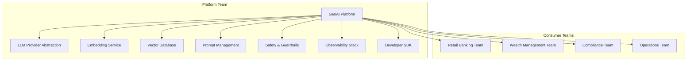

# Shared Platform Design in Banking GenAI Systems

## Overview

A shared platform (or internal platform) provides common capabilities that multiple product teams consume. In banking, a GenAI platform serves the retail banking team (customer-facing assistant), the wealth management team (advisor copilot), the compliance team (regulatory document analyzer), and the operations team (internal knowledge assistant).

The platform team's challenge is balancing standardization (one platform for all) with flexibility (each team has unique needs). Over-standardization creates bottlenecks; under-standardization creates duplicated effort and inconsistent quality.

---

## Platform Team Responsibilities



---

## Platform API Design

### Platform SDK (Python)

```python
# platform_sdk/__init__.py
"""
Banking GenAI Platform SDK.
All product teams use this SDK to access GenAI capabilities.
"""
from .client import BankingGenAIClient
from .config import PlatformConfig
from .models import QueryRequest, QueryResponse, Document, EmbeddingResult
from .safety import SafetyGuard, SafetyViolation

__version__ = "2.1.0"

class BankingGenAIClient:
    """
    Unified client for all platform GenAI services.
    Consumer teams interact with the platform through this single interface.
    """

    def __init__(self, config: PlatformConfig = None):
        self.config = config or PlatformConfig.from_environment()
        self._session = None

    async def __aenter__(self):
        self._session = aiohttp.ClientSession(
            base_url=self.config.platform_url,
            headers={"Authorization": f"Bearer {self.config.api_key}"},
        )
        return self

    async def __aexit__(self, *args):
        if self._session:
            await self._session.close()

    async def query(self, request: QueryRequest) -> QueryResponse:
        """
        Execute a RAG query through the platform.
        The platform handles: model selection, retrieval, generation, safety checks.
        """
        # Apply tenant context
        request.tenant_id = self.config.tenant_id

        # Validate request
        self._validate_request(request)

        async with self._session.post("/api/v1/query", json=request.dict()) as response:
            if response.status != 200:
                raise PlatformError(await response.text())
            return QueryResponse.parse_obj(await response.json())

    async def ingest_document(self, document: Document) -> str:
        """Ingest a document into the platform's knowledge base."""
        document.tenant_id = self.config.tenant_id

        async with self._session.post(
            "/api/v1/documents",
            json=document.dict(),
        ) as response:
            if response.status != 201:
                raise PlatformError(await response.text())
            result = await response.json()
            return result["document_id"]

    async def generate_embedding(self, text: str) -> EmbeddingResult:
        """Generate embedding vector for text."""
        async with self._session.post(
            "/api/v1/embeddings",
            json={"text": text, "tenant_id": self.config.tenant_id},
        ) as response:
            if response.status != 200:
                raise PlatformError(await response.text())
            return EmbeddingResult.parse_obj(await response.json())

    async def check_safety(self, text: str, direction: str = "input") -> SafetyGuard:
        """
        Check text against platform safety guards.
        direction: 'input' for user prompts, 'output' for model responses.
        """
        async with self._session.post(
            "/api/v1/safety/check",
            json={"text": text, "direction": direction, "tenant_id": self.config.tenant_id},
        ) as response:
            if response.status != 200:
                raise PlatformError(await response.text())
            return SafetyGuard.parse_obj(await response.json())

    def _validate_request(self, request: QueryRequest):
        """Validate the request before sending to the platform."""
        if not request.query:
            raise ValidationError("Query cannot be empty")
        if len(request.query) > 4000:
            raise ValidationError("Query exceeds maximum length (4000 characters)")
        if not request.customer_id:
            raise ValidationError("Customer ID is required")
```

### Platform Configuration

```python
# platform_sdk/config.py
"""
Platform configuration loaded from environment variables or config file.
"""
import os
from dataclasses import dataclass
from pathlib import Path
from typing import Optional

@dataclass
class PlatformConfig:
    """Configuration for connecting to the GenAI platform."""
    platform_url: str
    api_key: str
    tenant_id: str
    timeout_seconds: float = 30.0
    retry_count: int = 3
    safety_level: str = "standard"  # standard, strict, custom

    @classmethod
    def from_environment(cls) -> 'PlatformConfig':
        """Load configuration from environment variables."""
        return cls(
            platform_url=os.environ["GENAI_PLATFORM_URL"],
            api_key=os.environ["GENAI_PLATFORM_API_KEY"],
            tenant_id=os.environ["GENAI_TENANT_ID"],
            timeout_seconds=float(os.environ.get("GENAI_TIMEOUT_SECONDS", "30")),
            retry_count=int(os.environ.get("GENAI_RETRY_COUNT", "3")),
            safety_level=os.environ.get("GENAI_SAFETY_LEVEL", "standard"),
        )

    @classmethod
    def from_file(cls, path: str = "platform-config.yaml") -> 'PlatformConfig':
        """Load configuration from a YAML file."""
        import yaml
        with open(path) as f:
            data = yaml.safe_load(f)
        return cls(**data)
```

---

## Platform Service Level Objectives (SLOs)

The platform team commits to SLOs that consumer teams depend on.

| SLO | Target | Measurement | Violation Action |
|---|---|---|---|
| Availability | 99.95% | Monthly uptime | Post-incident review, consumer notification |
| Query P95 Latency | < 2.5s | Per-query measurement | Auto-scale, investigate bottleneck |
| Query P99 Latency | < 5s | Per-query measurement | Emergency scaling if sustained |
| Embedding Generation | < 200ms | Per-text measurement | Model downgrade or scale up |
| Safety Check Latency | < 50ms | Per-check measurement | Cache results, optimize rules |
| Document Ingestion | < 30s per doc | Per-document measurement | Async processing with queue |
| API Error Rate | < 0.1% | Per-request measurement | Investigate, rollback if deployment-related |

---

## Platform Versioning Strategy

```python
# platform_sdk/versioning.py
"""
Platform versioning ensures backward compatibility for consumer teams.
"""
from dataclasses import dataclass
from typing import Optional

@dataclass
class PlatformVersion:
    major: int
    minor: int
    patch: int

    def __str__(self):
        return f"{self.major}.{self.minor}.{self.patch}"

    def is_compatible_with(self, sdk_version: 'PlatformVersion') -> bool:
        """
        Check if this platform version is compatible with the SDK version.
        Compatible = same major version, platform >= SDK minor version.
        """
        if self.major != sdk_version.major:
            return False
        return self.minor >= sdk_version.minor

# Version compatibility matrix
COMPATIBILITY_MATRIX = {
    "1.x": {
        "min_platform": PlatformVersion(1, 0, 0),
        "max_platform": PlatformVersion(1, 99, 99),
        "deprecated": True,
        "deprecation_date": "2026-06-01",
    },
    "2.x": {
        "min_platform": PlatformVersion(2, 0, 0),
        "max_platform": PlatformVersion(2, 99, 99),
        "deprecated": False,
    },
    "3.x": {
        "min_platform": PlatformVersion(3, 0, 0),
        "max_platform": None,  # Current development
        "deprecated": False,
    },
}
```

---

## Onboarding New Consumer Teams

```yaml
# platform/onboarding-checklist.yaml
consumer_team_onboarding:
  pre_onboarding:
    - "Platform team approves new consumer team (capacity check)"
    - "Consumer team assigns a platform liaison"
    - "Security review of consumer team's use case"

  technical_setup:
    - "Create tenant ID and API credentials"
    - "Configure resource quotas (tokens/day, documents, storage)"
    - "Set up monitoring dashboards for the tenant"
    - "Configure safety guard profiles (standard, strict, custom)"
    - "Provide SDK access and documentation"

  knowledge_transfer:
    - "Platform architecture walkthrough"
    - "SDK usage training"
    - "Safety guard configuration guide"
    - "Observability and alerting setup"
    - "Incident response procedures"

  validation:
    - "Consumer team deploys a test application"
    - "End-to-end query flow validated"
    - "Document ingestion tested"
    - "Safety guards verified"
    - "Monitoring alerts confirmed"

  go-live:
    - "Production API keys issued"
    - "Rate limits set to production values"
    - "On-call rotation includes platform liaison"
    - "First month: weekly check-ins with platform team"
```

---

## Interview Questions

1. **How do you prevent the platform from becoming a bottleneck for product teams?**
   - Self-service: SDK, documentation, automated onboarding. Clear SLOs so teams know what to expect. Escape hatches: teams can use the platform's underlying services directly if needed (but lose platform guarantees). Regular feedback loops with consumer teams.

2. **What happens when a consumer team outgrows the platform?**
   - First, understand why: is it a genuine platform limitation, or does the team have unique needs? If it's a platform gap, prioritize it in the roadmap. If it's truly unique, the team can build a parallel path while the platform catches up. Never block a team's progress.

3. **How do you manage breaking changes on a shared platform?**
   - Use semantic versioning with backward compatibility within major versions. Deprecate features with a 6-month notice period. Provide migration tools. Run multiple API versions simultaneously. Communicate changes through the SDK (deprecation warnings in the client library).

4. **How do you measure platform success?**
   - Consumer team velocity: time from idea to production. Platform adoption: number of teams and queries per day. Quality: SLO compliance, consumer team satisfaction. Cost: cost per query trending down over time. Safety: zero safety incidents.

---

## Cross-References

- See [architecture/internal-developer-platforms.md](./internal-developer-platforms.md) for IDP design
- See [architecture/ai-platform-design.md](./ai-platform-design.md) for AI platform architecture
- See [engineering-culture/platform-engineering.md](../engineering-culture/platform-engineering.md) for platform team patterns
- See [genai-platforms/](../genai-platforms/) for GenAI platform specifics
