# Technical Debt Management in Banking GenAI Systems

## Overview

Technical debt is the implied cost of additional rework caused by choosing quick-and-dirty solutions now instead of better approaches that would take longer. In banking GenAI systems, technical debt accumulates faster than traditional software because:

- **Rapidly evolving technology**: Model providers release updates monthly, making design decisions quickly obsolete
- **Experimental nature**: Prototypes become production systems without proper hardening
- **Prompt sprawl**: Hundreds of prompt versions accumulate without governance
- **Model dependencies**: Tightly coupled code to specific LLM APIs that change frequently
- **Evaluation gaps**: Missing test coverage for non-deterministic behaviors

Unmanaged technical debt in banking GenAI systems creates regulatory risk, operational instability, and innovation paralysis.

---

## Technical Debt Taxonomy

```mermaid
flowchart TD
    A[Technical Debt] --> B[Code Debt]
    A --> C[Architecture Debt]
    A --> D[Infrastructure Debt]
    A --> E[Testing Debt]
    A --> F[Data Debt]
    A --> G[AI/ML Debt]

    B --> B1[Duplicated code]
    B --> B2[Missing documentation]
    B --> B3[Outdated dependencies]

    C --> C1[Tight coupling]
    C --> C2[Missing abstractions]
    C --> C3[Hardcoded configurations]

    D --> D1[Manual deployments]
    D --> D2[No monitoring]
    D --> D3[Single points of failure]

    E --> E1[Missing unit tests]
    E --> E2[No golden dataset]
    E --> E3[Flaky tests]

    F --> F1[No data lineage]
    F --> F2[Unversioned datasets]
    F --> F3[No PII scanning]

    G --> G1[Prompt sprawl]
    G --> G2[No model registry]
    G --> G3[Missing evaluation pipeline]
```



---

## Technical Debt Tracking

```python
# debt/tracker.py
"""
Technical debt tracking and management system.
Each debt item is tracked with cost estimates and paydown plans.
"""
from dataclasses import dataclass, field
from datetime import datetime
from typing import List, Optional
from enum import Enum

class DebtSeverity(Enum):
    CRITICAL = "critical"  # Must fix now (regulatory, security, outage risk)
    HIGH = "high"          # Must fix this quarter
    MEDIUM = "medium"      # Should fix this half
    LOW = "low"            # Nice to have

class DebtCategory(Enum):
    CODE = "code"
    ARCHITECTURE = "architecture"
    INFRASTRUCTURE = "infrastructure"
    TESTING = "testing"
    DATA = "data"
    AI_ML = "ai_ml"

@dataclass
class TechnicalDebtItem:
    """A tracked technical debt item."""
    id: str  # e.g., "DEBT-0042"
    title: str
    description: str
    category: DebtCategory
    severity: DebtSeverity
    created_date: datetime
    created_by: str

    # Cost estimates
    interest_rate: str       # Ongoing cost per sprint (high, medium, low)
    principal: str           # One-time cost to fix (story points)

    # Context
    affected_components: List[str] = field(default_factory=list)
    root_cause: str = ""
    workaround: str = ""

    # Paydown plan
    planned_sprint: Optional[str] = None
    assigned_team: Optional[str] = None
    status: str = "identified"  # identified, planned, in_progress, resolved, accepted
    resolution_date: Optional[datetime] = None
    resolution_notes: str = ""

    # Age tracking
    age_days: int = 0

    def calculate_age(self):
        """Calculate the age of this debt item."""
        self.age_days = (datetime.utcnow() - self.created_date).days

    def interest_cost_estimate(self) -> str:
        """Estimate the ongoing interest cost per sprint."""
        rate_map = {
            "high": "8-12 story points per sprint",
            "medium": "3-5 story points per sprint",
            "low": "1-2 story points per sprint",
        }
        return rate_map.get(self.interest_rate, "Unknown")


class TechnicalDebtRegister:
    """Manage the technical debt register."""

    def __init__(self):
        self.items: List[TechnicalDebtItem] = []

    def add(self, item: TechnicalDebtItem):
        """Add a debt item to the register."""
        item.calculate_age()
        self.items.append(item)

    def get_by_severity(self, severity: DebtSeverity) -> List[TechnicalDebtItem]:
        """Get all debt items of a specific severity."""
        return [i for i in self.items if i.severity == severity and i.status != "resolved"]

    def get_by_category(self, category: DebtCategory) -> List[TechnicalDebtItem]:
        """Get all debt items of a specific category."""
        return [i for i in self.items if i.category == category and i.status != "resolved"]

    def get_aging_report(self, max_age_days: int = 90) -> List[TechnicalDebtItem]:
        """Get debt items older than max_age_days."""
        return [i for i in self.items if i.age_days > max_age_days and i.status != "resolved"]

    def get_summary(self) -> dict:
        """Generate a summary of the debt register."""
        by_severity = {}
        by_category = {}
        total_principal = 0

        for item in self.items:
            if item.status == "resolved":
                continue

            item.calculate_age()

            by_severity[item.severity.value] = by_severity.get(item.severity.value, 0) + 1
            by_category[item.category.value] = by_category.get(item.category.value, 0) + 1
            total_principal += self._story_points(item.principal)

        return {
            "total_items": sum(by_severity.values()),
            "by_severity": by_severity,
            "by_category": by_category,
            "total_principal_estimate": total_principal,
            "aging_90_plus": len(self.get_aging_report(90)),
            "aging_180_plus": len(self.get_aging_report(180)),
        }

    def _story_points(self, estimate: str) -> int:
        """Parse story point estimate from string."""
        # Simple parsing: "13" -> 13, "8-12" -> 10, "large" -> 13
        if estimate.isdigit():
            return int(estimate)
        if "-" in estimate:
            parts = estimate.split("-")
            return (int(parts[0]) + int(parts[1])) // 2
        mapping = {"small": 3, "medium": 8, "large": 13, "xlarge": 21}
        return mapping.get(estimate.lower(), 8)
```

---

## Common GenAI Technical Debt Patterns

### 1. Prompt Sprawl

```yaml
# debt/items/prompt-sprawl.yaml
debt_id: DEBT-0101
title: "Prompt sprawl across services"
category: ai_ml
severity: high
description: |
  Each service maintains its own prompt templates with no central registry.
  This leads to inconsistent behavior, duplicated effort, and no governance
  over prompt changes.
affected_components:
  - rag-query-service
  - chat-service
  - document-summarization-service
  - fraud-analysis-service
interest_rate: high
principal: "13"  # story points to implement prompt registry
root_cause: "Services were built independently without platform thinking"
workaround: "Manual coordination between teams for prompt changes"
planned_sprint: "Sprint 24"
```

### 2. No LLM Evaluation Pipeline

```yaml
debt_id: DEBT-0102
title: "No automated LLM evaluation pipeline"
category: testing
severity: critical
description: |
  Model upgrades and prompt changes are evaluated manually.
  There is no automated pipeline to compare output quality before
  and after changes. This creates risk of quality regressions.
affected_components:
  - rag-query-service
  - embedding-service
interest_rate: high
principal: "21"
root_cause: "Evaluation framework was not built in initial release"
workaround: "Manual review of 50 sample outputs before each change"
```

### 3. Hardcoded LLM Provider

```yaml
debt_id: DEBT-0103
title: "Hardcoded OpenAI client in RAG service"
category: code
severity: medium
description: |
  The RAG service directly imports and uses the OpenAI Python client.
  Switching providers requires code changes, not just configuration.
affected_components:
  - rag-query-service/services/llm.py
interest_rate: medium
principal: "5"
root_cause: "Initial prototype used OpenAI directly for speed"
workaround: "Abstract the LLM call behind a common interface"
```

### 4. No Vector Database Backup

```yaml
debt_id: DEBT-0104
title: "No automated vector database backup"
category: infrastructure
severity: critical
description: |
  The vector database (Qdrant) has no automated backup procedure.
  A cluster failure would require re-ingesting all 15M documents,
  which takes approximately 72 hours.
affected_components:
  - qdrant-production
interest_rate: high
principal: "8"
root_cause: "Backup was deprioritized during initial deployment"
workaround: "Manual snapshot before major changes"
```

---

## Debt Paydown Strategy

### 20% Allocation Rule

```yaml
# debt/paydown-policy.yaml
policy:
  name: "Technical Debt Paydown Policy"
  principle: "Allocate 20% of each sprint to technical debt reduction"

  allocation:
    new_features: 60%
    bug_fixes: 20%
    technical_debt: 20%

  prioritization:
    - "Critical severity debt items (security, regulatory, outage risk)"
    - "High severity items with highest interest rate"
    - "Items aging > 180 days"
    - "Items blocking new feature development"

  tracking:
    - "Debt register reviewed in sprint planning"
    - "Aging report generated monthly"
    - "Summary included in quarterly engineering review"
    - "Critical items tracked in leadership dashboard"

  escalation:
    - "Critical items not addressed within 1 sprint: escalate to VP Engineering"
    - "High items not addressed within 2 sprints: escalate to Director"
    - "Aging > 180 days: automatic severity increase"
```

### Debt Paydown Dashboard

| Metric | Current | Target | Trend |
|---|---|---|---|
| Open debt items | 47 | < 30 | Decreasing |
| Critical items | 5 | 0 | Decreasing |
| High items | 12 | < 8 | Stable |
| Items aging > 180 days | 8 | 0 | Decreasing |
| Debt paydown velocity | 15 SP/sprint | 20 SP/sprint | Increasing |
| New debt rate | 5 items/month | < 3 items/month | Increasing (concerning) |
| Resolution rate | 8 items/month | > 10 items/month | Increasing |

---

## Preventing New Technical Debt

### Pre-Merge Debt Check

```yaml
# .github/workflows/debt-check.yaml
name: Technical Debt Check
on:
  pull_request:
    branches: [main]

jobs:
  debt-check:
    runs-on: ubuntu-latest
    steps:
      - uses: actions/checkout@v4

      - name: Check for hardcoded configurations
        run: |
          # Scan for hardcoded URLs, API keys, and magic numbers
          python scripts/debt_scan.py --check hardcoded
          exit_code=$?
          if [ $exit_code -ne 0 ]; then
            echo "::warning::Potential hardcoded configuration detected"
          fi

      - name: Check test coverage
        run: |
          pytest tests/ --cov=app --cov-report=term-missing --cov-fail-under=80

      - name: Check dependency freshness
        run: |
          pip list --outdated
          # Fail if critical dependencies are > 2 major versions behind

      - name: Check for TODO/FIXME/HACK comments
        run: |
          count=$(grep -r "TODO\|FIXME\|HACK\|XXX" app/ --include="*.py" | wc -l)
          if [ $count -gt 20 ]; then
            echo "::warning::$count technical debt comments found. Consider addressing them."
          fi

      - name: Comment on PR with debt summary
        uses: actions/github-script@v7
        with:
          script: |
            const debtCount = process.env.DEBT_COUNT;
            github.rest.issues.createComment({
              issue_number: context.issue.number,
              owner: context.repo.owner,
              repo: context.repo.repo,
              body: `Technical debt check: ${debtCount} debt markers found. ` +
                    `Please consider addressing them before merging.`
            });
```

### Architecture Review Gate

Every PR that introduces architectural change must answer:
1. Does this change create new technical debt? If yes, is a debt item created in the register?
2. Is there a plan to address the debt? (Fix now, or track in register with timeline)
3. Does this change reduce existing technical debt?

---

## Interview Questions

1. **How much technical debt is acceptable in a GenAI system?**
   - There is no fixed number. What matters is the trajectory: is debt growing faster than it is being paid down? A healthy system resolves more debt than it creates each quarter. Critical debt (security, regulatory) should always be zero. Aim for under 30 open items with no items aging over 180 days.

2. **How do you convince management to invest in debt paydown?**
   - Frame it in business terms: debt increases the cost of every future feature (interest rate). Show the trend: "We are spending 40% of our capacity on workarounds for known issues." Quantify the risk: "If this un-backed-up vector database fails, we lose 72 hours of document availability."

3. **What is the most common technical debt in GenAI systems?**
   - Prompt sprawl (no central management), missing evaluation pipelines (manual quality checks), tight coupling to specific LLM providers, insufficient safety testing, and lack of observability for AI-specific metrics (token usage, confidence distributions, hallucination rates).

4. **Should you fix technical debt before building new features?**
   - Always fix critical debt first. For everything else, use the 20% allocation rule: every sprint dedicates 20% to debt paydown while 60% goes to features. This ensures continuous progress on both fronts. If critical debt exists, pause features until it is resolved.

---

## Cross-References

- See [architecture/architecture-reviews.md](./architecture-reviews.md) for architecture review process
- See [architecture/architecture-decision-records.md](./architecture-decision-records.md) for ADRs
- See [engineering-culture/engineering-excellence.md](../engineering-culture/engineering-excellence.md) for quality culture
- See [testing-and-quality/quality-gates.md](../testing-and-quality/quality-gates.md) for quality thresholds
