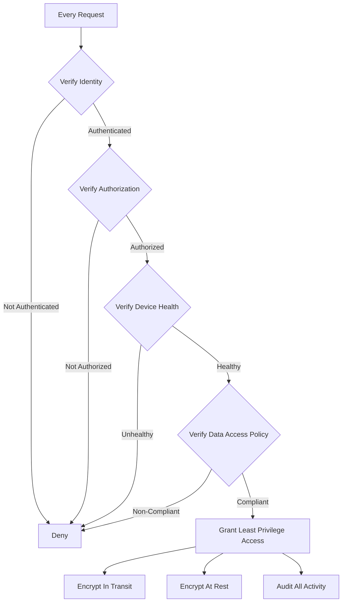

# Zero Trust Architecture in Banking GenAI Systems

## Overview

Zero Trust Architecture (ZTA) operates on the principle of "never trust, always verify." Every request -- whether from inside or outside the network -- must be authenticated, authorized, and encrypted. In banking GenAI systems, ZTA is mandatory because:

- **AI systems process sensitive customer data**: Account information, transaction history, personal details
- **LLM providers are external**: Data leaves the bank's network boundary
- **Supply chain risk**: Open-source models, libraries, and frameworks introduce vulnerabilities
- **Insider threat**: Compromised internal credentials must not grant unrestricted access
- **Regulatory requirement**: FFIEC, OCC, and NIST all mandate Zero Trust principles

---

## Zero Trust Principles



### Core Principles

| Principle | Description | Implementation |
|---|---|---|
| **Never Trust, Always Verify** | No implicit trust based on network location | mTLS everywhere, per-request auth |
| **Least Privilege Access** | Minimum permissions needed for the task | RBAC, ABAC, token-scoped permissions |
| **Assume Breach** | Design as if the network is already compromised | Network segmentation, micro-perimeters |
| **Verify Explicitly** | Use all available data for access decisions | Device health, location, behavior analytics |
| **Continuous Monitoring** | Trust is dynamic, not static | Real-time anomaly detection |

---

## Zero Trust Implementation

### Mutual TLS (mTLS) Between Services

```yaml
# infrastructure/mtls-config.yaml
# All inter-service communication uses mTLS
apiVersion: security.istio.io/v1beta1
kind: PeerAuthentication
metadata:
  name: banking-genai-mtls
  namespace: banking-genai
spec:
  mtls:
    mode: STRICT  # Reject all plaintext traffic
---
apiVersion: networking.istio.io/v1beta1
kind: DestinationRule
metadata:
  name: banking-genai-destination
  namespace: banking-genai
spec:
  host: "*.banking-genai.svc.cluster.local"
  trafficPolicy:
    tls:
      mode: ISTIO_MUTUAL  # Use Istio-managed mTLS certificates
---
# Exception: health check endpoints
apiVersion: security.istio.io/v1beta1
kind: PeerAuthentication
metadata:
  name: health-check-exception
  namespace: banking-genai
spec:
  selector:
    matchLabels:
      app: banking-rag-api
  portLevelMtls:
    8080:  # Health check port
      mode: PERMISSIVE
```

### Service-to-Service Authorization

```yaml
# infrastructure/service-authz.yaml
# Fine-grained authorization between services
apiVersion: security.istio.io/v1beta1
kind: AuthorizationPolicy
metadata:
  name: rag-query-authz
  namespace: banking-genai
spec:
  selector:
    matchLabels:
      app: rag-query-service
  action: ALLOW
  rules:
    - from:
        - source:
            principals: ["cluster.local/ns/banking-genai/sa/api-gateway"]
      when:
        - key: request.auth.claims[tenant_id]
          values: ["*"]  # Any tenant, but must have tenant claim
        - key: request.auth.claims[scope]
          values: ["rag:query"]
---
apiVersion: security.istio.io/v1beta1
kind: AuthorizationPolicy
metadata:
  name: embedding-service-authz
  namespace: banking-genai
spec:
  selector:
    matchLabels:
      app: embedding-service
  action: ALLOW
  rules:
    - from:
        - source:
            principals:
              - "cluster.local/ns/banking-genai/sa/rag-query-service"
              - "cluster.local/ns/banking-genai/sa/document-service"
---
apiVersion: security.istio.io/v1beta1
kind: AuthorizationPolicy
metadata:
  name: vector-db-authz
  namespace: banking-genai
spec:
  selector:
    matchLabels:
      app: qdrant
  action: ALLOW
  rules:
    - from:
        - source:
            principals:
              - "cluster.local/ns/banking-genai/sa/rag-query-service"
              - "cluster.local/ns/banking-genai/sa/embedding-service"
    - to:
        - operation:
            methods: ["GET", "POST"]  # Only read and search, no admin operations
      from:
        - source:
            principals:
              - "cluster.local/ns/banking-genai/sa/rag-query-service"
```

---

## LLM Provider Data Protection

When sending data to external LLM providers, Zero Trust requires:

```python
# platform/llm_gateway/data_protection.py
"""
Data protection layer for external LLM provider calls.
Ensures PII is removed before data leaves the bank's network.
"""
from dataclasses import dataclass
from typing import List, Dict
import re

@dataclass
class ProtectedPrompt:
    original_prompt: str
    protected_prompt: str
    redactions: List[Dict[str, str]]  # map of redaction token -> original value
    risk_score: float  # 0-1, how risky is this prompt to send externally

class PromptProtector:
    """Protect sensitive data before sending to external LLM providers."""

    # Patterns to detect and redact
    SENSITIVE_PATTERNS = {
        "ssn": (r"\b\d{3}-\d{2}-\d{4}\b", "[SSN_REDACTED]"),
        "credit_card": (r"\b(?:4\d{3}|5[1-5]\d{2}|3[47]\d{2})\d{12}\b", "[CC_REDACTED]"),
        "account_number": (r"\b\d{8,17}\b", "[ACCT_REDACTED]"),
        "email": (r"\b[A-Za-z0-9._%+-]+@[A-Za-z0-9.-]+\.[A-Z|a-z]{2,}\b", "[EMAIL_REDACTED]"),
        "phone": (r"\b\(?[0-9]{3}\)?[-.\s]?[0-9]{3}[-.\s]?[0-9]{4}\b", "[PHONE_REDACTED]"),
        "address": (r"\b\d+\s+[A-Z][a-z]+\s+(Street|St|Avenue|Ave|Road|Rd|Drive|Dr|Lane|Ln|Boulevard|Blvd)\b", "[ADDRESS_REDACTED]"),
    }

    def protect(self, prompt: str, context: dict = None) -> ProtectedPrompt:
        """Protect a prompt before sending to external LLM provider."""
        redactions = []
        protected = prompt

        for pattern_name, (pattern, replacement) in self.SENSITIVE_PATTERNS.items():
            matches = re.finditer(pattern, protected)
            for match in matches:
                redaction_token = f"{replacement}_{len(redactions)}"
                redactions.append({
                    "token": redaction_token,
                    "original_type": pattern_name,
                    "original_value": match.group(),
                })
                protected = protected.replace(match.group(), redaction_token, 1)

        # Calculate risk score
        risk_score = len(redactions) / max(len(prompt.split()), 1)
        risk_score = min(risk_score * 10, 1.0)  # Normalize to 0-1

        return ProtectedPrompt(
            original_prompt=prompt,
            protected_prompt=protected,
            redactions=redactions,
            risk_score=risk_score,
        )

    def restore(self, protected_response: str, redactions: List[Dict]) -> str:
        """Restore redacted values in the LLM response."""
        response = protected_response
        for redaction in redactions:
            response = response.replace(redaction["token"], redaction["original_value"])
        return response
```

---

## API Gateway Zero Trust

```python
# gateway/zero_trust_middleware.py
"""
Zero Trust middleware for the API gateway.
Every request is authenticated, authorized, and validated.
"""
from fastapi import Request, HTTPException
import jwt
import time

class ZeroTrustMiddleware:
    """
    Enforce Zero Trust at the API gateway level.
    1. Verify JWT signature and expiration
    2. Verify tenant isolation
    3. Verify scope/permissions
    4. Verify device fingerprint (optional)
    5. Verify request rate (anti-abuse)
    6. Log everything
    """

    def __init__(self, jwks_url: str, redis_url: str):
        self.jwks_client = jwt.PyJWKClient(jwks_url)
        self.redis = redis.from_url(redis_url)

    async def verify_request(self, request: Request):
        """Verify every aspect of the incoming request."""
        # 1. Extract and verify JWT
        token = self._extract_token(request)
        if not token:
            raise HTTPException(status_code=401, detail="Missing authentication")

        try:
            signing_key = self.jwks_client.get_signing_key_from_jwt(token)
            payload = jwt.decode(
                token,
                signing_key.key,
                algorithms=["RS256"],
                options={"require": ["exp", "iat", "sub", "tenant_id", "scope"]},
            )
        except jwt.ExpiredSignatureError:
            raise HTTPException(status_code=401, detail="Token expired")
        except jwt.InvalidTokenError as e:
            raise HTTPException(status_code=401, detail=f"Invalid token: {e}")

        # 2. Verify tenant isolation
        tenant_id = payload.get("tenant_id")
        request_path = request.url.path
        if not self._verify_tenant_access(tenant_id, request_path):
            raise HTTPException(status_code=403, detail="Tenant access denied")

        # 3. Verify scope
        scope = payload.get("scope", [])
        required_scope = self._get_required_scope(request)
        if required_scope not in scope:
            raise HTTPException(status_code=403, detail=f"Missing scope: {required_scope}")

        # 4. Rate limiting per identity
        client_id = payload["sub"]
        if not await self._check_rate_limit(client_id):
            raise HTTPException(status_code=429, detail="Rate limit exceeded")

        # 5. Log the verified request
        await self._audit_log(request, payload)

        # Attach verified identity to request state
        request.state.user = payload
        request.state.tenant_id = tenant_id

    def _verify_tenant_access(self, tenant_id: str, path: str) -> bool:
        """Verify that the tenant can access the requested path."""
        # Some paths are tenant-agnostic (health, public docs)
        public_paths = ["/health", "/docs", "/openapi.json"]
        if any(path.startswith(p) for p in public_paths):
            return True

        # For all other paths, tenant_id must be present and valid
        return tenant_id is not None

    def _get_required_scope(self, request: Request) -> str:
        """Determine the required scope for a request."""
        method = request.method
        path = request.url.path

        if "/rag/query" in path:
            return "rag:query"
        elif "/documents" in path:
            if method == "GET":
                return "documents:read"
            elif method == "POST":
                return "documents:write"
            elif method == "DELETE":
                return "documents:delete"
        return "default"
```

---

## Supply Chain Security for AI

```yaml
# security/supply-chain.yaml
# Zero Trust for AI supply chain: models, libraries, frameworks
model_supply_chain:
  # Only approved models from approved sources
  approved_models:
    - name: gpt-4-turbo
      provider: openai
      approved_date: "2026-01-15"
      review_status: approved
      sha256: "external"  # External provider, no local hash

    - name: llama-3-70b
      provider: meta
      approved_date: "2026-02-01"
      review_status: approved
      sha256: "a1b2c3d4..."  # Self-hosted, verify hash

  # All model downloads must be from approved registries
  model_registry:
    - url: "https://huggingface.co"
      allow: ["meta-llama/*", "mistralai/*"]
      block: ["*"]  # Block everything not explicitly allowed

    - url: "https://registry.internal.banking-genai.local"
      allow: ["*"]  # Trust internal registry

  # Library vulnerability scanning
  dependency_scanning:
    schedule: "daily"
    severity_threshold: "high"  # Block on HIGH or CRITICAL
    approved_licenses:
      - MIT
      - Apache-2.0
      - BSD-3-Clause
    blocked_licenses:
      - GPL-3.0  # Copyleft risk
      - AGPL-3.0  # Network copyleft risk
      - SSPL     # MongoDB license risk

  # Model validation before deployment
  model_validation:
    steps:
      - "Scan for known vulnerabilities (CVEs)"
      - "Verify model hash against trusted source"
      - "Run safety evaluation suite"
      - "Run golden dataset evaluation"
      - "Run red team test suite"
      - "Performance benchmark (latency, throughput)"
      - "Cost analysis (tokens per dollar)"
      - "Legal review (license, terms of service)"
```

---

## Interview Questions

1. **Why is Zero Trust particularly important for GenAI systems compared to traditional applications?**
   - GenAI systems have a larger attack surface: prompts can be injected, context windows may contain sensitive data, external LLM providers process your data, and model outputs can leak information. Traditional perimeter-based security is insufficient because the "perimeter" extends to external AI providers.

2. **How do you implement Zero Trust for external LLM API calls?**
   - (1) Authenticate the service making the call (service identity via mTLS). (2) Authorize the call (is this service allowed to call this provider?). (3) Protect the data (redact PII before transmission). (4) Encrypt in transit (TLS 1.3). (5) Log the call (audit trail). (6) Monitor for anomalies (unusual prompt patterns).

3. **What is the role of service mesh in Zero Trust?**
   - Service mesh (Istio, Linkerd) provides automatic mTLS between services, fine-grained authorization policies, and observability. It implements the "never trust" principle at the network level without requiring changes to application code.

4. **How do you handle the tension between Zero Trust and developer productivity?**
   - Automate everything: certificate rotation, policy generation, identity provisioning. Developers should not manually manage certificates or write authz policies. The platform team provides secure-by-default templates. Friction is minimized through self-service tooling while security is maximized through automation.

---

## Cross-References

- See [testing-and-quality/security-testing.md](../testing-and-quality/security-testing.md) for security testing
- See [infrastructure/network-security.md](../infrastructure/network-security.md) for network security patterns
- See [architecture/multi-tenant-design.md](./multi-tenant-design.md) for tenant isolation
- See [incident-management/](../incident-management/) for incident response
