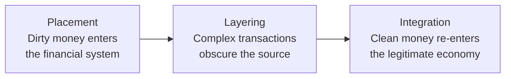
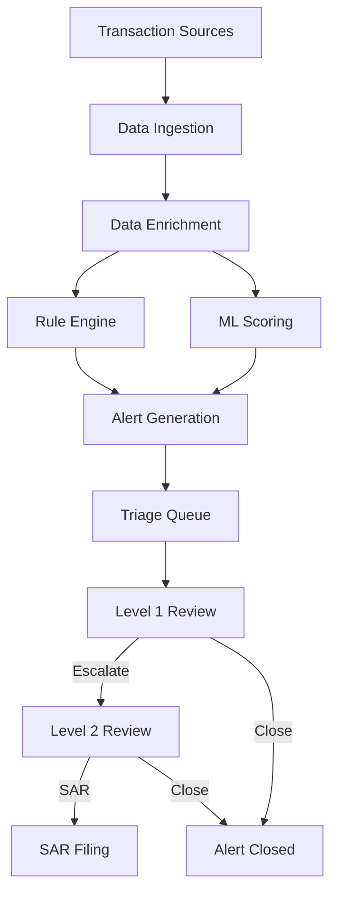
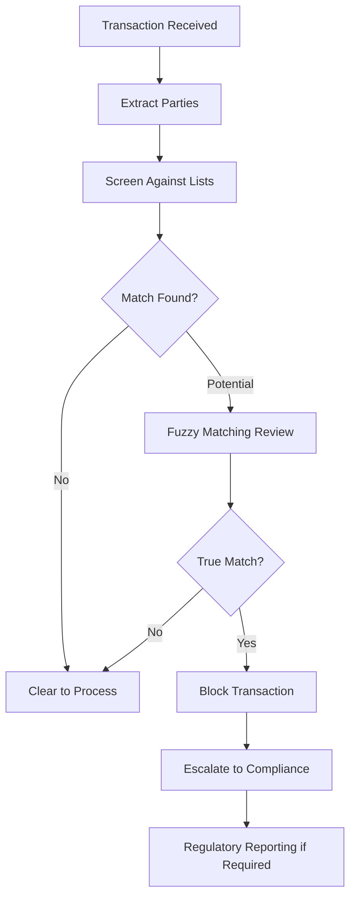
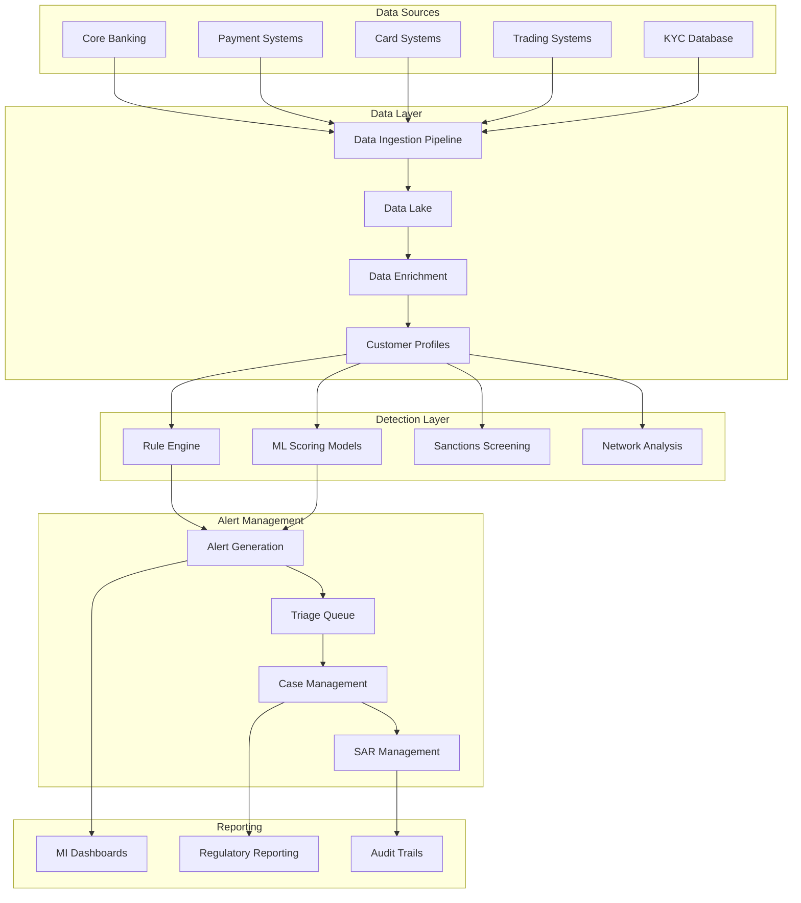
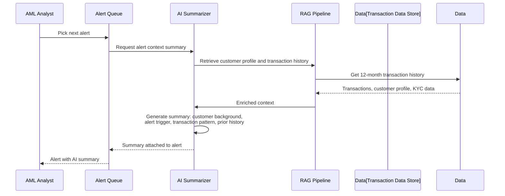

# AML and Fraud: Anti-Money Laundering, Transaction Monitoring, SAR Filing, and Fraud Detection

> **Audience:** Engineers building financial crime prevention systems.
> **Prerequisites:** [Banking 101](./banking-101.md), [Payments](./payments.md)
> **Cross-references:** [KYC and Onboarding](./kyc-and-onboarding.md), [Compliance Teams](./compliance-teams-and-how-they-work.md), [Regulations and Compliance](../regulations-and-compliance/)

---

## Table of Contents

1. [Why AML and Fraud Prevention Exists](#1-why-aml-and-fraud-prevention-exists)
2. [Money Laundering: The Problem](#2-money-laundering-the-problem)
3. [The Three Stages of Money Laundering](#3-the-three-stages-of-money-laundering)
4. [Fraud: The Other Side of Financial Crime](#4-fraud-the-other-side-of-financial-crime)
5. [Transaction Monitoring Systems](#5-transaction-monitoring-systems)
6. [Sanctions Screening](#6-sanctions-screening)
7. [Suspicious Activity Reports (SARs)](#7-suspicious-activity-reports-sars)
8. [Fraud Detection Systems](#8-fraud-detection-systems)
9. [The Financial Crime Investigation Team](#9-the-financial-crime-investigation-team)
10. [AML and Fraud System Architecture](#10-aml-and-fraud-system-architecture)
11. [GenAI in AML and Fraud](#11-genai-in-aml-and-fraud)
12. [Risks of AI in AML and Fraud](#12-risks-of-ai-in-aml-and-fraud)
13. [Key Regulations](#13-key-regulations)
14. [Common Systems and Technology](#14-common-systems-and-technology)
15. [Engineering Implications](#15-engineering-implications)
16. [Common Workflows](#16-common-workflows)
17. [Interview Questions](#17-interview-questions)

---

## 1. Why AML and Fraud Prevention Exists

Banks are the primary conduit through which money moves in the global economy. Criminals need to move money too — proceeds from drug trafficking, human smuggling, terrorism, corruption, and sanctions evasion. Banks are legally required to detect and report suspicious activity.

**The stakes:**

| Consequence | Example |
|------------|---------|
| **Regulatory Fines** | BNP Paribas: $8.9B (2014, sanctions violations) |
| **Criminal Charges** | Individuals can face prison time for AML failures |
| **License Revocation** | Banks can lose their right to operate |
| **Deferred Prosecution Agreements** | Years of enhanced monitoring and reporting |
| **Reputational Damage** | Decades of lost customer trust |

**Scale context:** Global money laundering is estimated at 2-5% of global GDP ($800B-$2T annually). Banks process billions of transactions daily, looking for needles in a very large haystack.

---

## 2. Money Laundering: The Problem

### 2.1 Definition

Money laundering is the process of making illegally obtained money ("dirty money") appear legitimate ("clean").

### 2.2 Predicate Offences

Money laundering proceeds from underlying crimes:

| Offence | Description |
|---------|------------|
| **Drug Trafficking** | Proceeds from illegal drug sales |
| **Fraud** | Proceeds from fraudulent schemes |
| **Corruption/Bribery** | Proceeds from corrupt activities |
| **Human Trafficking** | Proceeds from exploitation |
| **Tax Evasion** | Proceeds from evaded taxes |
| **Terrorism** | Funding for terrorist activities |
| **Cybercrime** | Proceeds from hacking, ransomware |
| **Sanctions Evasion** | Moving money to avoid sanctions |

---

## 3. The Three Stages of Money Laundering



### 3.1 Placement

The physical disposal of cash proceeds into the financial system:

| Technique | Description |
|-----------|------------|
| **Smurfing/Structuring** | Breaking large amounts into smaller transactions below reporting thresholds |
| **Cash-Intensive Businesses** | Mixing illegal proceeds with legitimate cash business revenue |
| **Currency Exchanges** | Converting cash to foreign currency or monetary instruments |
| **Loan Backs** | Using dirty money to repay a loan (making the loan appear legitimate) |

### 3.2 Layering

Separating proceeds from their source through layers of transactions:

| Technique | Description |
|-----------|------------|
| **Wire Transfers** | Moving funds between accounts at different banks |
| **Shell Companies** | Using companies with no real business purpose |
| **Trade-Based Laundering** | Over/under-invoicing goods to move value |
| **Cryptocurrency** | Using digital assets to obscure the trail |
| **Real Estate** | Purchasing and selling property |

### 3.3 Integration

Making the laundered funds appear legitimate:

| Technique | Description |
|-----------|------------|
| **Investments** | Investing in legitimate businesses |
| **Property Purchase** | Buying real estate |
| **Luxury Assets** | Purchasing art, jewelry, yachts |
| **Business Investments** | Investing in companies |

### 3.4 Red Flag Indicators

| Indicator | Why It's Suspicious |
|-----------|-------------------|
| **Rapid movement of funds** | Money in, money out quickly with no business purpose |
| **Transactions just below thresholds** | Structuring to avoid reporting |
| **No apparent business purpose** | Transfers that don't make commercial sense |
| **High-risk jurisdictions** | Transactions involving sanctioned or high-risk countries |
| **Shell company patterns** | Companies with no employees, premises, or real business |
| **Unusual activity for customer** | Transaction pattern inconsistent with customer profile |
| **Multiple accounts, same beneficiary** | Funds consolidated from many sources |
| **Round-dollar transactions** | Clean amounts with no apparent business rationale |

---

## 4. Fraud: The Other Side of Financial Crime

### 4.1 Types of Fraud Banks Must Detect

| Fraud Type | Description | Detection Approach |
|-----------|------------|-------------------|
| **Account Takeover (ATO)** | Criminal gains access to legitimate account | Login anomalies, device changes, behavioral shifts |
| **Application Fraud** | Fake identity to obtain banking products | Document verification, data cross-checking |
| **Authorized Push Payment Fraud** | Victim persuaded to send money to fraudster | Beneficiary analysis, contextual alerts |
| **Card Fraud** | Unauthorized use of payment cards | Real-time fraud scoring, velocity checks |
| **Check Fraud** | Forged or altered checks | Check image analysis, payee verification |
| **Internal Fraud** | Employees stealing or facilitating fraud | Access monitoring, behavioral analytics |
| **Synthetic Identity Fraud** | Combined real/fake identity data | Cross-reference checking, credit file analysis |
| **Romance/Scam Fraud** | Victim sending money to fake relationship | Pattern recognition, beneficiary screening |

### 4.2 Authorized Push Payment (APP) Fraud

This is the fastest-growing fraud type and particularly challenging:

```
Criminal (posing as legitimate party)
    │
    ▼
Convinces victim to transfer money
    │
    ▼
Victim initiates "legitimate" payment
    │
    ▼
Money goes to criminal's account (money mule)
    │
    ▼
Quickly moved through multiple accounts and withdrawn
```

**Key challenge:** The customer *authorized* the payment, so it looks legitimate to fraud systems. Detection must rely on:
- Beneficiary analysis (new, suspicious account)
- Contextual signals (victim behavior, phone call patterns)
- Real-time intervention (staff training to spot vulnerable customers)

---

## 5. Transaction Monitoring Systems

### 5.1 What Is Transaction Monitoring?

Transaction monitoring is the **ongoing surveillance** of customer transactions to detect patterns consistent with money laundering or other financial crime.

### 5.2 How It Works



### 5.3 Transaction Monitoring Rules

Rules define patterns that trigger alerts:

| Rule Type | Example | Threshold |
|-----------|---------|-----------|
| **Large Cash Transaction** | Cash deposit/withdrawal exceeds threshold | > $10,000 |
| **Structuring** | Multiple transactions just below threshold | 3+ transactions of $9,000-$9,999 in 5 days |
| **Rapid Movement** | Funds received and quickly sent elsewhere | In and out within 24 hours |
| **High-Risk Jurisdiction** | Transactions involving specific countries | Any transaction to/from listed country |
| **Unusual Activity** | Activity inconsistent with customer profile | > 3x average monthly volume |
| **Dormant Account Activation** | Previously inactive account suddenly active | New activity after 12+ months dormant |
| **Pass-Through Account** | Account used only to pass funds through | > 90% of credits debited within 48 hours |
| **Round-Trip Transaction** | Funds sent and received back from same party | Circular flow detected |

### 5.4 Alert Volumes and Disposition

| Metric | Typical Value |
|--------|--------------|
| **Alerts Generated** | Millions per year (large bank) |
| **False Positive Rate** | 90-95% |
| **Escalated to SAR** | 1-5% of alerts |
| **Investigation Time per Alert** | 30 minutes to several hours |

**Engineering implication:** The high false positive rate means analysts spend enormous time reviewing non-suspicious activity. Improving signal-to-noise ratio is one of the biggest opportunities for ML/AI in this space.

### 5.5 Customer Risk Rating

Each customer has a risk rating that affects monitoring thresholds:

| Risk Level | Description | Monitoring Intensity |
|-----------|------------|---------------------|
| **Low** | Retail customers, low risk profile | Standard rules |
| **Medium** | Small business, moderate activity | Enhanced rules |
| **High** | PEPs, high-risk jurisdictions, cash businesses | Intensive rules |
| **Enhanced Due Diligence (EDD)** | Highest risk customers | Manual review + intensive rules |

---

## 6. Sanctions Screening

### 6.1 What Are Sanctions?

Sanctions are economic and trade restrictions imposed by governments and international bodies to:
- Prevent conflict and maintain international security
- Combat terrorism
- Promote human rights
- Enforce foreign policy objectives

### 6.2 Key Sanctions Programs

| Program | Authority | Description |
|---------|-----------|------------|
| **OFAC (US)** | US Treasury | Most impactful globally (USD clearing) |
| **EU Sanctions** | European Union | EU-wide restrictions |
| **UK Sanctions** | UK OFSI | UK-specific regime post-Brexit |
| **UN Sanctions** | United Nations | International restrictions |

### 6.3 Sanctions Lists

| List | Description |
|------|------------|
| **SDN List (OFAC)** | Specially Designated Nationals — most comprehensive |
| **Consolidated List (EU)** | EU sanctions list |
| **UK Sanctions List** | UK designated persons |
| **UN Security Council List** | UN sanctions targets |

### 6.4 Screening Process



### 6.5 Fuzzy Matching Challenges

Names can be spelled many ways:
- Different transliterations (Arabic, Chinese, Russian names)
- Nicknames and aliases
- Typos and data quality issues
- Intentional misspellings to evade detection

**Engineering implication:** Fuzzy matching algorithms must balance catching true matches (no false negatives) with manageable false positive volumes. Common techniques include:
- Levenshtein distance
- Phonetic matching (Soundex, Metaphone)
- Token-based matching
- Machine learning-based name matching

### 6.6 50% Rule (OFAC)

OFAC's 50% Rule: Entities owned 50% or more by a sanctioned party are also sanctioned, even if not explicitly listed.

**Engineering implication:** Screening systems must check ownership structures, not just names on lists.

---

## 7. Suspicious Activity Reports (SARs)

### 7.1 What Is a SAR?

A SAR (Suspicious Activity Report) or STR (Suspicious Transaction Report) is a formal report filed with the financial intelligence unit when a bank suspects money laundering, fraud, or other financial crime.

### 7.2 When to File

| Jurisdiction | Filing Requirement |
|-------------|-------------------|
| **US (FinCEN)** | SAR filed within 30 calendar days of detection |
| **UK (NCA)** | SAR filed as soon as practicable after suspicion arises |
| **EU (FIU)** | Varies by member state, typically prompt filing |

### 7.3 SAR Content

| Field | Description |
|-------|------------|
| **Subject Information** | Name, DOB, address, ID numbers |
| **Activity Details** | Dates, amounts, transaction types |
| **Suspicion Narrative** | Detailed explanation of why the activity is suspicious |
| **Supporting Evidence** | Transaction records, account statements |

### 7.4 SAR Confidentiality

**Critical:** SARs are confidential. The customer must never be informed that a SAR has been filed. This is known as **"tipping off"** and is a criminal offence.

**Engineering implication:** SAR management systems must have strict access controls. Even within the bank, only authorized financial crime staff should access SAR data.

### 7.5 SAR Statistics

| Metric | Typical Value (Large Bank) |
|--------|--------------------------|
| **SARs Filed Per Year** | 50,000 - 200,000+ |
| **Average SAR Preparation Time** | 2-4 hours |
| **SARs Leading to Law Enforcement Action** | Small percentage |

---

## 8. Fraud Detection Systems

### 8.1 Real-Time Fraud Detection

```mermaid
graph TD
    Event[Transaction Event] --> Ingest[Event Ingestion]
    Ingest --> Features[Feature Extraction]
    Features --> Model[Fraud Scoring Model]
    Features --> Rules[Fraud Rules]
    
    Model --> Score[Fraud Score]
    Rules --> Score
    
    Score --> Action{Score Threshold}
    Action -->|Low| Approve[Approve Transaction]
    Action -->|Medium| Challenge[Challenge (OTP, Step-up)]
    Action -->|High| Decline[Decline Transaction]
    Action -->|Very High| Block[Block Account]
```

### 8.2 Fraud Detection Features

| Feature Category | Examples |
|-----------------|----------|
| **Transaction** | Amount, time, channel, merchant category |
| **Customer** | Historical behavior, average spend, typical locations |
| **Device** | Device fingerprint, IP address, geolocation |
| **Behavioral** | Typing speed, navigation patterns, time on page |
| **Network** | Relationship to known fraud patterns |
| **External** | Known compromised data, breach databases |

### 8.3 Machine Learning Models

| Model Type | Use Case | Advantages | Challenges |
|-----------|----------|-----------|-----------|
| **Logistic Regression** | Baseline fraud scoring | Interpretable, fast | Limited complexity |
| **Random Forest** | Fraud classification | Handles non-linear patterns | Less interpretable |
| **Gradient Boosting** | Production fraud scoring | High accuracy | Requires careful tuning |
| **Neural Networks** | Complex pattern detection | Learns complex patterns | Black box, resource-intensive |
| **Graph Analytics** | Network-based fraud detection | Detects organized fraud rings | Computationally expensive |
| **Anomaly Detection** | New fraud pattern discovery | Detects novel patterns | High false positive rate |

---

## 9. The Financial Crime Investigation Team

### 9.1 Team Structure

```
Chief Financial Crime Officer (CFCO)
├── Head of AML
│   ├── Transaction Monitoring Team
│   │   ├── Level 1 Analysts (triage)
│   │   ├── Level 2 Analysts (investigation)
│   │   └── Level 3 (complex cases)
│   ├── Sanctions Screening Team
│   └── SAR Filing Team
├── Head of Fraud
│   ├── Fraud Detection Team
│   ├── Fraud Investigation Team
│   └── Fraud Prevention Strategy
├── Head of KYC
│   ├── Customer Due Diligence Team
│   ├── Enhanced Due Diligence Team
│   └── Periodic Review Team
└── Financial Crime Analytics
    ├── Data Scientists
    ├── MI Reporting
    └── Model Validation
```

### 9.2 How the Team Works with Engineering

| Interaction | Description |
|------------|------------|
| **Rule Changes** | Compliance requests new or modified monitoring rules |
| **System Enhancements** | New data sources, improved matching algorithms |
| **Incident Response** | Investigating potential system failures |
| **Regulatory Exams** | Engineering evidence for regulatory reviews |
| **Model Validation** | Ensuring ML models perform as expected |

---

## 10. AML and Fraud System Architecture



---

## 11. GenAI in AML and Fraud

### 11.1 Use Cases

| Use Case | Description | Value |
|----------|------------|-------|
| **Alert Summarization** | AI summarizing transaction history and alert context for analysts | 40-60% reduction in investigation time |
| **SAR Drafting** | AI drafting suspicion narratives from investigation notes | 50% time savings on SAR preparation |
| **Rule Optimization** | AI analyzing alert patterns to suggest rule tuning | Reduced false positives |
| **Customer Risk Assessment** | AI analyzing diverse data sources for risk scoring | More accurate risk ratings |
| **Sanctions Advisory** | AI answering questions about sanctions regulations | Faster compliance decisions |
| **Typology Research** | AI researching money laundering typologies and trends | Better detection strategies |
| **Regulatory Change Analysis** | AI analyzing new AML regulations and their impact | Faster compliance response |
| **Investigation Assistance** | AI answering natural language queries about customer activity | Faster analyst work |

### 11.2 Example: AI Alert Summarization



### 11.3 Example: AI SAR Drafting

```
Input:  Investigation case data (customer profile, transactions, analyst notes, prior SARs)
Process: RAG retrieval → LLM analysis → Draft SAR narrative
Output:  Structured SAR draft with suspicion narrative, transaction summary, subject details
Human:   Analyst reviews, edits, validates accuracy
Compliance: SAR reviewed by supervisor before filing
Result:   SAR filed with financial intelligence unit
```

---

## 12. Risks of AI in AML and Fraud

### 12.1 Detection Risk

| Risk | Scenario | Impact |
|------|----------|--------|
| **Missed Financial Crime** | AI fails to flag genuinely suspicious activity | Regulatory fine, enabling criminal activity |
| **Excessive False Positives** | AI generates too many false alerts | Analyst overload, real alerts missed |
| **Model Drift** | Criminal behavior patterns change, AI doesn't adapt | Increasing miss rate |
| **Explainability Gap** | AI flags activity but cannot explain why | Regulatory challenge, investigation difficulty |

### 12.2 Regulatory Risk

| Risk | Scenario | Impact |
|------|----------|--------|
| **Non-Compliant Process** | AI changes SAR filing process without regulatory approval | Regulatory breach |
| **Data Privacy** | AI processes data beyond permitted purpose | GDPR violation |
| **Record-Keeping** | AI interactions not properly logged | Audit failure |

### 12.3 Mitigation Strategies

- **AI assists, humans decide.** AI should never autonomously close alerts or file SARs.
- **Explainable outputs.** Every AI recommendation must include reasoning.
- **Complete audit trails.** Every AI interaction logged for regulatory examination.
- **Regular model validation.** Models tested against known typologies and historical cases.
- **Deterministic rules remain primary.** Regulatory-required screening (sanctions) must use deterministic matching, not AI.

---

## 13. Key Regulations

| Regulation | Jurisdiction | What It Covers |
|-----------|-------------|---------------|
| **AML Directive (4th/5th/6th)** | EU | AML/CFT obligations, customer due diligence |
| **Bank Secrecy Act (BSA)** | US | AML program requirements, SAR/CTR filing |
| **USA PATRIOT Act** | US | Enhanced due diligence, information sharing |
| **Proceeds of Crime Act (POCA)** | UK | Money laundering offences |
| **Money Laundering Regulations** | UK | AML program requirements |
| **FATF Recommendations** | Global | International AML standards |
| **OFAC Regulations** | US | Sanctions compliance |
| **EU Sanctions Regulations** | EU | Sanctions compliance |
| **Wolfsberg Principles** | Industry | Correspondent banking due diligence |

See [Regulations and Compliance](../regulations-and-compliance/) for details.

---

## 14. Common Systems and Technology

| System Category | Examples |
|----------------|----------|
| **Transaction Monitoring** | NICE Actimize, SAS AML, Oracle FCCM, Finastra AML |
| **Sanctions Screening** | Oracle OFAC, Fircosoft, Dow Jones, Refinitiv World-Check |
| **KYC Platforms** | Fenergo, Quantexa, Refinitiv |
| **Case Management** | Actimize, SAS, custom platforms |
| **Fraud Detection** | Featurespace, NICE Actimize, RSA NetWitness |
| **Data Providers** | World-Check, Dow Jones, LexisNexis, ComplyAdvantage |
| **Network Analytics** | Quantexa, Palantir, Neo4j |

---

## 15. Engineering Implications

### 15.1 Data Quality Is Critical

AML systems depend on accurate, complete data:
- Missing customer information = missed detection
- Incomplete transaction data = false alerts
- Outdated KYC data = incorrect risk assessment

**Engineering implication:** Data quality monitoring is as important as the monitoring rules themselves.

### 15.2 Performance Requirements

| Operation | Typical SLA |
|-----------|------------|
| Sanctions screening (real-time) | < 200ms |
| Transaction monitoring alert generation | Within 24 hours of transaction |
| Alert triage queue availability | Real-time |
| SAR filing | Within regulatory timeframes |
| Historical data search | < 10 seconds for 12-month history |

### 15.3 Data Retention

| Data Type | Retention Period | Reason |
|-----------|-----------------|--------|
| SARs | 5-7 years minimum | Regulatory requirement |
| Alert records | 5-7 years | Audit requirement |
| Customer due diligence | 5 years after relationship ends | AML regulation |
| Transaction records | 5-7 years | AML regulation |

### 15.4 Access Control

- SAR data must be restricted to authorized financial crime staff only
- Investigation notes must be access-controlled
- Audit logs of all access to financial crime data
- No "tipping off" — systems must prevent alerting subjects of investigation

---

## 16. Common Workflows

### 16.1 Alert Lifecycle

```
1. Transaction monitoring system generates alert
2. Alert appears in triage queue with AI-generated summary
3. Level 1 analyst reviews alert (30 minutes typical)
4. Disposition:
   a. False positive — close with rationale
   b. Requires investigation — escalate to Level 2
5. Level 2 analyst conducts deep investigation
6. Investigation steps:
   a. Review customer profile and KYC
   b. Analyze transaction history
   c. Research external information
   d. Consider suspicious indicators
7. Disposition:
   a. No suspicion — close with detailed rationale
   b. Suspicion — prepare SAR
8. SAR drafted, reviewed, approved, filed
9. Customer relationship reviewed (exit, restrict, or continue)
```

### 16.2 SAR Filing Process

```
1. Analyst determines suspicion exists
2. SAR preparation begins in SAR management system
3. Subject details populated
4. Activity details compiled
5. Suspicion narrative drafted (AI-assisted)
6. Supporting evidence attached
7. SAR reviewed by supervisor
8. MLRO (Money Laundering Reporting Officer) approves
9. SAR filed with financial intelligence unit
10. SAR reference number recorded
11. Customer file updated
12. Ongoing monitoring enhanced
```

### 16.3 Sanctions Hit Investigation

```
1. Transaction triggers sanctions screening alert
2. Screening system generates potential match
3. Alert appears in sanctions queue
4. Analyst reviews match details
5. Fuzzy matching score and rationale examined
6. Analyst compares subject details against sanctions list entry
7. Decision:
   a. False positive — clear transaction, document rationale
   b. True match — block transaction, escalate immediately
8. If true match:
   a. Transaction blocked
   b. Compliance officer notified
   c. Regulatory reporting initiated
   d. Customer relationship reviewed
   e. Possible SAR filing
```

---

## 17. Interview Questions

### Foundational

1. **What are the three stages of money laundering? Give a real-world example of each.**
2. **What is a SAR and when must it be filed?**
3. **What is the difference between sanctions screening and transaction monitoring?**
4. **Why is the false positive rate in transaction monitoring so high (90-95%)? What are the implications?**

### Technical

5. **Design a sanctions screening system that processes 10,000 transactions per second with fuzzy name matching. How do you handle performance?**
6. **How would you design an alert triage system that presents the most relevant information to AML analysts?**
7. **What data would you need to build a machine learning model for detecting structuring behavior?**
8. **How do you ensure that SAR data is never accessible to unauthorized users, including the account managers of the subject customer?**

### GenAI-Specific

9. **You are building an AI SAR drafting system. What data sources would it use, and what validation steps are essential before a SAR is filed?**
10. **How would you ensure an AI alert summarization system does not miss critical context that a human analyst would notice?**
11. **Can AI replace human analysts in transaction monitoring? Why or why not?**

### Scenario-Based

12. **The sanctions screening system starts producing 10x the normal false positive volume. The compliance team cannot keep up. What is your response?**
13. **An investigation reveals that a customer has been moving funds through 15 accounts at 10 different banks over 3 months. What does your system do?**
14. **A regulator asks for evidence that your transaction monitoring rules are effective. What data and systems do you use to demonstrate this?**

---

## Further Reading

- [KYC and Onboarding](./kyc-and-onboarding.md) — Customer due diligence
- [Payments](./payments.md) — Payment monitoring
- [Compliance Teams](./compliance-teams-and-how-they-work.md) — How compliance reviews engineering work
- [Regulations and Compliance](../regulations-and-compliance/) — Detailed regulatory guides
- [Data Engineering](../data-engineering/) — Financial crime data pipelines
