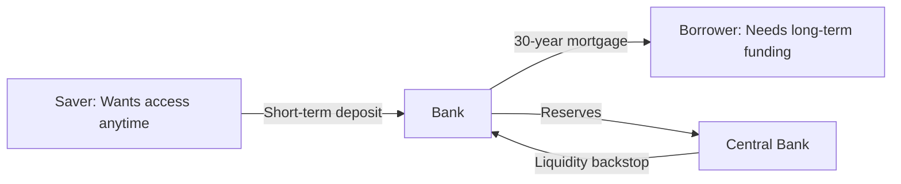
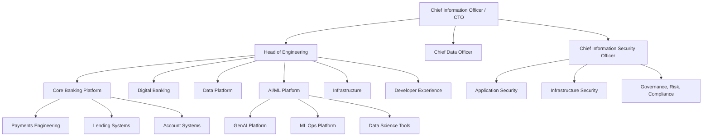
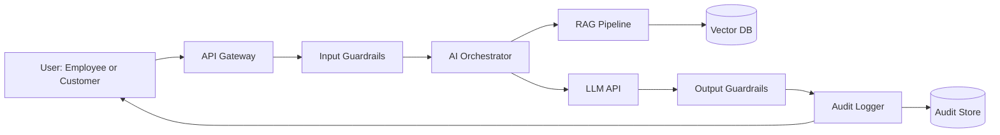

# Banking 101: How Banks Work, Why They Exist, and Why Technology Matters

> **Audience:** Engineers joining a bank who have never worked in financial services.
> **Prerequisites:** None. This is ground zero.
> **Cross-references:** [How Banks Are Structured](./how-banks-are-structured.md), [Engineering Philosophy](../engineering-philosophy/), [Glossary](../glossary/)

---

## Table of Contents

1. [What Is a Bank?](#1-what-is-a-bank)
2. [Why Banks Exist](#2-why-banks-exist)
3. [How Banks Make Money](#3-how-banks-make-money)
4. [Types of Banks](#4-types-of-banks)
5. [The Balance Sheet: A Bank's Report Card](#5-the-balance-sheet-a-banks-report-card)
6. [Why Technology Matters to Banks](#6-why-technology-matters-to-banks)
7. [The Technology Org at a Global Bank](#7-the-technology-org-at-a-global-bank)
8. [GenAI in Banking: The Landscape](#8-genai-in-banking-the-landscape)
9. [Risks of AI in Banking](#9-risks-of-ai-in-banking)
10. [Key Regulations You Must Know](#10-key-regulations-you-must-know)
11. [Common Systems and Technology](#11-common-systems-and-technology)
12. [Engineering Implications](#12-engineering-implications)
13. [Interview Questions](#13-interview-questions)

---

## 1. What Is a Bank?

A bank is a **financial intermediary** — an institution that connects people who have money (depositors/savers) with people who need money (borrowers).

At its simplest:

```
Savers ──deposit──► Bank ──lend──► Borrowers
                        │
                   Bank keeps
                  the difference
                 between interest
                 paid and charged
```

But modern banks are vastly more complex. A global bank like JPMorgan Chase, HSBC, or Barclays is more like a **technology company with a banking license**. They process trillions of dollars in payments, manage millions of portfolios, and employ tens of thousands of technologists.

**Key terms:**

- **Financial Intermediary:** An institution that channels funds between surplus units (savers) and deficit units (borrowers).
- **Banking License:** A regulatory authorization that permits an institution to accept deposits and make loans. In the US, issued by the OCC (Office of the Comptroller of the Currency) or state regulators. In the UK, by the PRA (Prudential Regulation Authority).
- **Fiduciary Duty:** The legal obligation to act in the best interest of clients.

### What Makes Banks Different From Other Companies?

1. **They trade in risk, not products.** A bank's "product" is its assessment of risk. Every loan, investment, and transaction is fundamentally a bet on the future.
2. **They are highly leveraged.** Banks typically operate with 90%+ debt-to-equity ratios. A 5% loss on assets can wipe out all equity. This is why regulators care so deeply.
3. **They are systemically important.** The failure of a large bank can trigger cascading failures across the entire economy (see: 2008 financial crisis).
4. **Every action is regulated.** From hiring to firing, from software deployment to data storage, banking activities are subject to regulatory oversight.

---

## 2. Why Banks Exist

Banks solve three fundamental economic problems:

### 2.1 Maturity Transformation

Savers want **liquidity** (access to their money now). Borrowers want **long-term funding** (a 30-year mortgage). Banks bridge this gap by taking short-term deposits and making long-term loans.



**Risk:** If too many depositors withdraw simultaneously (a **bank run**), the bank cannot liquidate long-term loans fast enough. This is why central banks act as **lenders of last resort**.

### 2.2 Risk Transformation

Banks pool risk across thousands of customers. Not everyone defaults at once. By diversifying their loan book, banks reduce the overall risk compared to individual lending.

### 2.3 Information Asymmetry Reduction

Banks have expertise and data that individual savers lack. They assess creditworthiness, monitor borrowers, and enforce contracts — services that would be prohibitively expensive for individuals to perform themselves.

---

## 3. How Banks Make Money

### 3.1 Net Interest Income (NII)

The difference between interest earned on loans and interest paid on deposits.

```
NII = Interest Income from Loans and Investments
    - Interest Expense on Deposits and Borrowings
```

**Example:** If a bank pays 2% on deposits and charges 6% on mortgages, the **net interest margin (NIM)** is approximately 4% (after accounting for reserves and costs).

**Engineering implication:** Interest rate models, pricing engines, and deposit management systems are core revenue-generating technology. Even a 0.1% improvement in NIM modeling can mean hundreds of millions in additional revenue for a global bank.

### 3.2 Non-Interest Income (Fee Income)

- **Transaction fees:** Wire transfers, account maintenance, overdraft fees
- **Advisory fees:** M&A advisory, restructuring
- **Trading revenue:** Proprietary trading, market making
- **Asset management fees:** Wealth management, mutual funds
- **Card fees:** Interchange fees, annual fees, late fees

**Engineering implication:** Payment processing systems, trading platforms, and wealth management portals are significant technology investments.

### 3.3 Trading and Investment Income

Banks invest their own capital (within regulatory limits) in:
- Government and corporate bonds
- Equities
- Derivatives
- Foreign exchange

**Engineering implication:** Trading systems require ultra-low latency (microseconds matter), real-time market data processing, and sophisticated risk models.

### 3.4 The Revenue Mix

For a typical global bank:

| Revenue Stream | % of Total Revenue |
|---------------|-------------------|
| Net Interest Income | 50-60% |
| Investment Banking Fees | 10-15% |
| Trading Revenue | 10-15% |
| Asset Management | 10-15% |
| Other Fees | 5-10% |

---

## 4. Types of Banks

### 4.1 Retail/Consumer Banks

Serve individual consumers with everyday banking:
- Checking and savings accounts
- Mortgages and personal loans
- Credit cards
- Basic investment products

**Examples:** Chase retail banking, Barclays UK, Wells Fargo consumer banking.

### 4.2 Commercial/Corporate Banks

Serve businesses, from small enterprises to multinational corporations:
- Commercial lending
- Cash management
- Trade finance
- Treasury services

### 4.3 Investment Banks

Serve corporations, governments, and institutional investors:
- M&A advisory
- Capital raising (IPOs, bond issuance)
- Sales and trading
- Research

### 4.4 Universal Banks

Offer all of the above under one roof. Most major global banks are universal banks:
- JPMorgan Chase
- HSBC
- Citigroup
- Barclays
- BNP Paribas
- Deutsche Bank

### 4.5 Central Banks

Not commercial entities. Central banks (Federal Reserve, ECB, Bank of England) manage monetary policy, regulate commercial banks, and act as lenders of last resort.

---

## 5. The Balance Sheet: A Bank's Report Card

Understanding a bank's balance sheet is essential for any engineer working on financial systems.

### 5.1 Assets (What the Bank Owns)

| Asset | Description |
|-------|------------|
| Cash and Reserves | Money held at the central bank and in vaults |
| Loans | Mortgages, personal loans, commercial loans |
| Securities | Government bonds, corporate bonds, equities |
| Derivatives | Financial contracts whose value depends on underlying assets |
| Trading Assets | Positions held for short-term trading profit |

### 5.2 Liabilities (What the Bank Owes)

| Liability | Description |
|-----------|------------|
| Customer Deposits | Money customers have deposited (the bank owes this back) |
| Wholesale Funding | Borrowings from other banks, bond issuance |
| Derivatives Liabilities | Obligations from derivative contracts |
| Operational Liabilities | Accounts payable, accrued expenses |

### 5.3 Equity (What's Left)

```
Equity = Assets - Liabilities
```

Bank equity is typically 8-12% of total assets. This is why banks are so highly leveraged — for every $1 of equity, they may have $10-12 of assets.

### 5.4 Key Ratios Every Engineer Should Understand

| Ratio | Formula | What It Tells You |
|-------|---------|-------------------|
| Capital Adequacy Ratio (CAR) | Tier 1 Capital / Risk-Weighted Assets | Buffer against losses |
| Loan-to-Deposit Ratio | Total Loans / Total Deposits | Liquidity risk |
| Net Interest Margin | (Interest Income - Interest Expense) / Average Earning Assets | Profitability of lending |
| Return on Equity (ROE) | Net Income / Shareholder Equity | Efficiency of capital use |
| Non-Performing Loan Ratio | NPLs / Total Loans | Credit quality |

**Engineering implication:** Every system that touches loans, deposits, or risk calculations feeds into these ratios. Inaccurate data = incorrect regulatory reporting = potential fines.

---

## 6. Why Technology Matters to Banks

### 6.1 Technology as a Competitive Advantage

Historically, banks competed on branch networks and relationships. Today, they compete on:

- **Digital experience:** Mobile apps, online banking, chatbots
- **Speed of execution:** Real-time payments, instant loan approvals
- **Data-driven decisions:** AI-powered credit scoring, fraud detection
- **Operational efficiency:** Automated processes, straight-through processing (STP)
- **Risk management:** Real-time risk dashboards, stress testing systems

### 6.2 Technology as a Regulatory Requirement

Banks are **required** by law to maintain:
- Transaction monitoring systems (for AML)
- KYC databases (for customer due diligence)
- Capital calculation engines (Basel III)
- Stress testing infrastructure (CCAR in the US)
- Audit trails for every transaction
- Data protection systems (GDPR, local equivalents)

### 6.3 Technology as a Risk Multiplier

Technology failures at banks can cause:
- **Market disruption:** Trading system outages during market hours
- **Customer harm:** Incorrect balance displays, failed payments
- **Regulatory breaches:** Data leaks, compliance gaps
- **Reputational damage:** Social media amplifies every failure

**Real example:** In 2012, Knight Capital's software deployment error caused a $440 million loss in 45 minutes due to a flag that was not set on one server. The company was bankrupt within two days. This was not a bank, but the same risk applies.

### 6.4 Technology Spend at Banks

A typical global bank spends **$10-20 billion per year on technology**. Roughly:
- 60-70% on "run the bank" (maintenance, operations)
- 30-40% on "change the bank" (new features, modernization)

Engineers should understand that most of their work is funded from this massive budget, and every expenditure is scrutinized.

---

## 7. The Technology Org at a Global Bank

### 7.1 Typical Structure



### 7.2 Engineering Roles

| Role | Responsibility |
|------|---------------|
| Software Engineer (L3-L5) | Feature development, bug fixes, code reviews |
| Senior Engineer (L5-L6) | System design, mentoring, cross-team collaboration |
| Staff Engineer (L6-L7) | Technical strategy, architecture, org-level impact |
| Principal Engineer (L7-L8) | Enterprise-wide technical vision, standards |
| Distinguished Engineer (L8+) | Industry-level thought leadership, strategic direction |
| Engineering Manager | People management, delivery accountability |
| Director of Engineering | Multi-team leadership, budget ownership |

### 7.3 How Engineering Teams Interact with the Business

```
Business Request --> Product Manager --> Tech Lead --> Engineering Team
                         │                      │
                         ▼                      ▼
                   Compliance Review      Architecture Review
                         │                      │
                         ▼                      ▼
                   Risk Assessment        Security Review
                         │                      │
                         └──────► Approval ◄────┘
                                   │
                                   ▼
                            Development --> Testing --> Deployment
```

---

## 8. GenAI in Banking: The Landscape

### 8.1 Where GenAI Is Used in Banking Today

| Area | Use Case | Maturity |
|------|----------|----------|
| **Customer Service** | Chatbots, virtual assistants | Production (limited) |
| **Software Engineering** | Code generation, code review, documentation | Production (growing) |
| **Compliance** | Policy analysis, regulation summarization | Pilot |
| **Risk Management** | Scenario analysis, stress test narrative generation | Pilot |
| **Operations** | Document processing, email triage, knowledge retrieval | Pilot |
| **Trading** | Market sentiment analysis, research summarization | Experimental |
| **HR** | Internal knowledge base, policy Q&A | Production (limited) |
| **Legal** | Contract review, clause extraction | Pilot |

### 8.2 How GenAI Differs from Traditional ML in Banking

| Aspect | Traditional ML | GenAI (LLMs) |
|--------|---------------|--------------|
| **Output** | Structured (score, classification) | Unstructured (text, code) |
| **Determinism** | Reproducible results | Non-deterministic |
| **Explainability** | Feature importance available | Hard to explain |
| **Regulatory Fit** | Well-understood by regulators | Emerging frameworks |
| **Data Requirements** | Structured, labeled data | Any text data |
| **Hallucination Risk** | Not applicable | Core concern |

### 8.3 GenAI Platform Architecture (Simplified)



---

## 9. Risks of AI in Banking

### 9.1 Hallucination Risk

An LLM generating incorrect financial data, regulatory requirements, or customer information could lead to:
- Wrong compliance decisions
- Incorrect customer advice
- Regulatory breaches

**Mitigation:** RAG with source citations, confidence thresholds, human-in-the-loop for critical outputs.

### 9.2 Data Exfiltration

Sensitive data (PII, account numbers, trading positions) could leak through:
- Prompts sent to external LLM providers
- Training data containing confidential information
- Prompt injection attacks extracting data from RAG sources

**Mitigation:** Data classification, DLP scanning, on-premise models where required, strict access controls on RAG sources.

### 9.3 Regulatory Risk

Regulators are still developing AI-specific frameworks. Current applicable regulations include:
- **EU AI Act:** Classifies banking AI as "high risk" in many cases
- **SR 11-7 (US):** Model risk management guidance
- **PRA SS1/23 (UK):** AI and ML in banking and insurance
- **OCC 2011-12:** Model risk management

**Mitigation:** Model inventory, validation processes, human oversight, documentation.

### 9.4 Operational Risk

- Model drift affecting output quality over time
- Dependency on external LLM providers
- Latency and availability concerns
- Cost unpredictability at scale

### 9.5 Reputational Risk

AI-generated content that is biased, inappropriate, or incorrect can cause public relations crises, especially if it affects customers.

---

## 10. Key Regulations You Must Know

| Regulation | Jurisdiction | What It Covers | Engineering Impact |
|-----------|-------------|----------------|-------------------|
| **Basel III** | Global | Capital adequacy, liquidity | Capital calculation systems |
| **GDPR** | EU/UK | Data protection and privacy | Data handling, consent, deletion |
| **DORA** | EU | Digital operational resilience | IT risk management, testing |
| **SOX** | US | Financial reporting | Audit trails, access controls |
| **AML Directives** | EU/Global | Anti-money laundering | Transaction monitoring |
| **PSD2/PSD3** | EU | Payment services | Open banking APIs |
| **EU AI Act** | EU | AI system regulation | AI governance, risk assessment |
| **CCAR** | US | Stress testing | Risk modeling infrastructure |
| **PCI-DSS** | Global | Card data security | Card processing systems |
| **MiFID II** | EU | Financial markets | Trading transparency, reporting |

See [Regulations and Compliance](../regulations-and-compliance/) for deep dives on each.

---

## 11. Common Systems and Technology

### 11.1 Core Banking Systems

| System | Description |
|--------|------------|
| **FIS Profile** | Core banking platform for retail and commercial |
| **Fiserv DNA** | Digital-first core banking |
| **Temenos T24** | Global core banking system |
| **Custom mainframe systems** | Legacy systems (COBOL, PL/I) still processing billions of transactions |

### 11.2 Payment Systems

| System | Description |
|--------|------------|
| **SWIFT** | International payment messaging network |
| **CHIPS/Fedwire** | US wholesale payment systems |
| **CHAPS** | UK high-value payment system |
| **SEPA** | European single euro payments area |
| **Faster Payments** | UK real-time payment system |

### 11.3 Risk and Compliance Systems

| System | Description |
|--------|------------|
| **Actimize (NICE)** | AML and fraud detection |
| **Oracle FCCM** | Financial crime compliance |
| **Bloomberg** | Market data and analytics |
| **Murex** | Trading and risk management |
| **Calypso** | Trading platform |

### 11.4 Modern Technology Stack

Modern bank technology teams work with:
- **Backend:** Java (Spring Boot), Python (FastAPI), Go, Node.js, C# (.NET)
- **Frontend:** React, Angular, TypeScript
- **Data:** Kafka, Spark, Flink, Airflow, dbt
- **Infrastructure:** Kubernetes/OpenShift, Docker, Terraform
- **Databases:** PostgreSQL, Oracle, MongoDB, Redis, Cassandra, Neo4j
- **Cloud:** AWS, Azure, GCP, plus on-premise data centers
- **AI/ML:** LangChain, LlamaIndex, vLLM, MLflow, SageMaker

---

## 12. Engineering Implications

### 12.1 What This Means for You as an Engineer

1. **Every line of code has regulatory implications.** Your code may be examined by auditors.
2. **Uptime is not optional.** Banking systems must meet strict SLAs (often 99.99%+).
3. **Data accuracy is paramount.** Incorrect calculations can lead to regulatory breaches.
4. **Audit trails are mandatory.** Every action must be logged and traceable.
5. **Security is everyone's responsibility.** You will be tested on security awareness.
6. **Change management is rigorous.** Deployments require approval, testing, and rollback plans.
7. **Documentation is part of the job.** Architecture decisions, security reviews, and compliance evidence must all be documented.

### 12.2 Common Engineering Workflows


---

## 13. Interview Questions

A banking-knowledgeable engineer should be able to answer:

### Foundational

1. **Explain how a bank makes money in three minutes to someone who has never worked in finance.**
2. **What is maturity transformation and why is it central to banking?**
3. **Why are banks so highly leveraged compared to other industries? What risks does this create?**
4. **What is the difference between a retail bank and an investment bank?**

### Technical

5. **If you were building a loan origination system, what data accuracy requirements would you consider and why?**
6. **How would you design an audit trail for a payment processing system?**
7. **What considerations would you make when choosing between an on-premise LLM and a cloud-hosted LLM for a banking application?**
8. **Explain the concept of risk-weighted assets. How does this affect system design?**

### Scenario-Based

9. **You discover that a calculation in the interest accrual system has been producing incorrect results for 3 months. Walk through your response.**
10. **A compliance officer asks you to build an AI system that summarizes regulatory documents. What safeguards would you implement?**
11. **Your team is asked to reduce the latency of a payment processing API from 2 seconds to 200 milliseconds. What is your approach?**
12. **How would you explain to a non-technical stakeholder why you need 6 weeks to add what seems like a "simple" field to a form?**

---

## Further Reading

- [Retail Banking](./retail-banking.md) — Consumer banking products in detail
- [Investment Banking](./investment-banking.md) — M&A, capital markets, trading
- [Payments](./payments.md) — Payment systems and networks
- [How Banks Are Structured](./how-banks-are-structured.md) — Organizational structure
- [Engineering Philosophy](../engineering-philosophy/) — Mindset and craft
- [Regulations and Compliance](../regulations-and-compliance/) — Detailed regulatory guides
- [Glossary](../glossary/) — Banking and technology terms
