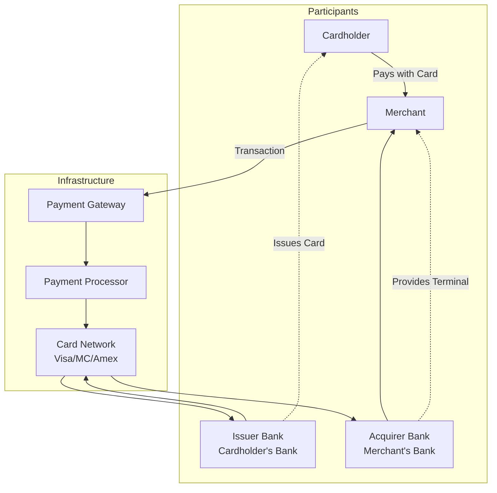
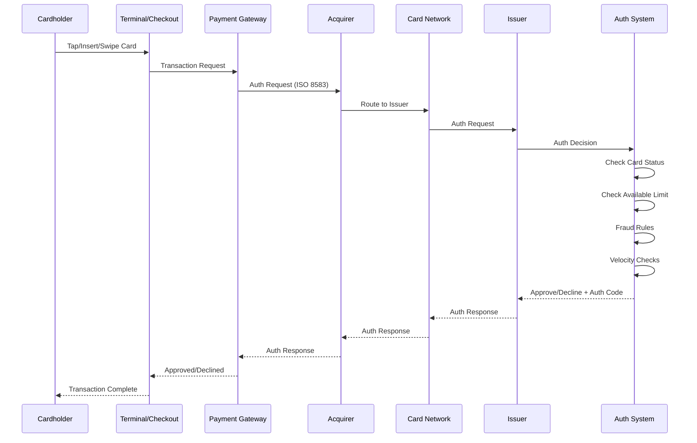
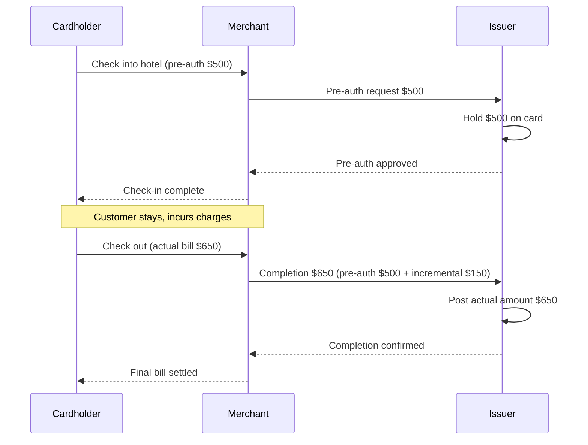
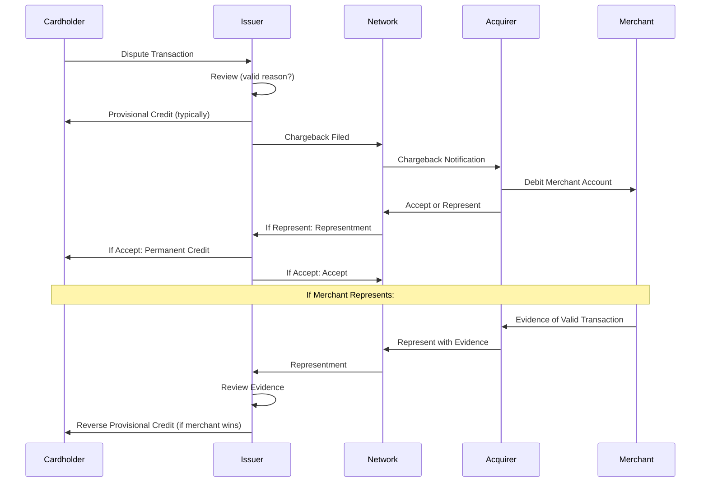
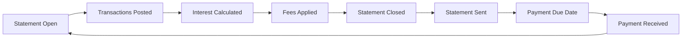
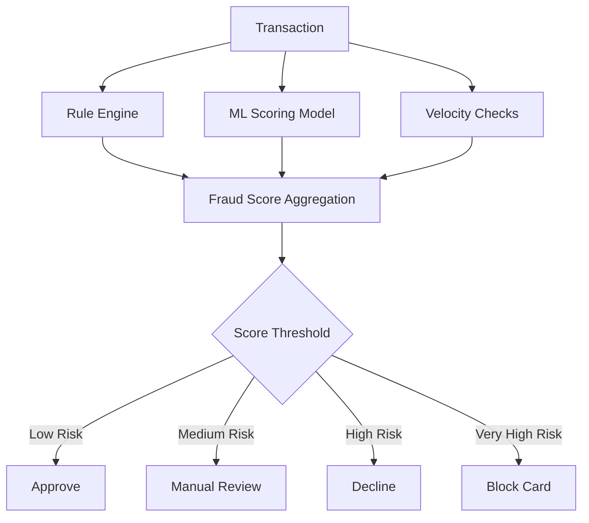
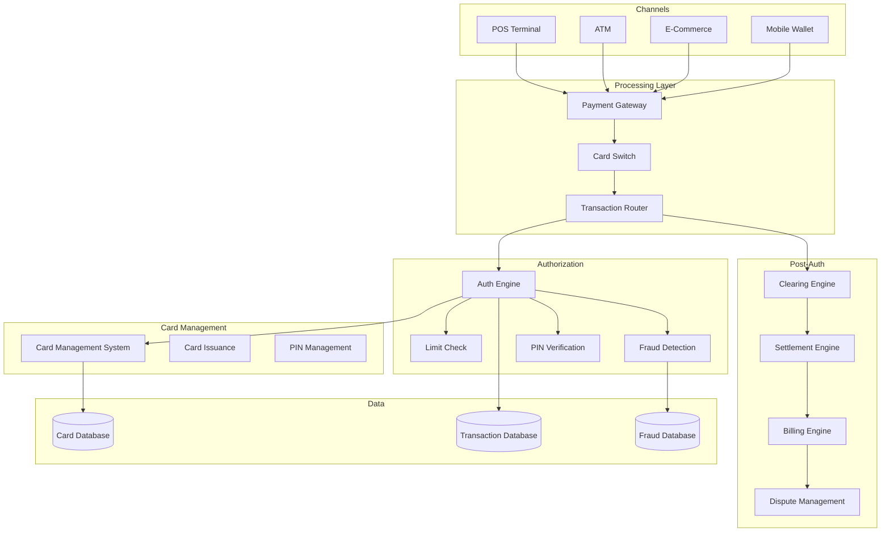
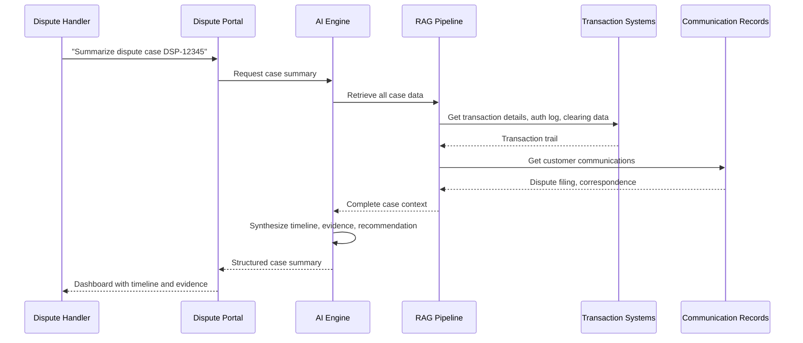

# Cards and Transactions: Card Processing, Authorization, Clearing, Settlement, and Disputes

> **Audience:** Engineers building or maintaining card processing systems.
> **Prerequisites:** [Banking 101](./banking-101.md), [Retail Banking](./retail-banking.md), [Payments](./payments.md)
> **Cross-references:** [Payments](./payments.md), [AML and Fraud](./aml-and-fraud.md), [Lending](./lending.md)

---

## Table of Contents

1. [The Card Ecosystem](#1-the-card-ecosystem)
2. [Card Types](#2-card-types)
3. [The Card Transaction Lifecycle](#3-the-card-transaction-lifecycle)
4. [Authorization](#4-authorization)
5. [Clearing](#5-clearing)
6. [Settlement](#6-settlement)
7. [Fees and Interchange](#7-fees-and-interchange)
8. [Disputes and Chargebacks](#8-disputes-and-chargebacks)
9. [Card Account Management](#9-card-account-management)
10. [Card Fraud and Security](#10-card-fraud-and-security)
11. [Card System Architecture](#11-card-system-architecture)
12. [GenAI in Cards and Transactions](#12-genai-in-cards-and-transactions)
13. [Risks of AI in Cards and Transactions](#13-risks-of-ai-in-cards-and-transactions)
14. [Key Regulations](#14-key-regulations)
15. [Common Systems and Technology](#15-common-systems-and-technology)
16. [Engineering Implications](#16-engineering-implications)
17. [Common Workflows](#17-common-workflows)
18. [Interview Questions](#18-interview-questions)

---

## 1. The Card Ecosystem

Card transactions involve multiple parties, each with a specific role:



### 1.1 Key Participants Explained

| Party | Role | Revenue |
|-------|------|---------|
| **Cardholder** | Consumer using the card | N/A (pays interest/fees) |
| **Merchant** | Business accepting card payments | Pays merchant discount fee |
| **Issuer** | Bank that issued the card | Interchange fee, interest, annual fees |
| **Acquirer** | Bank that processes for the merchant | Merchant discount fee minus interchange |
| **Card Network** | Visa, Mastercard, etc. | Network assessment fees |
| **Payment Gateway** | Connects merchant to processing network | Per-transaction fee |
| **Processor** | Handles authorization, clearing, settlement | Processing fee |

---

## 2. Card Types

### 2.1 Debit Cards

| Property | Description |
|----------|------------|
| **Linked To** | Checking/current account |
| **Funds Source** | Customer's own money |
| **Authorization** | Check available balance in account |
| **Settlement** | Funds debited from account |
| **PIN vs Signature** | PIN common for in-person, signature for online |
| **Network Debit** | Domestic debit networks or Visa/MC debit |

### 2.2 Credit Cards

| Property | Description |
|----------|------------|
| **Linked To** | Revolving credit line |
| **Funds Source** | Bank's money (borrowed) |
| **Authorization** | Check available credit limit |
| **Settlement** | Added to outstanding balance |
| **Repayment** | Monthly statement, minimum payment |
| **Interest** | Charged on revolving balance |

### 2.3 Prepaid Cards

| Property | Description |
|----------|------------|
| **Linked To** | Pre-loaded balance |
| **Funds Source** | Pre-funded balance |
| **Authorization** | Check prepaid balance |
| **Use Cases** | Gift cards, travel cards, benefit cards |

### 2.4 Commercial/Corporate Cards

| Property | Description |
|----------|------------|
| **For** | Business expenses |
| **Features** | Enhanced data (Level II/III), expense controls |
| **Benefits** | Lower interchange with rich data, spending controls |

---

## 3. The Card Transaction Lifecycle

```mermaid
graph TD
    subgraph "Phase 1: Authorization"
        A1[Card Presented at Merchant] --> A2[Terminal Reads Card]
        A2 --> A3[Auth Request to Acquirer]
        A3 --> A4[Auth Request via Network]
        A4 --> A5[Issuer Auth Decision]
        A5 --> A6[Auth Response: Approve/Decline]
        A6 --> A7[Response to Merchant]
    end
    
    subgraph "Phase 2: Clearing"
        C1[End of Day Batch] --> C2[Clearing File to Network]
        C2 --> C3[Network Distributes to Issuers]
        C3 --> C4[Issuer Posts to Account]
    end
    
    subgraph "Phase 3: Settlement"
        S1[Net Position Calculated] --> S2[Funds Transferred]
        S2 --> S3[Acquirer Credits Merchant]
    end
    
    subgraph "Phase 4: Dispute (if needed)"
        D1[Cardholder Disputes] --> D2[Chargeback Initiated]
        D2 --> D3[Issuer Credits Cardholder]
        D3 --> D4[Acquirer Debits Merchant]
    end
```



---

## 4. Authorization

### 4.1 What Is Authorization?

Authorization is the **real-time decision** of whether to approve or decline a card transaction. It happens in seconds while the customer waits at the till or the online checkout loads.

### 4.2 Authorization Flow (Detailed)



### 4.3 Authorization Decision Factors

| Factor | Check | Outcome |
|--------|-------|---------|
| **Card Status** | Is the card active, blocked, expired? | Block if inactive |
| **Available Limit** | Is there sufficient credit/balance? | Decline if insufficient |
| **PIN Verification** | Does the entered PIN match? (chip & PIN) | Decline if mismatch |
| **CVV Verification** | Does the CVV match? (online) | Decline if mismatch |
| **AVS (Address Verification)** | Does billing address match? (online) | Flag if mismatch |
| **Fraud Rules** | Does the transaction match fraud patterns? | Decline or flag |
| **Velocity Checks** | Too many transactions in short time? | Decline if suspicious |
| **Geographic Rules** | Transaction in unusual location? | Flag for review |
| **Merchant Category** | Restricted merchant type? | Decline if blocked |

### 4.4 Authorization Types

| Type | Description | Use Case |
|------|------------|----------|
| **Purchase** | Standard payment | Retail purchases |
| **Cash Advance** | Cash withdrawal from ATM | ATM withdrawals |
| **Refund/Credit** | Return of funds | Merchandise returns |
| **Pre-Authorization** | Reserve funds, finalize later | Hotels, car rentals, gas stations |
| **Incremental Auth** | Add to pre-authorization | Hotel minibar, extended stay |
| **Force Post** | Manual posting after offline auth | Offline transactions |
| **Recurring** | Subscription payments | Monthly subscriptions |
| **Installment** | Split into multiple payments | Buy now, pay later |

### 4.5 Pre-Authorization and Completion



---

## 5. Clearing

### 5.1 What Is Clearing?

Clearing is the **exchange of transaction details** between the acquirer and issuer via the card network. It happens after authorization, typically at end-of-day.

### 5.2 Clearing Process

```
Merchant closes business day (batch out)
    │
    ▼
Acquirer collects all transactions
    │
    ▼
Acquirer sends clearing file to card network
    │
    ▼
Network distributes transactions to respective issuers
    │
    ▼
Issuers receive clearing data and post to cardholder accounts
```

### 5.3 Clearing Data (ISO 8583)

The clearing message contains more detail than the authorization:

| Data Element | Authorization | Clearing |
|-------------|--------------|----------|
| Transaction Amount | Yes | Yes |
| Merchant Details | Basic | Full |
| Card Number | Yes | Yes |
| Transaction Date/Time | Yes | Yes |
| Merchant Category Code | Yes | Yes |
| Terminal Data | Basic | Full |
| Itemized Details | No | Yes (Level II/III) |
| Tax Amount | No | Yes (Level II/III) |
| Line Item Details | No | Yes (Level III) |

### 5.4 Level I, II, III Data

| Level | Description | Interchange Rate |
|-------|------------|-----------------|
| **Level I** | Basic transaction data | Standard |
| **Level II** | + Tax amount, merchant details | Lower (commercial cards) |
| **Level III** | + Line item details, product codes | Lowest (commercial cards) |

**Engineering implication:** Systems must support Level II/III data enrichment for commercial card processing.

---

## 6. Settlement

### 6.1 What Is Settlement?

Settlement is the **actual transfer of funds** between the acquirer and issuer. It follows clearing.

### 6.2 Settlement Flow

```
Network calculates net positions
    │
    ▼
Network sends settlement files to members
    │
    ▼
Funds transferred via settlement bank (typically Fedwire/CHAPS)
    │
    ▼
Acquirer receives funds from issuer (minus interchange)
    │
    ▼
Acquirer credits merchant account (minus acquirer fee)
```

### 6.3 Settlement Timeline

| Event | Timing |
|-------|--------|
| Authorization | Real-time |
| Clearing | End of merchant day (typically same day) |
| Settlement | 1-3 business days after clearing (T+1 to T+3) |
| Merchant Funding | 1-2 business days after settlement |

### 6.4 The Merchant Discount Fee

```
Customer pays: $100.00
    │
    Interchange Fee (to Issuer):    -$1.50 (1.5%)
    Network Assessment (to Network): -$0.14 (0.14%)
    Acquirer Fee:                    -$0.36 (0.36%)
    │
Merchant receives:                  $98.00 (98.0%)
```

The merchant discount fee varies by:
- Card type (debit vs. credit vs. commercial)
- Transaction type (card-present vs. card-not-present)
- Merchant category
- Transaction volume
- Risk profile

---

## 7. Fees and Interchange

### 7.1 Interchange Fees

Interchange is the fee paid by the acquirer to the issuer for each transaction. It is set by the card networks and varies by:

| Factor | Impact on Interchange |
|--------|---------------------|
| **Card Type** | Credit > Debit > Prepaid |
| **Transaction Type** | Card-not-present > Card-present |
| **Card Tier** | Rewards/premium > Standard |
| **Processing Method** | Contactless/chip > Swiped |
| **Data Level** | Level III < Level II < Level I |

### 7.2 Network Assessment Fees

Card networks charge a fee for using their infrastructure:
- Typically 0.11-0.14% of transaction value
- Plus a per-transaction fee (e.g., $0.0195)

### 7.3 Interchange++ Pricing

The most transparent pricing model for merchants:

```
Merchant Pays = Interchange + Network Assessment + Acquirer Markup

Example:
Interchange:           1.50%
Network Assessment:    0.14%
Acquirer Markup:       0.30% + $0.05
─────────────────────────────
Total on $100:         $1.94 + $0.05 = $1.99
```

---

## 8. Disputes and Chargebacks

### 8.1 What Is a Dispute?

A dispute occurs when a cardholder challenges a transaction on their statement. The cardholder claims they should not be charged.

### 8.2 Common Dispute Reasons

| Reason Code | Description |
|------------|-------------|
| **Fraud** | "I didn't make this transaction" |
| **Not Received** | "I paid but didn't receive goods/services" |
| **Not as Described** | "Goods received are different from what was advertised" |
| **Duplicate Processing** | "I was charged twice for the same transaction" |
| **Cancelled** | "I cancelled the service but was still charged" |
| **Processing Error** | "Wrong amount was charged" |

### 8.3 Chargeback Flow



### 8.4 Chargeback Timeframes

| Step | Typical Timeframe |
|------|------------------|
| Cardholder Dispute | Up to 120 days from transaction |
| Issuer Review | 30 days |
| Chargeback to Acquirer | 30 days |
| Merchant Response | 30 days |
| Final Determination | 30 days |
| Arbitration (if escalated) | 60+ days |

### 8.5 Merchant Chargeback Ratio

If a merchant's chargeback ratio exceeds network thresholds:

| Ratio | Consequence |
|-------|------------|
| **> 1%** | Warning from network |
| **> 1.5%** | Monitoring program, fines |
| **> 2%** | High-risk classification, higher fees |
| **> 3%** | Potential termination of processing |

**Engineering implication:** Merchants need real-time dashboards showing their chargeback ratios. Banks need automated monitoring and alerting.

---

## 9. Card Account Management

### 9.1 Card Account Structure

```
Card Account
├── Primary Cardholder
│   ├── Primary Card
│   └── Supplementary Card (spouse/dependent)
├── Credit Limit: $10,000
├── Available Credit: $7,200
├── Outstanding Balance: $2,800
│   ├── Purchases: $2,500
│   ├── Cash Advance: $300
│   └── Balance Transfer: $0
├── Current Statement Balance: $1,500
├── Minimum Payment Due: $35
├── Payment Due Date: 2024-02-15
├── Interest Rate: 19.99% (purchases), 24.99% (cash advance)
└── Rewards: 12,500 points
```

### 9.2 Statement Cycle



### 9.3 Balance Calculation Methods

| Method | Description |
|--------|------------|
| **Average Daily Balance** | Sum of daily balances / days in cycle |
| **Adjusted Balance** | Balance at end of previous cycle minus payments |
| **Previous Balance** | Balance at start of cycle |
| **Two-Cycle Average** | Average of current and previous cycle balances |

### 9.4 Interest Calculation on Credit Cards

```
Daily Periodic Rate = APR / 365
Daily Interest = Daily Balance × Daily Periodic Rate
Monthly Interest = Sum of Daily Interest

Grace Period: If full statement balance is paid by due date,
              no interest on new purchases (typically 21-25 days)
```

**Engineering implication:** Credit card interest calculations are more complex than loan interest due to:
- Multiple rate types (purchases, cash advance, balance transfer)
- Grace period logic
- Compounding (interest on interest)
- Daily balance calculations

---

## 10. Card Fraud and Security

### 10.1 Card Fraud Types

| Type | Description | Prevalence |
|------|------------|-----------|
| **Card-Not-Present Fraud** | Online/phone fraud using stolen card details | Highest |
| **Counterfeit Card Fraud** | Fraudulent card created from skimmed data | Declining (chip) |
| **Lost/Stolen Card Fraud** | Genuine card used by finder/thief | Moderate |
| **Card-Not-Received Fraud** | Intercepted card in mail | Low |
| **Application Fraud** | Fake identity to obtain a card | Growing |
| **Account Takeover** | Criminal gains access to existing account | Growing |

### 10.2 Fraud Detection Techniques



### 10.3 Common Fraud Rules

| Rule | Description |
|------|------------|
| **Velocity** | Too many transactions in short time |
| **Geographic** | Transaction in country different from usual |
| **Amount** | Transaction amount significantly above normal |
| **Merchant Category** | High-risk MCC (electronics, jewelry, wire transfers) |
| **Time** | Transaction at unusual time |
| **Card Testing** | Small transactions followed by large one |
| **BIN Attack** | Sequential card numbers from same BIN |

### 10.4 3-D Secure (3DS)

3-D Secure adds an authentication step for online card payments:

```
Cardholder enters card details online
    │
    ▼
Merchant/ACS (Access Control Server) challenges cardholder
    │
    ▼
Cardholder authenticates (password, biometric, OTP)
    │
    ▼
Authentication result passed to issuer
    │
    ▼
Issuer considers 3DS result in auth decision
```

**3DS 2.0 improvements:**
- Risk-based authentication (frictionless flow for low-risk)
- Rich data exchange (200+ data elements)
- Mobile-friendly
- Better user experience

---

## 11. Card System Architecture



---

## 12. GenAI in Cards and Transactions

### 12.1 Use Cases

| Use Case | Description | Value |
|----------|------------|-------|
| **Fraud Alert Summarization** | AI summarizing fraud alerts for investigators | Faster triage, reduced alert fatigue |
| **Dispute Case Summarization** | AI compiling all evidence for a dispute case | Faster resolution, consistency |
| **Customer Inquiry Response** | AI answering cardholder questions about transactions | Reduced call center volume |
| **Transaction Categorization** | AI categorizing transactions for spending insights | Better customer experience |
| **Merchant Intelligence** | AI analyzing merchant risk patterns | Proactive risk management |
| **Chargeback Prediction** | AI predicting which transactions may result in chargebacks | Proactive dispute prevention |
| **Fraud Rule Tuning** | AI suggesting optimal fraud rule thresholds | Better fraud detection, fewer false positives |
| **Card Product Analysis** | AI analyzing card product performance and usage patterns | Better product decisions |

### 12.2 Example: AI Dispute Summarization



### 12.3 Example: AI Transaction Categorization

```
Input:   Transaction data (merchant name, MCC, amount, location)
Process: AI classifies into spending categories (groceries, travel, dining, etc.)
Output:  Categorized transaction with confidence score
Usage:   Customer spending insights, budgeting tools, personalized offers
```

---

## 13. Risks of AI in Cards and Transactions

### 13.1 Fraud Detection Risk

| Risk | Scenario | Impact |
|------|----------|--------|
| **Missed Fraud** | AI fails to identify a fraudulent pattern | Financial loss, cardholder harm |
| **False Positive** | AI flags legitimate transactions as fraud | Cardholder frustration, lost revenue |
| **Model Drift** | Fraud patterns evolve, AI doesn't adapt | Increasing miss rate over time |
| **Adversarial Attacks** | Fraudsters learn to evade AI detection | Systematic fraud exploitation |

### 13.2 Customer-Facing AI Risk

| Risk | Scenario | Impact |
|------|----------|--------|
| **Incorrect Balance Info** | AI gives wrong balance or transaction details | Customer complaint, potential financial harm |
| **Unauthorized Disclosure** | AI reveals another customer's transaction info | GDPR breach, massive fine |
| **Wrong Dispute Advice** | AI gives incorrect information about dispute rights | Regulatory complaint, FOS escalation |

### 13.3 Mitigation Strategies

- **AI assists, never decides.** AI should recommend fraud scores, but the final block/allow decision should use deterministic rules.
- **Strict data scoping.** AI can only access the specific cardholder's data.
- **Complete audit trail.** Every AI interaction with transaction data is logged.
- **Regular model validation.** Fraud detection models must be validated against actual fraud outcomes.
- **Confidence thresholds.** Fall back to human review when AI confidence is low.

---

## 14. Key Regulations

| Regulation | Relevance to Cards |
|-----------|-------------------|
| **PSD2/PSD3 (EU)** | Strong customer authentication, SCA exemptions |
| **Regulation E (US)** | Electronic fund transfers, error resolution |
| **Regulation Z (US)** | Truth in Lending, credit card disclosures |
| **CARD Act (US)** | Credit card accountability, fee restrictions |
| **PCI-DSS** | Card data security requirements |
| **EMV Standards** | Chip card specifications |
| **3-D Secure Specifications** | Online authentication standards |
| **Interchange Fee Regulation (EU)** | Caps on interchange fees |
| **Chargeback Rules** | Network-specific chargeback regulations |

See [Regulations and Compliance](../regulations-and-compliance/) for details.

---

## 15. Common Systems and Technology

| System Category | Examples |
|----------------|----------|
| **Card Processing** | TSYS, First Data (Fiserv), FIS Card Services, TS2 |
| **Card Management** | Compass Plus, OpenWay, Mambu |
| **Fraud Detection** | Featurespace, NICE Actimize, SAS Fraud, RSA |
| **PIN Management** | Thales, UPP Security, Entrust |
| **Card Issuance** | IDEMIA, Gemalto, Datacard |
| **Payment Gateway** | Stripe, Adyen, Worldpay, Cybersource |
| **3-D Secure** | CardinalCommerce, ThreatMetrix, Ravelin |
| **Dispute Management** | Verifi, Ethoca, Chargebacks911 |

---

## 16. Engineering Implications

### 16.1 Performance Requirements

| Operation | Typical SLA |
|-----------|------------|
| Authorization | < 2 seconds end-to-end |
| Fraud scoring | < 500ms (within auth flow) |
| PIN verification | < 200ms |
| Balance check | < 100ms |
| Clearing file processing | Complete within batch window |
| Statement generation | Complete within 3 business days |

### 16.2 Data Integrity

- Every authorization must result in an audit record
- Clearing data must reconcile with authorization data
- Settlement must reconcile with clearing data
- Disputes must be traceable from origination to resolution
- Card account balances must be reconciled daily

### 16.3 Idempotency

Card transaction processing must handle:
- Duplicate authorization messages (network retries)
- Duplicate clearing messages
- Re-presented chargebacks

Every message must have a unique identifier, and processing must be idempotent.

### 16.4 Security

- Card numbers must be encrypted at rest and masked in logs
- PAN (Primary Account Number) must never appear in clear in logs
- PIN data must be handled in HSMs (Hardware Security Modules)
- Access to cardholder data must be logged and audited
- PCI-DSS compliance is mandatory for all systems handling card data

---

## 17. Common Workflows

### 17.1 Card Transaction End-to-End

```
1. Cardholder presents card at merchant
2. Terminal reads card (chip, contactless, magnetic stripe)
3. Authorization request sent to acquirer/processor
4. Routed through card network to issuer
5. Issuer checks: card status, available limit, fraud rules
6. Authorization response: Approve or Decline
7. If approved: authorization hold placed on account
8. End of day: merchant batches out
9. Clearing file sent through network
10. Issuer posts transaction to cardholder account
11. Authorization hold replaced with posted transaction
12. Settlement between acquirer and issuer
13. Merchant funded
14. Cardholder receives statement
```

### 17.2 Dispute Processing

```
1. Cardholder notices unknown transaction on statement
2. Cardholder contacts bank (phone, app, branch)
3. Dispute logged in dispute management system
4. Card provisionally credited (within regulatory timeframes)
5. Dispute filed with card network (within reason code requirements)
6. Chargeback sent to acquirer/merchant
7. Merchant responds with evidence or accepts
8. If merchant represents: evidence reviewed
9. Decision made (cardholder or merchant wins)
10. If cardholder disagrees: can escalate to arbitration
11. Final determination
12. If cardholder wins: provisional credit becomes permanent
13. If merchant wins: provisional credit reversed
```

### 17.3 Card Issuance

```
1. Customer approved for card product
2. Card account created in card management system
3. Card ordered from card bureau
4. Card personalized (PAN, name, expiry)
5. PIN generated and mailed separately
6. Card delivered to customer
7. Customer activates card (phone, app, first use)
8. Card becomes active for transactions
9. Welcome communication sent
10. Account monitoring begins
```

---

## 18. Interview Questions

### Foundational

1. **Walk through the lifecycle of a card transaction from authorization to settlement.**
2. **What is the difference between authorization, clearing, and settlement?**
3. **Explain the four-party card model. Who are the participants and what do they earn?**
4. **What is a chargeback and how does the dispute process work?**

### Technical

5. **Design a card authorization system that must respond in under 2 seconds while checking multiple fraud rules. How do you architect this?**
6. **How would you implement idempotent card transaction processing?**
7. **What data would you capture for every card transaction to support dispute resolution months later?**
8. **How do you calculate the daily balance on a credit card with multiple rate types and a grace period?**

### GenAI-Specific

9. **You are building an AI system to summarize card dispute cases. What data sources does it need, and what are the key risks?**
10. **An AI system categorizes card transactions for customer spending insights. What happens when it miscategorizes a transaction and the customer makes a financial decision based on that?**
11. **How would you design an AI fraud alert summarization system that helps investigators without replacing their judgment?**

### Scenario-Based

12. **A customer's card is being used for fraudulent transactions in three countries simultaneously. The fraud detection system has not blocked the card. What is your investigation?**
13. **The clearing file processing has been running for 6 hours and is only 40% complete. Normal processing time is 2 hours. What do you do?**
14. **A merchant's chargeback ratio has jumped from 0.5% to 2.3% in one month. What action does your system take?**

---

## Further Reading

- [Payments](./payments.md) — Payment systems, networks
- [AML and Fraud](./aml-and-fraud.md) — Fraud detection, transaction monitoring
- [Retail Banking](./retail-banking.md) — Consumer banking products
- [PCI-DSS](../regulations-and-compliance/) — Card data security standard
- [Security](../security/) — Application and infrastructure security
