# Common Banking Workflows: Day-to-Day Workflows Engineers Encounter

> **Audience:** Engineers who need to understand the daily workflows and processes they will encounter working in banking technology.
> **Prerequisites:** [Banking 101](./banking-101.md), [How Banks Are Structured](./how-banks-are-structured.md)
> **Cross-references:** [Compliance Teams](./compliance-teams-and-how-they-work.md), [Engineering Philosophy](../engineering-philosophy/), [Incident Management](../incident-management/)

---

## Table of Contents

1. [Why Workflows Matter](#1-why-workflows-matter)
2. [The Engineer's Daily Workflow](#2-the-engineers-daily-workflow)
3. [The Change Management Workflow](#3-the-change-management-workflow)
4. [The Incident Response Workflow](#4-the-incident-response-workflow)
5. [The Compliance Review Workflow](#5-the-compliance-review-workflow)
6. [The Data Request Workflow](#6-the-data-request-workflow)
7. [The Regulatory Reporting Workflow](#7-the-regulatory-reporting-workflow)
8. [The End-of-Day/Batch Processing Workflow](#8-the-end-of-daybatch-processing-workflow)
9. [The Access Request Workflow](#9-the-access-request-workflow)
10. [The Vendor Assessment Workflow](#10-the-vendor-assessment-workflow)
11. [The Model Deployment Workflow](#11-the-model-deployment-workflow)
12. [The Audit Response Workflow](#12-the-audit-response-workflow)
13. [The Customer Escalation Workflow](#13-the-customer-escalation-workflow)
14. [The Business Continuity Workflow](#14-the-business-continuity-workflow)
15. [The GenAI-Specific Workflows](#15-the-genai-specific-workflows)
16. [Common Systems and Technology](#16-common-systems-and-technology)
17. [Engineering Implications](#17-engineering-implications)
18. [Interview Questions](#18-interview-questions)

---

## 1. Why Workflows Matter

In consumer tech, you write code, test it, and deploy it. In banking, every action exists within a **framework of controls, approvals, and documentation**. This is not bureaucracy — it is **professional discipline** in an environment where mistakes cost billions and careers.

Understanding these workflows helps you:
- **Plan accurately.** A "simple" change may take weeks due to required steps.
- **Avoid frustration.** Knowing the "why" behind each step makes the process bearable.
- **Navigate efficiently.** Knowing who to talk to and what to prepare speeds everything up.
- **Communicate with stakeholders.** You can explain timelines and dependencies clearly.

---

## 2. The Engineer's Daily Workflow

### 2.1 A Typical Day

```
08:30  ─ Check overnight alerts and monitoring dashboards
         Any production incidents? Batch job failures?
         
09:00  ─ Stand-up meeting with the team
         What did I do yesterday? What today? Any blockers?
         
09:15  ─ Review pull requests from teammates
         Code review with banking-specific checklist:
         - Data accuracy (no floating-point for money)
         - Audit logging in place
         - Access controls correct
         - Error handling comprehensive
         
09:45  ─ Feature development
         Working on the assigned story/task
         
11:30  ─ Meeting: Architecture review for upcoming change
         Presenting design, getting feedback from architects
         
12:00  ─ Lunch
         
13:00  ─ Feature development (continued)
         
14:30  ─ Meeting: Compliance review session
         Walking through a new system with compliance reviewer
         Answering questions about data flows and controls
         
15:30  ─ Respond to stakeholder questions
         Product owner: "Can we add this field?"
         Ops team: "When will this be in production?"
         
16:00  ─ Work on documentation
         Architecture decision records, runbooks, compliance evidence
         
17:00  ─ Check monitoring one more time
         Any issues before end of day?
         
17:30  ─ Wrap up, plan tomorrow
```

### 2.2 Weekly Rhythms

| Day | Typical Activities |
|-----|-------------------|
| **Monday** | Sprint planning, week-ahead planning |
| **Tuesday** | Architecture reviews, design sessions |
| **Wednesday** | Mid-week check-in, stakeholder meetings |
| **Thursday** | Compliance reviews, security reviews |
| **Friday** | Wrap-up, documentation, deployment window |

### 2.3 Monthly Rhythms

| Activity | Description |
|----------|------------|
| **Month-End Processing** | Supporting batch processing, reconciliation |
| **Regulatory Reporting** | Data feeds to regulatory systems |
| **Capacity Planning** | Reviewing resource utilization |
| **Retrospective** | Team improvement discussion |
| **Metrics Review** | Sprint metrics, defect trends, SLA compliance |

---

## 3. The Change Management Workflow

### 3.1 Every Change Goes Through This

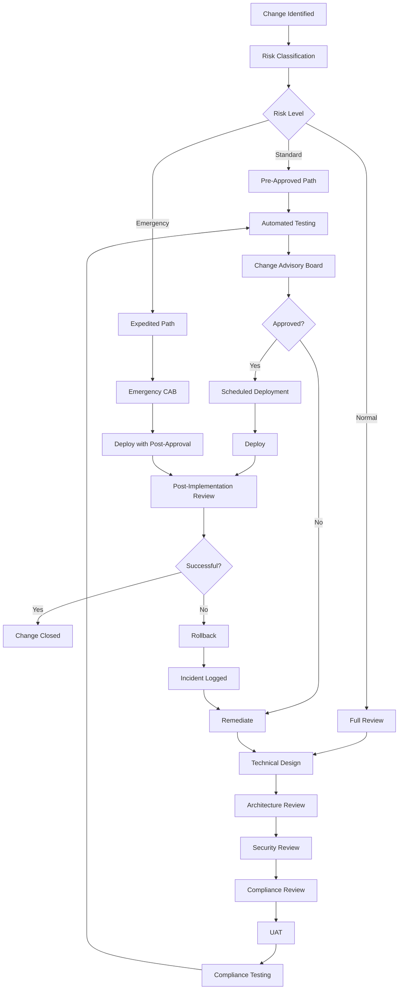

### 3.2 Change Risk Classification

| Level | Description | Approval Path | Example |
|-------|------------|--------------|---------|
| **Standard** | Low risk, repeatable, well-understood | Pre-approved, automated | Routine patching |
| **Normal** | Moderate risk, requires review | Full CAB process | New feature deployment |
| **Emergency** | Urgent fix required | Emergency CAB, post-approval | Production bug fix |
| **Major** | High risk, significant impact | Executive approval | Core system migration |

### 3.3 Change Freeze Periods

| Period | Reason |
|--------|--------|
| **Month-End** | Financial processing (last 3 business days + first 3) |
| **Quarter-End** | Regulatory reporting (last week of quarter + first week) |
| **Year-End** | Annual processing (mid-December to mid-January) |
| **Tax Season** | Tax reporting (varies by jurisdiction) |
| **Major Events** | Elections, market events, bank-specific events |

**Engineering implication:** Plan deployments around freeze periods. A "simple" change may need to wait 3-4 weeks.

---

## 4. The Incident Response Workflow

### 4.1 When Things Go Wrong

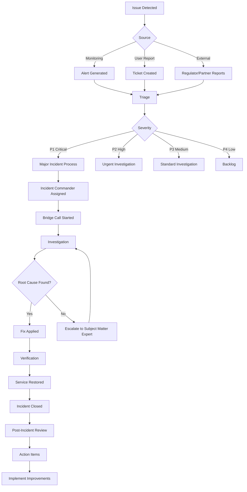

### 4.2 Incident Severity Definitions

| Severity | Definition | Response Time | Escalation |
|----------|-----------|--------------|-----------|
| **P1 Critical** | Complete service outage, customer impact, regulatory breach | 15 minutes | CIO, Business Head, potentially Regulator |
| **P2 High** | Significant degradation, workaround available | 30 minutes | Director of Engineering, Product Owner |
| **P3 Medium** | Partial degradation, limited customer impact | 4 hours | Engineering Manager |
| **P4 Low** | Minor issue, no customer impact | Next business day | Tech Lead |

### 4.3 Post-Incident Review (PIR)

Every P1/P2 incident requires a PIR:

| Section | Description |
|---------|------------|
| **Timeline** | What happened, when, in what order |
| **Impact** | Who was affected, for how long, what was the harm |
| **Root Cause** | Technical and process root causes |
| **Detection** | How was the issue detected? Could it have been detected sooner? |
| **Response** | How did we respond? What went well, what didn't? |
| **Prevention** | What could have prevented this? |
| **Action Items** | Specific actions with owners and deadlines |

---

## 5. The Compliance Review Workflow

### 5.1 How Compliance Reviews Happen

Covered in detail in [Compliance Teams](./compliance-teams-and-how-they-work.md). Quick reference:

```
1. Engineering identifies need for compliance review
2. Review request submitted with documentation package
3. Compliance assigns reviewer (typically 1-2 weeks queue time)
4. Reviewer reviews documentation (1-2 weeks)
5. Questions and clarifications (1-2 weeks)
6. Outcome: Approved / Approved with Conditions / Remediation Required
7. If remediation: address issues, re-submit (additional 1-2 weeks)
```

**Total timeline: 4-8 weeks for a standard review.**

### 5.2 What to Prepare

See the compliance evidence checklist in [Compliance Teams](./compliance-teams-and-how-they-work.md).

---

## 6. The Data Request Workflow

### 6.1 When Someone Needs Data

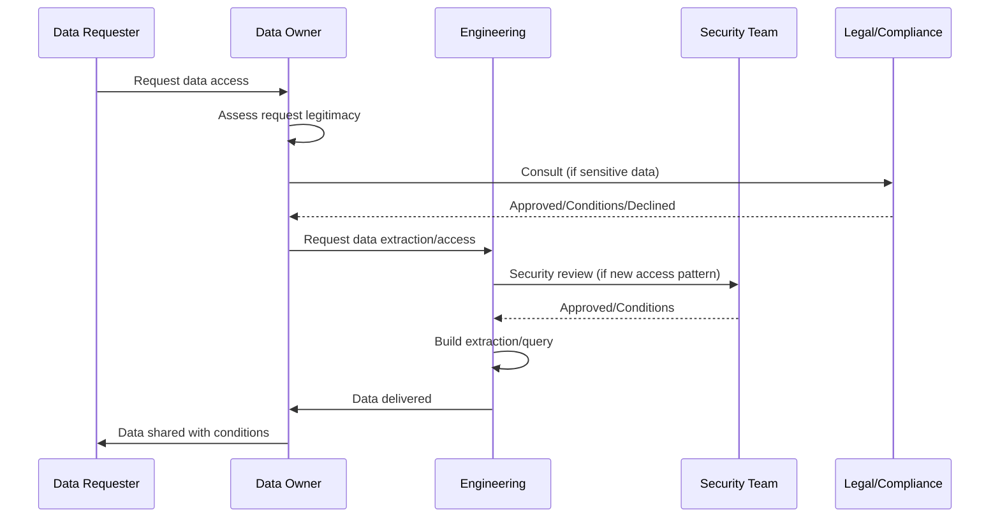

### 6.2 Common Data Requests

| Request Type | Source | Turnaround | Complexity |
|-------------|--------|-----------|-----------|
| **Regulatory Data Pull** | Compliance team | 1-5 days | Medium |
| **Audit Evidence** | Internal Audit | 3-10 days | Medium-High |
| **Management Report** | Business leadership | 1-5 days | Low-Medium |
| **Customer Data Subject Request** | Customer (via GDPR) | 30 days (legal requirement) | Medium |
| **Law Enforcement Request** | Legal team | Per legal guidance | High |
| **Model Training Data** | Data Science team | 2-4 weeks | High |

---

## 7. The Regulatory Reporting Workflow

### 7.1 Regular Regulatory Submissions

| Report | Frequency | Recipient | Content |
|--------|----------|-----------|---------|
| **Call Reports** | Quarterly | US Regulators | Financial condition |
| **FR Y-9C** | Quarterly | Federal Reserve | Financial statements |
| **COREP/FINREP** | Quarterly | EU Regulators | Capital and financial reporting |
| **Large Exposures** | Quarterly | Multiple Regulators | Concentration risk |
| **LCR/NSFR** | Monthly | Prudential Regulators | Liquidity metrics |
| **SAR Statistics** | Quarterly | FinCEN/NCA | Financial crime statistics |
| **MiFID II Transaction Reports** | Daily/T+1 | EU Regulators | Trade transparency |
| **EMIR Trade Reports** | T+1 | EU Regulators | Derivatives reporting |

### 7.2 The Reporting Process

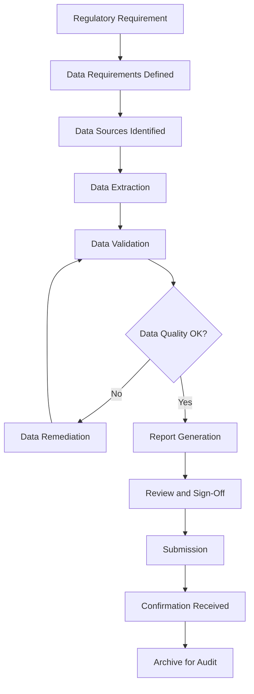

### 7.3 Engineering Involvement

Engineers are involved in:
- Building and maintaining data extraction pipelines
- Ensuring data quality at source
- Fixing data issues identified during validation
- Responding to regulator queries about data
- Implementing new regulatory requirements

---

## 8. The End-of-Day/Batch Processing Workflow

### 8.1 What Happens at End-of-Day

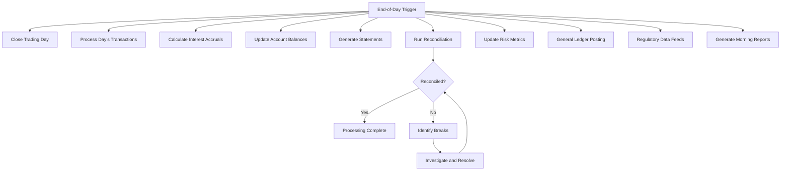

### 8.2 Batch Processing Timeline (Example)

| Time | Activity | Duration | Criticality |
|------|---------|----------|------------|
| **17:00** | Trading day closes | 30 min | Critical |
| **17:30** | Trade capture and confirmation | 1 hour | Critical |
| **18:30** | Market data loading | 30 min | Critical |
| **19:00** | P&L calculation | 1 hour | Critical |
| **20:00** | Risk metrics update | 1 hour | Critical |
| **21:00** | Interest accrual (retail) | 2 hours | Critical |
| **23:00** | Reconciliation | 1 hour | Critical |
| **00:00** | General ledger posting | 1 hour | Critical |
| **01:00** | Regulatory data feeds | 1 hour | High |
| **02:00** | Report generation | 1 hour | Medium |
| **03:00** | Complete — morning reports available | — | — |

### 8.3 When Batch Goes Wrong

| Issue | Impact | Response |
|-------|--------|----------|
| **Single job fails** | Delayed downstream jobs | Restart job, monitor |
| **Multiple jobs fail** | Batch window may be missed | Investigate root cause, estimate completion |
| **Data quality issue** | Incorrect calculations | Rollback, fix data, re-run |
| **Infrastructure issue** | Cannot complete batch | Escalate to infrastructure team, activate contingency |
| **Deadline at risk** | Morning reports unavailable | Notify stakeholders, manual workaround if needed |

---

## 9. The Access Request Workflow

### 9.1 Getting Access to Systems

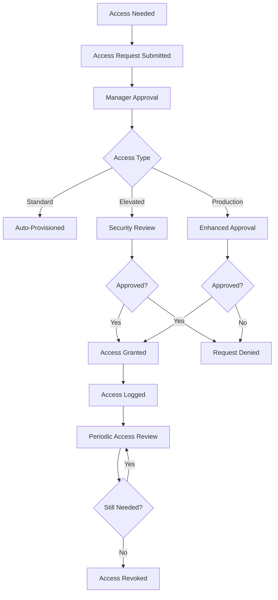

### 9.2 Access Levels

| Level | Description | Approval Required | Review Frequency |
|-------|------------|------------------|-----------------|
| **Read-Only** | View data, no modifications | Manager | Quarterly |
| **Standard User** | Normal operations | Manager | Quarterly |
| **Elevated** | Administrative functions | Manager + Security | Monthly |
| **Production** | Production system access | Manager + Director + Security | Monthly |
| **Root/Admin** | Full system control | Director + CISO + Change Request | Weekly |

### 9.3 Just-In-Time Access

For sensitive access, banks use just-in-time (JIT) access:
- Request access when needed (not standing access)
- Approved for specific time window
- Access automatically revoked after window
- All actions logged and reviewed

---

## 10. The Vendor Assessment Workflow

### 10.1 When You Need External Technology

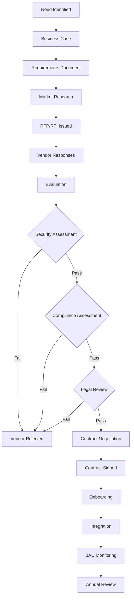

### 10.3 Assessment Areas

| Area | Questions |
|------|----------|
| **Security** | How is data protected? What certifications do they have? |
| **Compliance** | Do they meet regulatory requirements? Where is data hosted? |
| **Resilience** | What is their uptime? Do they have DR/BCP? |
| **Financial Stability** | Will they be around in 5 years? |
| **Data Processing** | Do they process our data? Where? How? |
| **Subprocessors** | Do they use third parties? Are they assessed? |
| **Exit** | How do we get our data back if we leave? |

---

## 11. The Model Deployment Workflow

### 11.1 For ML/AI Models

```mermaid
graph TD
    A[Model Developed] --> B[Documentation Complete]
    B --> C[Internal Testing]
    C --> D[Model Validation (Independent)]
    D --> E{Validation Passed?}
    E -->|No| F[Remediate Model]
    F --> C
    E -->|Yes| G[Model Risk Committee Review]
    G --> H{Approved?}
    H -->|No| F
    H -->|Yes| I[Compliance Review]
    I --> J{Compliance Approved?}
    J -->|No| F
    J -->|Yes| K[Security Review]
    K --> L[Deployment to Staging]
    L --> M[Shadow/Parallel Run]
    M --> N{Performance Acceptable?}
    N -->|No| F
    N -->|Yes| O[Production Deployment]
    O --> P[Ongoing Monitoring]
    P --> Q{Model Drift?}
    Q -->|Yes| R[Model Retraining]
    Q -->|No| P
    R --> C
```

### 11.2 Model Validation

| Check | Description |
|-------|------------|
| **Conceptual Soundness** | Is the model theoretically appropriate? |
| **Data Quality** | Is training data adequate and representative? |
| **Performance Testing** | Does the model perform as claimed? |
| **Stress Testing** | How does the model perform under stress scenarios? |
| **Bias Testing** | Does the model produce biased outcomes? |
| **Explainability** | Can model outputs be explained? |
| **Documentation** | Is the model fully documented? |

---

## 12. The Audit Response Workflow

### 12.1 When Audit Comes Calling

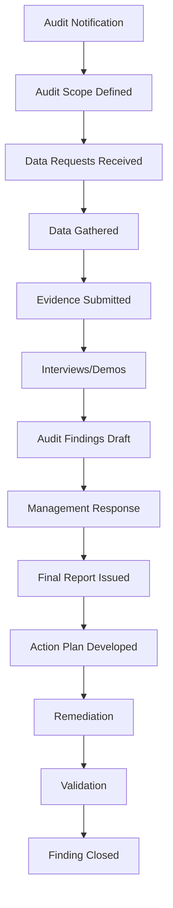

### 12.2 What Auditors Want

| Request | Typical Response Time |
|---------|---------------------|
| **System documentation** | 1-3 days |
| **Access logs** | 1-5 days |
| **Change records** | 1-3 days |
| **Configuration screenshots** | 1-3 days |
| **Sample transactions** | 3-10 days |
| **Staff interviews** | Scheduled during audit |
| **System demonstrations** | Scheduled during audit |

---

## 13. The Customer Escalation Workflow

### 13.1 When Things Affect Customers

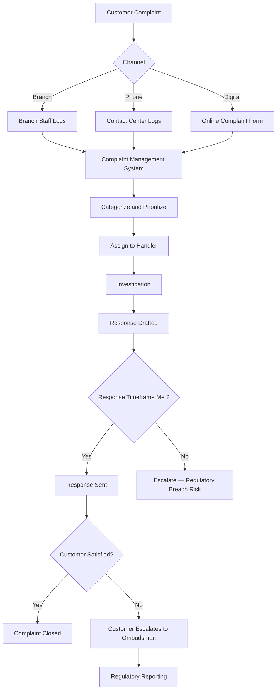

### 13.4 Engineering Involvement

Engineers get involved when:
- The complaint relates to a system error
- Data is needed to investigate
- A fix is required
- Multiple customers are affected (potential incident)

---

## 14. The Business Continuity Workflow

### 14.1 When Disaster Strikes

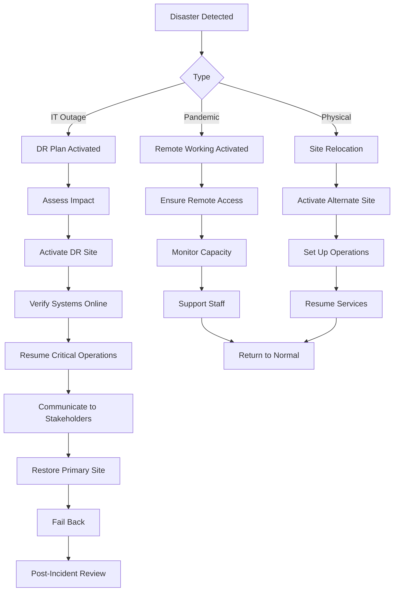

### 14.2 Business Continuity Testing

| Test Type | Frequency | Description |
|-----------|----------|------------|
| **Desktop Walkthrough** | Quarterly | Team reviews DR plan |
| **Technical Failover** | Semi-annually | Systems failed over to DR |
| **Full Simulation** | Annually | End-to-end DR exercise |
| **Regulatory Test** | As required | Regulator-mandated testing |

---

## 15. The GenAI-Specific Workflows

### 15.1 GenAI System Deployment

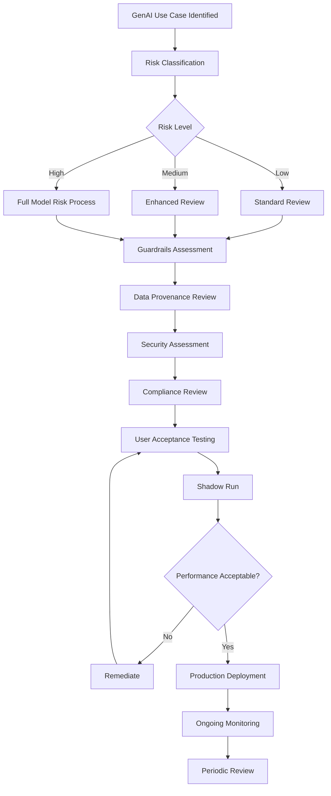

### 15.2 GenAI Incident Response

| Event | Response |
|-------|----------|
| **Hallucination detected** | Log incident, review guardrails, update prompts |
| **Data leakage suspected** | Immediate containment, investigate scope, notify security |
| **Prompt injection detected** | Block source, review guardrails, update detection rules |
| **Bias discovered** | Log incident, assess scope, retrain/adjust, notify compliance |
| **Quality degradation** | Investigate model drift, retrain or adjust, notify stakeholders |

### 15.3 GenAI Periodic Review

| Review Item | Frequency | Owner |
|------------|----------|-------|
| **Model Performance** | Monthly | ML Engineering |
| **Guardrail Effectiveness** | Monthly | Security |
| **Output Quality Sampling** | Weekly | Product Team |
| **Prompt Inventory** | Quarterly | ML Engineering |
| **Access Review** | Quarterly | Security |
| **Compliance Attestation** | Annually | Compliance |
| **Model Validation** | Annually | Model Risk |

---

## 16. Common Systems and Technology

| System Category | Examples |
|----------------|----------|
| **Change Management** | ServiceNow, Jira Service Management, BMC Remedy |
| **Incident Management** | PagerDuty, ServiceNow, VictorOps, xMatters |
| **Compliance Management** | MetricStream, ServiceNow GRC, Archer |
| **Audit Management** | TeamMate, AuditBoard, ServiceNow |
| **Access Management** | SailPoint, Okta, Azure AD, CyberArk |
| **Batch Processing** | Control-M, Autosys, Airflow, custom schedulers |
| **Complaint Management** | Salesforce, ServiceNow, custom platforms |
| **Model Risk Management** | ModelRisk, custom MRM platforms |

---

## 17. Engineering Implications

### 17.1 What This Means for You

1. **Everything takes longer than you think.** Not because of inefficiency, but because of necessary controls.
2. **Documentation is part of the deliverable.** Not optional — required.
3. **Approvals are sequential, not parallel.** Step B cannot start until Step A is approved.
4. **Relationships matter.** Knowing the people in compliance, security, and operations makes everything smoother.
5. **Automation is your friend.** The more you can automate (testing, evidence gathering, monitoring), the faster you move.
6. **Learn the vocabulary.** Understanding banking and compliance terminology helps you communicate effectively.

### 17.2 Time Estimation Guide

| Activity | Typical Duration | Notes |
|----------|-----------------|-------|
| **Simple code change** | 1-2 days development + 1-2 days review/deploy | Standard changes |
| **New feature** | 2-4 weeks development + 2-4 weeks reviews/testing | Depends on complexity |
| **Compliance review** | 4-8 weeks | Queue + review + remediation |
| **Security review** | 2-4 weeks | Queue + assessment + remediation |
| **Architecture review** | 1-2 weeks | Design iteration |
| **UAT** | 2-4 weeks | Business user availability |
| **Model validation** | 4-12 weeks | Depends on model complexity |
| **Vendor onboarding** | 8-16 weeks | Security + compliance + legal |
| **Audit response** | 4-12 weeks | Depends on scope |
| **Regulatory implementation** | 3-12 months | Depends on regulation complexity |

### 17.3 The Golden Rules

1. **Engage compliance and security early.** Early engagement = faster overall process.
2. **Document as you go.** Not at the end.
3. **Automate evidence collection.** Make compliance evidence a byproduct of development, not a separate activity.
4. **Build relationships.** The people reviewing your work are humans — treat them well.
5. **Learn from incidents.** Every incident is a learning opportunity, not a blame session.
6. **Understand the business impact.** Your code affects real people and real money.

---

## 18. Interview Questions

### Foundational

1. **Walk through what happens when you need to deploy a change to production at a bank. Why does it take longer than at a startup?**
2. **What is the difference between a standard, normal, and emergency change?**
3. **What is a post-incident review and why is it important?**
4. **What happens during end-of-day batch processing and why does it matter?**

### Technical

5. **You need to deploy a critical bug fix during a change freeze period. What is your approach?**
6. **How would you design an automated evidence collection system for compliance reviews?**
7. **A batch processing job that normally completes in 2 hours has been running for 6 hours. Walk through your investigation.**
8. **How would you design a system that provides real-time data for regulatory reporting instead of batch reporting?**

### GenAI-Specific

9. **You want to deploy a GenAI assistant for internal use. What workflows does it need to go through that a traditional system doesn't?**
10. **A GenAI system starts producing hallucinated responses. What is your incident response process?**
11. **How would you design a periodic review process for a production GenAI system?**

### Scenario-Based

12. **A P1 incident has been ongoing for 3 hours. The incident commander is asking you for help. The system is a payment processing service. What do you do?**
13. **You discover that a change deployed 2 weeks ago has been causing a slow data leak that only just became visible. What is your response?**
14. **Compliance has rejected your system design and asked for significant changes. The business wants to launch in 4 weeks. How do you handle this?**

---

## Further Reading

- [Banking 101](./banking-101.md) — How banks work
- [Compliance Teams](./compliance-teams-and-how-they-work.md) — How compliance reviews engineering work
- [Incident Management](../incident-management/) — Incident response and learning
- [Engineering Philosophy](../engineering-philosophy/) — Mindset and craft
- [Leadership and Collaboration](../leadership-and-collaboration/) — Influence and communication
