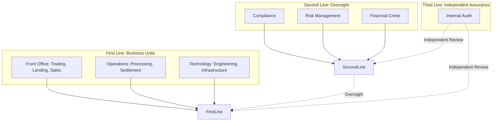
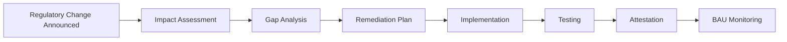
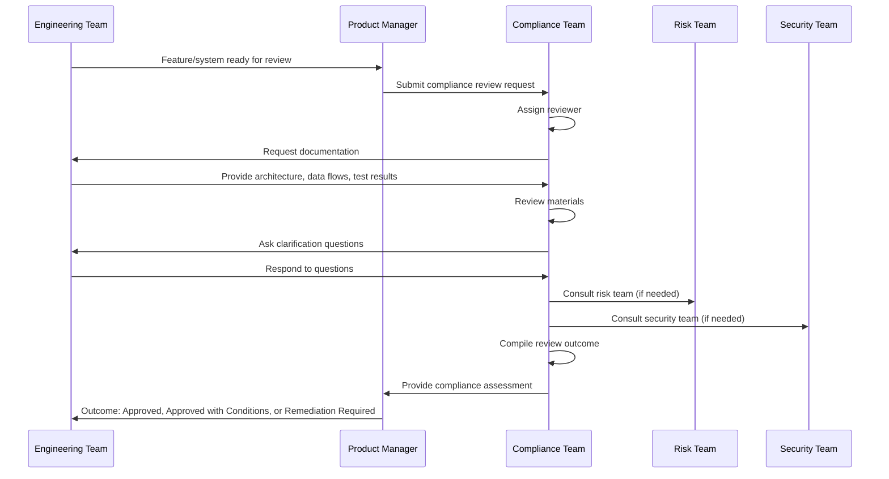
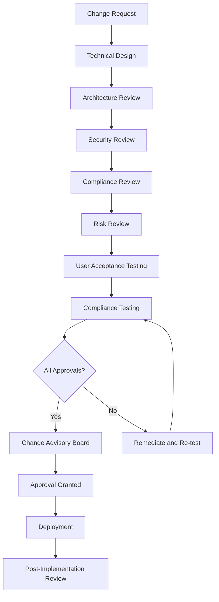
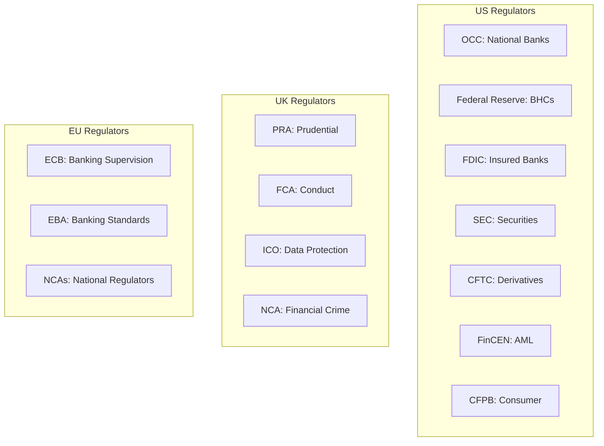
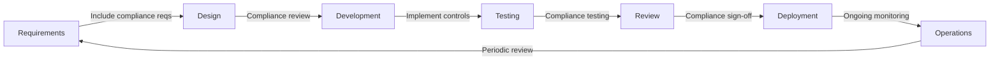

# Compliance Teams and How They Work: Organization, Reviews, and Engineering Interactions

> **Audience:** Engineers who need to understand how compliance teams operate and how they review engineering work.
> **Prerequisites:** [Banking 101](./banking-101.md), [AML and Fraud](./aml-and-fraud.md), [KYC and Onboarding](./kyc-and-onboarding.md)
> **Cross-references:** [AML and Fraud](./aml-and-fraud.md), [KYC and Onboarding](./kyc-and-onboarding.md), [Regulations and Compliance](../regulations-and-compliance/)

---

## Table of Contents

1. [What Is Compliance?](#1-what-is-compliance)
2. [Why Compliance Is Not the Enemy](#2-why-compliance-is-not-the-enemy)
3. [Compliance Organization Structure](#3-compliance-organization-structure)
4. [Key Compliance Functions](#4-key-compliance-functions)
5. [How Compliance Reviews Engineering Work](#5-how-compliance-reviews-engineering-work)
6. [The Change Approval Process](#6-the-change-approval-process)
7. [Compliance Requirements for Systems](#7-compliance-requirements-for-systems)
8. [Audit and Examination](#8-audit-and-examination)
9. [Regulatory Relationships](#9-regulatory-relationships)
10. [GenAI and Compliance](#10-genai-and-compliance)
11. [Risks of AI in Compliance](#11-risks-of-ai-in-compliance)
12. [How to Work Effectively with Compliance](#12-how-to-work-effectively-with-compliance)
13. [Common Systems and Technology](#13-common-systems-and-technology)
14. [Engineering Implications](#14-engineering-implications)
15. [Common Workflows](#15-common-workflows)
16. [Interview Questions](#16-interview-questions)

---

## 1. What Is Compliance?

Compliance is the function that ensures the bank **operates within the laws, regulations, and rules** that apply to it. It acts as the bridge between the regulatory landscape and the bank's operations.

### 1.1 The Three Lines of Defense



### 1.2 Key Principle

**Compliance is the second line of defense.** The first line (engineering teams, product owners, business units) owns the risk. Compliance provides oversight, guidance, and challenge. Internal Audit provides independent assurance that both lines are working.

---

## 2. Why Compliance Is Not the Enemy

### 2.1 The Engineer's Perspective

> "Compliance just slows everything down. They say no to everything. They don't understand technology."

This is a common but unproductive view. Here's the reality:

### 2.2 The Compliance Perspective

Compliance teams are:
- **Legally accountable.** Regulators hold compliance officers personally responsible for failures.
- **Under-resourced.** They typically have fewer people than engineering but oversee everything.
- **Risk-focused.** Their job is to ask "what could go wrong?" not "how fast can we ship?"
- **Your ally.** Good compliance teams want to enable the business safely. They say "yes, if" not "no."

### 2.3 What Happens Without Compliance

| Scenario | Consequence |
|----------|------------|
| **Unreviewed system goes live** | May violate data protection, accessibility, or security regulations |
| **AI system deployed without review** | May produce biased outcomes, hallucinate, or leak data |
| **Data flow not mapped** | May transfer data to jurisdictions where it's not permitted |
| **Access controls not reviewed** | May allow unauthorized access to regulated data |

### 2.4 The Real Cost of Compliance Failures

| Bank | Failure | Cost |
|------|---------|------|
| Wells Fargo | Fake accounts scandal | $3B+ in fines |
| Goldman Sachs | 1MDB scandal | $5B+ in fines |
| Facebook (Meta) | GDPR violations | $1.3B fine |
| Various banks | LIBOR manipulation | $9B+ in combined fines |

---

## 3. Compliance Organization Structure

### 3.1 Typical Compliance Structure

```
Board of Directors
└── Board Compliance Committee
    └── Chief Compliance Officer (CCO)
        ├── Head of Regulatory Compliance
        │   ├── Banking Regulations Team
        │   ├── Markets Compliance Team
        │   └── Consumer Compliance Team
        ├── Head of AML/Financial Crime
        │   ├── Transaction Monitoring
        │   ├── Sanctions
        │   └── KYC/CDD
        ├── Head of Compliance Testing
        │   ├── Testing Program
        │   └── Issue Management
        ├── Head of Compliance Advisory
        │   ├── Product Advisory
        │   ├── Technology Advisory
        │   └── Regulatory Change
        ├── Head of Compliance Training
        │   ├── Training Programs
        │   └── Culture and Awareness
        └── Head of Compliance MI and Reporting
            ├── Regulatory Reporting
            └── Management Information
```

### 3.2 Compliance Roles Relevant to Engineering

| Role | Interaction with Engineering |
|------|----------------------------|
| **Technology Compliance Advisor** | Reviews new systems, data flows, AI/ML models |
| **Product Compliance Advisor** | Reviews new products and features |
| **Compliance Tester** | Tests compliance controls in systems |
| **Regulatory Change Manager** | Tracks regulatory changes affecting systems |
| **Issue Manager** | Tracks and escalates compliance issues |
| **MLRO (Money Laundering Reporting Officer)** | Receives SARs, liaises with law enforcement |

---

## 4. Key Compliance Functions

### 4.1 Regulatory Compliance

Ensures the bank complies with all applicable banking regulations:

| Area | Regulations | Engineering Impact |
|------|------------|-------------------|
| **Consumer Protection** | Consumer Duty, UDAAP, TILA | Product design, disclosures, fairness |
| **Markets** | MiFID II, MAR, Dodd-Frank | Trading systems, reporting, surveillance |
| **Prudential** | Basel III, CCAR | Capital, liquidity, stress testing systems |
| **Data Protection** | GDPR, CCPA | Data handling, consent, deletion |
| **Operational Resilience** | DORA, PRA SS1/21 | System availability, testing |

### 4.2 Financial Crime Compliance

Covered in detail in [AML and Fraud](./aml-and-fraud.md) and [KYC and Onboarding](./kyc-and-onboarding.md).

### 4.3 Compliance Testing

Proactive testing of compliance controls:

| Test Type | Description |
|-----------|------------|
| **Control Testing** | Do compliance controls work as designed? |
| **Transaction Testing** | Sample transactions for compliance |
| **System Testing** | Do systems enforce compliance rules? |
| **Thematic Reviews** | Deep-dive into specific areas across the bank |

### 4.4 Regulatory Change Management

Tracking and implementing regulatory changes:



---

## 5. How Compliance Reviews Engineering Work

### 5.1 When Compliance Gets Involved

Compliance reviews are triggered by:

| Trigger | Example |
|---------|---------|
| **New System** | Building a new GenAI assistant |
| **Major Change** | Adding customer-facing AI features |
| **New Product** | Launching a new lending product |
| **Regulatory Change** | New regulation affects existing systems |
| **Incident** | Compliance failure discovered |
| **Periodic Review** | Scheduled review of existing systems |
| **Audit Finding** | Internal audit identifies compliance gap |

### 5.2 What Compliance Looks For

| Area | Questions Compliance Asks |
|------|--------------------------|
| **Data Handling** | What data does the system process? Where does it go? Is it protected? |
| **Customer Impact** | How does this affect customers? Is it fair? Are disclosures adequate? |
| **Regulatory Alignment** | Which regulations apply? How does the system ensure compliance? |
| **Access Control** | Who can access what? Is access logged and monitored? |
| **Audit Trail** | Can we reconstruct what happened and why? |
| **Error Handling** | What happens when something goes wrong? Are errors logged? |
| **Testing** | How was compliance tested? What were the results? |
| **Escalation** | How are compliance issues escalated? |
| **Record Keeping** | Are records retained per regulatory requirements? |

### 5.3 The Compliance Review Process



### 5.4 Review Outcomes

| Outcome | Meaning |
|---------|---------|
| **Approved** | No compliance concerns. Proceed to deployment. |
| **Approved with Conditions** | Proceed, but implement specific controls by a defined date. |
| **Remediation Required** | Cannot proceed until specified issues are resolved. |
| **Escalated** | Requires senior compliance or regulatory sign-off. |

---

## 6. The Change Approval Process

### 6.1 How Changes Get Approved



### 6.2 Compliance Evidence Package

For each change, engineering must provide:

| Document | Description |
|----------|------------|
| **System Description** | What the system does, who uses it |
| **Data Flow Diagram** | How data enters, flows through, and exits the system |
| **Data Classification** | What types of data are processed (PII, financial, etc.) |
| **Access Control Design** | Who can access what, how access is granted/revoked |
| **Audit Trail Design** | What is logged, how long it is retained |
| **Compliance Test Results** | Evidence that compliance controls work |
| **Regulatory Mapping** | Which regulations apply and how they are addressed |
| **Error Handling** | How errors are handled, logged, and escalated |
| **Incident Response** | How compliance incidents are managed |
| **User Training** | How users are trained on compliance aspects |

---

## 7. Compliance Requirements for Systems

### 7.1 Universal Requirements

Every regulated system must have:

| Requirement | Description |
|------------|------------|
| **Access Controls** | Role-based access, least privilege, regular access reviews |
| **Audit Logging** | All actions logged with timestamp, user, action, outcome |
| **Data Protection** | Encryption at rest and in transit, data minimization |
| **Error Handling** | Graceful failures, error logging, user-friendly messages |
| **Change Management** | Version control, testing, approval, rollback |
| **Business Continuity** | Disaster recovery, backup, failover |
| **Vendor Management** | Third-party risk assessment for external services |
| **Training** | Users trained on compliance aspects of the system |

### 7.2 AI-Specific Requirements

| Requirement | Description |
|------------|------------|
| **Model Inventory** | All AI models registered with model risk management |
| **Model Validation** | Independent validation before production use |
| **Output Monitoring** | AI outputs monitored for quality and compliance |
| **Human Oversight** | Human review for high-stakes AI decisions |
| **Explainability** | AI decisions can be explained to regulators |
| **Bias Testing** | Regular testing for discriminatory outcomes |
| **Data Provenance** | Training data sources documented and approved |

### 7.3 Data-Specific Requirements

| Requirement | Description |
|------------|------------|
| **Data Classification** | All data classified (public, internal, confidential, restricted) |
| **Data Lineage** | Source, transformation, and destination of all data documented |
| **Data Retention** | Retention periods defined per regulatory requirements |
| **Data Deletion** | Secure deletion per GDPR and other requirements |
| **Cross-Border Transfer** | Data transfer restrictions documented and enforced |
| **Consent Management** | Customer consent captured and tracked where required |

---

## 8. Audit and Examination

### 8.1 Internal Audit

Internal Audit independently reviews the bank's controls:

| Aspect | Description |
|--------|------------|
| **Frequency** | Risk-based, typically every 1-3 years per area |
| **Scope** | Defined per audit engagement |
| **Output** | Audit findings (rated by severity) |
| **Follow-up** | Management action plans tracked to completion |

### 8.2 Regulatory Examination

Regulators examine the bank periodically:

| Regulator | Jurisdiction | Focus |
|-----------|-------------|-------|
| **OCC/Fed/FDIC** | US | Safety and soundness, consumer compliance |
| **PRA/FCA** | UK | Prudential regulation, conduct |
| **ECB** | EU | Banking supervision |
| **MAS** | Singapore | Prudential and conduct |
| **FINMA** | Switzerland | Banking supervision |

### 8.3 What Examiners Ask For

| Request | Engineering Impact |
|---------|-------------------|
| **System documentation** | Architecture diagrams, data flows, access controls |
| **Change logs** | Evidence of controlled change management |
| **Test results** | Evidence of testing (functional, security, compliance) |
| **Incident logs** | Record of incidents and remediation |
| **Access logs** | Who accessed what and when |
| **Training records** | Evidence of staff training |
| **Compliance attestations** | Sign-offs from compliance and risk |
| **Sample transactions** | Ability to trace specific transactions through the system |

### 8.4 Audit Findings

| Severity | Description | Timeline |
|----------|------------|----------|
| **Critical** | Immediate risk of harm or regulatory breach | Fix within 30 days |
| **High** | Significant control weakness | Fix within 90 days |
| **Medium** | Control improvement needed | Fix within 6 months |
| **Low** | Minor enhancement recommended | Fix within 12 months |

---

## 9. Regulatory Relationships

### 9.1 Key Regulators by Area



### 9.2 How Compliance Manages Regulatory Relationships

| Activity | Description |
|----------|------------|
| **Regulatory Reporting** | Regular submissions to regulators |
| **Examination Management** | Coordinating regulator requests and visits |
| **Supervisory Engagement** | Proactive communication with regulators |
| **Remediation Tracking** | Tracking regulatory findings to completion |
| **Regulatory Intelligence** | Monitoring regulatory developments |

---

## 10. GenAI and Compliance

### 10.1 How Compliance Views GenAI

Compliance teams approach GenAI with **cautious interest**:

| Perspective | View |
|------------|------|
| **Opportunity** | AI can automate compliance testing, monitoring, and reporting |
| **Risk** | AI introduces new compliance risks (bias, hallucination, data leakage) |
| **Regulatory Uncertainty** | AI regulations are evolving, creating uncertainty |
| **Evidence Requirement** | Compliance needs to see evidence that AI systems are controlled |

### 10.2 What Compliance Wants from AI Systems

| Requirement | Description |
|------------|------------|
| **Model Registration** | Every AI model registered in the model inventory |
| **Risk Assessment** | AI risk classification (low, medium, high) |
| **Validation** | Independent model validation completed |
| **Guardrails** | Input/output controls documented and tested |
| **Human Oversight** | Clear process for human review and override |
| **Audit Trail** | Every AI interaction logged |
| **Training** | Users trained on AI system limitations |
| **Incident Response** | AI failure modes identified and response planned |

### 10.3 AI in Compliance Functions

| Compliance Function | AI Use Case |
|--------------------|------------|
| **Regulatory Change** | AI monitoring and summarizing regulatory developments |
| **Compliance Testing** | AI identifying control gaps, suggesting test scenarios |
| **Transaction Monitoring** | AI enhancing detection (alongside deterministic rules) |
| **Policy Management** | AI keeping policies current with regulatory changes |
| **Training** | AI generating training content, personalized learning |
| **Reporting** | AI drafting regulatory reports and management information |
| **Advisory** | AI answering compliance questions from staff |

---

## 11. Risks of AI in Compliance

### 11.1 Over-reliance Risk

| Risk | Scenario | Impact |
|------|----------|--------|
| **Automated Compliance** | AI makes compliance decisions without human review | Undetected compliance failures |
| **Missed Nuance** | AI misses regulatory nuance that a human would catch | Incorrect compliance assessment |
| **Regulatory Change Gap** | AI not updated with new regulations | Outdated compliance advice |

### 11.2 Regulatory Acceptance Risk

| Risk | Scenario | Impact |
|------|----------|--------|
| **Model Rejection** | Regulator does not accept AI-based compliance approach | Remediation required, reputational damage |
| **Explainability Gap** | Cannot explain how AI reached a compliance conclusion | Regulatory criticism |
| **Documentation Gap** | AI-based compliance processes not adequately documented | Audit finding |

### 11.3 Mitigation Strategies

- **Start with assistive AI.** AI supports human compliance professionals, never replaces them.
- **Maintain deterministic controls.** Core compliance rules remain rule-based.
- **Document everything.** AI processes documented to the same standard as manual processes.
- **Engage regulators early.** Discuss AI compliance approaches with regulators before deployment.
- **Regular validation.** AI compliance outputs validated against manual assessments.

---

## 12. How to Work Effectively with Compliance

### 12.1 Do

| Action | Why |
|--------|-----|
| **Engage early** | Bring compliance in at design time, not after the system is built |
| **Explain in plain English** | Avoid technical jargon; use diagrams and examples |
| **Show, don't just tell** | Demo the system, don't just describe it |
| **Ask what they need** | "What evidence would help you feel comfortable with this?" |
| **Provide context** | Explain the business value and risk mitigation |
| **Document everything** | Compliance needs written evidence, not verbal assurances |
| **Be proactive about risks** | "Here are the risks we identified and how we mitigated them" |

### 12.2 Don't

| Action | Why |
|--------|-----|
| **Surprise them** | Don't deploy something and tell compliance afterward |
| **Dismiss their concerns** | Their concerns are based on regulatory obligations, not opinions |
| **Assume they understand the technology** | Explain technical concepts clearly |
| **Minimize compliance effort** | Compliance reviews take time for a reason |
| **Treat compliance as a checkbox** | Compliance is an ongoing partnership |

### 12.3 The Ideal Engineering-Compliance Relationship

```
Engineering: "We're building X. Here's what it does and the data it handles.
              We've identified these regulatory implications.
              Can we review the design together before we build it?"

Compliance: "Great that you engaged us early. Here are the regulations that apply.
             Here's what we need to see to be comfortable.
             Let's work together to make this compliant."
```

---

## 13. Common Systems and Technology

| System Category | Examples |
|----------------|----------|
| **Compliance Management** | MetricStream, SAP GRC, ServiceNow GRC |
| **Regulatory Change** | Thomson Reuters Regulatory Intelligence, Wolters Kluwer |
| **Policy Management** | PolicyTech, Convercent, Navex |
| **Training Management** | SumTotal, Cornerstone, custom LMS |
| **Issue Management** | ServiceNow, Archer, custom issue trackers |
| **Audit Management** | TeamMate, AuditBoard, custom audit platforms |
| **Regulatory Reporting** | AxiomSL, Wolters Kluwer CCH, custom reporting |

---

## 14. Engineering Implications

### 14.1 What This Means for You

1. **Compliance is part of your requirements.** Not an afterthought — a first-class requirement.
2. **Documentation is engineering work.** Architecture diagrams, data flow diagrams, and compliance evidence are part of the deliverable.
3. **Compliance testing is testing.** Not "extra" testing — essential testing.
4. **Audit requests are mandatory.** You must be able to provide evidence to auditors and regulators.
5. **Regulatory deadlines are non-negotiable.** If a regulation has an effective date, the system must be compliant by that date.

### 14.2 Building Compliance Into Your SDLC



### 14.3 Compliance Evidence Checklist

For every system, be ready to provide:

- [ ] System architecture diagram
- [ ] Data flow diagram with data classifications
- [ ] Access control matrix
- [ ] Audit logging specification
- [ ] Error handling procedure
- [ ] Incident response plan
- [ ] Compliance test results
- [ ] Regulatory mapping document
- [ ] User training materials
- [ ] Change management records
- [ ] Third-party risk assessments (if applicable)
- [ ] Model validation reports (for AI systems)

---

## 15. Common Workflows

### 15.1 New System Compliance Review

```
1. Engineering team designs new system
2. Product manager submits compliance review request
3. Compliance assigns reviewer
4. Compliance requests documentation package
5. Engineering provides documentation
6. Compliance reviews and asks questions
7. Engineering responds and provides additional evidence
8. Compliance may escalate to specialist teams (data protection, financial crime)
9. Compliance compiles assessment
10. Outcome communicated: Approved / Approved with Conditions / Remediation Required
11. If remediation required: engineering addresses issues, re-submits
12. Compliance sign-off recorded
```

### 15.2 Regulatory Examination Preparation

```
1. Regulator announces examination
2. Compliance team notifies affected business areas
3. Engineering teams gather requested documentation
4. Systems demonstrated to examiners if requested
5. Sample transactions traced through systems
6. Compliance evidence presented
7. Examiner findings discussed with engineering
8. Remediation plans developed for any findings
9. Remediation tracked to completion
10. Evidence of remediation provided to regulator
```

### 15.3 Compliance Incident Response

```
1. Compliance failure detected (monitoring, audit, or incident report)
2. Incident logged and triaged
3. Compliance team assesses severity
4. If significant: regulatory notification initiated
5. Root cause investigation begins
6. Engineering identifies technical root cause
7. Remediation plan developed
8. Remediation implemented and tested
9. Compliance verifies remediation effectiveness
10. Incident closed with lessons learned
11. Process improvements implemented to prevent recurrence
```

---

## 16. Interview Questions

### Foundational

1. **What are the three lines of defense in a bank? Where does engineering sit?**
2. **What is the difference between compliance and internal audit?**
3. **Why do compliance teams review engineering work? What are they looking for?**
4. **What is the difference between a compliance finding and an audit finding?**

### Technical

5. **You are building a new internal GenAI assistant. What compliance documentation would you prepare and what teams would you engage?**
6. **How would you design audit logging for a system that processes regulated financial transactions?**
7. **A regulator asks to see how a specific customer's data flows through your system. How do you respond?**
8. **How do you ensure that a system remains compliant after it is deployed, not just at launch?**

### GenAI-Specific

9. **Compliance is concerned about an AI system you've built. How do you address their concerns and what evidence do you provide?**
10. **How would you design an AI system so that its decisions can be explained to a regulator who has no technical background?**
11. **What compliance risks are unique to GenAI systems that don't exist in traditional software?**

### Scenario-Based

12. **You discover that a system has been processing data in a way that violates GDPR for the past 6 months. Walk through your response.**
13. **A compliance reviewer asks you to delay a launch by 4 weeks to complete their review. The business says this is unacceptable. How do you handle this?**
14. **A regulator identifies a compliance gap in your system during an examination. The gap was not flagged by your compliance team. What happens next?**

---

## Further Reading

- [AML and Fraud](./aml-and-fraud.md) — Financial crime compliance
- [KYC and Onboarding](./kyc-and-onboarding.md) — Customer due diligence
- [Regulations and Compliance](../regulations-and-compliance/) — Detailed regulatory guides
- [Engineering Philosophy](../engineering-philosophy/) — Mindset and craft
- [Security](../security/) — Security engineering
