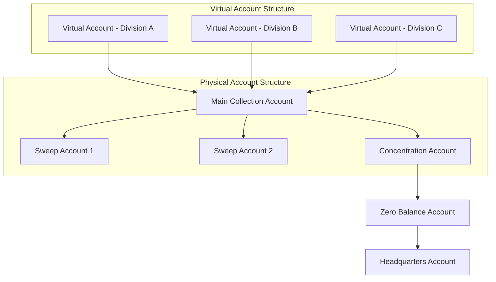
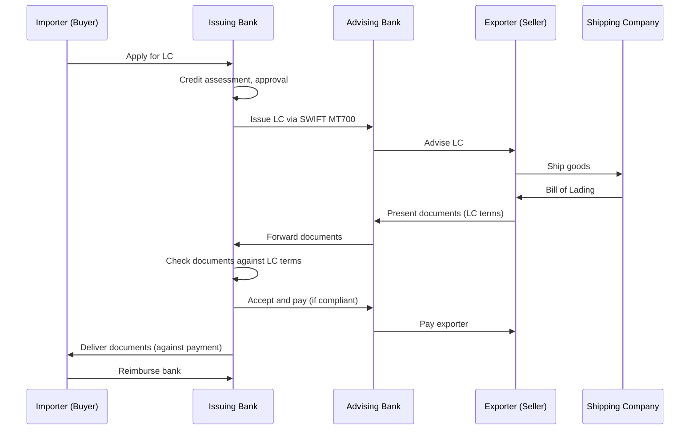
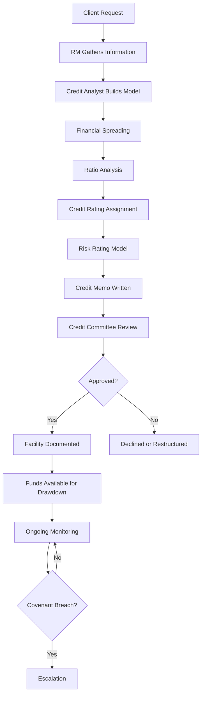
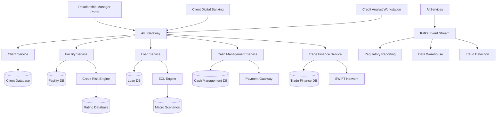
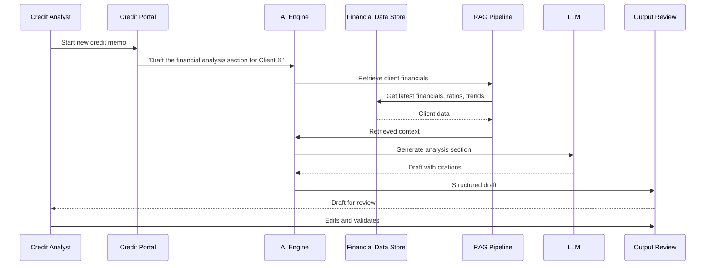

# Corporate Banking: Commercial Lending, Cash Management, and Trade Finance

> **Audience:** Engineers building systems for corporate and commercial banking.
> **Prerequisites:** [Banking 101](./banking-101.md), [Lending](./lending.md)
> **Cross-references:** [Treasury and Risk](./treasury-and-risk.md), [Payments](./payments.md), [AML and Fraud](./aml-and-fraud.md)

---

## Table of Contents

1. [What Is Corporate Banking?](#1-what-is-corporate-banking)
2. [Corporate Banking Products](#2-corporate-banking-products)
3. [Commercial Lending](#3-commercial-lending)
4. [Cash Management](#4-cash-management)
5. [Trade Finance](#5-trade-finance)
6. [Treasury Services](#6-treasury-services)
7. [The Corporate Banking Client](#7-the-corporate-banking-client)
8. [Credit Analysis in Corporate Banking](#8-credit-analysis-in-corporate-banking)
9. [Corporate Banking Systems Architecture](#9-corporate-banking-systems-architecture)
10. [GenAI in Corporate Banking](#10-genai-in-corporate-banking)
11. [Risks of AI in Corporate Banking](#11-risks-of-ai-in-corporate-banking)
12. [Key Regulations](#12-key-regulations)
13. [Common Systems and Technology](#13-common-systems-and-technology)
14. [Engineering Implications](#14-engineering-implications)
15. [Common Workflows](#15-common-workflows)
16. [Interview Questions](#16-interview-questions)

---

## 1. What Is Corporate Banking?

Corporate banking serves **businesses** — from small and medium enterprises (SMEs) to large multinational corporations — with banking products tailored to their operational and strategic needs.

**Corporate banking vs. retail banking:**

| Aspect | Retail Banking | Corporate Banking |
|--------|---------------|-------------------|
| **Customer** | Individual consumers | Businesses |
| **Products** | Standardized | Customized |
| **Deal Size** | Small ($1K-$1M) | Large ($1M-$10B+) |
| **Volume** | High (millions of customers) | Lower (thousands of clients) |
| **Relationship** | Transactional | Relationship-managed |
| **Decisioning** | Automated/algorithmic | Relationship manager + credit committee |
| **Risk Assessment** | Credit score-based | Deep financial analysis |
| **Pricing** | Standard rates | Negotiated per client |

**Corporate banking vs. investment banking:**

| Aspect | Corporate Banking | Investment Banking |
|--------|------------------|-------------------|
| **Focus** | Lending and cash management | Capital markets and advisory |
| **Revenue** | Interest income, fees | Advisory fees, trading revenue |
| **Balance Sheet** | Uses bank's balance sheet (lending) | May or may not use balance sheet |
| **Relationship** | Long-term, ongoing | Deal-by-deal |

**Client segments:**

| Segment | Revenue Definition | Typical Needs |
|---------|-------------------|--------------|
| **Small Business Banking** | Revenue < $1M | Simple loans, deposits, payments |
| **Middle Market** | Revenue $1M-$500M | Working capital facilities, cash management |
| **Large Corporate** | Revenue $500M-$5B | Syndicated loans, trade finance, treasury |
| **Multinational** | Revenue $5B+ | Global facilities, multi-currency, cross-border |

---

## 2. Corporate Banking Products

```mermaid
graph TD
    CB[Corporate Banking Products] --> L[Lending]
    CB --> CM[Cash Management]
    CB --> TF[Trade Finance]
    CB --> TS[Treasury Services]
    CB --> FX[FX Services]
    
    L --> TL[Term Loans]
    L --> RC[Revolving Credit Facilities]
    L --> OL[Overdrafts]
    L --> BL[Bilateral Loans]
    L --> SL[Syndicated Loans]
    L --> FB[Invoice Financing]
    
    CM --> CA[Collection Accounts]
    CM --> DA[Disbursement]
    CM --> PO[Payroll Services]
    CM --> VS[Virtual Accounts]
    CM --> RP[Receivables Processing]
    
    TF --> LC[Letters of Credit]
    TF --> BG[Bank Guarantees]
    TF --> DF[Documentary Collections]
    TF --> FF[Forfaiting]
    
    TS --> LM[Liquidity Management]
    TS --> NP[Notional Pooling]
    TS --> ZB[Zero Balancing]
    TS --> RP2[Reporting & Analytics]
    
    FX --> ST[Spot FX]
    FX --> FW[Forward Contracts]
    FX --> OPT[FX Options]
```



---

## 3. Commercial Lending

### 3.1 Types of Corporate Loans

| Facility Type | Description | Typical Use |
|--------------|------------|-------------|
| **Term Loan** | Fixed amount, fixed repayment schedule | Capital expenditure, acquisition finance |
| **Revolving Credit Facility (RCF)** | Borrow, repay, reborrow up to a limit | Working capital, liquidity buffer |
| **Overdraft** | Short-term borrowing on current account | Day-to-day cash flow management |
| **Bridge Loan** | Short-term financing until permanent arrangement | Acquisition bridge, refinancing |
| **Syndicated Loan** | Large loan shared among multiple banks | Major acquisitions, project finance |
| **Bilateral Loan** | Loan between one bank and one borrower | Smaller facilities |

### 3.2 Loan Structure

A corporate loan facility has many more parameters than a retail loan:

| Parameter | Description |
|-----------|------------|
| **Commitment Amount** | Total facility available |
| **Drawdown** | When and how the borrower accesses funds |
| **Tenor** | Duration of the facility (1-10 years typical) |
| **Pricing** | Base rate + margin (spread), often tied to credit rating |
| **Covenants** | Conditions the borrower must maintain |
| **Security/Collateral** | Assets securing the loan |
| **Repayment Schedule** | Amortization profile |
| **Purpose** | What the loan can be used for |
| **Conditions Precedent** | Requirements before first drawdown |

### 3.3 Covenants

Covenants are conditions the borrower must maintain. Breach of covenant = event of default.

**Financial covenants:**
| Covenant | Formula | Typical Threshold |
|----------|---------|------------------|
| **Leverage Ratio** | Total Debt / EBITDA | < 4.0x |
| **Interest Coverage** | EBITDA / Interest Expense | > 3.0x |
| **Debt Service Coverage** | EBITDA / Total Debt Service | > 1.2x |
| **Current Ratio** | Current Assets / Current Liabilities | > 1.0x |
| **Fixed Charge Coverage** | (EBITDA - CapEx) / Debt Service | > 1.1x |

**Non-financial covenants:**
- Negative pledge (cannot grant security to other lenders)
- Change of control provisions
- Disposal restrictions
- Information covenants (must provide financial statements on schedule)

**Engineering implication:** Covenant monitoring systems must:
1. Ingest client financial data on a regular schedule
2. Calculate covenant ratios automatically
3. Alert relationship managers when covenants are close to breach
4. Escalate when covenants are breached
5. Track waiver/amendment processes

### 3.4 Credit Rating and Risk Grading

Every corporate borrower receives an internal risk grade:

| Grade | Description | PD (Probability of Default) |
|-------|------------|---------------------------|
| 1-3 | Investment grade quality | < 1% |
| 4-6 | Standard credit | 1-5% |
| 7-8 | Sub-standard | 5-15% |
| 9 | Special mention | 15-25% |
| 10 | Impaired/default | > 25% |

These grades feed into:
- Pricing (higher risk = higher margin)
- Limits (concentration risk management)
- Provisioning (IFRS 9 expected credit loss)
- Regulatory capital calculations

---

## 4. Cash Management

### 4.1 What Is Cash Management?

Cash management helps corporate clients manage their **working capital** — the money flowing in and out of their business every day.

**Core components:**

| Component | Description |
|-----------|------------|
| **Collections** | Receiving money from customers (receivables) |
| **Disbursements** | Paying money to suppliers, employees, tax authorities |
| **Account Structure** | How the client's accounts are organized |
| **Liquidity Management** | Optimizing cash positions across accounts |
| **Reporting** | Visibility into cash positions and flows |

### 4.2 Account Structures



**Key structures:**

| Structure | Description | Use Case |
|-----------|------------|----------|
| **Zero Balancing (ZBA)** | Subsidiary accounts swept to zero daily into a concentration account | Centralized cash management |
| **Target Balancing** | Accounts swept to a target balance | Accounts that need minimum funding |
| **Notional Pooling** | Balances notionally offset (no physical movement) for interest calculation | Interest optimization without physical transfers |
| **Physical Pooling** | Balances physically transferred to a pool | Centralized liquidity |
| **Virtual Accounts** | Sub-accounts tracking balances within a main account | Client-level reporting without opening real accounts |

### 4.3 Payment and Collection Services

| Service | Description |
|---------|------------|
| **Bulk Payments** | Mass payment processing (payroll, supplier payments) |
| **Host-to-Host** | Direct system-to-system connectivity with the client |
| **SWIFT for Corporates** | Using SWIFT network for corporate payments |
| **API Banking** | Real-time API access to banking services |
| **Check Processing** | Still relevant in some markets (US) |
| **Lockbox** | Bank receives and processes client payments |
| **Receivables Matching** | Matching incoming payments to invoices |

### 4.4 Multi-Bank Connectivity

Large corporates work with multiple banks. They need:

- **Host-to-host connectivity:** Direct connections (SFTP, APIs) to each bank
- **SWIFT Alliance:** Using SWIFT as a single connectivity point to multiple banks
- **Multi-bank platforms:** ERP systems (SAP, Oracle) integrating with banks
- **Standardization:** ISO 20022 message formats for consistent data exchange

**Engineering implication:** Corporate banking platforms must support:
- Multiple connectivity channels (API, SFTP, SWIFT, EBICS)
- Multiple message formats (ISO 20022, MT, custom)
- Authentication and authorization (certificates, tokens)
- Reconciliation between internal records and client records

---

## 5. Trade Finance

### 5.1 What Is Trade Finance?

Trade finance facilitates **international trade** by reducing the risk that exporters won't get paid and importers won't receive goods. It bridges the trust gap between trading parties in different countries.

**The fundamental problem:**
```
Exporter (Seller)                              Importer (Buyer)
"I want to ship goods, but I'm                  "I want to receive goods, but I'm
 afraid the buyer won't pay."                    afraid the seller won't deliver."
```

The bank acts as a trusted intermediary.

### 5.2 Trade Finance Products

| Product | Description | Risk to Bank |
|---------|------------|-------------|
| **Letter of Credit (LC)** | Bank guarantees payment to exporter if documents are presented correctly | Document compliance risk |
| **Bank Guarantee** | Bank guarantees performance or payment if client defaults | Performance risk |
| **Documentary Collection** | Bank handles document exchange but doesn't guarantee payment | Lower risk, fee-based |
| **Forfaiting** | Bank buys exporter's receivables at a discount | Credit risk of importer's bank |
| **Factoring** | Bank buys receivables from exporter | Credit risk of buyers |
| **Supply Chain Finance** | Bank finances early payment to suppliers | Credit risk of anchor buyer |
| **Standby LC** | Backup payment guarantee if client fails to perform | Contingent risk |

### 5.3 Letter of Credit Flow



**Document requirements under an LC:**
- Commercial invoice
- Bill of lading (proof of shipment)
- Certificate of origin
- Insurance certificate
- Packing list
- Inspection certificate

**Engineering implication:** Trade finance systems must:
- Track LC issuance, amendments, and expiry
- Validate document compliance against LC terms
- Manage SWIFT messaging
- Calculate fees and commissions
- Track country and sanction risk
- Interface with customs and trade platforms

### 5.4 Supply Chain Finance (Reverse Factoring)

```mermaid
graph LR
    Supplier[Supplier] -->|Invoice| Anchor[Anchor Buyer]
    Anchor -->|Approve Invoice| Bank[Bank]
    Bank -->|Early Payment (discounted)| Supplier
    Bank -->|Full Payment at Maturity| Anchor
```

The bank pays the supplier early (at a discount) and collects the full amount from the buyer at maturity. This helps suppliers get paid faster while buyers extend their payment terms.

---

## 6. Treasury Services

Corporate treasury services help clients manage their financial operations:

| Service | Description |
|---------|------------|
| **Liquidity Management** | Optimizing cash across accounts, entities, and currencies |
| **FX Risk Management** | Hedging foreign exchange exposure |
| **Interest Rate Hedging** | Swaps, caps, floors to manage interest rate exposure |
| **Investment Services** | Short-term investment of surplus cash (money market funds, deposits) |
| **Debt Management** | Managing debt portfolio, refinancing analysis |
| **Risk Reporting** | Consolidated view of cash, FX, and interest rate risk |

---

## 7. The Corporate Banking Client

### 7.1 Client Structure Complexity

Corporate clients can have complex organizational structures:

```
Global Parent Corp
├── US Subsidiary A
│   ├── Operating Company A1
│   └── Holding Company A2
├── UK Subsidiary B
│   └── Operating Company B1
├── Singapore Subsidiary C
│   └── Operating Company C1
└── Brazil Subsidiary D
    └── Operating Company D1
```

**Engineering implications:**
- Each entity may have its own credit facility
- Cross-guarantees may link facilities
- Consolidated exposure must be calculated at group level
- Different regulatory requirements per jurisdiction
- Multi-currency support is mandatory

### 7.2 Relationship Management

Each corporate client has a **Relationship Manager (RM)** who:
- Owns the client relationship
- Identifies new business opportunities
- Coordinates credit requests
- Monitors client health
- Is the primary point of contact

**Engineering implication:** CRM systems for corporate banking are more complex than retail. They must track:
- Client hierarchy (parent, subsidiaries, affiliates)
- Total relationship revenue and profitability
- Pipeline of new opportunities
- Interaction history
- Credit facility utilization

---

## 8. Credit Analysis in Corporate Banking

### 8.1 The Credit Process



### 8.2 Financial Spreading

The process of inputting a company's financial statements into the credit system:

1. **Balance Sheet:** Assets, liabilities, equity
2. **Income Statement:** Revenue, EBITDA, net income
3. **Cash Flow Statement:** Operating, investing, financing cash flows
4. **Ratio Calculation:** Leverage, coverage, liquidity, profitability

**Engineering implication:** Financial spreading systems must:
- Support multiple accounting standards (US GAAP, IFRS, local GAAP)
- Handle different fiscal year-ends
- Calculate ratios automatically
- Support multi-year trend analysis
- Flag unusual movements

### 8.3 Expected Credit Loss (ECL) — IFRS 9

Under IFRS 9, banks must recognize expected credit losses on loans:

| Stage | Description | ECL Calculation |
|-------|------------|----------------|
| **Stage 1** | Performing, no significant increase in credit risk | 12-month ECL |
| **Stage 2** | Performing, significant increase in credit risk | Lifetime ECL |
| **Stage 3** | Credit-impaired | Lifetime ECL |

**Engineering implication:** ECL calculation requires:
- Probability of Default (PD) models
- Loss Given Default (LGD) models
- Exposure at Default (EAD) models
- Forward-looking macroeconomic scenarios
- Automated staging logic

---

## 9. Corporate Banking Systems Architecture



---

## 10. GenAI in Corporate Banking

### 10.1 Use Cases

| Use Case | Description | Value |
|----------|------------|-------|
| **Credit Memo Drafting** | AI drafting sections of credit memoranda from financial data | 30-50% time savings for analysts |
| **Financial Statement Analysis** | AI extracting and analyzing financial data from PDFs, scanned documents | Faster spreading, fewer errors |
| **Covenant Monitoring Narratives** | AI generating explanations of covenant breaches or near-misses | Faster RM action |
| **Client Meeting Preparation** | AI summarizing client relationship, recent activity, news, market context | Better RM preparedness |
| **Trade Finance Document Review** | AI checking trade documents against LC terms | Faster document examination |
| **Industry Analysis** | AI summarizing industry trends for a specific sector client | Better credit analysis |
| **Regulatory Change Impact** | AI analyzing how new regulations affect specific client sectors | Proactive client advisory |
| **Proposal/RFP Responses** | AI drafting responses to client RFPs for banking services | Faster response, consistency |

### 10.2 Example: AI-Assisted Credit Memo



### 10.3 Example: Trade Finance Document Checking

```
Input:  Scanned trade documents (invoice, bill of lading, certificates)
Process: OCR → Document classification → Data extraction → Comparison against LC terms
Output: Compliance report: each LC term checked against documents, discrepancies flagged
Human:   Trade finance officer reviews flagged discrepancies
Result:   Documents accepted or discrepancies raised with presenting bank
```

---

## 11. Risks of AI in Corporate Banking

### 11.1 Credit Decision Risk

| Risk | Scenario | Impact |
|------|----------|--------|
| **Incorrect Financial Analysis** | AI misreads financial statements and recommends approval | Bad credit decision, potential loss |
| **Outdated Information** | AI uses stale financial data | Incorrect assessment of client health |
| **Bias** | AI favors or disfavors certain industries/regions unfairly | Regulatory scrutiny, lost business |
| **Missing Red Flags** | AI fails to identify warning signs in financial data | Undetected credit deterioration |

### 11.2 Confidentiality Risk

Corporate banking deals with sensitive, non-public information:
- Financial statements before public release
- M&A plans
- Strategic initiatives
- Supplier and customer relationships

**Mitigation:**
- Strict access controls on AI systems
- Client-level data scoping
- No cross-client data sharing in prompts
- On-premise models for sensitive analysis
- Complete audit trails

### 11.3 Trade Finance Document Risk

| Risk | Scenario | Impact |
|------|----------|--------|
| **False Negative on Discrepancy** | AI misses a document discrepancy | Bank pays on non-compliant documents, potential loss |
| **False Positive** | AI flags a non-issue as a discrepancy | Delayed payment, client dissatisfaction |
| **Fraud Detection Gap** | AI fails to detect forged documents | Financial loss, reputational damage |

---

## 12. Key Regulations

| Regulation | Relevance to Corporate Banking |
|-----------|-------------------------------|
| **Basel III** | Capital adequacy for corporate loans, leverage ratio |
| **Large Exposure Rules** | Limits on exposure to single counterparties |
| **IFRS 9 / CECL** | Expected credit loss provisioning |
| **AML Directives** | Transaction monitoring, suspicious activity reporting |
| **Sanctions Regulations** | OFAC, EU sanctions screening on all transactions |
| **Trade Finance Regulations** | UCP 600 (LCs), URC 522 (collections), URDG 758 (guarantees) |
| **GDPR** | Corporate contact data protection |
| **Country Risk Regulations** | Restrictions on lending to certain jurisdictions |
| **Transfer Pricing** | Cross-border pricing within corporate groups |
| **DORA (EU)** | Digital operational resilience for financial entities |

See [Regulations and Compliance](../regulations-and-compliance/) for details.

---

## 13. Common Systems and Technology

| System Category | Examples |
|----------------|----------|
| **Corporate Lending** | FIS Corporate Lending, Finastra Mortgage Connect, Loan IQ |
| **Trade Finance** | GTreasury, Finastra Trade Finance, Bolero |
| **Cash Management** | Bottomline Technologies, FIS Cash Management |
| **Credit Risk** | Moody's RiskAnalyst, SAS Credit Risk, custom engines |
| **CRM** | Salesforce Financial Services Cloud, Microsoft Dynamics |
| **Financial Spreading** | Bloomberg, Moody's RiskAnalyst, custom spreading tools |
| **Document Management** | OpenText, SharePoint, iManage |
| **SWIFT Connectivity** | Alliance Access, SWIFTNet, APIs |

---

## 14. Engineering Implications

### 14.1 Complexity of Corporate Products

Corporate banking products are significantly more complex than retail:
- A single corporate facility may have 50+ parameters
- Loan agreements are 100+ pages of legal text
- Covenants are bespoke per client
- Pricing may have multiple tiers and ratchets

**Engineering implication:** Data models must be flexible enough to handle bespoke structures. Avoid hard-coding business rules that vary by client.

### 14.2 Multi-Currency and Cross-Border

Corporate clients operate across borders:
- Multi-currency facilities
- Cross-border payments
- Different regulatory requirements per country
- Time zone considerations for processing

**Engineering implication:** All systems must be currency-aware, timezone-aware, and jurisdiction-aware from day one.

### 14.3 Integration Complexity

Corporate banking systems integrate with:
- Client ERP systems (SAP, Oracle)
- SWIFT network
- Credit bureaus and rating agencies
- Regulatory reporting systems
- Internal risk and finance systems
- Payment networks
- Trade finance platforms

**Engineering implication:** Integration design is as important as core system design. APIs must be well-documented, versioned, and backward-compatible.

### 14.4 Data Quality

Corporate banking data quality directly affects:
- Credit decisions
- Regulatory capital calculations
- Client reporting
- Risk aggregation

**Engineering implication:** Data validation is mandatory at every ingestion point. Implement data quality monitoring and alerting.

---

## 15. Common Workflows

### 15.1 New Credit Facility Setup

```
1. Client approaches RM with financing need
2. RM engages credit analyst
3. Financial data collected and spread
4. Credit rating assigned
5. Facility structure designed (amount, tenor, pricing, covenants)
6. Credit memo written and submitted
7. Credit committee reviews and approves (or declines)
8. Legal documentation drafted and negotiated
9. Facility set up in lending system
10. Conditions precedent verified
11. Facility available for drawdown
12. Ongoing monitoring begins
```

### 15.2 Drawdown Request

```
1. Client submits drawdown request
2. System checks: facility availability, covenants status, conditions
3. If all clear: auto-approved
4. If covenant close or breach: RM review required
5. Funds disbursed to client account
6. Utilization updated
7. Repayment schedule calculated
8. Client notified
```

### 15.3 Covenant Monitoring Cycle

```
1. Client submits financial statements (quarterly/annually)
2. Analyst spreads financials in system
3. System recalculates covenant ratios
4. Comparison against covenant thresholds:
   - Pass: No action
   - Close to breach: Alert to RM
   - Breach: Escalation to credit risk team
5. If breach: Waiver process initiated or remedial action
6. Updated rating if financial health has changed
7. Client notified of outcome
```

### 15.4 Annual Credit Review

```
1. Scheduled review triggered by system
2. RM gathers updated financial information
3. Credit analyst updates financial spread
4. Financial ratios recalculated
5. Credit rating reviewed and updated
6. Facility utilization analyzed
7. Industry and market outlook assessed
8. Credit memo updated
9. Credit committee re-confirms facility (or requests changes)
10. Pricing reviewed and potentially adjusted
```

---

## 16. Interview Questions

### Foundational

1. **What is the difference between a term loan and a revolving credit facility? When would a company use each?**
2. **Explain what a covenant is and give three examples of financial covenants.**
3. **What is trade finance and why does it exist? Explain a letter of credit.**
4. **How does a bank assess the creditworthiness of a corporate borrower differently from a retail customer?**

### Technical

5. **Design a data model for a corporate lending facility that supports term loans, RCFs, and overdrafts.**
6. **How would you build a covenant monitoring system that alerts RMs before a breach occurs?**
7. **A corporate client has 15 subsidiaries across 8 countries. How would you model their organizational structure and credit facilities?**
8. **How do you calculate Expected Credit Loss under IFRS 9? What inputs are needed?**

### GenAI-Specific

9. **You are building an AI system to draft credit memoranda. What data sources would it need access to, and what safeguards are required?**
10. **How would you ensure an AI trade finance document checker does not miss critical discrepancies?**
11. **An AI system analyzes client financials for credit decisions. How do you validate its output and ensure fairness across industries?**

### Scenario-Based

12. **A corporate client's leverage ratio has increased from 3.2x to 4.1x over two quarters. Their covenant threshold is 4.0x. What happens in your system?**
13. **A trade finance system flags that a bill of lading date doesn't match the LC terms, but the trade officer believes it's a typo. What is the process?**
14. **The credit rating model has been downgrading 30% more clients than usual this quarter. How do you investigate whether this is a model issue or a genuine economic trend?**

---

## Further Reading

- [Lending](./lending.md) — Credit lifecycle, underwriting, servicing
- [Treasury and Risk](./treasury-and-risk.md) — Treasury operations, liquidity management
- [Payments](./payments.md) — Payment systems, SWIFT, cross-border
- [AML and Fraud](./aml-and-fraud.md) — Transaction monitoring for corporate clients
- [Compliance Teams](./compliance-teams-and-how-they-work.md) — How compliance reviews engineering work
- [Databases](../databases/) — Data modeling for financial systems
