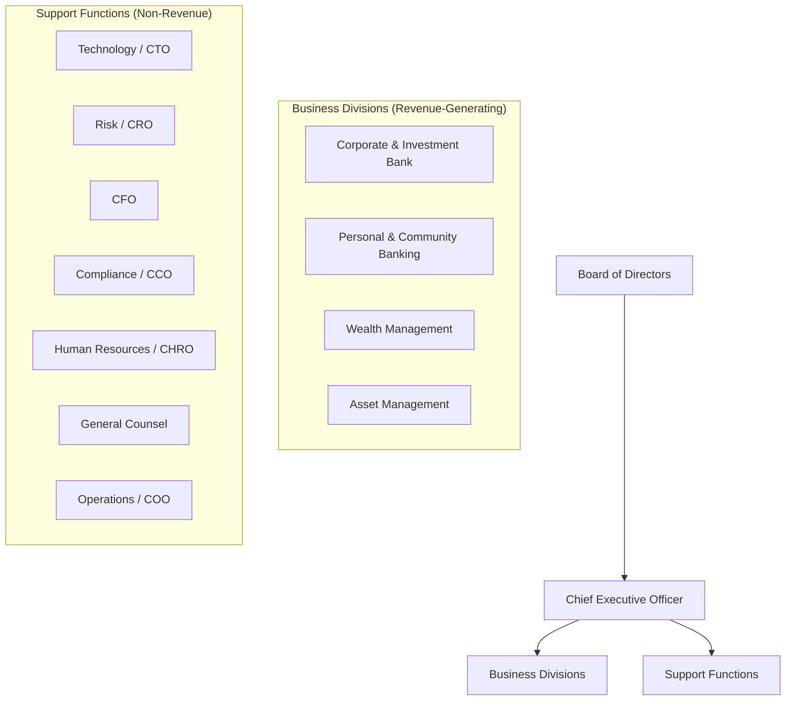
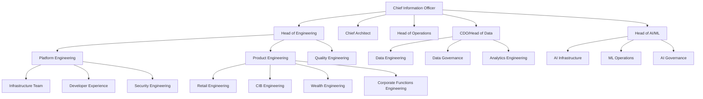
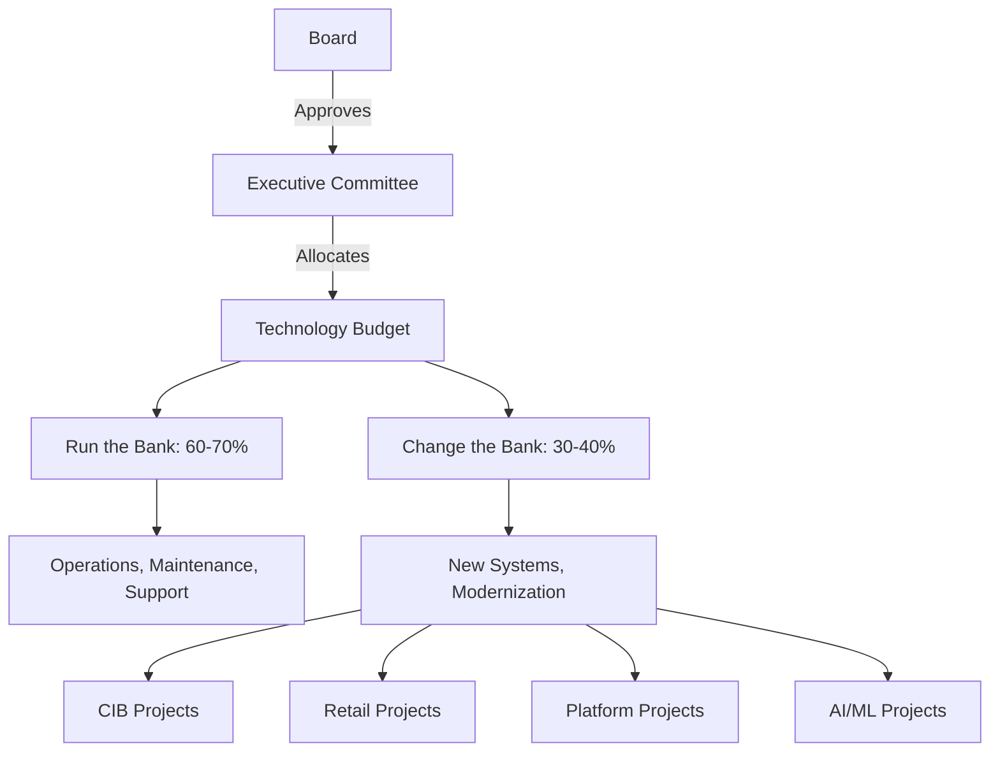

# How Banks Are Structured: Divisions, Reporting Lines, and Technology Organization

> **Audience:** Engineers who need to understand bank organizational structure to navigate their roles effectively.
> **Prerequisites:** [Banking 101](./banking-101.md)
> **Cross-references:** [Banking 101](./banking-101.md), [Engineering Philosophy](../engineering-philosophy/), [Leadership and Collaboration](../leadership-and-collaboration/)

---

## Table of Contents

1. [Why Organizational Structure Matters to Engineers](#1-why-organizational-structure-matters-to-engineers)
2. [The Bank at a Glance](#2-the-bank-at-a-glance)
3. [The C-Suite](#3-the-c-suite)
4. [Business Divisions](#4-business-divisions)
5. [Support Functions](#5-support-functions)
6. [The Technology Organization](#6-the-technology-organization)
7. [How Engineering Teams Map to Business Areas](#7-how-engineering-teams-map-to-business-areas)
8. [Reporting Lines and Governance](#8-reporting-lines-and-governance)
9. [Geographic Structure](#9-geographic-structure)
10. [Matrix Organizations](#10-matrix-organizations)
11. [GenAI and Organizational Change](#11-genai-and-organizational-change)
12. [Common Systems and Technology](#12-common-systems-and-technology)
13. [Engineering Implications](#13-engineering-implications)
14. [Common Workflows](#14-common-workflows)
15. [Interview Questions](#15-interview-questions)

---

## 1. Why Organizational Structure Matters to Engineers

Understanding bank structure helps you:
- **Know who to talk to.** When you need a decision, you need to know who makes it.
- **Understand priorities.** Different divisions have different priorities and pressures.
- **Navigate complexity.** Banks are large and matrixed — knowing the structure helps you find the right people.
- **Communicate effectively.** Understanding business incentives helps you frame technical decisions in business terms.
- **Plan your career.** Understanding structure reveals promotion paths and opportunities.

---

## 2. The Bank at a Glance



---

## 3. The C-Suite

### 3.1 Executive Leadership

| Role | Responsibility | Engineering Interaction |
|------|---------------|------------------------|
| **CEO** | Overall strategy and performance | Indirect (board-level technology decisions) |
| **COO** | Operations, efficiency, transformation | High (operational systems, process automation) |
| **CFO** | Financial management, reporting | High (financial systems, reporting infrastructure) |
| **CRO** | Risk management | High (risk systems, data infrastructure) |
| **CTO/CIO** | Technology strategy and delivery | Direct (your boss's boss's boss) |
| **CISO** | Information security | High (security requirements, reviews) |
| **CCO** | Compliance | High (compliance reviews, regulatory) |
| **CDO** | Data strategy | High (data platforms, governance) |
| **CHRO** | Human resources | Medium (HR systems, workforce tools) |
| **General Counsel** | Legal affairs | Medium (legal review of contracts, disputes) |

### 3.2 Technology Leadership

```
CTO/CIO
├── Chief Technology Officer (may be same as CIO)
│   ├── Head of Engineering
│   ├── Head of Architecture
│   ├── Head of Developer Experience
│   └── Head of Innovation/Emerging Tech
├── Chief Information Security Officer (CISO)
│   ├── Application Security
│   ├── Infrastructure Security
│   ├── Identity and Access Management
│   └── Security Operations Center (SOC)
├── Chief Data Officer (CDO)
│   ├── Data Engineering
│   ├── Data Governance
│   ├── Analytics/BI
│   └── Data Science
├── Head of Infrastructure
│   ├── Cloud Platform
│   ├── Network
│   ├── Data Center
│   └── End-User Computing
├── Head of Service Management
│   ├── IT Service Desk
│   ├── Incident Management
│   └── Problem Management
└── Head of GenAI/ML Platform
    ├── AI/ML Infrastructure
    ├── Model Engineering
    └── AI Governance
```

---

## 4. Business Divisions

### 4.1 Corporate and Investment Bank (CIB)

| Sub-Division | What They Do | Engineering Needs |
|-------------|-------------|------------------|
| **Investment Banking** | M&A advisory, capital markets | Deal management systems, pitch tools |
| **Sales and Trading** | Executing trades for clients | Trading platforms, market data, risk systems |
| **Corporate Banking** | Lending and cash management for corporates | Lending systems, cash management platforms |
| **Securities Services** | Custody, clearing, prime brokerage | Custody systems, reconciliation |

### 4.2 Personal and Community Banking (Retail)

| Sub-Division | What They Do | Engineering Needs |
|-------------|-------------|------------------|
| **Retail Banking** | Checking, savings, personal loans | Core banking, digital channels |
| **Mortgages** | Home lending | Mortgage origination and servicing |
| **Cards** | Credit and debit cards | Card processing, fraud detection |
| **Business Banking** | Small business banking | SMB lending, business accounts |

### 4.3 Wealth Management

| Sub-Division | What They Do | Engineering Needs |
|-------------|-------------|------------------|
| **Private Banking** | High-net-worth individuals | Client portals, portfolio management |
| **Financial Advisory** | Financial planning | Planning tools, CRM |
| **Investment Solutions** | Managed portfolios | Portfolio management, rebalancing |

### 4.4 Asset Management

| Sub-Division | What They Do | Engineering Needs |
|-------------|-------------|------------------|
| **Fund Management** | Managing mutual funds, ETFs | Portfolio management, trading |
| **Institutional** | Managing institutional mandates | Institutional reporting, risk |
| **Distribution** | Selling funds to investors | Distribution platforms, reporting |

---

## 5. Support Functions

### 5.1 Risk Management

```
Chief Risk Officer (CRO)
├── Credit Risk
├── Market Risk
├── Operational Risk
├── Model Risk
├── Climate Risk
└── Enterprise Risk
```

### 5.2 Finance

```
Chief Financial Officer (CFO)
├── Financial Planning & Analysis
├── Financial Reporting
├── Tax
├── Treasury
├── Investor Relations
└── Procurement
```

### 5.3 Compliance

Covered in detail in [Compliance Teams](./compliance-teams-and-how-they-work.md).

### 5.4 Operations

```
Chief Operating Officer (COO)
├── Payment Operations
├── Trade Operations
├── Loan Operations
├── Customer Service
├── Business Process Management
└── Transformation
```

### 5.5 Human Resources

```
Chief Human Resources Officer (CHRO)
├── Talent Acquisition
├── Learning and Development
├── Compensation and Benefits
├── Employee Relations
├── Diversity and Inclusion
└── HR Technology
```

---

## 6. The Technology Organization

### 6.1 Typical Technology Structure at Scale



### 6.2 Engineering Team Models

**Model 1: Division-Aligned**
```
Engineering teams are embedded within business divisions.
Example: Retail Engineering reports to Head of Retail Banking.
Pro: Close to business, aligned priorities.
Con: Duplication of effort, inconsistent standards.
```

**Model 2: Centralized Technology**
```
All engineering reports to CTO/CIO.
Teams are assigned to business areas but report through technology.
Pro: Consistent standards, efficient resource allocation.
Con: Less business intimacy, competing priorities.
```

**Model 3: Matrix (Most Common)**
```
Engineers have a solid-line manager in technology
and a dotted-line to the business division.
Pro: Best of both worlds.
Con: Complex reporting, potential conflicts.
```

### 6.3 Team Sizes and Scope

| Team Level | Typical Size | Scope |
|-----------|-------------|-------|
| **Squad/Tribe (Agile)** | 5-9 engineers | Single product/feature area |
| **Chapter** | 20-50 engineers | Related product areas |
| **Department** | 50-200 engineers | Full business area |
| **Division** | 200-1000+ engineers | Entire business division technology |
| **Enterprise Technology** | 5,000-30,000+ | Entire bank technology |

---

## 7. How Engineering Teams Map to Business Areas

### 7.1 Product Engineering Alignment

```
Retail Banking Engineering
├── Digital Banking Team (mobile app, online banking)
├── Core Banking Team (accounts, deposits)
├── Lending Team (mortgages, personal loans)
├── Cards Team (card processing, fraud)
└── Payments Team (transfers, bill pay)

CIB Engineering
├── Trading Technology (equities, fixed income, FX)
├── Investment Banking Systems (deal management, pitch tools)
├── Corporate Banking Systems (lending, cash management)
├── Risk Systems (market risk, credit risk)
└── Market Data Infrastructure

Corporate Functions Engineering
├── Finance Systems (GL, reporting, planning)
├── HR Systems (workday, payroll, recruiting)
├── Risk Systems (enterprise risk, model risk)
├── Compliance Systems (AML, KYC, sanctions)
└── Legal Systems (contract management, matter management)
```

### 7.2 Platform Engineering (Shared Services)

```
Platform Engineering
├── Cloud Platform (OpenShift, AWS, Azure)
├── API Platform (gateway, service mesh)
├── Data Platform (data lake, pipelines, warehouses)
├── AI/ML Platform (model serving, feature stores, GenAI)
├── Identity Platform (SSO, IAM, MFA)
├── Messaging Platform (Kafka, event streaming)
├── Observability Platform (logs, metrics, traces)
└── Developer Experience (CI/CD, tooling, inner loop)
```

---

## 8. Reporting Lines and Governance

### 8.1 Decision-Making Bodies

| Body | Purpose | Engineering Representation |
|------|---------|--------------------------|
| **Board of Directors** | Ultimate governance | CIO may present |
| **Executive Committee** | Strategic decisions | CIO is a member |
| **Technology Steering Committee** | Technology investment priorities | CIO, Head of Engineering |
| **Architecture Review Board** | Technical standards and patterns | Chief Architect, senior engineers |
| **Change Advisory Board** | Production change approval | Operations, engineering leads |
| **Security Review Board** | Security policy and exceptions | CISO, security leads |
| **Model Risk Committee** | Model validation and approval | Head of AI/ML, model validators |

### 8.2 Escalation Path

```
Engineer
└── Tech Lead
    └── Engineering Manager
        └── Director of Engineering
            └── Head of Engineering
                └── CTO/CIO
                    └── CEO
```

For technical escalations, the path goes through technology leadership. For business escalations, the path goes through the business division.

### 8.3 Budget and Funding



---

## 9. Geographic Structure

### 9.1 Global Bank Structure

```
Global Headquarters (e.g., London, New York)
├── Regional Headquarters
│   ├── Americas (New York, São Paulo)
│   ├── EMEA (London, Frankfurt, Dubai)
│   └── Asia-Pacific (Singapore, Hong Kong, Sydney)
└── Country Operations
    ├── Country CEO
    ├── Local Business Heads
    └── Local Technology Teams
```

### 9.2 Geographic Engineering Implications

| Aspect | Consideration |
|--------|--------------|
| **Follow-the-Sun** | Teams distributed across time zones for 24/7 coverage |
| **Data Residency** | Data may not leave certain jurisdictions (GDPR, local laws) |
| **Regulatory Differences** | Different regulations per country |
| **Cultural Differences** | Communication styles, working hours, holidays |
| **Entity Structure** | Each country may be a separate legal entity |
| **Cost Arbitrage** | Some teams located in lower-cost centers |

---

## 10. Matrix Organizations

### 10.1 What Is a Matrix?

In a matrix organization, individuals report to multiple managers:

```
Engineer A:
├── Solid-line: Engineering Manager (technology)
│   ├── Performance reviews
│   ├── Career development
│   ├── Technical standards
│   └── Resource allocation
└── Dotted-line: Product Owner (business)
    ├── Daily priorities
    ├── Feature requirements
    ├── Sprint planning
    └── Business acceptance
```

### 10.2 Matrix Challenges and Solutions

| Challenge | Solution |
|-----------|----------|
| **Competing priorities** | Clear prioritization framework, escalation path |
| **Conflicting directions** | Regular alignment meetings, shared OKRs |
| **Diffused accountability** | Clear RACI matrix for each initiative |
| **Communication overhead** | Structured communication channels, regular syncs |
| **Performance review complexity** | Input from both managers, clear criteria |

---

## 11. GenAI and Organizational Change

### 11.1 How GenAI Is Changing Bank Structure

| Change | Description |
|--------|------------|
| **New AI/ML Division** | Many banks are creating dedicated AI/ML organizations |
| **AI Governance Function** | New teams managing AI risk, ethics, and compliance |
| **AI Center of Excellence** | Cross-functional teams spreading AI capabilities |
| **Prompt Engineering Roles** | New roles for prompt design and optimization |
| **AI Product Managers** | PMs specializing in AI-powered products |
| **Model Risk Expansion** | Expanded model risk teams for AI governance |

### 11.2 Where GenAI Teams Sit

| Model | Pros | Cons |
|-------|------|------|
| **Centralized AI Platform Team** | Consistent platform, shared expertise | Less business alignment |
| **Embedded in Business Divisions** | Close to use cases, business-aligned | Duplication, inconsistent standards |
| **Hybrid (Platform + Embedded)** | Best of both | Complex management |

Most large banks are moving toward the **hybrid model**:
- Central AI platform team builds infrastructure, tooling, and standards
- Embedded AI engineers work with business divisions on use cases
- AI governance function provides independent oversight

---

## 12. Common Systems and Technology

| System Category | Examples |
|----------------|----------|
| **Org Management** | Workday, SAP SuccessFactors, Oracle HCM |
| **Collaboration** | Microsoft 365, Slack, Teams, Confluence |
| **Project Management** | Jira, ServiceNow, Rally, Azure DevOps |
| **Architecture Management** | LeanIX, Ardoq, Miro |
| **IT Service Management** | ServiceNow, Jira Service Management |
| **Identity Management** | Okta, Azure AD, Ping Identity, SailPoint |

---

## 13. Engineering Implications

### 13.1 What This Means for You

1. **Know your stakeholders.** Who uses what you build? Who funds it? Who regulates it?
2. **Understand the matrix.** You likely have multiple stakeholders with different priorities.
3. **Escalation is normal.** Escalating issues is not a failure — it's how large organizations make decisions.
4. **Budget matters.** Your work is funded from a specific budget line. Understanding where helps you advocate for resources.
5. **Geography matters.** Your team may span multiple countries and time zones. Communication is critical.
6. **Governance is real.** Decisions are made in committees and boards. Understanding these helps you navigate.

### 13.2 Stakeholder Mapping

For every project, identify:

| Stakeholder | Role | Interest |
|------------|------|----------|
| **Product Owner** | Business representative | Features, timeline, business value |
| **Tech Lead** | Technical direction | Architecture, code quality, standards |
| **Engineering Manager** | People and delivery | Team health, delivery predictability |
| **Architecture Board** | Standards compliance | Patterns, technology choices |
| **Security Team** | Risk management | Security controls, vulnerabilities |
| **Compliance Team** | Regulatory alignment | Compliance evidence, auditability |
| **Operations Team** | Production support | Deployability, observability |
| **End Users** | System consumers | Usability, reliability |

---

## 14. Common Workflows

### 14.1 New Initiative Intake

```
1. Business identifies need/opportunity
2. Business case developed (costs, benefits, risks)
3. Business case submitted to technology steering committee
4. Technology assesses feasibility, effort, dependencies
5. Committee prioritizes against other initiatives
6. If approved: budget allocated, team assigned
7. Project kicks off with discovery phase
8. Architecture review
9. Development begins
10. Regular governance check-ins
```

### 14.2 Cross-Division Collaboration

```
1. Division A needs capability that Division B also needs
2. Platform engineering identifies common requirement
3. Shared solution designed
4. Funding agreed between divisions (chargeback or central funding)
5. Built as platform capability
6. Both divisions consume via API
7. Platform team maintains, both divisions provide input
```

### 14.3 Organizational Change

```
1. Strategic decision to reorganize (merger, split, new division)
2. New structure designed
3. Technology implications assessed
4. Systems mapped to new structure
5. Access controls updated
6. Budget reallocated
7. Teams reassigned
8. Communication to all affected staff
9. Transition period with overlap
10. New structure operational
```

---

## 15. Interview Questions

### Foundational

1. **What are the main business divisions in a universal bank and what do they do?**
2. **What is the three lines of defense model? Where does technology sit?**
3. **What is the difference between the CRO and the CCO?**
4. **Why does a bank have both a CIO and a CTO? What's the difference?**

### Technical

5. **You are asked to build a system that serves both the retail banking division and the corporate banking division. How do you manage the different priorities and requirements?**
6. **How would you design a platform service that needs to be used by engineering teams across 5 business divisions?**
7. **Your team is split across three time zones. How do you structure your work to be effective?**
8. **How do you manage access control for a system that is used by employees across 30 countries with different regulatory requirements?**

### Organizational

9. **Your product owner wants Feature A, your tech lead wants to refactor the codebase, and your compliance reviewer wants you to address a compliance finding. All are important. How do you prioritize?**
10. **You discover that another engineering team is building something very similar to what your team is building. What do you do?**
11. **A senior executive asks you to prioritize their request, but it conflicts with your committed roadmap. How do you handle this?**

### GenAI-Specific

12. **Where should a GenAI platform team sit in a bank's organization structure? Centralized, embedded, or hybrid? Defend your answer.**
13. **How would you structure an AI governance function? Who should it report to and why?**
14. **You are building an internal GenAI assistant that serves the entire bank. How do you manage the competing requirements of 10+ business divisions?**

---

## Further Reading

- [Banking 101](./banking-101.md) — How banks work
- [Compliance Teams](./compliance-teams-and-how-they-work.md) — How compliance works
- [Engineering Philosophy](../engineering-philosophy/) — Mindset and craft
- [Leadership and Collaboration](../leadership-and-collaboration/) — Influence and communication
- [Onboarding](../onboarding/) — New engineer ramp-up
