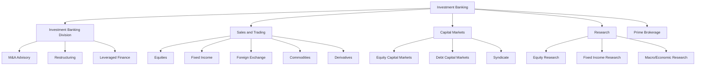
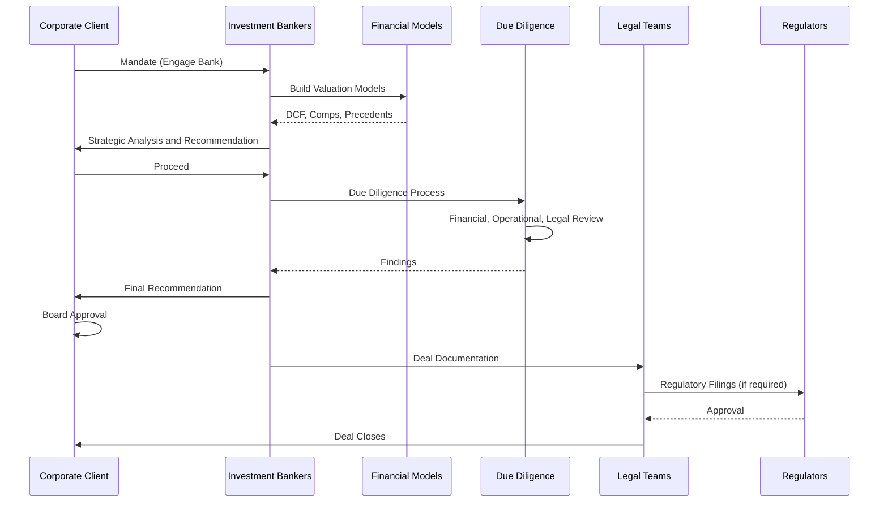
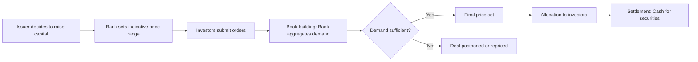
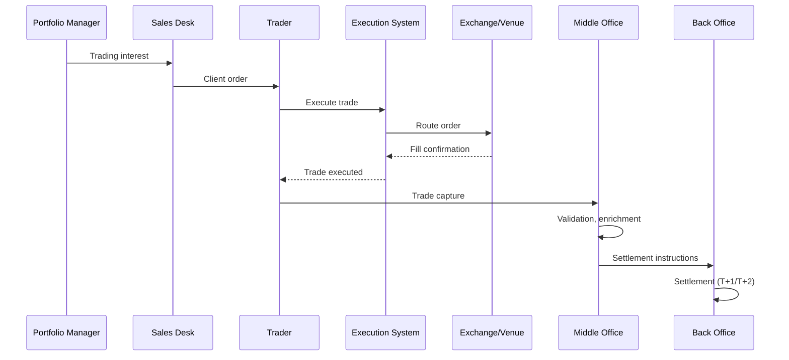
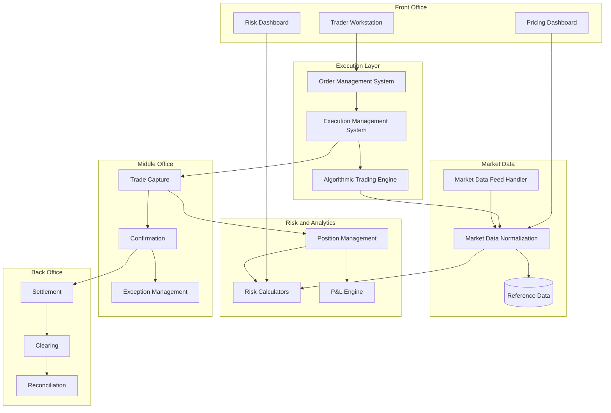
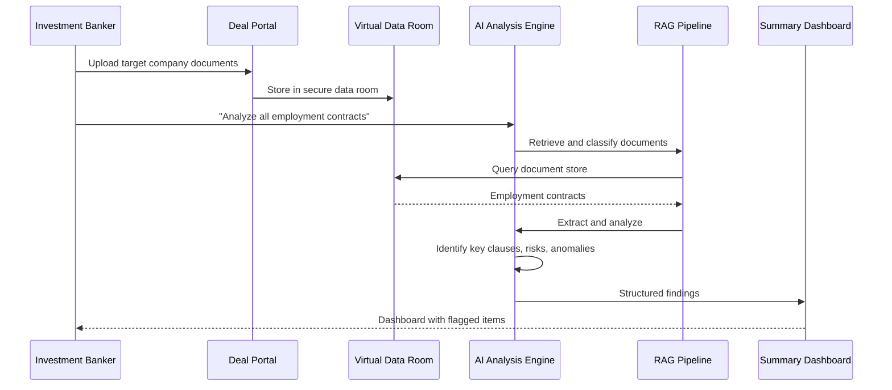

# Investment Banking: M&A Advisory, Capital Markets, Trading, and Research

> **Audience:** Engineers building systems for investment banking divisions.
> **Prerequisites:** [Banking 101](./banking-101.md)
> **Cross-references:** [Treasury and Risk](./treasury-and-risk.md), [Payments](./payments.md), [Compliance Teams](./compliance-teams-and-how-they-work.md)

---

## Table of Contents

1. [What Is Investment Banking?](#1-what-is-investment-banking)
2. [Investment Banking Divisions](#2-investment-banking-divisions)
3. [M&A Advisory](#3-ma-advisory)
4. [Capital Markets](#4-capital-markets)
5. [Sales and Trading](#5-sales-and-trading)
6. [Equity Research](#6-equity-research)
7. [Prime Brokerage](#7-prime-brokerage)
8. [The Technology Stack in Investment Banking](#8-the-technology-stack-in-investment-banking)
9. [GenAI in Investment Banking](#9-genai-in-investment-banking)
10. [Risks of AI in Investment Banking](#10-risks-of-ai-in-investment-banking)
11. [Key Regulations](#11-key-regulations)
12. [Common Systems and Technology](#12-common-systems-and-technology)
13. [Engineering Implications](#13-engineering-implications)
14. [Common Workflows](#14-common-workflows)
15. [Interview Questions](#15-interview-questions)

---

## 1. What Is Investment Banking?

Investment banking is the division of a bank that serves **corporations, governments, and institutional investors** — not individual consumers. It helps clients:

- **Raise capital** (through equity or debt issuance)
- **Execute strategic transactions** (mergers, acquisitions, divestitures)
- **Manage risk** (through derivatives and hedging)
- **Make informed investment decisions** (through research and advisory)

**Scale context:** A top-tier investment bank may:
- Advise on $500B+ in M&A deals per year
- Underwrite $200B+ in equity and debt issuances
- Process $10T+ in trading volume annually
- Employ 5,000+ technology professionals in the trading and capital markets divisions

**Key difference from retail banking:** Investment banking is **deal-driven** and **relationship-driven**, not product-driven. Each engagement is bespoke, though the underlying technology infrastructure is shared.

---

## 2. Investment Banking Divisions



---

## 3. M&A Advisory

### 3.1 What It Is

M&A advisory is the business of advising corporations on:
- **Acquisitions** (buying another company)
- **Mergers** (combining with another company)
- **Divestitures** (selling a business unit)
- **Spin-offs** (creating an independent company from a division)
- **Joint ventures**

The bank earns advisory fees (typically 0.5-2% of deal value) and sometimes success fees.

### 3.2 The M&A Process



### 3.3 Financial Models Used in M&A

| Model | Purpose |
|-------|---------|
| **DCF (Discounted Cash Flow)** | Value a company based on projected future cash flows |
| **Comparable Companies (Comps)** | Value based on similar publicly traded companies |
| **Precedent Transactions** | Value based on similar past M&A deals |
| **LBO (Leveraged Buyout)** | Value based on acquisition using significant debt |
| **Merger Model** | Analyze accretion/dilution of a proposed merger |

**Engineering implication:** These models are typically built in Excel by bankers. Engineering teams build:
- Automated model validation systems
- Data platforms feeding model inputs (market data, company financials)
- Collaboration tools for deal teams
- Document management for deal materials

### 3.4 Confidentiality and Information Barriers

M&A deals are highly confidential. A leak can:
- Move stock prices (insider trading risk)
- Derail negotiations
- Result in regulatory investigation

**Information barriers (Chinese Walls):** Strict separation between divisions. Investment bankers cannot share deal information with traders or research analysts.

**Engineering implication:** Access control systems must enforce information barriers at the data level. A trader's system must not show M&A pipeline data. This is not just policy — it is a **regulatory requirement**.

---

## 4. Capital Markets

### 4.1 Equity Capital Markets (ECM)

ECM helps companies raise capital by issuing equity (shares):

| Activity | Description |
|----------|------------|
| **IPO (Initial Public Offering)** | Taking a private company public |
| **Follow-on Offering** | Additional share issuance by a public company |
| **Block Trade** | Large share sale by an existing shareholder |
| **Rights Issue** | Offering existing shareholders the right to buy new shares |
| **Convertible Bonds** | Bonds that can convert into equity |

### 4.2 Debt Capital Markets (DCM)

DCM helps clients raise capital by issuing debt (bonds):

| Activity | Description |
|----------|------------|
| **Investment Grade Bonds** | Bonds rated BBB-/Baa3 or higher |
| **High Yield Bonds** | Bonds rated below investment grade ("junk bonds") |
| **Government Bonds** | Sovereign debt issuance |
| **Structured Products** | Securitized debt (MBS, ABS, CDOs) |

### 4.3 The Syndicate Function

The syndicate desk sits between IBD and Sales & Trading. They:
- Determine pricing and size of new issuances
- Allocate securities to investors
- Manage the book-building process

### 4.4 The Book-Building Process



---

## 5. Sales and Trading

### 5.1 What It Is

Sales and Trading (S&T) is the division that:
- **Executes trades** on behalf of institutional clients (pension funds, hedge funds, asset managers)
- **Makes markets** (provides buy and sell prices) in securities
- **Manages the bank's own trading book** (within regulatory limits)

### 5.2 Asset Classes

| Asset Class | What's Traded | Key Characteristics |
|------------|--------------|-------------------|
| **Equities** | Stocks, ETFs | High volume, low margin, electronic |
| **Fixed Income** | Government/corporate bonds | Lower volume, higher margin, relationship-driven |
| **Foreign Exchange (FX)** | Currency pairs | Largest market by volume ($7.5T/day), 24/5 |
| **Commodities** | Oil, gold, agricultural products | Physical and financial settlement |
| **Credit** | Credit default swaps, bonds | Counterparty risk sensitive |
| **Derivatives** | Options, futures, swaps | Complex, requires sophisticated modeling |
| **Rates** | Interest rate products | Tied to central bank policy |

### 5.3 Trading Venues

| Venue | Description |
|-------|------------|
| **Exchanges** | Regulated, centralized (NYSE, LSE, CME) |
| **OTC (Over-the-Counter)** | Bilateral, less regulated |
| **Dark Pools** | Private exchanges, hidden order books |
| **Internal Crossing** | Matching client orders within the bank |

### 5.4 The Trading Lifecycle



### 5.5 Key Trading Metrics

| Metric | Description |
|--------|------------|
| **Spread** | Difference between bid and ask price |
| **Slippage** | Difference between expected and actual execution price |
| **Market Impact** | Price movement caused by the trade itself |
| **VWAP** | Volume-weighted average price (benchmark) |
| **TWAP** | Time-weighted average price (benchmark) |

---

## 6. Equity Research

### 6.1 What It Is

Equity research produces:
- **Company reports:** Deep analysis of individual companies
- **Sector reports:** Industry-wide analysis
- **Recommendations:** Buy, Hold, or Sell ratings
- **Price targets:** Expected future stock price
- **Earnings models:** Revenue and earnings projections

### 6.2 The Research Wall

Research must be **independent** from investment banking. This is enforced by:
- Separate reporting lines
- Information barriers
- Compliance review of research before publication
- Restrictions on analysts covering companies where the bank has investment banking relationships

**Engineering implication:** Research management systems must enforce access controls, publication workflows, and compliance review gates.

### 6.3 Research Distribution

Research is distributed to:
- Internal sales and trading desks
- Institutional clients (for commission generation)
- Retail clients (through wealth management channels)

Each distribution channel may have different access rights and timing restrictions.

---

## 7. Prime Brokerage

### 7.1 What It Is

Prime brokerage provides services to hedge funds and institutional clients:
- **Securities lending:** Borrowing securities for short selling
- **Margin financing:** Lending money to clients against their portfolio
- **Trade execution:** Access to trading venues
- **Clearing and settlement:** Post-trade processing
- **Custody:** Safekeeping of assets
- **Reporting:** Portfolio analytics and risk reporting

### 7.2 Technology Requirements

| Requirement | Reason |
|------------|--------|
| **Real-time margin monitoring** | Client may breach margin limits at any time |
| **Automated margin calls** | Systems must trigger calls when thresholds breached |
| **Securities lending inventory** | Track available and loaned securities |
| **Risk aggregation** | View client risk across all positions |
| **Regulatory reporting** | SFTR, Dodd-Frank, EMIR reporting |

---

## 8. The Technology Stack in Investment Banking

### 8.1 Architecture Overview



### 8.2 Technology Characteristics by Layer

| Layer | Latency Requirement | Data Volume | Key Technology |
|-------|-------------------|-------------|---------------|
| **Market Data** | Microseconds | Millions of messages/sec | C++, FPGA, Aeron |
| **Execution** | Microseconds to milliseconds | High | C++, Java, Go |
| **Risk** | Seconds to minutes | Medium | Python, Java, C++ |
| **Middle Office** | Minutes | Medium | Java, Python |
| **Back Office** | Hours (batch OK) | High batch volume | Java, Python, batch |

---

## 9. GenAI in Investment Banking

### 9.1 Use Cases

| Use Case | Description | Value |
|----------|------------|-------|
| **Deal Pitch Automation** | AI generating sections of pitch books (market overview, comparable analysis) | Reduced banker time, consistent quality |
| **Due Diligence Acceleration** | AI reviewing target company documents, contracts, financials | Faster deal execution |
| **Research Drafting** | AI drafting research report sections from data and models | Analyst time savings |
| **Trade Surveillance** | AI detecting unusual trading patterns, potential market abuse | Regulatory compliance |
| **Client Intelligence** | AI summarizing client relationships, interaction history, opportunities | Better relationship management |
| **Regulatory Change Analysis** | AI monitoring and summarizing regulatory changes affecting trading | Faster compliance response |
| **P&L Attribution Analysis** | AI explaining daily P&L movements in narrative form | Faster risk analysis |
| **Credit Memo Drafting** | AI drafting sections of credit memoranda for new issuances | Faster time to market |

### 9.2 Example: AI-Assisted Due Diligence



### 9.3 Example: AI Research Summarization

```
Input:  Financial model outputs, earnings data, news, industry reports
Process: RAG retrieval → LLM synthesis → Fact-checking against source data
Output: Draft research report with citations
Human:   Analyst reviews, edits, adds judgment
Compliance: Pre-publication review (automated + manual)
Distribution: Approved research to clients
```

---

## 10. Risks of AI in Investment Banking

### 10.1 Information Barrier Breaches

The most critical risk. If an AI system with access to both M&A deal data and trading systems provides information across the Chinese Wall, it creates:
- **Insider trading risk**
- **Regulatory violations**
- **Criminal liability**

**Mitigation:**
- Separate AI instances for each division (or strict access controls)
- Audit logs of every prompt and response
- Data classification labels on all AI inputs
- Regular access reviews

### 10.2 Market Manipulation

AI-generated research or analysis that could be perceived as attempting to influence market prices:
- Biased stock recommendations
- Selective use of data
- Timing of publication to benefit trading positions

**Mitigation:**
- Compliance review of all AI-generated content before publication
- Comparison against independent data sources
- Timestamp and version control on all content

### 10.3 Confidentiality Leaks

Deal information in AI prompts could leak:
- Through model training data
- Through shared context windows
- Through error messages or logs

**Mitigation:**
- On-premise AI models for deal-related work
- Strict prompt sanitization
- No deal names or identifiers in prompts to external services
- Complete audit trails

### 10.4 Trading Algorithm Risks

If AI is used to inform trading algorithms:
- Unintended market impact
- Feedback loops with other algorithms
- Regulatory scrutiny of algorithmic trading

**Mitigation:**
- Pre-trade risk checks (independent of AI)
- Kill switch capabilities
- Regulatory testing of algorithms
- Human oversight on all algorithmic strategies

---

## 11. Key Regulations

| Regulation | Relevance to Investment Banking |
|-----------|-------------------------------|
| **MiFID II (EU)** | Trading transparency, research unbundling, best execution |
| **Dodd-Frank (US)** | OTC derivatives, swap reporting, Volcker Rule |
| **EMIR (EU)** | Derivatives clearing, trade reporting |
| **MAR (EU)** | Market abuse regulation, insider dealing |
| **FINRA Rules (US)** | Broker-dealer regulation, research independence |
| **SFTR (EU)** | Securities financing transaction reporting |
| **Volcker Rule (US)** | Proprietary trading restrictions |
| **UK SM&CR** | Senior Managers accountability |
| **SEC Rule 15c3-5** | Market access risk management |
| **Best Execution** | Obligation to achieve best result for clients |

See [Regulations and Compliance](../regulations-and-compliance/) for details.

---

## 12. Common Systems and Technology

### 12.1 Trading Systems

| System | Description |
|--------|------------|
| **Murex MX.3** | Integrated trading, risk, and processing platform |
| **Calypso** | Trading and risk management |
| **Bloomberg Terminal** | Market data, news, trading, analytics |
| **Reuters Eikon/Refinitiv** | Market data and analytics |
| **ION Trading** | Fixed income trading platforms |
| **Charles River IMS** | Investment management system |

### 12.2 Market Data Providers

| Provider | Data Type |
|----------|-----------|
| **Bloomberg** | Real-time prices, news, reference data |
| **Refinitiv (LSEG)** | Real-time prices, analytics |
| **ICE Data Services** | Fixed income data |
| **Markit (S&P Global)** | Credit data, indices |
| **Morningstar** | Fund data |

### 12.3 Risk Systems

| System | Description |
|--------|------------|
| **RiskMetrics (MSCI)** | Market risk analytics |
| **Moody's Analytics** | Credit risk |
| **Bloomberg PORT** | Portfolio analytics |
| **AxiomSL** | Regulatory reporting |
| **Custom risk engines** | Bank-specific risk models |

---

## 13. Engineering Implications

### 13.1 Latency Matters

In equities trading, **microseconds are money**. A 1-millisecond advantage in order execution can mean millions in revenue. However:

- **Not everything needs to be fast.** Risk calculations, end-of-day reporting, and compliance reporting can be batch processes.
- **Understand the requirement.** Ask the business: "What is the latency requirement for this system?" before optimizing.

### 13.2 Data Consistency

Trading systems must maintain consistency across:
- Order management system
- Position management system
- Risk engine
- P&L calculator
- Regulatory reporting

**Engineering implication:** Event-driven architecture with Kafka or similar is common. But you must handle:
- Message ordering (sequence numbers)
- Late-arriving trades
- Trade corrections
- Position breaks

### 13.3 End-of-Day Processing

Every trading day ends with a batch process:
- Position reconciliation
- P&L calculation
- Risk metric updates
- Regulatory report generation
- General ledger posting

**Engineering implication:** These batch windows are shrinking. Systems that took 6 hours must now complete in 2. Parallelization and optimization are constant challenges.

### 13.4 Change Management

Trading system changes are subject to:
- Pre-production testing
- Business user acceptance testing
- Regulatory impact assessment
- Change advisory board approval
- Restricted deployment windows (never during market hours)
- Rollback plans

### 13.5 Documentation

Every system must document:
- Data flows and lineage
- Access controls
- Error handling procedures
- Escalation paths
- Business continuity plans

---

## 14. Common Workflows

### 14.1 New Trade Flow

```
1. Client places order (phone, electronic, algo)
2. Trader captures trade in OMS
3. Pre-trade compliance checks (limits, restrictions)
4. Order routed to venue (exchange, dark pool, OTC)
5. Fill received from venue
6. Trade captured in trade capture system
7. Trade enriched with reference data
8. Confirmation sent to counterparty
9. Position updated
10. P&L calculated
11. Trade flows to middle office for settlement
```

### 14.2 End-of-Day Process

```
1. Trading day closes
2. All trades captured and confirmed
3. Positions reconciled with counterparties
4. Market data loaded (closing prices, FX rates)
5. P&L calculated (realized and unrealized)
6. Risk metrics updated (VaR, stress tests)
7. Regulatory reports generated
8. General ledger updated
9. Exceptions identified and escalated
10. Morning report prepared for management
```

### 14.3 New Issue (Bond Issuance)

```
1. DCM mandates: Client wants to issue $1B in bonds
2. Credit analysis: Analysts assess creditworthiness
3. Pricing: Syndicate desk determines coupon and spread
4. Marketing: Roadshow to institutional investors
5. Book-building: Investor orders collected
6. Pricing: Final terms set based on demand
7. Allocation: Bonds allocated to investors
8. Settlement: Cash received, bonds delivered (T+2)
9. Listing: Bonds listed on exchange
10. Secondary trading: Bonds trade in secondary market
```

---

## 15. Interview Questions

### Foundational

1. **Explain the difference between the primary market and the secondary market.**
2. **What is a book-building process and why does it matter?**
3. **What is the difference between buy-side and sell-side?**
4. **Why must research be independent from investment banking?**

### Technical

5. **Design a system that processes 1 million market data updates per second and provides real-time pricing to traders.**
6. **How would you ensure that trade positions are always consistent across multiple systems?**
7. **What data structures would you use for an order book? Why?**
8. **How would you design a P&L attribution system that explains daily profit/loss movements?**

### GenAI-Specific

9. **You are building an AI system to help investment bankers analyze target company documents during M&A due diligence. What security and compliance controls are mandatory?**
10. **How would you prevent an AI research assistant from inadvertently sharing deal-related information with the trading desk?**
11. **An AI system is used to draft research reports. How do you ensure the output is accurate, unbiased, and compliant before publication?**

### Scenario-Based

12. **A trade was executed but the position is showing incorrectly in the risk system. Walk through your debugging process.**
13. **The end-of-day P&L calculation is running 4 hours longer than expected. What is your approach to diagnosing and fixing this?**
14. **A trader asks an AI system to summarize the market outlook for a stock. The bank is currently advising that company on an M&A deal. What should happen?**

---

## Further Reading

- [Treasury and Risk](./treasury-and-risk.md) — Treasury operations, risk management
- [Payments](./payments.md) — Settlement of trades, payment systems
- [Compliance Teams](./compliance-teams-and-how-they-work.md) — How compliance reviews engineering work
- [AML and Fraud](./aml-and-fraud.md) — Trade surveillance, market abuse detection
- [Data Engineering](../data-engineering/) — Market data pipelines
- [Real-World Case Studies](../real-world-case-studies/) — Production incident stories
