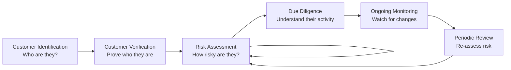
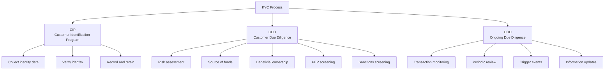
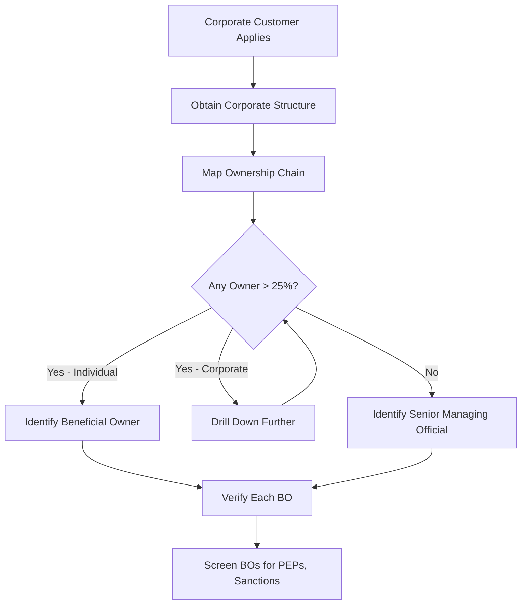
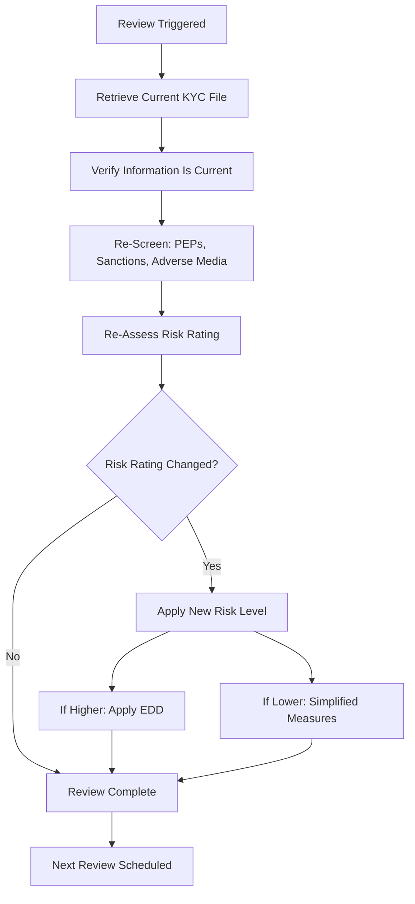
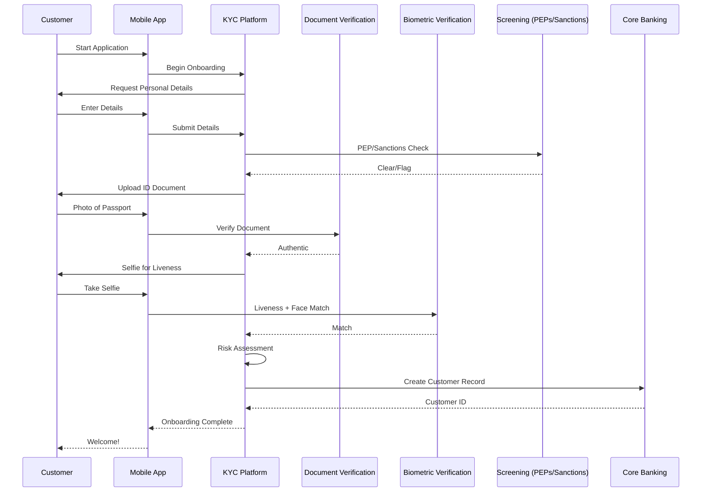
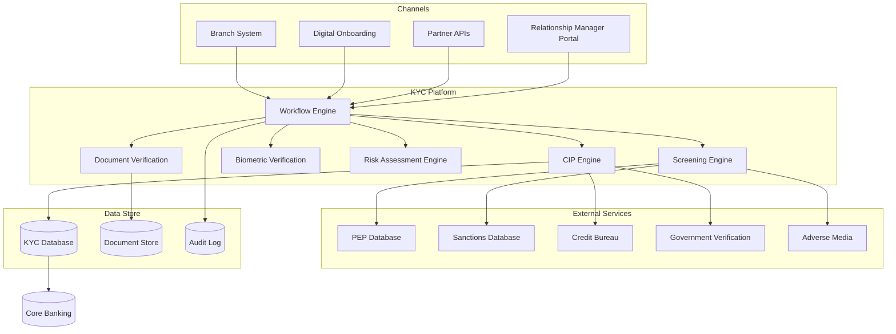
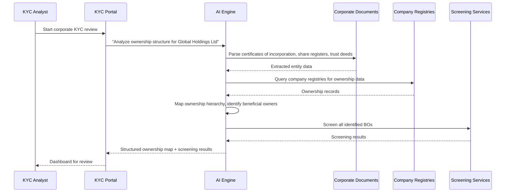

# KYC and Onboarding: Know Your Customer, Identity Verification, and Ongoing Due Diligence

> **Audience:** Engineers building customer onboarding and identity verification systems.
> **Prerequisites:** [Banking 101](./banking-101.md), [AML and Fraud](./aml-and-fraud.md)
> **Cross-references:** [AML and Fraud](./aml-and-fraud.md), [Retail Banking](./retail-banking.md), [Compliance Teams](./compliance-teams-and-how-they-work.md)

---

## Table of Contents

1. [What Is KYC?](#1-what-is-kyc)
2. [Why KYC Exists](#2-why-kyc-exists)
3. [The KYC Process](#3-the-kyc-process)
4. [Identity Verification](#4-identity-verification)
5. [Customer Due Diligence (CDD)](#5-customer-due-diligence-cdd)
6. [Enhanced Due Diligence (EDD)](#6-enhanced-due-diligence-edd)
7. [Politically Exposed Persons (PEPs)](#7-politically-exposed-persons-peps)
8. [Beneficial Ownership](#8-beneficial-ownership)
9. [Ongoing Due Diligence and Periodic Review](#9-ongoing-due-diligence-and-periodic-review)
10. [KYC Utility and Shared Data](#10-kyc-utility-and-shared-data)
11. [Digital Onboarding](#11-digital-onboarding)
12. [KYC System Architecture](#12-kyc-system-architecture)
13. [GenAI in KYC](#13-genai-in-kyc)
14. [Risks of AI in KYC](#14-risks-of-ai-in-kyc)
15. [Key Regulations](#15-key-regulations)
16. [Common Systems and Technology](#16-common-systems-and-technology)
17. [Engineering Implications](#17-engineering-implications)
18. [Common Workflows](#18-common-workflows)
19. [Interview Questions](#19-interview-questions)

---

## 1. What Is KYC?

KYC (Know Your Customer) is the process by which banks **verify the identity of their clients** and understand their financial activities. It is the foundation of AML and financial crime prevention.

**KYC is not a one-time event.** It is an ongoing process that spans the entire customer relationship:



---

## 2. Why KYC Exists

### 2.1 The Problem

Before KYC regulations, criminals could easily:
- Open bank accounts under fake identities
- Use banks to launder money
- Hide proceeds of corruption and fraud
- Finance terrorism

### 2.2 The Regulatory Response

Governments worldwide mandate that banks must know who they are dealing with. The cost of non-compliance is severe:

| Bank | Fine | Reason |
|------|------|--------|
| Standard Chartered | $1.1B (2019) | AML and sanctions violations |
| Danske Bank | Scandal (2018) | $230B suspicious transactions through Estonian branch |
| 1MDB/ Goldman Sachs | $5B+ (2020) | Facilitating corruption |

### 2.3 KYC as a Business Enabler

Good KYC processes:
- Reduce fraud losses
- Speed up legitimate customer onboarding
- Improve customer experience (fewer manual interventions)
- Enable cross-border business with confidence
- Protect the bank's reputation

---

## 3. The KYC Process

### 3.1 CIP: Customer Identification Program

The first step is identifying who the customer is:

**For Individuals:**
| Data Element | Purpose |
|-------------|---------|
| Full Legal Name | Identity verification |
| Date of Birth | Distinguish from others with same name |
| Residential Address | Jurisdiction determination |
| Government-Issued ID Number | SSN, NI number, passport number |
| Nationality | Sanctions and risk assessment |
| Contact Details | Communication |

**For Legal Entities:**
| Data Element | Purpose |
|-------------|---------|
| Legal Entity Name | Identity verification |
| Registration Number | Companies House, state registry |
| Registered Address | Jurisdiction |
| Tax ID / EIN | Tax reporting |
| LEI (Legal Entity Identifier) | Global identification |
| Date of Incorporation | Entity age, legitimacy |
| Jurisdiction of Incorporation | Risk assessment |
| Business Activity | Understanding expected activity |

### 3.2 The Three Pillars of KYC



---

## 4. Identity Verification

### 4.1 Verification Methods

| Method | Description | Strength | Use Case |
|--------|------------|----------|----------|
| **Document Verification** | Checking government-issued ID (passport, driving license) | High | All customers |
| **Biometric Verification** | Facial recognition, fingerprint, voice | High | Digital onboarding |
| **Database Checks** | Cross-referencing with credit bureaus, electoral roll | Medium | Supplemental |
| **Knowledge-Based Authentication** | Questions based on credit history | Medium | Step-up verification |
| **Address Verification** | Utility bills, bank statements | Medium | Address confirmation |
| **In-Person Verification** | Branch staff verify identity | Highest | High-risk, EDD |

### 4.2 Document Verification Process

```mermaid
graph TD
    A[Customer Uploads ID Document] --> B[Document Authenticity Check]
    B --> C{Genuine Document?}
    C -->|No| D[Reject]
    C -->|Yes| E[Data Extraction (OCR)]
    E --> F[Data Validation]
    F --> G{Data Consistent?}
    G -->|No| H[Manual Review]
    G -->|Yes| I[Liveness Check]
    I --> J{Live Person?}
    J -->|No| D
    J -->|Yes| K[Face Match Against ID Photo]
    K --> L{Match?}
    L -->|No| H
    L -->|Yes| M[Identity Verified]
    H --> M
    H --> D
```

### 4.3 Document Fraud Techniques

| Technique | Description | Detection |
|-----------|------------|-----------|
| **Forged Document** | Entirely fake document | Security feature analysis |
| **Altered Document** | Genuine document with changes | Inconsistency detection |
| **Stolen Identity** | Genuine document used by wrong person | Biometric verification |
| **Synthetic Identity** | Combined real and fake data | Cross-database validation |
| **Counterfeit Document** | High-quality fake | Advanced document analysis |

---

## 5. Customer Due Diligence (CDD)

### 5.1 What Is CDD?

CDD is the process of understanding the customer's financial profile and assessing their risk level.

### 5.2 CDD Components

| Component | Description |
|-----------|------------|
| **Risk Assessment** | What is the customer's ML/TF risk level? |
| **Source of Funds** | Where does the customer's money come from? |
| **Source of Wealth** | How did the customer accumulate their overall wealth? |
| **Expected Activity** | What transactions does the customer expect to make? |
| **Purpose of Relationship** | Why does the customer want to bank with us? |

### 5.3 Risk Assessment Factors

| Factor | Low Risk | High Risk |
|--------|----------|-----------|
| **Customer Type** | Salaried employee | Cash-intensive business |
| **Geography** | Low-risk jurisdiction | High-risk jurisdiction |
| **Product** | Basic savings account | International wire transfers |
| **Delivery Channel** | Branch onboarding | Remote onboarding |
| **Industry** | Public sector employment | Gambling, crypto, MSB |
| **Transaction Volume** | Low, predictable | High, complex |

### 5.4 Risk Rating

| Risk Level | Description | Due Diligence Level |
|-----------|------------|-------------------|
| **Low** | Minimal ML/TF risk | Simplified due diligence |
| **Medium** | Standard risk | Standard due diligence |
| **High** | Elevated risk | Enhanced due diligence |
| **Prohibited** | Unacceptable risk | Relationship declined |

---

## 6. Enhanced Due Diligence (EDD)

### 6.1 When Is EDD Required?

| Trigger | Example |
|---------|---------|
| **PEP** | Customer is a government minister |
| **High-Risk Jurisdiction** | Customer has significant ties to a high-risk country |
| **High-Risk Industry** | Customer operates a casino or money service business |
| **Complex Ownership** | Multi-layered corporate structure |
| **Non-Face-to-Face** | Remote onboarding with elevated risk |
| **Unusual Activity Pattern** | Activity that doesn't match expected profile |

### 6.2 EDD Requirements

| Requirement | Description |
|------------|------------|
| **Senior Management Approval** | EDD relationships require sign-off from senior management |
| **Source of Wealth Verification** | Independent evidence of how wealth was accumulated |
| **Source of Funds Verification** | Evidence for the specific funds being deposited |
| **Enhanced Ongoing Monitoring** | More frequent transaction monitoring |
| **More Frequent Reviews** | Annual reviews instead of standard 2-3 year cycle |
| **Adverse Media Screening** | Checking for negative news coverage |
| **Additional Documentation** | More extensive documentation requirements |

---

## 7. Politically Exposed Persons (PEPs)

### 7.1 What Is a PEP?

A PEP is someone who has been entrusted with a prominent public function. They are not inherently risky, but the *position* carries higher risk of corruption.

### 7.2 PEP Categories

| Category | Examples |
|----------|---------|
| **Foreign PEP** | Foreign government minister, foreign head of state |
| **Domestic PEP** | Domestic government minister, MP, senior judge |
| **International Organization PEP** | Senior official at UN, World Bank, IMF |
| **RCA (Relative or Close Associate)** | Family member or close associate of a PEP |

### 7.3 PEP Handling

```mermaid
graph TD
    A[Customer Identified as PEP] --> B[Determine PEP Type]
    B --> C[Assess Risk Level]
    C --> D[Senior Management Approval Required]
    D --> E[Enhanced Due Diligence]
    E --> F[Source of Wealth Verification]
    F --> G[Enhanced Ongoing Monitoring]
    G --> H[Periodic Review (Annual)]
```

### 7.4 PEP Screening

| Data Source | Description |
|------------|------------|
| **Commercial PEP Databases** | World-Check, Dow Jones, Refinitiv |
| **Government Lists** | Publicly available lists of office holders |
| **Media Screening** | News and adverse media searches |
| **Internal Records** | Prior PEP identification |

---

## 8. Beneficial Ownership

### 8.1 What Is Beneficial Ownership?

Beneficial ownership identifies the **natural persons** who ultimately own or control a legal entity. This prevents criminals from hiding behind corporate structures.

### 8.2 Ownership Thresholds

| Jurisdiction | Threshold |
|-------------|-----------|
| **US (FinCEN CDD Rule)** | 25% or more ownership |
| **UK (PSC Register)** | 25% or more shares or voting rights |
| **EU (4th AML Directive)** | 25% or more ownership |
| **FATF** | 25% or more (recommended) |

### 8.3 Uncovering Beneficial Owners



### 8.4 Complex Ownership Structures

```
Customer: Global Holdings Ltd (Cayman Islands)
    │
    ├── Owned by: Pacific Trust (Jersey)
    │       │
    │       └── Trustee: Offshore Trustees Ltd
    │               │
    │               └── Beneficiaries: [Undisclosed]
    │
    └── Owned by: Investment Corp (BVI)
            │
            ├── 40% owned by: Mr. X (Singapore)
            └── 60% owned by: Mrs. Y (Switzerland)
```

**Engineering implication:** Systems must be able to represent and visualize complex ownership hierarchies, and drill down to natural persons.

---

## 9. Ongoing Due Diligence and Periodic Review

### 9.1 Ongoing Due Diligence

KYC does not end after onboarding. Banks must continuously:

| Activity | Description |
|----------|------------|
| **Transaction Monitoring** | Is activity consistent with KYC profile? |
| **Sanctions Re-Screening** | Has the customer appeared on a sanctions list? |
| **PEP Re-Screening** | Has the customer become a PEP? |
| **Adverse Media Monitoring** | Is there negative news about the customer? |
| **Trigger Events** | Has something changed that requires re-assessment? |

### 9.2 Trigger Events

| Event | Action |
|-------|--------|
| **PEP Status Change** | Re-rate risk, apply EDD |
| **Sanctions Hit** | Block/freeze, escalate |
| **Adverse Media** | Review and assess impact |
| **Material Change in Activity** | Update KYC profile |
| **Change in Ownership** | Re-verify beneficial owners |
| **Geographic Change** | Re-assess jurisdictional risk |
| **Large Unusual Transaction** | Review and update profile |

### 9.3 Periodic Review

| Risk Level | Review Frequency |
|-----------|-----------------|
| **Low** | Every 3-5 years |
| **Medium** | Every 2-3 years |
| **High** | Annually |
| **EDD** | Annually (or more frequently) |

### 9.4 Review Process



---

## 10. KYC Utility and Shared Data

### 10.1 The Problem

Every bank performs KYC on the same customers. This is duplicative, costly, and frustrating for customers.

### 10.2 KYC Utilities

Some jurisdictions are developing shared KYC utilities:

| Model | Description | Example |
|-------|------------|---------|
| **Centralized KYC Utility** | Shared database of KYC data | Singapore's KYC utility |
| **Token-Based Sharing** | Banks share KYC completion tokens | Industry consortia |
| **Regulated Data Providers** | Third-party verified KYC data | Refinitiv, Dow Jones |

### 10.3 Legal Entity Identifier (LEI)

The LEI is a global standard for identifying legal entities:
- 20-character alphanumeric code
- Required for many financial transactions
- Contains ownership reference data
- Managed by GLEIF (Global Legal Entity Identifier Foundation)

---

## 11. Digital Onboarding

### 11.1 Digital Onboarding Flow



### 11.2 Digital Onboarding Challenges

| Challenge | Description |
|-----------|------------|
| **Document Quality** | Poor photos, glare, cropped edges |
| **Liveness Detection** | Spoofing with photos, videos, masks |
| **Network Connectivity** | Unreliable connections in some regions |
| **Accessibility** | Customers without smartphones or internet |
| **Cross-Border Documents** | Foreign documents harder to verify |
| **Name Matching** | Different name formats across cultures |

---

## 12. KYC System Architecture



---

## 13. GenAI in KYC

### 13.1 Use Cases

| Use Case | Description | Value |
|----------|------------|-------|
| **Document Data Extraction** | AI extracting data from diverse ID document types | Reduced manual entry, faster onboarding |
| **Corporate Structure Analysis** | AI parsing complex ownership documents and mapping beneficial owners | Faster EDD for corporate clients |
| **Adverse Media Screening** | AI summarizing news articles and assessing relevance | Reduced analyst review time |
| **KYC Review Assistant** | AI preparing periodic review packages with updated information | 40-60% time savings on reviews |
| **Risk Assessment Support** | AI analyzing customer profile and suggesting risk rating | Consistency in risk assessment |
| **Regulatory Guidance** | AI answering questions about KYC requirements | Faster compliance decisions |
| **Customer Communication** | AI drafting KYC information requests to customers | Faster document collection |
| **Source of Wealth Analysis** | AI analyzing financial documents to verify wealth claims | Faster EDD completion |

### 13.2 Example: AI-Assisted Corporate KYC



### 13.3 Example: AI Adverse Media Review

```
Input:  Customer name, aliases, associated entities
Process: Search news and media → AI classify relevance and sentiment → Summarize findings
Output: Risk-rated media summary with links to source articles
Human:   KYC analyst reviews and assesses impact on customer risk
Result:   KYC file updated with adverse media assessment
```

---

## 14. Risks of AI in KYC

### 14.1 Identity Verification Risk

| Risk | Scenario | Impact |
|------|----------|--------|
| **False Acceptance** | AI accepts a forged document as genuine | Criminal account opened, ML/fraud |
| **False Rejection** | AI rejects a genuine customer | Lost customer, complaints, potential discrimination |
| **Biometric Bias** | Facial recognition performs poorly for certain demographics | Discrimination, regulatory action |
| **Document Diversity** | AI fails to recognize foreign or uncommon document types | Exclusion of legitimate customers |

### 14.2 Risk Assessment Risk

| Risk | Scenario | Impact |
|------|----------|--------|
| **Incorrect Risk Rating** | AI underestimates customer risk | Inadequate monitoring, regulatory breach |
| **Geographic Bias** | AI systematically rates customers from certain countries as higher risk | Discrimination, lost business |
| **Outdated Information** | AI uses stale data for risk assessment | Incorrect risk profile |
| **Missing Context** | AI misses important context in adverse media | Incomplete risk assessment |

### 14.3 Mitigation Strategies

- **Human oversight on all risk ratings.** AI recommends, humans approve.
- **Diverse training data.** Document verification models trained on global document types.
- **Bias testing.** Regular fairness testing across demographics.
- **Audit trails.** Every AI decision logged with rationale.
- **Fallback mechanisms.** Manual review available when AI is uncertain.

---

## 15. Key Regulations

| Regulation | Jurisdiction | What It Covers |
|-----------|-------------|---------------|
| **AML Directive (4th/5th/6th)** | EU | Customer due diligence, beneficial ownership |
| **Bank Secrecy Act / CDD Rule** | US | Customer identification, beneficial ownership |
| **USA PATRIOT Act** | US | Customer identification program requirements |
| **Money Laundering Regulations** | UK | Customer due diligence requirements |
| **FATF Recommendations** | Global | International KYC standards |
| **GDPR** | EU/UK | Data protection in KYC processing |
| **eIDAS** | EU | Electronic identification standards |
| **Travel Rule (FATF)** | Global | Crypto asset customer identification |

See [Regulations and Compliance](../regulations-and-compliance/) for details.

---

## 16. Common Systems and Technology

| System Category | Examples |
|----------------|----------|
| **KYC Platforms** | Fenergo, Quantexa, Oracle FCCM, Refinitiv World-Check |
| **Document Verification** | Jumio, Onfido, Trulioo, Veriff |
| **Biometric Verification** | FaceTec, iProov, Mitek, Smile Identity |
| **Screening Services** | World-Check, Dow Jones, ComplyAdvantage, LexisNexis |
| **Adverse Media** | Refinitiv, LexisNexis, RiskNest |
| **Corporate Data** | Bureau van Dijk, OpenCorporates, LEI databases |
| **Workflow Management** | Pega, Appian, custom platforms |

---

## 17. Engineering Implications

### 17.1 Data Quality

- KYC data feeds every other system (transaction monitoring, sanctions screening, credit decisions)
- Poor KYC data = poor downstream decisions
- Data validation at every ingestion point
- Regular data cleansing and deduplication

### 17.2 Performance Requirements

| Operation | Typical SLA |
|-----------|------------|
| Identity verification (digital) | < 5 minutes end-to-end |
| Sanctions screening (real-time) | < 200ms |
| PEP screening | < 5 seconds |
| Risk assessment | < 30 seconds |
| Adverse media search | < 30 seconds |
| Periodic review package generation | < 1 minute |

### 17.3 Data Retention

| Data Type | Retention Period | Reason |
|-----------|-----------------|--------|
| KYC Records | 5 years after relationship ends | AML regulation |
| Verification Evidence | 5 years after relationship ends | Audit requirement |
| Screening Results | 5 years | Regulatory requirement |
| Audit Logs | 7+ years | Compliance evidence |

### 17.4 Integration

KYC systems must integrate with:
- Core banking (customer creation)
- Transaction monitoring (profile updates)
- Sanctions screening (ongoing checks)
- Credit systems (credit application KYC)
- Payment systems (beneficiary screening)
- HR systems (employee KYC)

---

## 18. Common Workflows

### 18.1 New Customer Onboarding (Digital)

```
1. Customer downloads app and starts application
2. Enters personal details (name, DOB, address, contact)
3. Uploads photo of government-issued ID
4. AI verifies document authenticity and extracts data
5. Customer takes selfie for liveness check
6. AI performs face match against ID photo
7. PEP and sanctions screening (automated)
8. Credit bureau check (for identity confirmation)
9. Risk assessment calculated
10. If standard risk: auto-approval
11. If elevated risk: referred to KYC analyst for manual review
12. If approved: customer account created in core banking
13. Welcome communication sent
14. KYC file stored for ongoing monitoring
```

### 18.2 Corporate Customer Onboarding

```
1. Relationship manager engages prospective client
2. Client submits corporate information package
3. KYC analyst collects:
   - Certificate of incorporation
   - Memorandum and articles of association
   - Register of directors and shareholders
   - Beneficial ownership information
   - Source of wealth documentation
   - Expected activity profile
4. Corporate structure mapped
5. Beneficial owners identified and verified
6. All individuals screened (PEPs, sanctions, adverse media)
7. Risk assessment completed
8. If EDD required: senior management approval obtained
9. KYC file completed and reviewed by compliance
10. Account opened in core banking
```

### 18.3 Periodic KYC Review

```
1. Review triggered by system (scheduled or trigger event)
2. KYC analyst retrieves current KYC file
3. Customer contact details verified
4. PEP and sanctions re-screening
5. Adverse media search
6. Transaction activity reviewed against expected profile
7. Ownership structure re-verified (for corporates)
8. Risk rating re-assessed
9. KYC file updated
10. If risk rating changed: appropriate measures applied
11. Next review date scheduled
```

---

## 19. Interview Questions

### Foundational

1. **What are the three pillars of KYC (CIP, CDD, ODD)? Explain each.**
2. **What is a PEP and why do they require enhanced due diligence?**
3. **What is beneficial ownership and why does it matter?**
4. **What is the difference between source of funds and source of wealth?**

### Technical

5. **Design a digital onboarding system that verifies customer identity in under 5 minutes. What components do you need?**
6. **How would you build a system that maps complex corporate ownership structures to identify beneficial owners?**
7. **How do you ensure KYC data is kept current across millions of customers without manual review of every account?**
8. **Design a periodic review system that prioritizes the highest-risk customers for the most frequent reviews.**

### GenAI-Specific

9. **You are building an AI system to extract data from identity documents from 150+ countries. What challenges would you face and how would you address them?**
10. **How would you ensure an AI adverse media screening system does not introduce geographic or ethnic bias into risk assessments?**
11. **An AI system recommends risk ratings for customers. How do you validate that these ratings are accurate and fair?**

### Scenario-Based

12. **A customer's periodic review reveals they have become a PEP since their last review. What happens in your system?**
13. **The document verification system starts rejecting documents from a specific country at a high rate. What is your investigation?**
14. **A corporate customer's ownership structure changes but they don't notify the bank. How does your system detect this?**

---

## Further Reading

- [AML and Fraud](./aml-and-fraud.md) — Transaction monitoring, financial crime
- [Retail Banking](./retail-banking.md) — Consumer account opening
- [Compliance Teams](./compliance-teams-and-how-they-work.md) — How compliance reviews engineering work
- [Regulations and Compliance](../regulations-and-compliance/) — Detailed regulatory guides
