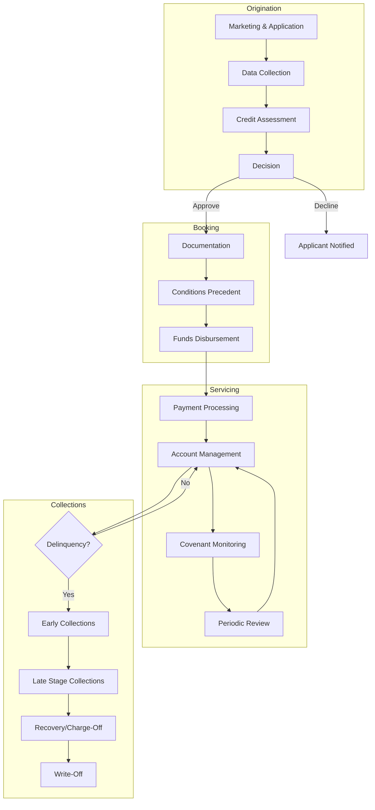
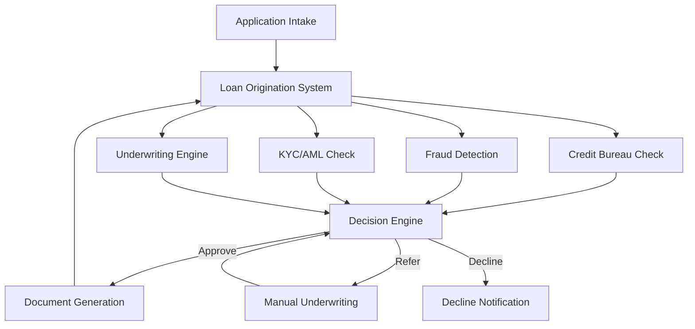
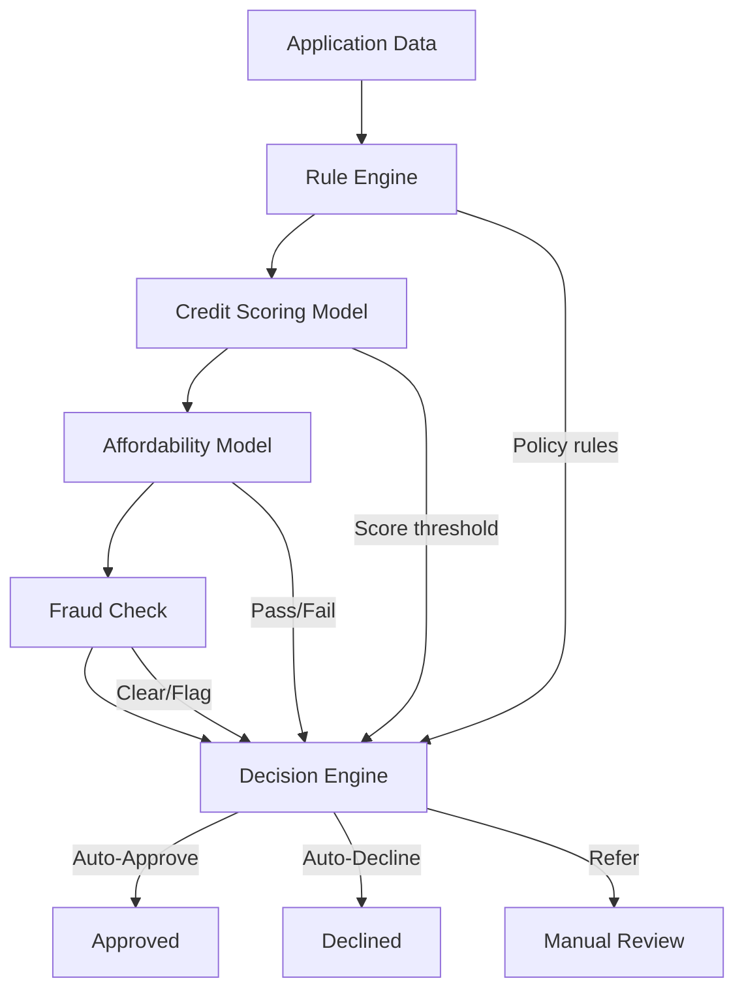
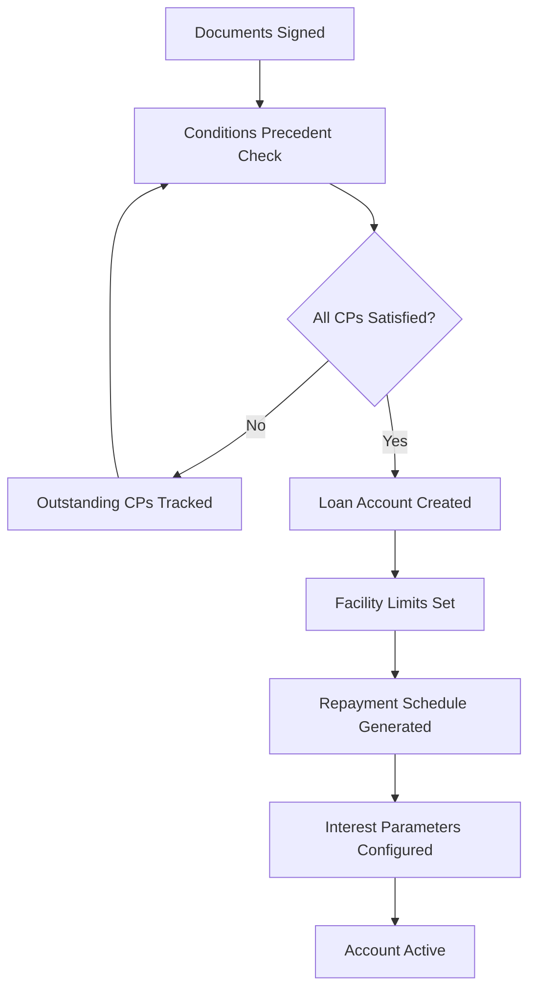
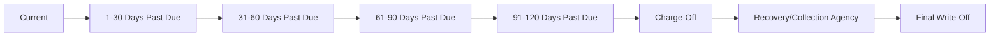
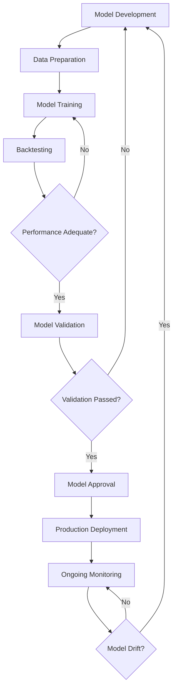
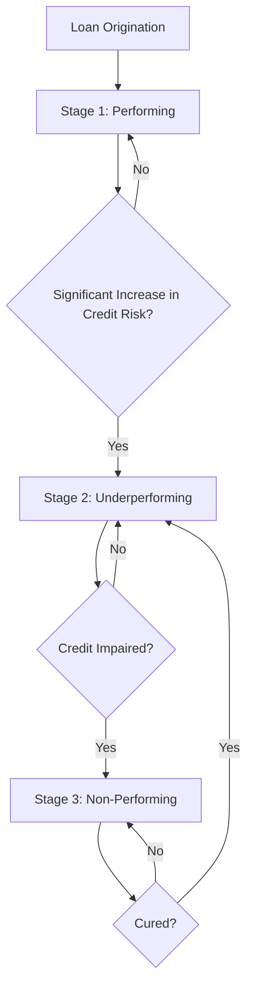
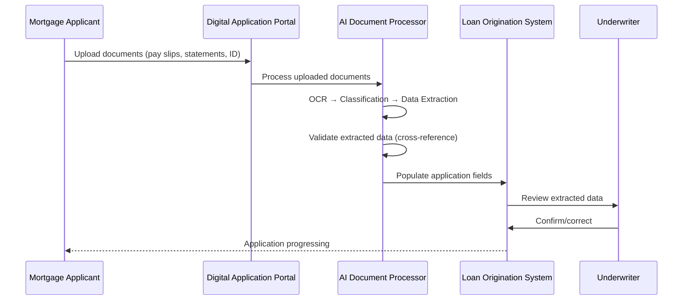

# Lending: Credit Lifecycle, Underwriting, Loan Origination, Servicing, and Collections

> **Audience:** Engineers building credit and lending systems.
> **Prerequisites:** [Banking 101](./banking-101.md), [Retail Banking](./retail-banking.md), [Corporate Banking](./corporate-banking.md)
> **Cross-references:** [AML and Fraud](./aml-and-fraud.md), [Treasury and Risk](./treasury-and-risk.md), [Databases](../databases/)

---

## Table of Contents

1. [The Credit Lifecycle](#1-the-credit-lifecycle)
2. [Loan Origination](#2-loan-origination)
3. [Credit Underwriting](#3-credit-underwriting)
4. [Credit Decisioning](#4-credit-decisioning)
5. [Loan Documentation and Booking](#5-loan-documentation-and-booking)
6. [Loan Servicing](#6-loan-servicing)
7. [Collections and Recoveries](#7-collections-and-recoveries)
8. [Credit Risk Modeling](#8-credit-risk-modeling)
9. [IFRS 9 / CECL: Expected Credit Loss](#9-ifrs-9--cecl-expected-credit-loss)
10. [GenAI in Lending](#10-genai-in-lending)
11. [Risks of AI in Lending](#11-risks-of-ai-in-lending)
12. [Key Regulations](#12-key-regulations)
13. [Common Systems and Technology](#13-common-systems-and-technology)
14. [Engineering Implications](#14-engineering-implications)
15. [Common Workflows](#15-common-workflows)
16. [Interview Questions](#16-interview-questions)

---

## 1. The Credit Lifecycle

The credit lifecycle encompasses every stage of a loan from initial application through final resolution. Understanding the full lifecycle is essential for engineers building lending systems.



### 1.1 Lifecycle Across Product Types

| Phase | Retail (Mortgage) | Retail (Personal Loan) | Corporate |
|-------|------------------|----------------------|-----------|
| **Origination** | 30-60 days | Minutes to hours | Weeks to months |
| **Underwriting** | Automated + manual | Fully automated | Credit committee |
| **Documentation** | Standard legal | Standard terms | Bespoke legal agreements |
| **Servicing** | Long-term (15-30 years) | Medium-term (1-7 years) | Ongoing relationship |
| **Collections** | Foreclosure process | Collections agency | Restructuring/workout |

---

## 2. Loan Origination

### 2.1 What Is Loan Origination?

Loan origination is the process of **receiving, processing, and deciding on** a loan application. It is the front-end of the credit lifecycle and the primary customer touchpoint.

### 2.2 Origination Channels

| Channel | Description | Products |
|---------|------------|----------|
| **Branch** | Customer applies in person with a banker | Mortgages, personal loans |
| **Digital/Online** | Self-service application via web or mobile | All retail products |
| **Broker/Intermediary** | Third-party broker submits on behalf of client | Mortgages, commercial loans |
| **Relationship Manager** | RM submits for corporate client | Corporate loans |
| **API/Partner** | Embedded lending via partner platforms | Point-of-sale loans, BNPL |

### 2.3 Origination Data Collection

**For Retail Loans:**
| Data Type | Examples | Source |
|-----------|----------|--------|
| **Personal** | Name, DOB, address, SSN/NI | Application |
| **Employment** | Employer, income, length of employment | Application, pay slips |
| **Financial** | Bank statements, assets, liabilities | Bank statements, credit report |
| **Credit** | Credit score, history, existing credit | Credit bureau |
| **Property** (mortgage) | Address, value, type | Valuation, Land Registry |
| **Purpose** | What the loan is for | Application |

**For Corporate Loans:**
| Data Type | Examples | Source |
|-----------|----------|--------|
| **Corporate** | Company registration, structure, ownership | Companies House, KYC |
| **Financial** | Audited financials, management accounts | Client submission |
| **Industry** | Sector analysis, market position | External research |
| **Existing Banking** | Current products, relationship history | Internal systems |
| **Purpose** | Use of funds, repayment source | Client discussion |
| **Security** | Collateral details, valuations | External valuers |

### 2.4 Loan Origination System (LOS)

The LOS is the central platform managing the origination process:



---

## 3. Credit Underwriting

### 3.1 What Is Underwriting?

Underwriting is the process of **assessing whether to lend** and on what terms. It evaluates the borrower's ability and willingness to repay.

### 3.2 The Five Cs of Credit

| C | Description | Questions Answered |
|---|------------|-------------------|
| **Character** | Willingness to repay | Credit history, references, track record |
| **Capacity** | Ability to repay | Income, cash flow, debt service coverage |
| **Capital** | Borrower's financial cushion | Equity contribution, net worth |
| **Collateral** | Secondary repayment source | Property, assets, guarantees |
| **Conditions** | External factors | Economic environment, industry trends |

### 3.3 Retail Underwriting: The 5 Key Checks

| Check | Purpose | Data Used |
|-------|---------|-----------|
| **Affordability** | Can the customer afford the repayments? | Income, expenditure, existing debts |
| **Creditworthiness** | Does the customer have a good credit history? | Credit bureau report, internal history |
| **Identity & Fraud** | Is the applicant who they claim to be? | KYC verification, fraud databases |
| **Collateral Value** | Is the security adequate? (secured loans) | Property valuation, LTV calculation |
| **Sustainability** | Will the customer afford repayments if rates rise? | Stress testing at higher rates |

### 3.4 Corporate Underwriting: Financial Analysis

| Analysis | Description | Key Metrics |
|----------|------------|-------------|
| **Profitability** | How profitable is the business? | EBITDA margin, ROE, ROA |
| **Leverage** | How much debt does the company carry? | Debt/EBITDA, Debt/Equity |
| **Coverage** | Can the company service its debt? | Interest coverage, DSCR |
| **Liquidity** | Can the company meet short-term obligations? | Current ratio, Quick ratio |
| **Efficiency** | How well does the company use its assets? | Asset turnover, working capital days |
| **Growth** | Is the company growing or declining? | Revenue growth, earnings growth |

### 3.5 Automated Underwriting

Most retail lending uses automated underwriting systems:



**Decision Engine Rules (Example):**
```
IF credit_score >= 650 
   AND affordability_check = PASS 
   AND fraud_check = CLEAR 
   AND ltv <= 80%
   AND dti <= 43%
THEN Auto-Approve

IF credit_score >= 600 
   AND credit_score < 650
   AND affordability_check = PASS
   AND fraud_check = CLEAR
THEN Refer to Manual Underwriter

IF credit_score < 600
   OR fraud_check = FLAG
THEN Auto-Decline
```

---

## 4. Credit Decisioning

### 4.1 Credit Scoring

Credit scoring assigns a numerical value representing the probability of default:

| Score Range (FICO) | Classification | Typical Outcome |
|-------------------|---------------|----------------|
| 800-850 | Exceptional | Best rates, auto-approve |
| 740-799 | Very Good | Favorable rates, auto-approve |
| 670-739 | Good | Standard rates, auto-approve |
| 580-669 | Fair | Higher rates, possible manual review |
| 300-579 | Poor | Likely decline |

### 4.2 Scorecard Design

**Application Scorecard** (for new applications):
```
Variable              Score Points
───────────────────────────────────
Age 25-34             +15
Age 35-44             +20
Age 45-54             +25
Employed > 2 years    +30
Income > $75K         +25
No adverse credit     +40
Current account > 3yr +15
Existing mortgage     +20
───────────────────────────────────
Total Score           Range: 0-200+
```

**Behavioral Scorecard** (for existing customers):
```
Variable              Score Points
───────────────────────────────────
No missed payments    +30
Regular savings       +15
Account tenure > 5yr  +10
Utilization < 30%     +20
No recent inquiries   +10
───────────────────────────────────
Total Score           Used for limit management
```

### 4.3 Pricing

Once approved, the loan must be priced:

```
Loan Rate = Base Rate + Risk Margin + Cost Margin + Profit Margin

Where:
- Base Rate: Reference rate (e.g., SOFR, Bank Rate)
- Risk Margin: Based on credit score/rating
- Cost Margin: Operational cost of the loan
- Profit Margin: Target return
```

**Risk-based pricing example:**

| Credit Score | Risk Margin | Total Rate (Base 5%) |
|-------------|-------------|---------------------|
| 780+ | 0.5% | 5.5% |
| 720-779 | 1.0% | 6.0% |
| 660-719 | 2.0% | 7.0% |
| 620-659 | 3.5% | 8.5% |
| 580-619 | 5.0% | 10.0% |

---

## 5. Loan Documentation and Booking

### 5.1 Documentation

**Retail Loans:**
- Loan agreement (standard form)
- Terms and conditions
- Key facts illustration / Schumer box
- Security documents (for secured loans: mortgage deed, charge)
- Guarantee documents (if applicable)

**Corporate Loans:**
- Facility agreement (bespoke, 100+ pages)
- Security documents (debentures, charges, guarantees)
- Legal opinions
- Board resolutions
- Conditions precedent checklist
- Intercreditor agreement (if multiple lenders)

### 5.2 Loan Booking

Once documents are signed, the loan is "booked" in the lending system:



**Engineering implication:** Loan booking requires precise configuration of:
- Principal amount and currency
- Interest rate type (fixed, floating), rate, calculation method
- Repayment frequency and amount
- Fees (origination, commitment, arrangement)
- Covenant thresholds and monitoring schedule
- Maturity date
- Drawdown schedule (for term loans with tranches)
- Collateral registration

---

## 6. Loan Servicing

### 6.1 What Is Loan Servicing?

Loan servicing is the **ongoing administration** of a loan after it has been booked. For a 30-year mortgage, this means 360 months of payment processing, statement generation, and account management.

### 6.2 Core Servicing Functions

| Function | Description |
|----------|------------|
| **Payment Processing** | Receiving and allocating payments (principal, interest, fees) |
| **Interest Calculation** | Daily accrual, rate changes, capitalization |
| **Balance Management** | Tracking outstanding balance, available credit |
| **Statement Generation** | Monthly/quarterly account statements |
| **Escrow Management** | Managing escrow accounts (taxes, insurance) |
| **Arrears Management** | Tracking missed payments, calculating late fees |
| **Account Changes** | Rate changes, term modifications, payment holidays |
| **Customer Communication** | Statements, notifications, reminders |
| **Regulatory Reporting** | Data feeds to credit bureaus, regulators |

### 6.3 Payment Allocation (Waterfall)

When a payment is received, it is allocated in a specific order:

```
Payment Received
    │
    ▼
1. Late Fees / Penalties
    │
    ▼
2. Accrued Interest
    │
    ▼
3. Principal
    │
    ▼
4. Escrow (if applicable)
    │
    ▼
5. Overpayment (if any) → Applied to principal reduction
```

**Engineering implication:** The payment allocation order is defined in the loan agreement and may vary by product. The system must be configurable, not hard-coded.

### 6.4 Amortization

For a standard amortizing loan, each payment is split between interest and principal:

```
Month 1: Interest = $2,000, Principal = $500 → Balance = $299,500
Month 2: Interest = $1,997, Principal = $503 → Balance = $298,997
Month 3: Interest = $1,993, Principal = $507 → Balance = $298,490
...
Month 360: Interest = $17, Principal = $2,483 → Balance = $0
```

**Key insight:** In the early years of a mortgage, most of the payment goes to interest. This is important for customer communications — customers often don't realize how slowly their balance decreases initially.

### 6.5 Interest Rate Changes

When interest rates change (for variable-rate loans):

| Scenario | Action |
|----------|--------|
| **Rate decrease** | Recalculate payment (lower) or keep same payment (shorter term) |
| **Rate increase** | Recalculate payment (higher) or keep same payment (longer term) |
| **Payment cap** | If payment cannot increase enough, negative amortization may occur |
| **Rate floor/ceiling** | Rate cannot go below floor or above ceiling |

**Engineering implication:** Rate changes must be applied from the correct effective date. Historical recalculations may be needed if a rate change was missed or applied incorrectly.

---

## 7. Collections and Recoveries

### 7.1 The Delinquency Timeline



### 7.2 Collections Strategies by Stage

| Stage | Action | Intensity |
|-------|--------|-----------|
| **1-30 DPD** | SMS/email reminders, courtesy calls | Low |
| **31-60 DPD** | Phone calls, letters, repayment plan offers | Medium |
| **61-90 DPD** | Intensified calls, field visits, settlement offers | High |
| **91-120 DPD** | Legal notice, charge-off preparation | Critical |
| **Charge-Off** | Sold to collection agency or internal recovery | Last resort |

### 7.3 Corporate Collections: Workout

For corporate borrowers in distress, a different approach is used:

| Action | Description |
|--------|------------|
| **Forbearance** | Temporary relief from payments while borrower restructures |
| **Restructuring** | Modifying loan terms (extend term, reduce rate, payment holiday) |
| **Debt-for-Equity Swap** | Converting debt to equity ownership |
| **Enforcement** | Taking control of collateral, appointing receivers |
| **Insolvency** | Formal bankruptcy proceedings |

### 7.4 Loss Given Default (LGD)

When a loan defaults, the bank incurs a loss:

```
LGD = 1 - Recovery Rate

Example:
Loan Balance: $100,000
Property Sold For: $75,000
Recovery Costs: $5,000
Net Recovery: $70,000
LGD = 1 - (70,000 / 100,000) = 30%
```

**Engineering implication:** LGD models feed into capital calculations and IFRS 9 ECL. Historical recovery data must be maintained and analyzed.

---

## 8. Credit Risk Modeling

### 8.1 Key Risk Parameters

| Parameter | Definition | Time Horizon |
|-----------|-----------|-------------|
| **PD (Probability of Default)** | Likelihood that a borrower defaults | 12-month or lifetime |
| **LGD (Loss Given Default)** | Percentage of exposure lost in default | At default |
| **EAD (Exposure at Default)** | Amount owed at the time of default | At default |
| **EL (Expected Loss)** | PD × LGD × EAD | Based on above |

```
Expected Loss = PD × LGD × EAD

Example:
PD = 2% (0.02)
LGD = 40% (0.40)
EAD = $200,000
EL = 0.02 × 0.40 × $200,000 = $1,600
```

### 8.2 Model Development and Validation

Credit models are developed by quantitative teams and must be validated:



---

## 9. IFRS 9 / CECL: Expected Credit Loss

### 9.1 The Concept

Banks must recognize expected credit losses on their loan portfolios, not just losses that have already occurred. This is forward-looking provisioning.

### 9.2 The Three-Stage Model



| Stage | Provision | Description |
|-------|-----------|-------------|
| **Stage 1** | 12-month ECL | Performing, no significant deterioration |
| **Stage 2** | Lifetime ECL | Performing but SICR detected |
| **Stage 3** | Lifetime ECL | Credit-impaired (in default) |

### 9.3 Forward-Looking Information

ECL calculations incorporate macroeconomic scenarios:

| Scenario | Probability | Impact on PD |
|----------|------------|-------------|
| **Base Case** | 50% | Current trend |
| **Upside Case** | 25% | Improved economy, lower PD |
| **Downside Case** | 25% | Recession, higher PD |

**Engineering implication:** ECL engines must:
- Calculate PD, LGD, EAD for every loan
- Apply multiple macroeconomic scenarios
- Aggregate to portfolio level
- Produce audit-ready reports
- Run monthly (at minimum) for the entire loan book

---

## 10. GenAI in Lending

### 10.1 Use Cases

| Use Case | Description | Value |
|----------|------------|-------|
| **Document Processing** | AI extracting data from pay slips, tax returns, bank statements for applications | 60-80% reduction in manual data entry |
| **Credit Memo Drafting** | AI drafting credit analysis sections from financial data | 40% time savings for analysts |
| **Customer Communication** | AI drafting collections letters, payment reminders | Consistency, reduced ops cost |
| **Policy Research** | AI answering questions about credit policy, underwriting guidelines | Faster RM/analyst onboarding |
| **Loan Application Triage** | AI reviewing applications for completeness before submission | Reduced rework |
| **Covenant Breach Analysis** | AI analyzing covenant breach scenarios and recommending actions | Faster RM response |
| **Collateral Valuation Support** | AI analyzing property market data to support valuations | Faster mortgage processing |
| **Restructuring Analysis** | AI modeling restructuring scenarios for distressed borrowers | Better workout outcomes |

### 10.2 Example: AI Document Processing for Mortgage Applications



### 10.3 Example: AI Credit Memo Assistant

```
Input:  Client financial data, credit bureau report, relationship history, market data
Process: RAG retrieval of client data → LLM analysis → Draft credit memo sections
Output: Structured credit memo draft with citations
Human:   Credit analyst reviews, edits, adds judgment
Result:   Completed credit memo submitted to credit committee
```

---

## 11. Risks of AI in Lending

### 11.1 Fair Lending and Bias Risk

| Risk | Scenario | Impact |
|------|----------|--------|
| **Discriminatory Output** | AI recommends different loan terms based on protected characteristics | Regulatory fines, lawsuits, reputational damage |
| **Proxy Discrimination** | AI uses variables that correlate with protected characteristics | Same impact as above |
| **Training Data Bias** | Historical lending data reflects past discrimination | AI perpetuates historical bias |
| **Geographic Bias** | AI systematically approves fewer loans from certain areas | Redlining concerns |

**Mitigation:**
- Regular fairness testing across protected groups
- Explainable AI models — every decision must be explainable
- Human review of AI recommendations
- Adverse action notices with specific reasons (regulatory requirement)
- Remove protected characteristics and their proxies from input data

### 11.2 Credit Decision Risk

| Risk | Scenario | Impact |
|------|----------|--------|
| **Wrongful Denial** | AI denies a creditworthy applicant | Lost revenue, regulatory complaint |
| **Wrongful Approval** | AI approves a high-risk applicant | Credit loss, increased NPLs |
| **Incorrect Pricing** | AI recommends wrong interest rate | Revenue loss or customer harm |
| **Data Staleness** | AI uses outdated financial data | Incorrect credit assessment |

### 11.3 Regulatory Compliance Risk

| Risk | Scenario | Impact |
|------|----------|--------|
| **Missing Adverse Action Notice** | AI denies loan but doesn't generate required notice | Regulatory violation |
| **Non-compliant Terms** | AI suggests loan terms that violate regulations | Regulatory breach |
| **Data Retention Violation** | AI training data includes records that should have been deleted | GDPR/privacy violation |

---

## 12. Key Regulations

| Regulation | Relevance to Lending |
|-----------|---------------------|
| **ECOA (US)** | Equal Credit Opportunity Act — no discrimination in lending |
| **Fair Lending Laws** | Prohibit discriminatory lending practices |
| **TILA (US)** | Truth in Lending Act — disclosure requirements |
| **HOEPA (US)** | Home Ownership and Equity Protection — high-cost mortgage rules |
| **RESPA (US)** | Real Estate Settlement Procedures Act |
| **IFRS 9** | Expected credit loss provisioning (international) |
| **CECL (US)** | Current Expected Credit Loss (US GAAP) |
| **Basel III** | Capital requirements for credit risk |
| **Consumer Duty (UK)** | FCA requirement for good customer outcomes |
| **MCOB (UK)** | Mortgage conduct of business rules |
| **GDPR** | Data protection in credit decisions |
| **SR 11-7 (US)** | Model risk management (applies to credit models) |

See [Regulations and Compliance](../regulations-and-compliance/) for details.

---

## 13. Common Systems and Technology

| System Category | Examples |
|----------------|----------|
| **Loan Origination** | Ellie Mae Encompass, Calyx Point, nCino, MSP |
| **Loan Servicing** | FIS LoanServicing, Fiserv, Black Knight, custom platforms |
| **Credit Decisioning** | Experian PowerCurve, FICO Origination Manager, Provenir |
| **Credit Scoring** | FICO Score, VantageScore, custom scorecards |
| **Collections** | FIS Collections, Finastra, custom collections platforms |
| **Document Management** | OpenText, Laserfiche, SharePoint |
| **Credit Risk** | Moody's Analytics, SAS Credit Risk, RiskMetrics |
| **Credit Bureaus** | Equifax, Experian, TransUnion (US); Experian, Equifax, CallCredit (UK) |

---

## 14. Engineering Implications

### 14.1 Data Accuracy and Precision

- Loan balances, interest calculations, and payment allocations must be exact
- Floating-point errors compound over the life of a loan
- Daily interest accrual runs on millions of accounts — performance matters
- Historical accuracy must be maintained (audit trail of every calculation)

### 14.2 Performance Requirements

| Operation | Typical SLA |
|-----------|------------|
| Credit decision (retail, auto) | < 30 seconds |
| Credit decision (mortgage, AVM) | < 5 minutes |
| Payment posting | End-of-day batch (complete within window) |
| Interest accrual | Overnight batch (complete within window) |
| Statement generation | Monthly batch (complete within 3 business days) |
| ECL calculation | Monthly (complete within 5 business days) |

### 14.3 Regulatory Reporting

Lending systems must feed:
- Credit bureau reporting (monthly)
- Regulatory capital calculations (quarterly)
- ECL reporting (monthly)
- NPL reporting (monthly)
- Consumer compliance reporting (monthly/quarterly)
- Stress testing data (annual CCAR in US)

### 14.4 Change Management

- Credit model changes require validation and approval
- Pricing changes must be applied from specific effective dates
- System changes affecting calculations require parallel run and reconciliation
- Rollback plans are mandatory for any calculation change

---

## 15. Common Workflows

### 15.1 Retail Loan Application to Funding

```
1. Customer submits application (digital or branch)
2. Identity verification (KYC)
3. Credit bureau pull
4. Automated underwriting (scorecard + affordability)
5. Decision: Auto-approve, Refer, or Auto-decline
6. If referred: Manual underwriter reviews
7. If approved: Terms communicated to customer
8. Customer accepts terms
9. Documentation generated and signed
10. Loan booked in servicing system
11. Funds disbursed
12. First payment due date set
```

### 15.2 Monthly Servicing Cycle

```
Day 1-End of Month:
  - Daily interest accrual
  - Payment processing as received
  - Late fee calculation for overdue accounts
  - Arrears status updates

Month-End Batch:
  - Statement generation for all accounts
  - Credit bureau reporting
  - General ledger posting
  - Regulatory data feeds
  - NPL staging updates
  - Collections queue assignment
```

### 15.3 Delinquency Management

```
1. Payment missed on due date
2. Grace period (if applicable, typically 15 days)
3. Day 1 DPD: Late fee applied, reminder sent
4. Day 5 DPD: Courtesy call
5. Day 15 DPD: Letter sent
6. Day 30 DPD: Report to credit bureau
7. Day 30-60 DPD: Regular collection calls
8. Day 60 DPD: Final notice
9. Day 90 DPD: Charge-off preparation
10. Day 120 DPD: Charge-off, account moved to recoveries
11. Recovery process begins (internal or external)
```

---

## 16. Interview Questions

### Foundational

1. **Walk through the credit lifecycle from application to charge-off.**
2. **What is the difference between PD, LGD, and EAD? How are they used?**
3. **Explain amortization. Why does most of an early mortgage payment go to interest?**
4. **What is the difference between Stage 1, Stage 2, and Stage 3 under IFRS 9?**

### Technical

5. **Design a payment allocation system for a loan servicing platform. How do you handle partial payments, overpayments, and payment holidays?**
6. **How would you implement a credit scoring system that is auditable and explainable?**
7. **Design the data model for a loan origination system that supports retail mortgages, personal loans, and corporate term loans.**
8. **How do you ensure daily interest accrual on 10 million loan accounts completes within a 4-hour maintenance window?**

### GenAI-Specific

9. **You are building an AI system to process mortgage application documents. What data quality checks are essential before the extracted data is used for underwriting?**
10. **How would you ensure an AI credit decisioning system does not discriminate against protected groups? How would you test this?**
11. **An AI system drafts credit memoranda for corporate loans. What safeguards prevent it from using outdated or incorrect financial data?**

### Scenario-Based

12. **A customer disputes their loan balance, claiming they made payments that aren't reflected. Walk through your investigation.**
13. **The ECL calculation shows a 40% increase in Stage 2 loans this month. What do you investigate?**
14. **A credit model has been producing scores that are 50 points higher than expected since the last update. What is your response?**

---

## Further Reading

- [Retail Banking](./retail-banking.md) — Consumer banking products
- [Corporate Banking](./corporate-banking.md) — Commercial lending, covenants
- [Treasury and Risk](./treasury-and-risk.md) — Credit risk, capital management
- [AML and Fraud](./aml-and-fraud.md) — Fraud detection in loan applications
- [KYC and Onboarding](./kyc-and-onboarding.md) — Identity verification for applicants
- [Databases](../databases/) — Data modeling for lending systems
- [Data Engineering](../data-engineering/) — ECL data pipelines
