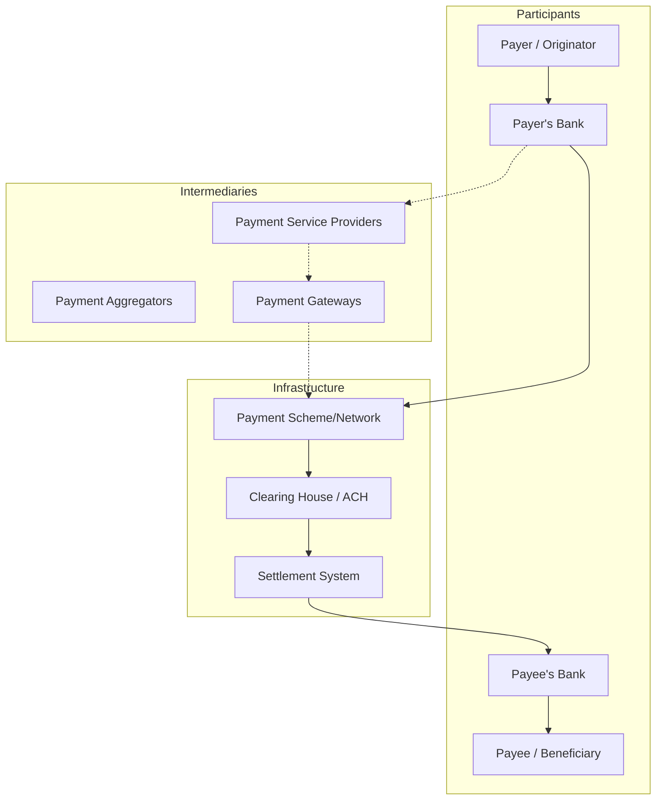
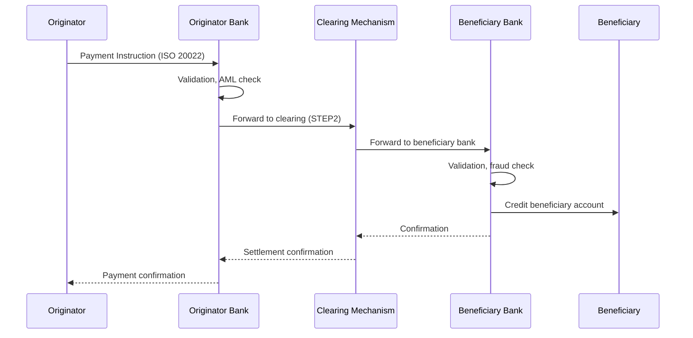
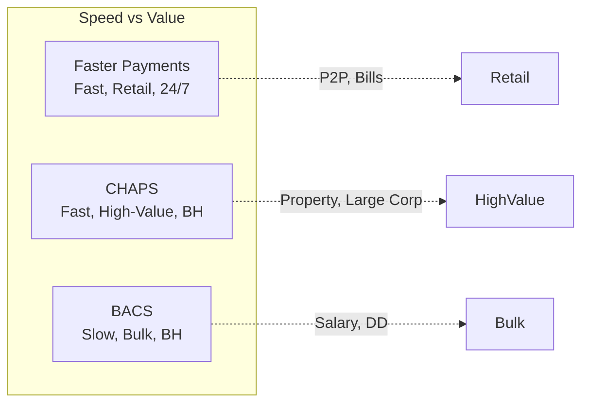
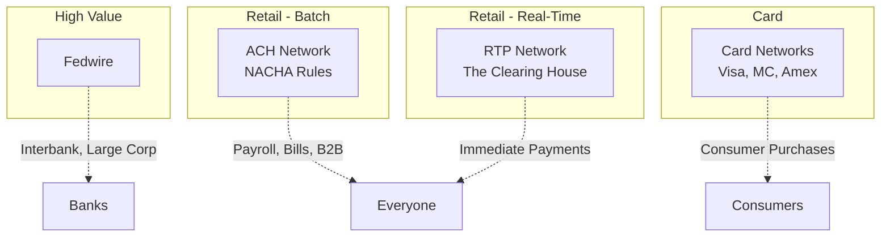
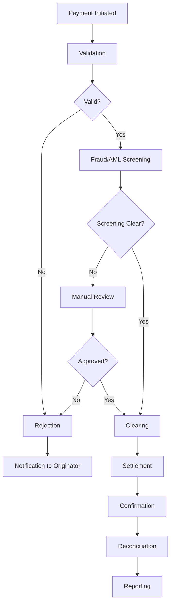
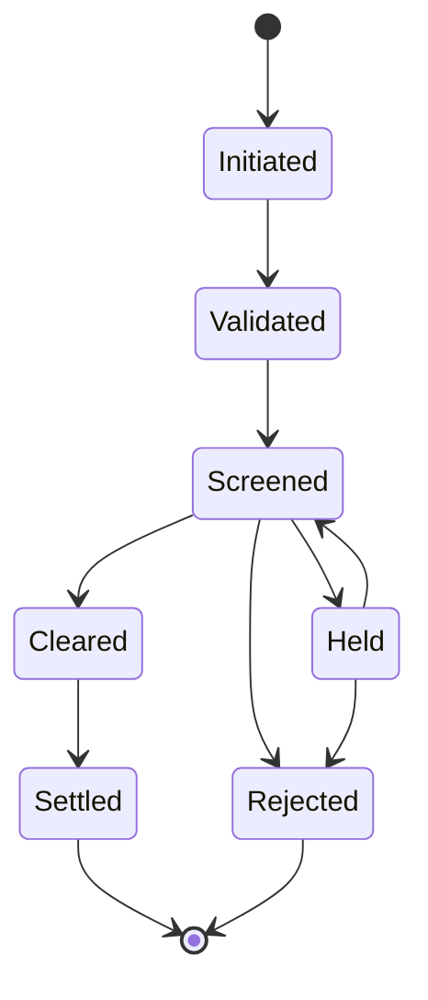

# Payments: Systems, Networks, Protocols, and Real-Time Payments

> **Audience:** Engineers building, maintaining, or integrating payment systems.
> **Prerequisites:** [Banking 101](./banking-101.md)
> **Cross-references:** [Cards and Transactions](./cards-and-transactions.md), [Corporate Banking](./corporate-banking.md), [AML and Fraud](./aml-and-fraud.md)

---

## Table of Contents

1. [What Is a Payment?](#1-what-is-a-payment)
2. [The Payment Ecosystem](#2-the-payment-ecosystem)
3. [Payment System Types](#3-payment-system-types)
4. [SWIFT](#4-swift)
5. [SEPA](#5-sepa)
6. [UK Faster Payments, CHAPS, and BACS](#6-uk-faster-payments-chaps-and-bacs)
7. [US Payment Systems: Fedwire, ACH, RTP](#7-us-payment-systems-fedwire-ach-rtp)
8. [Card Networks](#8-card-networks)
9. [Real-Time Payments](#9-real-time-payments)
10. [Payment Message Formats](#10-payment-message-formats)
11. [Payment Processing Lifecycle](#11-payment-processing-lifecycle)
12. [GenAI in Payments](#12-genai-in-payments)
13. [Risks of AI in Payments](#13-risks-of-ai-in-payments)
14. [Key Regulations](#14-key-regulations)
15. [Common Systems and Technology](#15-common-systems-and-technology)
16. [Engineering Implications](#16-engineering-implications)
17. [Common Workflows](#17-common-workflows)
18. [Interview Questions](#18-interview-questions)

---

## 1. What Is a Payment?

A payment is the **transfer of value** from one party (the originator/payer) to another (the beneficiary/payee). But behind this simple concept lies an extraordinarily complex infrastructure involving multiple intermediaries, messaging standards, reconciliation processes, and regulatory requirements.

### 1.1 The Four-Party Model (Card Payments)

```
Cardholder ──pays──► Merchant
    │                    │
    │                    │
 Issuer Bank          Acquirer Bank
    │                    │
    └──────Card─────────┘
          Network
    (Visa/MC/Amex)
```

### 1.2 The Correspondent Banking Model (Wire Transfers)

```
Payer ──► Payer's Bank ──► Correspondent Bank ──► Beneficiary's Bank ──► Beneficiary
              (Originating)    (Intermediary)         (Receiving)
```

Most international payments flow through **correspondent banking relationships** — banks holding accounts with each other to facilitate cross-border transfers.

---

## 2. The Payment Ecosystem



### 2.2 Key Terms

| Term | Definition |
|------|-----------|
| **Payment Initiation** | The process of starting a payment |
| **Clearing** | The exchange and validation of payment instructions between banks |
| **Settlement** | The actual transfer of funds between banks (final and irrevocable) |
| **Gross Settlement** | Each payment settled individually, in real-time |
| **Net Settlement** | Payments netted out and settled in batches |
| **RTGS** | Real-Time Gross Settlement — high-value, immediate settlement |
| **Deferred Net Settlement** | Payments batched and netted, settled at set intervals |

---

## 3. Payment System Types

### 3.1 High-Value Payment Systems

Used for large, time-critical payments (interbank transfers, settlements, corporate payments):

| System | Country | Type | Settlement |
|--------|---------|------|-----------|
| **Fedwire** | US | RTGS | Real-time, gross |
| **CHAPS** | UK | RTGS | Real-time, gross |
| **TARGET2** | Eurozone | RTGS | Real-time, gross |
| **BOJ-NET** | Japan | RTGS | Real-time, gross |
| **CNAPS HVPS** | China | RTGS | Real-time, gross |

**Characteristics:**
- Individual settlement (no netting)
- Real-time, irrevocable
- Typically operates during business hours
- Minimal transaction volume but highest value
- Critical to financial stability

### 3.2 Retail Payment Systems

Used for everyday payments by consumers and businesses:

| System | Country | Type | Settlement |
|--------|---------|------|-----------|
| **ACH** | US | Deferred net | Batch, 1-2 day |
| **BACS** | UK | Deferred net | Batch, 3 day |
| **SEPA Credit Transfer** | EU | Deferred net | 1 business day |
| **Faster Payments** | UK | Real-time | Near real-time |
| **SEPA Instant** | EU | Real-time | < 10 seconds |
| **RTP** | US | Real-time | Real-time |

### 3.3 Cross-Border Payment Systems

| System | Description |
|--------|------------|
| **SWIFT** | Messaging network for international payments |
| **Correspondent Banking** | Banks holding accounts with each other |
| **SEPA Cross-Border** | Euro payments across EU countries |
| **SWIFT gpi** | SWIFT's global payments innovation for tracking |

---

## 4. SWIFT

### 4.1 What Is SWIFT?

SWIFT (Society for Worldwide Interbank Financial Telecommunication) is a **messaging network** — not a payment system. It provides a secure, standardized way for banks to communicate payment instructions.

- Founded: 1973
- Members: 11,000+ institutions in 200+ countries
- Volume: 45+ million messages per day

### 4.2 How SWIFT Works

```
Bank A ──SWIFT message──► SWIFT Network ──SWIFT message──► Bank B
     │                                                      │
     ▼                                                      ▼
 Bank A debits                                         Bank B credits
 customer account                                      beneficiary account
```

The SWIFT message tells Bank B to pay the beneficiary. The actual fund movement happens through correspondent accounts or settlement systems.

### 4.3 SWIFT Message Types (MT)

| MT Series | Category | Common Types |
|-----------|----------|-------------|
| MT 1xx | Customer Payments | MT103 (Customer Transfer), MT103+ (SEPA) |
| MT 2xx | Financial Institution Transfers | MT202 (Bank Transfer), MT202 COV (Cover) |
| MT 3xx | FX and Money Markets | MT300 (FX Confirmation) |
| MT 4xx | Collections | MT400 (Collection Request) |
| MT 5xx | Securities | MT540-543 (Securities Settlement) |
| MT 7xx | Trade Finance | MT700 (Letter of Credit), MT760 (Guarantee) |
| MT 9xx | Statements | MT940 (Statement), MT950 (Interbank Statement) |

### 4.4 SWIFT MT to MX Migration

The industry is migrating from MT (proprietary SWIFT format) to MX (ISO 20022 XML format):

| Aspect | MT Format | MX Format (ISO 20022) |
|--------|-----------|----------------------|
| **Format** | Fixed-length fields | XML |
| **Data Richness** | Limited | Rich, structured |
| **Extensibility** | Not extensible | Extensible |
| **Migration Deadline** | | Coexistence period until Nov 2025 |

**Engineering implication:** Payment systems must support both MT and MX formats during the migration period and eventually MX-only.

### 4.5 SWIFT gpi (Global Payments Innovation)

SWIFT gpi improves cross-border payments:
- **End-to-end tracking:** Like tracking a parcel
- **Faster settlement:** Same-day for most corridors
- **Fee transparency:** All fees disclosed upfront
- **Payment status updates:** Real-time status

---

## 5. SEPA

### 5.1 What Is SEPA?

SEPA (Single Euro Payments Area) enables euro-denominated payments across 36 European countries as if they were domestic payments.

**Member countries:** All EU members + UK, Switzerland, Norway, Iceland, Liechtenstein, Monaco, San Marino, Vatican City, Andorra, Monaco.

### 5.2 SEPA Schemes

| Scheme | Description | Settlement Time |
|--------|------------|----------------|
| **SEPA Credit Transfer (SCT)** | Standard euro credit transfer | 1 business day |
| **SEPA Instant Credit Transfer (SCT Inst)** | Real-time euro transfer | < 10 seconds, 24/7/365 |
| **SEPA Direct Debit Core (SDD Core)** | Consumer direct debits | Variable |
| **SEPA Direct Debit B2B (SDD B2B)** | Business direct debits | Variable |
| **SEPA Card Clearing** | Card transaction clearing | Next day |

### 5.3 SEPA Payment Flow



---

## 6. UK Faster Payments, CHAPS, and BACS

### 6.1 Faster Payments

| Property | Value |
|----------|-------|
| **Type** | Real-time retail payment system |
| **Availability** | 24/7/365 |
| **Speed** | Typically < 2 seconds |
| **Limit** | Per-bank limits (typically £250K+) |
| **Settlement** | Deferred net (multiple times per day) |
| **Use Case** | Person-to-person, bill payments, immediate transfers |

### 6.2 CHAPS

| Property | Value |
|----------|-------|
| **Type** | High-value RTGS |
| **Availability** | Business hours |
| **Speed** | Real-time (same day guaranteed) |
| **Limit** | No limit |
| **Settlement** | Real-time, gross (settled at Bank of England) |
| **Use Case** | Property purchases, large corporate payments, settlement |

### 6.3 BACS

| Property | Value |
|----------|-------|
| **Type** | Automated clearing system |
| **Availability** | Business days |
| **Speed** | 3 working days |
| **Limit** | No limit |
| **Settlement** | Deferred net |
| **Use Case** | Salary payments, direct debits, regular business payments |

### 6.4 UK Payment System Comparison



---

## 7. US Payment Systems: Fedwire, ACH, RTP

### 7.1 Fedwire

| Property | Value |
|----------|-------|
| **Type** | RTGS operated by the Federal Reserve |
| **Availability** | Business hours (extended) |
| **Speed** | Real-time |
| **Limit** | No limit |
| **Use Case** | Interbank transfers, large corporate payments, securities settlement |

### 7.2 ACH (Automated Clearing House)

| Property | Value |
|----------|-------|
| **Type** | Deferred net clearing system |
| **Availability** | Business days (multiple settlement windows) |
| **Speed** | 1-2 business days (Same Day ACH available) |
| **Limit** | Varies by entry class |
| **Use Case** | Direct deposit, bill payments, B2B payments |

**ACH Entry Classes:**

| Code | Description |
|------|------------|
| **PPD** | Prearranged Payment and Deposit (consumer) |
| **CCD** | Corporate Credit or Debit (business) |
| **CTX** | Corporate Trade Exchange (business with remittance) |
| **WEB** | Internet-initiated entries |
| **TEL** | Telephone-initiated entries |
| **ARC** | Accounts Receivable Entry (check conversion) |

### 7.3 RTP (Real-Time Payments)

| Property | Value |
|----------|-------|
| **Type** | Real-time payment system operated by The Clearing House |
| **Availability** | 24/7/365 |
| **Speed** | Real-time (< seconds) |
| **Limit** | $1M+ per transaction |
| **Settlement** | Real-time, gross, final |
| **Use Case** | Immediate payments, person-to-person, emergency payments |

### 7.4 US Payment Landscape Overview



---

## 8. Card Networks

### 8.1 Major Card Networks

| Network | Type | Market Position |
|---------|------|----------------|
| **Visa** | Four-party model | Largest globally by volume |
| **Mastercard** | Four-party model | Second largest globally |
| **American Express** | Three-party model (issuer + acquirer) | Premium segment |
| **Discover** | Three-party model | US-focused |
| **UnionPay** | Four-party model | Largest by cards in issue (China) |
| **JCB** | Three-party model | Japan |

### 8.2 Four-Party vs. Three-Party Model

**Four-Party Model (Visa, Mastercard):**
```
Cardholder ──► Issuer Bank ──► Card Network ──► Acquirer Bank ──► Merchant
```

**Three-Party Model (Amex, Discover):**
```
Cardholder ──► Amex (Issuer + Acquirer) ──► Merchant
```

### 8.3 Card Transaction Flow

See [Cards and Transactions](./cards-and-transactions.md) for the complete deep-dive.

**Quick overview of the key steps:**
1. **Authorization:** Real-time check of card validity and available funds
2. **Clearing:** Exchange of transaction details between issuer and acquirer
3. **Settlement:** Movement of funds between banks
4. **Dispute/Chargeback:** Process for contested transactions

---

## 9. Real-Time Payments

### 9.1 The Global Trend

Real-time payments are the fastest-growing payment type globally:

| System | Country | Launch | Speed |
|--------|---------|--------|-------|
| **Faster Payments** | UK | 2008 | < 2 seconds |
| **FPS** | Singapore | 2014 | Real-time |
| **UPI** | India | 2016 | Real-time |
| **PIX** | Brazil | 2020 | Real-time |
| **RTP** | US | 2017 | Real-time |
| **FedNow** | US | 2023 | Real-time |
| **SEPA Instant** | EU | 2017 | < 10 seconds |
| **NPP** | Australia | 2018 | Real-time |
| **PayNow** | Singapore | 2017 | Real-time |

### 9.2 Real-Time Payment Characteristics

| Characteristic | Requirement |
|---------------|------------|
| **Availability** | 24/7/365 (no downtime) |
| **Speed** | < 10 seconds end-to-end |
| **Finality** | Settlement is immediate and irrevocable |
| **Confirmation** | Confirmation of credit to originator |
| **Rich Data** | ISO 20022 messages with remittance information |

### 9.3 Engineering Challenges for Real-Time Payments

| Challenge | Description |
|-----------|------------|
| **Always-On** | No maintenance windows — must be truly 24/7 |
| **Irrevocability** | Once sent, the payment cannot be reversed |
| **Fraud Detection** | Must detect fraud in < 300ms (before the payment completes) |
| **Liquidity Management** | Banks must manage their settlement accounts in real-time |
| **Scalability** | Peak volumes (payday, holidays) must be handled |
| **Interoperability** | Connecting to other real-time systems domestically and internationally |

---

## 10. Payment Message Formats

### 10.1 ISO 20022

ISO 20022 is becoming the **global standard** for payment messaging. It uses XML and provides rich, structured data.

**Key ISO 20022 Payment Messages:**

| Message | Description |
|---------|------------|
| **pacs.008** | Financial Institution Credit Transfer (bank-to-bank payment) |
| **pacs.009** | Financial Institution Credit Transfer (interbank) |
| **pain.001** | Customer Credit Transfer Initiation |
| **pain.002** | Payment Status Report |
| **camt.053** | Bank-to-Customer Statement |
| **camt.054** | Bank-to-Customer Debit/Credit Notification |
| **pacs.002** | Payment Status Report (FIToFI) |
| **pacs.028** | Request for Payment (RFP) |

### 10.2 ISO 20022 vs. Legacy Formats

| Aspect | Legacy (MT, NACHA, proprietary) | ISO 20022 |
|--------|--------------------------------|-----------|
| **Format** | Fixed-length, flat files | XML |
| **Data** | Limited character fields | Rich, structured data |
| **Extensibility** | Not extensible | Extensible |
| **Remittance** | Limited or unstructured | Full structured remittance |
| **Adoption** | Being phased out | Mandatory for many systems |

### 10.3 Example: pain.001 (Customer Credit Transfer) Structure

```xml
<Document>
  <CstmrCdtTrfInitn>
    <GrpHdr>
      <MsgId>MSG-12345</MsgId>
      <CreDtTm>2024-01-15T10:30:00</CreDtTm>
      <NbOfTxs>1</NbOfTxs>
      <CtrlSum>1500.00</CtrlSum>
    </GrpHdr>
    <PmtInf>
      <PmtInfId>PMT-67890</PmtInfId>
      <PmtMtd>TRF</PmtMtd>
      <ReqdExctnDt>2024-01-15</ReqdExctnDt>
      <Dbtr>
        <Nm>John Smith</Nm>
        <PstlAdr>...</PstlAdr>
      </Dbtr>
      <DbtrAcct>
        <Id><IBAN>GB29NWBK60161331926819</IBAN></Id>
      </DbtrAcct>
      <CdtTrfTxInf>
        <PmtId>
          <EndToEndId>E2E-11111</EndToEndId>
        </PmtId>
        <Amt><InstdAmt Ccy="GBP">1500.00</InstdAmt></Amt>
        <Cdtr>
          <Nm>ABC Landlord Ltd</Nm>
        </Cdtr>
        <CdtrAcct>
          <Id><IBAN>GB82WEST12345698765432</IBAN></Id>
        </CdtrAcct>
        <RmtInf>
          <Ustrd>Rent for January 2024</Ustrd>
        </RmtInf>
      </CdtTrfTxInf>
    </PmtInf>
  </CstmrCdtTrfInitn>
</Document>
```

---

## 11. Payment Processing Lifecycle



### 11.1 Each Step Explained

| Step | Description | Engineering Considerations |
|------|------------|--------------------------|
| **Initiation** | Payment instruction received | Multiple channels (API, file, UI, SWIFT) |
| **Validation** | Format, mandatory fields, account validity | Schema validation, account lookup |
| **Fraud/AML Screening** | Sanctions, watchlists, anomaly detection | Real-time screening, fuzzy matching |
| **Clearing** | Payment instruction sent to receiving bank | Scheme-specific formatting, routing |
| **Settlement** | Funds move between banks | Liquidity management, account balances |
| **Confirmation** | Both parties notified | Status notifications, pain.002 |
| **Reconciliation** | Internal records match external settlement | Automated matching, exception handling |
| **Reporting** | Regulatory and management reporting | Data aggregation, audit trails |

---

## 12. GenAI in Payments

### 12.1 Use Cases

| Use Case | Description | Value |
|----------|------------|-------|
| **Payment Investigation** | AI summarizing payment status, tracing stalled payments | Reduced ops time, faster resolution |
| **Exception Handling** | AI classifying and routing payment exceptions | Faster resolution, reduced manual sorting |
| **Payment Data Enrichment** | AI extracting and structuring remittance information from unstructured text | Better reconciliation |
| **Regulatory Reporting** | AI generating payment regulatory reports from transaction data | Compliance efficiency |
| **Client Inquiry Response** | AI answering client questions about payment status | Reduced call center volume |
| **SWIFT Message Generation** | AI generating correct SWIFT/ISO 20022 messages from natural language descriptions | Reduced ops errors |
| **Reconciliation Assistance** | AI suggesting matches for unmatched payment items | Faster reconciliation |
| **Payment Analytics** | AI analyzing payment patterns for business insights | Better product decisions |

### 12.2 Example: AI Payment Investigation Assistant

```mermaid
sequenceDiagram
    participant Ops as Ops Team Member
    interface as Investigation Portal
    participant AI as AI Engine
    participant RAG as RAG Pipeline
    participant PaySys as Payment Systems
    participant SWIFT as SWIFT Messages
    
    Ops->>interface: "Where is payment ABC-12345?"
    interface->>AI: Query payment status
    AI->>RAG: Retrieve payment trail
    RAG->>PaySys: Get payment details
    PaySys-->>RAG: Payment record, status history
    RAG->>SWIFT: Get related SWIFT messages
    SWIFT-->>RAG: MT103, MT202, gpi tracking
    RAG-->>AI: Complete payment trail
    AI->>AI: Synthesize narrative
    AI-->>interface: "Payment ABC-12345 was initiated on...<br/>Currently held at intermediary bank...<br/>ETA: ..."
    interface-->>Ops: Formatted investigation result
```

### 12.3 Example: AI Payment Exception Classifier

```
Input:   Payment exception record with error codes, messages, payment details
Process: AI classifies exception type, suggests resolution action, predicts resolution time
Output:  Classified exception with recommended action
Human:   Ops team member reviews and confirms (or overrides)
Result:  Exception routed to correct queue with suggested fix
```

---

## 13. Risks of AI in Payments

### 13.1 Payment Execution Risk

| Risk | Scenario | Impact |
|------|----------|--------|
| **Incorrect Payment Instruction** | AI generates wrong SWIFT message format | Payment fails or goes to wrong beneficiary |
| **Amount Error** | AI misreads amount from document | Wrong amount sent — potentially large loss |
| **Duplicate Payment** | AI processes a payment that was already processed | Financial loss, reconciliation complexity |
| **Missed Fraud** | AI incorrectly classifies a fraudulent payment as legitimate | Financial loss, regulatory breach |
| **False Fraud Alert** | AI blocks a legitimate payment as suspicious | Customer dissatisfaction, business disruption |

### 13.2 Compliance Risk

| Risk | Scenario | Impact |
|------|----------|--------|
| **Sanctions Evasion** | AI fails to match a sanctions list entry | Massive regulatory fine, criminal liability |
| **AML Gap** | AI misses suspicious payment pattern | Regulatory fine, enforcement action |
| **Data Privacy** | AI processes payment data containing PII inappropriately | GDPR violation |

### 13.3 Mitigation Strategies

- **AI should never execute payments directly.** AI can recommend, but execution requires human approval or deterministic system logic.
- **Deterministic rules for compliance.** Sanctions screening and AML rules must be deterministic, not AI-based. AI can augment but not replace.
- **Complete audit trails.** Every AI interaction with payment data must be logged.
- **Fallback mechanisms.** If the AI system fails, payment processing must continue via standard processes.
- **Regular validation.** AI classifications must be validated against actual outcomes.

---

## 14. Key Regulations

| Regulation | Relevance to Payments |
|-----------|----------------------|
| **PSD2/PSD3 (EU)** | Payment services, strong customer authentication, open banking |
| **Regulation (EU) 2021/1230** | Cross-border payment charges, fee transparency |
| **Instant Payments Regulation (EU)** | SEPA Instant adoption requirements |
| **DORA (EU)** | Digital operational resilience for payment services |
| **NACHA Rules (US)** | ACH network operating rules |
| **Regulation CC (US)** | Funds availability, check clearing |
| **Regulation E (US)** | Electronic fund transfers, consumer protection |
| **Faster Payments Rules (UK)** | Participation rules for Faster Payments |
| **Payment Account Regulations (UK)** | Access to payment accounts |
| **OFAC Sanctions** | Sanctions screening on all USD payments |
| **FATF Recommendations** | AML standards for payment providers |

See [Regulations and Compliance](../regulations-and-compliance/) for details.

---

## 15. Common Systems and Technology

| System Category | Examples |
|----------------|----------|
| **Payment Hubs** | FIS PaymentHub, Finastra Payment Gateway, custom platforms |
| **SWIFT Connectivity** | SWIFT Alliance, Alliance Access, Alliance Cloud |
| **Clearing Connectivity** | NACHA-file processors, Faster Payments connectivity, SEPA connectivity |
| **Sanctions Screening** | Oracle OFAC, Fircosoft, Dow Jones Risk & Compliance |
| **Fraud Detection** | NICE Actimize, SAS Fraud Management, Featurespace |
| **Reconciliation** | SmartStream TLM, Finastra Fusion Reconciliation |
| **Payment Tracking** | SWIFT gpi Tracker, internal tracking systems |
| **Message Translation** | MT-MX translators, format converters |

---

## 16. Engineering Implications

### 16.1 Idempotency Is Non-Negotiable

Payment systems receive duplicate messages. Network retries, system restarts, and human re-submissions all cause duplicates. **Every payment endpoint must be idempotent.**

```
Idempotency Key Approach:
1. Client generates unique idempotency key per payment
2. Server stores key + result
3. If same key received again, return original result (do not re-execute)
4. Keys should expire after a defined period
```

### 16.2 Payment State Machines

Every payment has a state. Transitions must be well-defined and irreversible in certain cases:



### 16.3 Precision and Rounding

- Payment amounts must use exact decimal representation (never float)
- Currency-specific decimal places (JPY has 0, USD has 2, BHD has 3)
- Exchange rate precision matters — 6+ decimal places
- Fees calculated per scheme rules, often with minimums and maximums

### 16.4 Error Handling

Payment errors must be:
- **Clear:** The originator must understand what went wrong
- **Actionable:** The error must indicate what to do next
- **Traceable:** Every error must have a unique reference for investigation
- **Logged:** Complete context preserved for debugging

### 16.5 Observability

Payment systems require comprehensive monitoring:
- Transaction volumes (by type, channel, scheme)
- Processing times (p50, p95, p99)
- Error rates (by error type)
- Queue depths (pending payments)
- Settlement account balances
- Fraud/AML hit rates
- Reconciliation breaks

---

## 17. Common Workflows

### 17.1 Customer Initiates a Wire Transfer

```
1. Customer logs into online/mobile banking
2. Enters beneficiary details (name, account, SWIFT/BIC, amount)
3. System validates account format and beneficiary name
4. Customer authenticates (2FA / biometric)
5. Payment submitted to payment processing system
6. Sanctions screening (real-time)
7. If clear: payment routed via appropriate scheme (Fedwire/SWIFT)
8. Customer account debited
9. Payment confirmation sent
10. Settlement occurs between banks
11. Customer notified of completion
```

### 17.2 Payment Investigation

```
1. Customer complains: "Payment hasn't arrived"
2. Ops team retrieves payment record
3. Checks payment status in tracking system
4. If via SWIFT gpi: checks gpi tracker for current location
5. If stuck at intermediary: sends SWIFT inquiry (MT199)
6. Intermediary responds with status
7. If lost: initiates trace process
8. If confirmed lost: re-issues payment
9. Customer updated throughout
10. Investigation logged
```

### 17.3 End-of-Day Reconciliation

```
1. All payment messages for the day collected
2. Internal payment records compared with settlement reports
3. Matching:
   - Matched: OK, archived
   - Unmatched (our side has it, settlement doesn't): Investigate
   - Unmatched (settlement has it, our side doesn't): Investigate
4. Breaks logged and assigned for investigation
5. Reconciliation report generated and signed off
6. General ledger updated with settlement amounts
7. Regulatory reports generated if required
```

---

## 18. Interview Questions

### Foundational

1. **Explain the difference between clearing and settlement in payments.**
2. **What is the difference between RTGS and deferred net settlement?**
3. **Why are cross-border payments slower than domestic payments?**
4. **What is SWIFT and why doesn't it actually move money?**

### Technical

5. **Design an idempotent payment API. How do you handle duplicate requests?**
6. **How would you design a sanctions screening system that processes payments in under 100ms?**
7. **A payment system needs to support 100 payment schemes across 50 countries. How do you architect this?**
8. **How do you ensure payment state transitions are atomic and auditable?**

### GenAI-Specific

9. **You are building an AI payment investigation assistant. What data sources does it need, and what guardrails are essential?**
10. **Can an AI system make decisions about blocking suspicious payments? Why or why not?**
11. **How would you design a system that uses AI to enrich payment remittance data while ensuring no PII is exposed to external LLM services?**

### Scenario-Based

12. **A customer's $50M payment is stuck in the system. It passed all checks but the receiving bank hasn't confirmed receipt. Walk through your investigation.**
13. **The sanctions screening system starts producing false positives at 10x the normal rate. What is your response?**
14. **During peak processing (payday), the payment system latency increases from 50ms to 5 seconds. What is your approach to diagnosing and fixing this?**

---

## Further Reading

- [Cards and Transactions](./cards-and-transactions.md) — Card payment processing in detail
- [Corporate Banking](./corporate-banking.md) — Cash management, SWIFT for corporates
- [AML and Fraud](./aml-and-fraud.md) — Transaction monitoring, sanctions screening
- [Compliance Teams](./compliance-teams-and-how-they-work.md) — How compliance reviews engineering work
- [Data Engineering](../data-engineering/) — Payment data pipelines
- [Databases](../databases/) — Data modeling for payment systems
