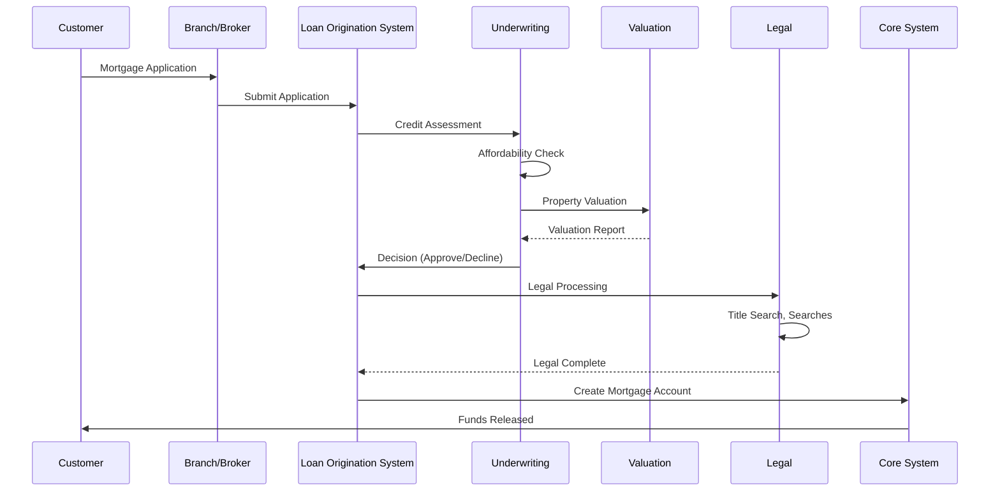
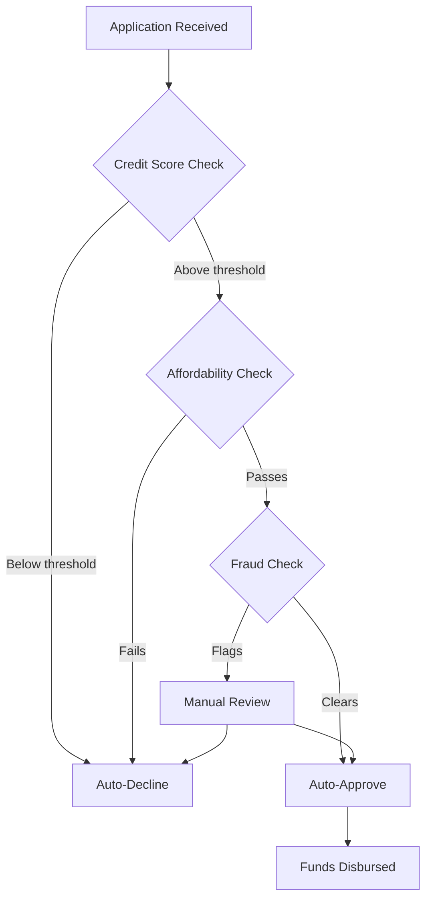
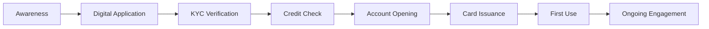
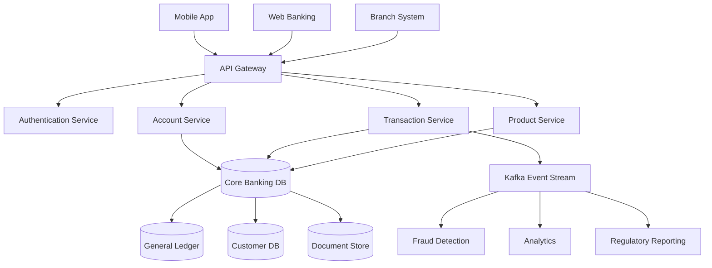
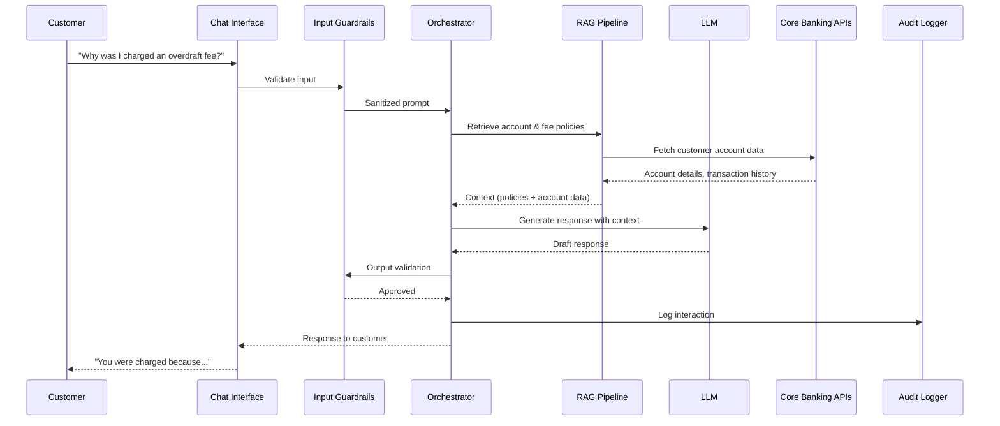

# Retail Banking: Consumer Products, Accounts, and Services

> **Audience:** Engineers building systems for consumer-facing banking products.
> **Prerequisites:** [Banking 101](./banking-101.md)
> **Cross-references:** [Lending](./lending.md), [Cards and Transactions](./cards-and-transactions.md), [KYC and Onboarding](./kyc-and-onboarding.md)

---

## Table of Contents

1. [What Is Retail Banking?](#1-what-is-retail-banking)
2. [Core Retail Banking Products](#2-core-retail-banking-products)
3. [Deposit Accounts](#3-deposit-accounts)
4. [Mortgages](#4-mortgages)
5. [Personal Loans](#5-personal-loans)
6. [Credit Cards (Overview)](#6-cards-overview)
7. [Savings and Investment Products](#7-savings-and-investment-products)
8. [The Retail Banking Customer Journey](#8-the-retail-banking-customer-journey)
9. [How Retail Banking Systems Work](#9-how-retail-banking-systems-work)
10. [GenAI in Retail Banking](#10-genai-in-retail-banking)
11. [Risks of AI in Retail Banking](#11-risks-of-ai-in-retail-banking)
12. [Key Regulations](#12-key-regulations)
13. [Common Systems and Technology](#13-common-systems-and-technology)
14. [Engineering Implications](#14-engineering-implications)
15. [Common Workflows](#15-common-workflows)
16. [Interview Questions](#16-interview-questions)

---

## 1. What Is Retail Banking?

Retail banking (also called **consumer banking** or **personal banking**) is the face of banking that most people interact with daily. It serves individual consumers — not businesses, not institutions — with everyday financial products.

**Key characteristics:**
- **High volume, low value per transaction:** Millions of customers making small transactions
- **Standardized products:** Products are mass-produced, not customized per customer
- **Branch and digital channels:** Historically branch-based, now increasingly digital-first
- **Regulated consumer protection:** Heavy regulation to protect individual consumers
- **Relationship-based:** Banks aim to be the "primary bank" for each customer, cross-selling multiple products

**Scale context:** A large retail bank may have:
- 50+ million retail customers
- 100+ million deposit accounts
- 10+ million mortgage accounts
- 20+ million credit cards
- Processing billions of transactions per day

---

## 2. Core Retail Banking Products

```mermaid
graph TD
    RB[Retail Banking Products] --> DA[Deposit Accounts]
    RB --> L[Loans]
    RB --> CC[Cards]
    RB --> SI[Savings & Investments]
    RB --> PB[Payment Services]
    
    DA --> CA[Checking/Current Account]
    DA --> SA[Savings Account]
    DA --> TD[Term Deposits / CDs]
    DA --> ISA[ISA (UK) / IRA (US)]
    
    L --> MT[Mortgages]
    L --> PL[Personal Loans]
    L --> OD[Overdrafts]
    L --> AL[Auto Loans]
    
    CC --> CRC[Credit Cards]
    CC --> DC[Debit Cards]
    CC --> PC[Prepaid Cards]
    
    SI --> SSA[Stocks & Shares ISA]
    SI --> MF[Mutual Funds]
    SI --> P[Pensions]
    
    PB --> OP[Online Payments]
    PB --> BP[Bill Payments]
    PB --> TT[Transfers]
```

---

## 3. Deposit Accounts

### 3.1 Checking Account (US) / Current Account (UK)

The everyday transaction account. This is the **gateway product** — the first relationship a customer has with a bank.

**Features:**
- Debit card linked to the account
- Direct deposit (salary payments)
- Bill payments and standing orders
- Overdraft facility (often)
- Mobile and online banking access
- ATM access

**Key terms:**
- **Overdraft:** Permission to withdraw more than the available balance, up to a limit. Can be authorized (pre-arranged) or unauthorized.
- **Standing Order:** A customer instruction to pay a fixed amount at regular intervals.
- **Direct Debit:** A customer authorization allowing a third party to collect variable amounts from the account.
- **ACH (US) / BACS (UK):** Automated clearing house systems for batch payment processing.

**Engineering implications:**
- Account balance calculations must be exact (floating-point errors are unacceptable)
- Transaction ordering matters (race conditions in simultaneous deposits/withdrawals)
- Overdraft limit calculations feed into credit risk systems
- Every transaction must be auditable

### 3.2 Savings Account

An interest-bearing deposit account.

**Types:**
| Type | Description | Rate Characteristics |
|------|------------|---------------------|
| **Instant Access** | Withdraw anytime | Variable rate, typically lower |
| **Notice Account** | Give notice before withdrawal | Higher rate |
| **Fixed-Term Bond** | Locked for a period | Fixed rate, penalty for early withdrawal |
| **Regular Saver** | Monthly deposit requirement | Bonus rate for meeting targets |

**Key concept — Interest Calculation:**

```
Daily Balance Method:
Daily Interest = (Balance × Annual Rate) / 365 (or 360)
Monthly Credit = Sum of Daily Interest for the month
```

**Engineering implications:**
- Interest accrual runs daily (batch process)
- Rate changes must be applied from specific effective dates
- Tax reporting may be required (e.g., 1099-INT in the US)
- Compound interest calculations require high precision

### 3.3 Term Deposits / Certificates of Deposit (CDs)

Fixed-term, fixed-rate deposits where the customer commits money for a specific period.

**Key terms:**
- **Maturity Date:** When the term ends and funds become available
- **Early Withdrawal Penalty:** Fee for accessing funds before maturity
- **Ladder Strategy:** Customer holds multiple CDs with staggered maturities

### 3.4 Deposit Insurance

| Jurisdiction | Scheme | Coverage Limit |
|-------------|--------|---------------|
| US | FDIC | $250,000 per depositor, per bank |
| UK | FSCS | £85,000 per person, per bank |
| EU | DGS | €100,000 per depositor, per bank |

**Engineering implication:** Systems must track deposit balances against insurance limits and report to the relevant scheme.

---

## 4. Mortgages

A mortgage is a loan secured against residential property. It is typically the largest financial commitment a consumer makes.

### 4.1 Mortgage Components

| Component | Description |
|-----------|------------|
| **Principal** | The loan amount |
| **Interest Rate** | Fixed, variable, or tracker |
| **Term** | Typically 15-30 years |
| **LTV (Loan-to-Value)** | Loan amount as % of property value |
| **DTI (Debt-to-Income)** | Monthly payments as % of income |

### 4.2 Mortgage Types

| Type | Description | Risk Profile |
|------|------------|-------------|
| **Fixed Rate** | Rate locked for 2, 3, 5, or 10 years | Predictable for customer, rate risk for bank |
| **Variable/ARM** | Rate changes with market conditions | Customer bears rate risk |
| **Interest-Only** | Only interest paid; principal due at end | Higher risk, higher LTV |
| **Offset** | Savings balance offset against mortgage | Reduces interest, common in UK |

### 4.3 The Mortgage Lifecycle



### 4.4 Mortgage Underwriting Criteria

- **Credit Score:** Minimum score thresholds (FICO, Experian, Equifax)
- **Affordability:** Income verification, expenditure analysis, stress testing at higher rates
- **LTV Limits:** Maximum loan amounts relative to property value (typically 80-95%)
- **Employment Status:** Stable income, length of employment
- **Property Type:** Some property types are higher risk (flats, ex-local authority)

**Engineering implications:**
- Underwriting engines encode complex business rules
- Integration with credit bureaus (Equifax, Experian, TransUnion)
- Automated valuation models (AVMs) for property valuation
- Affordability calculators with regulatory-compliant assumptions
- Document management for application paperwork

---

## 5. Personal Loans

Unsecured loans for personal use — debt consolidation, home improvement, major purchases.

### 5.1 Loan Structure

| Parameter | Description |
|-----------|------------|
| **Amount** | Typically $1,000 - $50,000 |
| **Term** | 1-7 years |
| **Rate** | Fixed or variable, based on credit score |
| **Repayment** | Equal monthly installments (amortizing) |
| **APR** | Annual Percentage Rate (includes fees) |

### 5.2 Amortization

Most personal loans use **equal monthly installment** repayment:

```
Monthly Payment = P × [r(1+r)^n] / [(1+r)^n - 1]

Where:
P = Principal
r = Monthly interest rate
n = Number of payments
```

**Engineering implication:** The amortization schedule must be calculated precisely and stored. Each payment is split between principal and interest, and this split changes every month. Floating-point math errors compound over the life of the loan.

### 5.3 Loan Decisioning



---

## 6. Cards Overview

Credit cards and debit cards are core retail products. Deep dive in [Cards and Transactions](./cards-and-transactions.md).

**Quick distinction:**
- **Debit Card:** Directly linked to checking account. Money leaves immediately.
- **Credit Card:** A revolving line of credit. Customer borrows and repays.

---

## 7. Savings and Investment Products

Retail banks increasingly offer investment products:

| Product | Description |
|---------|------------|
| **Stocks & Shares ISA (UK)** | Tax-efficient investment wrapper |
| **Mutual Funds** | Pooled investment vehicles |
| **Robo-Advisors** | Automated investment management |
| **Pensions** | Retirement savings (SIPP, 401k) |
| **Bonds** | Government and corporate bonds |

**Engineering implications:**
- Integration with brokerage systems
- Regulatory suitability assessments (MiFID II in EU)
- Portfolio valuation and reporting
- Tax reporting

---

## 8. The Retail Banking Customer Journey

### 8.1 Acquisition



### 8.2 Engagement and Retention

Banks measure:
- **Primary Banking Status:** Is this the customer's main bank?
- **Product Holding:** How many products does the customer have? (Target: 3+)
- **Digital Engagement:** App logins, online transactions
- **Churn Risk:** Likelihood of customer leaving
- **Lifetime Value (LTV):** Expected revenue over customer relationship

### 8.3 Attrition

When customers leave:
- Account closure process
- Final statement and balance settlement
- Data retention per regulatory requirements
- Win-back campaigns

---

## 9. How Retail Banking Systems Work

### 9.1 Architecture Overview



### 9.2 Key System Properties

| Property | Requirement | Reason |
|----------|------------|--------|
| **Consistency** | Strong (ACID) | Financial accuracy |
| **Availability** | 99.99%+ | Customer trust, regulatory |
| **Auditability** | Complete | Regulatory compliance |
| **Data Retention** | 7+ years | Legal requirements |
| **Performance** | Sub-second for balance checks | Customer experience |

---

## 10. GenAI in Retail Banking

### 10.1 Use Cases

| Use Case | Description | Value |
|----------|------------|-------|
| **Customer Service Chatbots** | AI-powered virtual assistants handling account inquiries, transactions, FAQs | Reduced call center costs, 24/7 availability |
| **Mortgage Document Processing** | Extracting data from pay slips, tax returns, bank statements | Faster processing, reduced manual effort |
| **Personalized Product Recommendations** | AI analyzing customer behavior to suggest suitable products | Increased cross-sell, better customer experience |
| **Complaint Handling** | AI drafting responses to customer complaints | Faster resolution, consistency |
| **Branch Staff Assistants** | AI providing customer context to branch staff | Better service, reduced lookup time |
| **Financial Wellness Coaching** | AI providing spending insights and savings tips | Customer engagement, loyalty |
| **Dispute Summarization** | AI summarizing card dispute cases for handlers | Faster resolution |

### 10.2 Example: AI-Powered Customer Service Flow



---

## 11. Risks of AI in Retail Banking

### 11.1 Customer-Facing AI Risks

| Risk | Scenario | Impact |
|------|----------|--------|
| **Hallucination** | AI gives incorrect balance information or fee explanation | Customer complaint, regulatory complaint, potential FOS escalation |
| **Bias** | AI recommends products based on demographic bias | Discrimination claims, regulatory fines |
| **Data Leakage** | AI reveals another customer's information | GDPR breach, massive fines |
| **Unauthorized Transactions** | AI processes a transaction without proper authorization | Financial loss, fraud |

### 11.2 Operational AI Risks

| Risk | Scenario | Impact |
|------|----------|--------|
| **Model Drift** | AI recommendation quality degrades over time | Reduced customer satisfaction, lost revenue |
| **Over-reliance** | Staff trust AI output without verification | Errors propagate, customer harm |
| **Cost** | High-volume LLM API calls at scale | Unpredictable operational costs |

### 11.3 Mitigation Strategies

- **Never let AI make binding decisions** (account closures, fee reversals above threshold) without human review
- **Implement strict data scoping** — AI can only access the specific customer's data
- **Use retrieval-augmented generation** with source citations, not free-form generation
- **Log every interaction** for audit and complaint resolution
- **Implement confidence thresholds** — fall back to human agent when confidence is low
- **Regular red teaming** — test the AI with adversarial prompts

---

## 12. Key Regulations

| Regulation | Relevance to Retail Banking |
|-----------|---------------------------|
| **Truth in Lending Act (US)** | Requires clear disclosure of loan terms, APR |
| **Consumer Duty (UK)** | FCA requirement for good customer outcomes |
| **UDAAP (US)** | Prohibits unfair, deceptive, or abusive acts |
| **GDPR** | Customer data protection, right to erasure |
| **PSD2/PSD3 (EU)** | Open banking, payment services |
| **ECOA (US)** | Equal Credit Opportunity Act — no discrimination in lending |
| **Fair Lending Laws** | Prohibit discriminatory lending practices |
| **Banking Conduct Sourcebook (UK)** | Conduct rules for retail banking |

See [Regulations and Compliance](../regulations-and-compliance/) for details.

---

## 13. Common Systems and Technology

| System Category | Examples |
|----------------|----------|
| **Core Banking** | FIS Profile, Fiserv DNA, Temenos T24, Jack Henry |
| **Digital Banking** | Alkami, Q2, Fiserv Digital, custom platforms |
| **Mortgage Origination** | Ellie Mae Encompass, Calyx Point |
| **Credit Decisioning** | Experian PowerCurve, FICO Origination Manager |
| **CRM** | Salesforce Financial Services Cloud, Microsoft Dynamics |
| **Document Management** | OpenText, SharePoint, custom DMS |
| **Card Processing** | TSYS, First Data, FIS Card Services |
| **Contact Center** | Avaya, Genesys, NICE inContact |

---

## 14. Engineering Implications

### 14.1 Data Accuracy

- **Decimal precision:** Always use fixed-point or arbitrary-precision decimal types. Never use floating-point for money.
- **Rounding:** Banks have specific rounding rules (often "banker's rounding" — round half to even).
- **Reconciliation:** Daily reconciliation between sub-ledgers and general ledger is mandatory.
- **Audit:** Every balance change must have an audit trail with timestamp, user/system, and reason.

### 14.2 Performance Requirements

| Operation | Typical SLA |
|-----------|------------|
| Balance inquiry | < 200ms |
| Transaction posting | < 500ms |
| Funds transfer | < 1 second |
| Payment initiation | < 2 seconds |
| Batch interest calculation | Complete within maintenance window |

### 14.3 Regulatory Reporting

Retail banking systems must feed data to:
- Transaction reporting systems (regulatory trade reporting)
- AML monitoring systems
- Fraud detection systems
- Deposit insurance reporting
- Tax reporting (IRS, HMRC)

### 14.4 Change Management

- All changes require testing in non-production environments
- Data migrations require parallel run and reconciliation
- Rollback plans are mandatory
- Changes are often restricted during peak periods (month-end, year-end, holiday seasons)

---

## 15. Common Workflows

### 15.1 Account Opening

```
1. Customer submits application (digital or branch)
2. KYC/identity verification triggered
3. Credit check (soft search for account opening)
4. Initial deposit collected
5. Account created in core system
6. Debit card ordered
7. Welcome communications sent
8. Account activated on first use
```

### 15.2 Monthly Statement Generation

```
1. End-of-day batch processes accrue interest
2. Transactions for the cycle are compiled
3. Fees calculated (monthly fees, overdraft fees)
4. Statement generated (PDF and digital)
5. Customer notified
6. Statement archived for regulatory retention
```

### 15.3 Complaint Handling

```
1. Complaint received (any channel)
2. Logged in complaint management system
3. Categorized and prioritized
4. Assigned to handler
5. Investigation conducted
6. Response drafted (8 weeks max response time in UK)
7. Customer notified
8. If unresolved, customer can escalate to ombudsman
9. Complaint data reported to regulators
```

---

## 16. Interview Questions

### Foundational

1. **Explain the difference between a checking account and a savings account. How would you design the database schema for each?**
2. **What is LTV and why does it matter in mortgage lending?**
3. **How does a bank calculate whether a customer can afford a loan?**
4. **What is the difference between an authorized and unauthorized overdraft?**

### Technical

5. **Why should you never use floating-point arithmetic for financial calculations? Give a concrete example of what could go wrong.**
6. **Design a system that processes 10,000 transactions per second while maintaining exact balance consistency.**
7. **How would you implement daily reconciliation between a transaction ledger and the general ledger?**
8. **What database transaction isolation level would you use for account balance updates and why?**

### GenAI-Specific

9. **You are building an AI customer service assistant for retail banking. What guardrails would you implement before it goes live?**
10. **How would you ensure an AI system does not give different loan advice to customers of different demographics? How would you test this?**
11. **An AI system recommends financial products to customers. What metrics would you monitor to ensure it is performing correctly and fairly?**

### Scenario-Based

12. **A customer complains that the AI chatbot gave them incorrect information about their mortgage rate. Walk through your investigation.**
13. **The interest accrual batch job ran 2 hours late and you're not sure if it completed correctly. What do you do?**
14. **You find that a bug has been charging customers the wrong type of interest on savings accounts for 6 months. Describe your response.**

---

## Further Reading

- [Lending](./lending.md) — Credit lifecycle, underwriting, servicing
- [Cards and Transactions](./cards-and-transactions.md) — Card processing in detail
- [KYC and Onboarding](./kyc-and-onboarding.md) — Identity verification
- [AML and Fraud](./aml-and-fraud.md) — Transaction monitoring, fraud detection
- [Payments](./payments.md) — Payment systems and networks
- [Compliance Teams](./compliance-teams-and-how-they-work.md) — How compliance reviews engineering work
