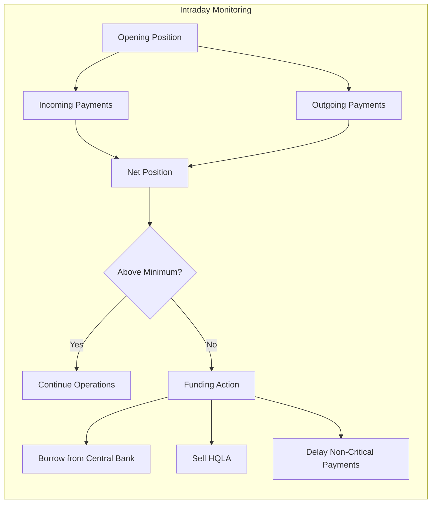
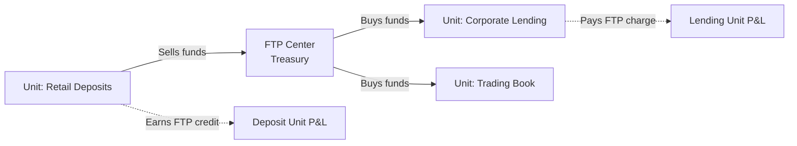
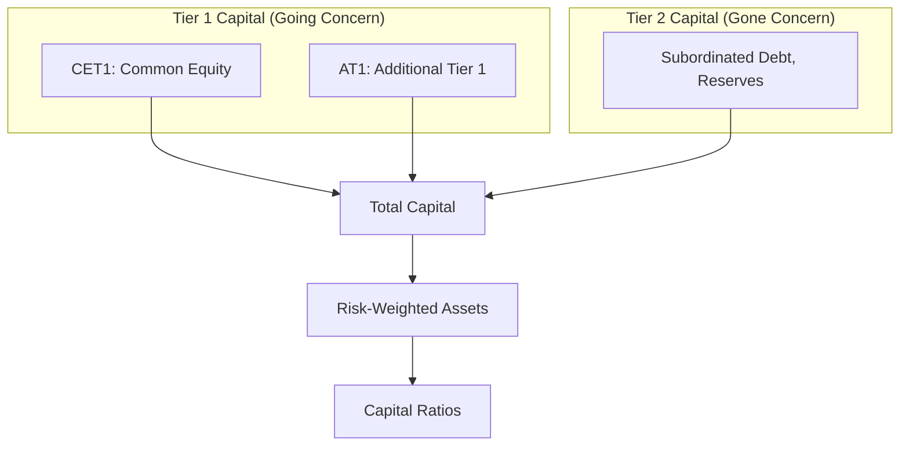
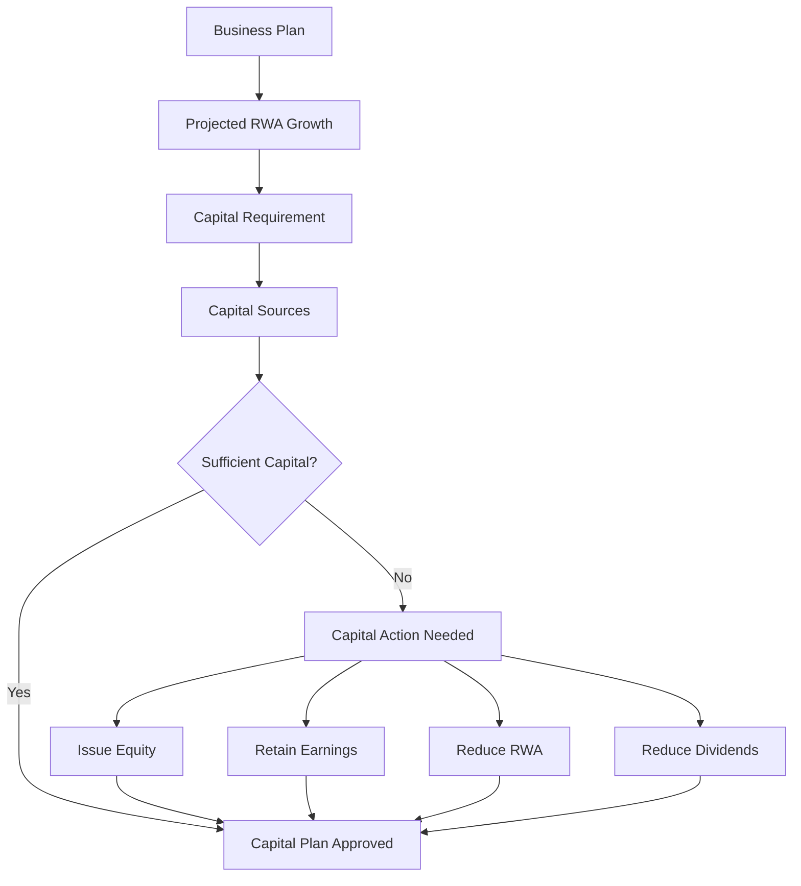
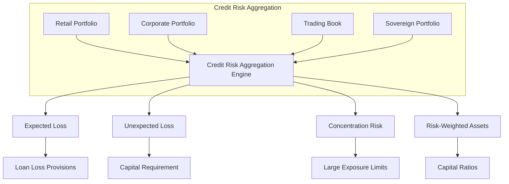
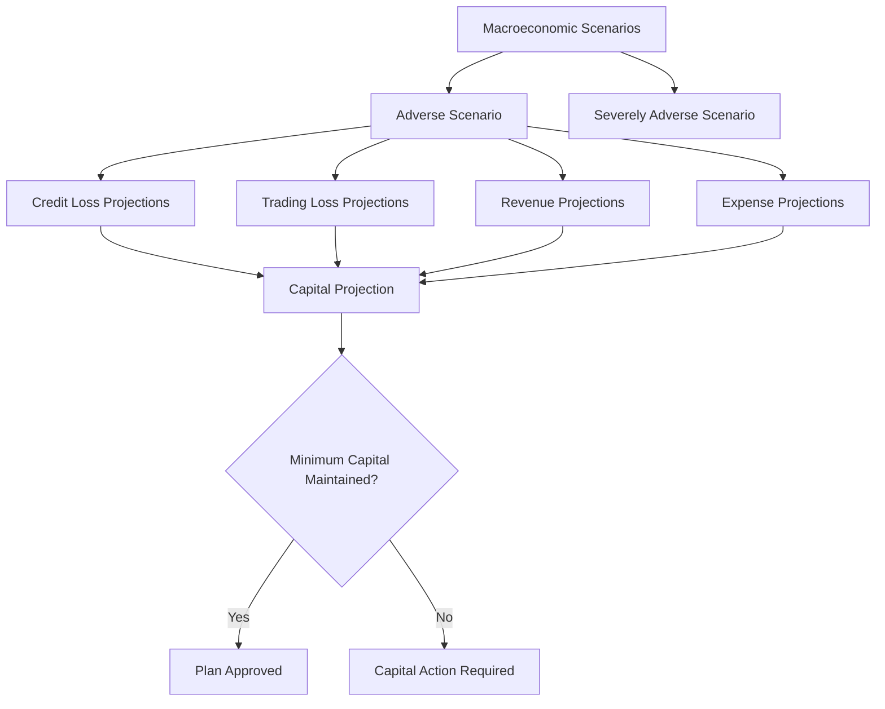
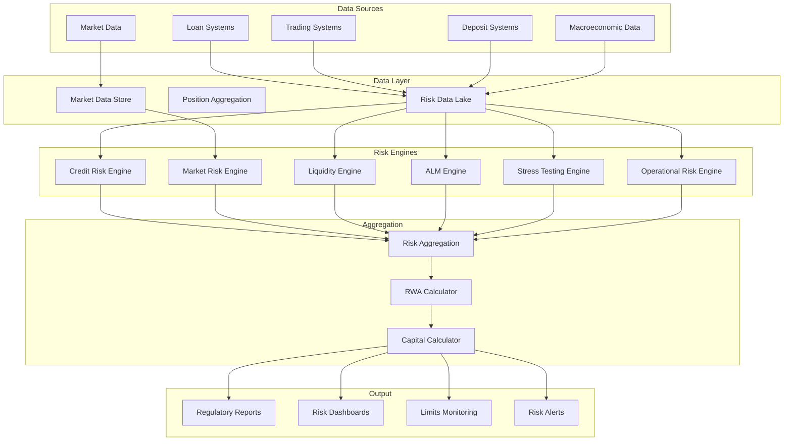
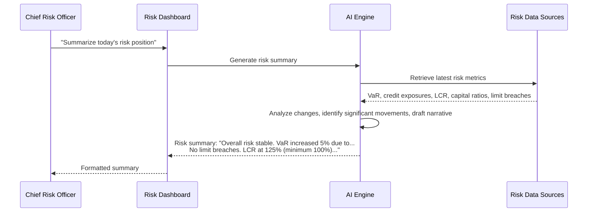

# Treasury and Risk: Treasury Operations, Liquidity Management, Market Risk, and Credit Risk

> **Audience:** Engineers building treasury, risk, and capital management systems.
> **Prerequisites:** [Banking 101](./banking-101.md), [Investment Banking](./investment-banking.md)
> **Cross-references:** [Corporate Banking](./corporate-banking.md), [Investment Banking](./investment-banking.md), [Regulations and Compliance](../regulations-and-compliance/)

---

## Table of Contents

1. [What Is Treasury?](#1-what-is-treasury)
2. [Treasury Functions](#2-treasury-functions)
3. [Liquidity Management](#3-liquidity-management)
4. [Funds Transfer Pricing](#4-funds-transfer-pricing)
5. [Capital Management](#5-capital-management)
6. [Market Risk](#6-market-risk)
7. [Credit Risk](#7-credit-risk)
8. [Operational Risk](#8-operational-risk)
9. [Asset-Liability Management (ALM)](#9-asset-liability-management-alm)
10. [Stress Testing](#10-stress-testing)
11. [Risk System Architecture](#11-risk-system-architecture)
12. [GenAI in Treasury and Risk](#12-genai-in-treasury-and-risk)
13. [Risks of AI in Treasury and Risk](#13-risks-of-ai-in-treasury-and-risk)
14. [Key Regulations](#14-key-regulations)
15. [Common Systems and Technology](#15-common-systems-and-technology)
16. [Engineering Implications](#16-engineering-implications)
17. [Common Workflows](#17-common-workflows)
18. [Interview Questions](#18-interview-questions)

---

## 1. What Is Treasury?

The Treasury division of a bank manages the bank's own **funding, liquidity, and balance sheet**. It is distinct from the treasury services offered to corporate clients (see [Corporate Banking](./corporate-banking.md)).

**Treasury's core mandate:**

```
Ensure the bank always has:
  ┌─────────────────────────────────────────┐
  │  1. Enough cash to meet obligations     │
  │  2. Enough capital to absorb losses     │
  │  3. Optimal funding at the right cost   │
  │  4. Risk exposures within limits        │
  └─────────────────────────────────────────┘
```

**Why this matters:** If treasury fails, the bank fails. Treasury is the function that prevented bank collapses during the 2008 financial crisis and the 2023 regional bank failures (Silicon Valley Bank, First Republic).

---

## 2. Treasury Functions

```mermaid
graph TD
    Treasury[Treasury Division] --> LM[Liquidity Management]
    Treasury --> FM[Funding Management]
    Treasury --> CM[Capital Management]
    Treasury --> ALM[ALM]
    Treasury --> FTP[Funds Transfer Pricing]
    Treasury --> MR[Market Risk]
    Treasury --> CR[Credit Risk]
    Treasury --> OR[Operational Risk]
    
    LM --> LCR[LCR Monitoring]
    LM --> NSFR[NSFR Monitoring]
    LM --> CashForecast[Cash Flow Forecasting]
    
    FM --> Wholesale[Wholesale Funding]
    FM --> Deposits[Deposit Strategy]
    FM --> Issuance[Debt Issuance]
    
    CM --> CapitalPlan[Capital Planning]
    CM --> RWA[Risk-Weighted Assets]
    CM --> Dividend[Capital Distribution]
    
    ALM --> IRBBM[Interest Rate Risk]
    ALM --> GapAnalysis[Gap Analysis]
    ALM --> NII[NII Optimization]
    
    FTP --> Pricing[Internal Pricing]
    FTP --> Incentive[Business Unit Incentives]
```



---

## 3. Liquidity Management

### 3.1 What Is Liquidity Risk?

Liquidity risk is the risk that the bank cannot meet its financial obligations as they fall due — either because it doesn't have enough cash, or because it cannot convert assets to cash quickly enough.

### 3.2 Regulatory Liquidity Metrics

**Liquidity Coverage Ratio (LCR):**
```
LCR = High-Quality Liquid Assets (HQLA) / Net Cash Outflows (30-day stress)

Requirement: ≥ 100%

HQLA includes:
- Cash and central bank reserves
- Government bonds (Level 1)
- High-quality corporate bonds (Level 2, capped at 40%)
```

**Net Stable Funding Ratio (NSFR):**
```
NSFR = Available Stable Funding (ASF) / Required Stable Funding (RSF)

Requirement: ≥ 100%

Purpose: Ensure stable funding for long-term assets
```

### 3.3 Intraday Liquidity Management

Banks must manage liquidity not just at end-of-day, but **throughout the day**:



### 3.4 Cash Flow Forecasting

Treasury forecasts cash flows across all business lines:

| Timeframe | Purpose |
|-----------|---------|
| **Intraday** | Payment processing, settlement |
| **1-7 days** | Short-term funding, market operations |
| **1-3 months** | LCR management, wholesale funding |
| **1-12 months** | Funding strategy, debt issuance |
| **1-5 years** | Strategic funding, NSFR |

**Engineering implication:** Cash flow forecasting systems aggregate data from every business line (retail deposits, corporate loans, trading positions, derivatives). Data accuracy and timeliness are critical.

---

## 4. Funds Transfer Pricing

### 4.1 What Is FTP?

FTP is the internal pricing mechanism by which treasury "buys" funds from deposit-generating units and "sells" funds to lending units.



### 4.2 Why FTP Matters

FTP ensures that:
- **Deposit-taking units are rewarded** for providing cheap funding
- **Lending units pay the true cost** of funding
- **Business decisions are based on economic reality**, not just revenue
- **Interest rate risk is centralized** in treasury (where it can be managed)

### 4.3 FTP Mechanics

```
FTP Rate = Base Reference Rate + Liquidity Premium + Term Premium

Example:
- 1-year loan funded by retail deposits:
  - Base rate (SOFR): 5.00%
  - Liquidity premium: 0.25%
  - Term premium: 0.15%
  - FTP Rate: 5.40%

Retail deposits paying 3.00% earn: 5.40% - 3.00% = 2.40% spread to treasury
Corporate loan at 6.50% pays: 6.50% - 5.40% = 1.10% net margin to lending unit
```

**Engineering implication:** FTP systems must:
- Calculate FTP rates daily for every product
- Allocate funding to individual loans and deposits
- Produce FTP P&L for each business unit
- Support multiple FTP methodologies (matched maturity, pooled, etc.)

---

## 5. Capital Management

### 5.1 Regulatory Capital

Banks must hold minimum levels of capital to absorb losses:



### 5.2 Capital Ratio Requirements (Basel III)

| Ratio | Requirement | Buffer | Total |
|-------|------------|--------|-------|
| **CET1** | 4.5% | 2.5% | 7.0% |
| **Tier 1** | 6.0% | 2.5% | 8.5% |
| **Total Capital** | 8.0% | 2.5% | 10.5% |

Plus:
- **Capital Conservation Buffer:** 2.5%
- **Countercyclical Buffer:** 0-2.5%
- **G-SIB Buffer:** 1-3.5% (for global systemically important banks)
- **PRA Buffer:** Additional buffer set by regulator

### 5.3 Risk-Weighted Assets (RWA)

Not all assets carry the same risk. RWA adjusts assets by their risk:

| Asset | Risk Weight | Example |
|-------|------------|---------|
| **Cash/Government Bonds (developed)** | 0% | US Treasuries, UK Gilts |
| **Mortgages** | 35-50% | Residential property loans |
| **Corporate Loans** | 100% | Standard corporate lending |
| **Retail Loans** | 75% | Consumer credit |
| **Past Due Loans** | 100-150% | Non-performing exposures |

```
RWA = Asset Value × Risk Weight

Example:
$100M in mortgages at 35% risk weight = $35M RWA
$100M in corporate loans at 100% risk weight = $100M RWA
```

### 5.4 Capital Planning



---

## 6. Market Risk

### 6.1 What Is Market Risk?

Market risk is the risk of loss from movements in market prices:

| Risk Type | Description | Affected By |
|-----------|------------|-------------|
| **Interest Rate Risk** | Changes in interest rates | Bonds, loans, deposits |
| **Foreign Exchange Risk** | Currency movements | FX positions, cross-border exposures |
| **Equity Risk** | Stock price movements | Equity holdings, equity derivatives |
| **Commodity Risk** | Commodity price movements | Commodity trading, hedging |
| **Credit Spread Risk** | Changes in credit spreads | Bond portfolios, credit derivatives |

### 6.2 Value at Risk (VaR)

VaR is the most common market risk metric:

```
VaR Definition:
"The maximum expected loss over a given time horizon
 at a given confidence level under normal market conditions"

Example:
1-day 99% VaR = $50M

Meaning: On 99 of 100 trading days, the loss will not exceed $50M.
On 1 of 100 days, the loss could exceed $50M.
```

### 6.3 VaR Calculation Methods

| Method | Description | Advantages | Disadvantages |
|--------|------------|-----------|--------------|
| **Historical Simulation** | Uses actual historical price movements | Simple, no distributional assumptions | Past may not predict future |
| **Parametric (Variance-Covariance)** | Assumes normal distribution, uses volatilities and correlations | Fast, intuitive | Assumes normality (fat tails ignored) |
| **Monte Carlo** | Simulates thousands of scenarios | Flexible, captures complex risks | Computationally intensive |

### 6.4 Expected Shortfall (ES)

ES (also called Conditional VaR) addresses VaR's key limitation — it tells you the average loss *when* VaR is breached:

```
Expected Shortfall (99%) = Average loss in the worst 1% of scenarios

Example:
If 99% VaR = $50M, Expected Shortfall might be $75M
Meaning: On the bad days (when VaR is breached), average loss is $75M
```

Basel III has moved from VaR to ES as the primary market risk metric.

### 6.5 Stress Testing

Beyond VaR and ES, banks stress test their portfolios:

| Stress Scenario | Description |
|----------------|------------|
| **2008-style crisis** | Global financial crisis repeat |
| **Rate shock** | +200bps interest rate move |
| **FX crash** | Major currency devaluation |
| **Equity crash** | -40% equity market |
| **Sovereign default** | Major government defaults |
| **Idiosyncratic** | Bank-specific stress scenarios |

---

## 7. Credit Risk

### 7.1 What Is Credit Risk?

Credit risk is the risk of loss from a borrower's failure to repay. It is the largest risk category for most banks.

### 7.2 Credit Risk Metrics

| Metric | Description |
|--------|------------|
| **PD (Probability of Default)** | Likelihood of borrower defaulting |
| **LGD (Loss Given Default)** | Loss severity if default occurs |
| **EAD (Exposure at Default)** | Amount owed at default |
| **EL (Expected Loss)** | PD × LGD × EAD |
| **UL (Unexpected Loss)** | Loss beyond expected (covered by capital) |

### 7.3 Credit Risk Across the Portfolio



### 7.4 Concentration Risk

| Concentration Type | Description |
|-------------------|------------|
| **Single Name** | Too much exposure to one borrower |
| **Sector** | Too much exposure to one industry |
| **Geographic** | Too much exposure to one country/region |
| **Product** | Too much exposure to one product type |
| **Currency** | Too much exposure to one currency |

---

## 8. Operational Risk

### 8.1 What Is Operational Risk?

Operational risk is the risk of loss from inadequate or failed internal processes, people, systems, or from external events.

### 8.2 Operational Risk Categories

| Category | Examples |
|----------|---------|
| **Process Risk** | Errors in transaction processing, settlement failures |
| **System Risk** | IT outages, cyber attacks, data corruption |
| **People Risk** | Fraud by employees, inadequate training, key person risk |
| **Legal/Regulatory Risk** | Lawsuits, regulatory fines, contract disputes |
| **External Events** | Natural disasters, terrorism, pandemic |

### 8.3 Operational Risk Capital

Under Basel III, banks must hold capital for operational risk:

| Approach | Description |
|----------|------------|
| **Basic Indicator Approach** | Capital = % of gross income |
| **Standardized Approach** | Capital based on business line indicators |
| **Advanced Measurement Approach** | Bank's own internal models (with regulator approval) |

### 8.4 Loss Data Collection

Banks maintain operational loss databases:

| Threshold | Action |
|-----------|--------|
| **All losses** | Recorded in incident management system |
| **Above $10K** | Reported to operational risk team |
| **Above $100K** | Investigated, root cause analysis |
| **Above $1M** | Senior management notification, board reporting |

---

## 9. Asset-Liability Management (ALM)

### 9.1 What Is ALM?

ALM manages the balance sheet to optimize the risk-return tradeoff between assets (loans, investments) and liabilities (deposits, borrowings).

### 9.2 Interest Rate Risk in the Banking Book (IRRBB)

This is the risk that changes in interest rates affect the bank's earnings and economic value:

```
Scenario: Interest rates rise by 200bps

Assets:
- Fixed-rate mortgages at 3% → Bank earns 3% while market pays 5%
- Value of fixed-rate assets declines

Liabilities:
- Savings deposits at 1% → Bank may need to pay 3%
- Funding cost increases

Net Impact: NIM compression, economic value loss
```

### 9.3 Gap Analysis

Gap analysis measures the maturity mismatch between assets and liabilities:

| Time Bucket | Assets | Liabilities | Gap |
|------------|--------|------------|-----|
| **0-1 month** | $50B | $70B | -$20B |
| **1-3 months** | $30B | $25B | +$5B |
| **3-12 months** | $40B | $30B | +$10B |
| **1-5 years** | $100B | $60B | +$40B |
| **5+ years** | $80B | $15B | +$65B |

Negative gap in the short term = liability-sensitive (hurt when rates rise).

### 9.4 ALM Tools

| Tool | Purpose |
|------|--------|
| **Interest Rate Sensitivity** | Impact of rate changes on NII and EVE |
| **Duration Analysis** | Price sensitivity of fixed-rate instruments |
| **Simulation** | Project NII under various rate scenarios |
| **Economic Value of Equity (EVE)** | Present value impact of rate changes |
| **Behavioral Modeling** | How customers actually behave (prepayments, deposit betas) |

---

## 10. Stress Testing

### 10.1 What Is Stress Testing?

Stress testing evaluates how the bank would perform under adverse economic scenarios.

### 10.2 Regulatory Stress Tests

| Test | Jurisdiction | Description |
|------|-------------|------------|
| **CCAR** | US | Comprehensive Capital Analysis and Review |
| **Dodd-Frank Act Stress Test** | US | Annual stress test for large banks |
| **EBA Stress Test** | EU | European Banking Authority stress test |
| **Bank of England Stress Test** | UK | Annual UK bank stress testing |

### 10.3 Stress Test Components



### 10.4 Stress Test Scenarios

Typical adverse scenario variables:

| Variable | Baseline | Adverse | Severely Adverse |
|----------|----------|---------|-----------------|
| **GDP Growth** | +2.0% | -2.0% | -5.0% |
| **Unemployment** | 4.0% | 7.0% | 10.0% |
| **Equity Prices** | +5.0% | -20% | -40% |
| **House Prices** | +3.0% | -10% | -25% |
| **Interest Rates** | +0.5% | +2.0% | +3.0% |

---

## 11. Risk System Architecture



---

## 12. GenAI in Treasury and Risk

### 12.1 Use Cases

| Use Case | Description | Value |
|----------|------------|-------|
| **Regulatory Scenario Analysis** | AI analyzing regulatory stress test scenarios and their implications | Faster scenario design |
| **Risk Report Summarization** | AI summarizing daily/weekly risk reports for senior management | Faster executive decision-making |
| **ALM Narrative Generation** | AI drafting ALCO (Asset-Liability Committee) papers | Reduced preparation time |
| **Market Intelligence** | AI monitoring and summarizing market events affecting risk positions | Faster response to market moves |
| **Capital Planning Support** | AI analyzing capital optimization strategies | Better capital decisions |
| **Liquidity Forecasting** | AI enhancing cash flow forecasts with pattern recognition | More accurate liquidity management |
| **Stress Test Narrative** | AI drafting stress test documentation and analysis | Faster submission preparation |
| **Risk Policy Research** | AI answering questions about risk regulations and internal policies | Faster compliance |

### 12.2 Example: AI Risk Report Summarization



---

## 13. Risks of AI in Treasury and Risk

### 13.1 Risk Measurement Risk

| Risk | Scenario | Impact |
|------|----------|--------|
| **Incorrect Risk Metrics** | AI generates wrong VaR or capital calculations | Misleading risk picture, regulatory breach |
| **Model Risk** | AI model produces biased or inaccurate forecasts | Wrong business decisions |
| **Over-reliance** | Management trusts AI output without independent verification | Undetected risk buildup |

### 13.2 Regulatory Risk

| Risk | Scenario | Impact |
|------|----------|--------|
| **Non-Compliant Models** | AI models used for regulatory calculations without validation | Regulatory rejection, fines |
| **Documentation Gaps** | AI-generated stress test documentation lacks rigor | Regulatory criticism |
| **Explainability** | Regulators cannot understand how AI arrived at risk figures | Model rejection |

### 13.3 Mitigation Strategies

- **Independent model validation.** All AI models used in risk calculations must pass model risk management review.
- **Human oversight.** Risk decisions require human sign-off.
- **Parallel runs.** AI outputs run alongside existing systems before production use.
- **Complete documentation.** Every AI model documented per SR 11-7 / model risk management standards.
- **Deterministic fallback.** AI failures must not disrupt critical risk reporting.

---

## 14. Key Regulations

| Regulation | Relevance to Treasury and Risk |
|-----------|-------------------------------|
| **Basel III** | Capital adequacy, liquidity ratios, leverage ratio |
| **Basel IV / Finalization** | Revised standardized approaches, output floor |
| **CCAR (US)** | Annual stress testing and capital planning |
| **Dodd-Frank (US)** | Stress testing requirements |
| **IRRBB Standards** | Interest rate risk in the banking book |
| **Large Exposure Rules** | Limits on single-counterparty exposure |
| **Leverage Ratio** | Non-risk-based capital backstop |
| **SR 11-7 (US)** | Model risk management guidance |
| **PRA SS7/19** | UK model risk management expectations |
| **DORA (EU)** | Digital operational resilience |

See [Regulations and Compliance](../regulations-and-compliance/) for details.

---

## 15. Common Systems and Technology

| System Category | Examples |
|----------------|----------|
| **ALM** | QRM, Moody's Analytics, SAP ALM, Oracle |
| **Risk Management** | Murex, Calypso, RiskMetrics, Bloomberg PORT |
| **Regulatory Reporting** | AxiomSL, Regulatory Data Management |
| **Stress Testing** | Moody's Analytics, SAS, custom platforms |
| **Market Data** | Bloomberg, Refinitiv, ICE, Markit |
| **Capital Management** | Moody's RiskAnalyst, custom capital engines |
| **Liquidity Management** | QRM, FIS, custom liquidity platforms |

---

## 16. Engineering Implications

### 16.1 Data Quality Is Everything

Risk calculations are only as good as the data:
- Incomplete position data = wrong risk metrics
- Stale market data = incorrect valuations
- Missing loan data = wrong capital ratios

**Engineering implication:** Data quality monitoring is as critical as the risk calculations themselves.

### 16.2 Performance Requirements

| Operation | Typical SLA |
|-----------|------------|
| VaR calculation | Complete within 2 hours of market close |
| Stress test (regulatory) | Complete within 5 business days |
| LCR calculation | Daily, complete within 4 hours |
| RWA calculation | Monthly, complete within 5 business days |
| Intraday liquidity monitoring | Real-time, < 1 minute lag |
| Risk dashboards | Data refreshed within 1 hour |

### 16.3 Model Risk Management

All risk models must follow SR 11-7 principles:
- Development documentation
- Independent validation
- Outcomes analysis
- Ongoing monitoring
- Periodic revalidation

### 16.4 Audit and Traceability

Every risk calculation must be traceable:
- Input data source and timestamp
- Model version and parameters
- Calculation methodology
- Output values and confidence intervals
- Who reviewed and approved

---

## 17. Common Workflows

### 17.1 Daily Risk Reporting

```
1. Market data loaded (end-of-day prices, rates, FX)
2. Trading positions captured
3. VaR calculated (all portfolios)
4. Credit risk metrics updated
5. Liquidity positions calculated
6. Limit breaches identified
7. Risk report generated
8. Report distributed to CRO, trading heads, treasury
9. Any breaches escalated to relevant owners
10. Previous day's breaches reviewed for resolution
```

### 17.2 Monthly Capital and RWA Calculation

```
1. All positions as of month-end captured
2. RWA calculated by asset class:
   - Credit RWA (retail, corporate, sovereign, trading)
   - Market RWA (VaR-based, standardized)
   - Operational RWA
3. Capital ratios calculated (CET1, Tier 1, Total)
4. Comparison against regulatory minimums and internal limits
5. Leverage ratio calculated
6. Capital plan reviewed
7. Report submitted to regulator (if required)
8. Report presented to Board Risk Committee
```

### 17.3 ALCO (Asset-Liability Committee) Meeting

```
1. Pre-meeting: Risk and treasury teams prepare papers
   - NII analysis and outlook
   - Interest rate risk position
   - Liquidity position and forecast
   - Funding plan
   - Capital position and outlook
2. AI-assisted paper drafting and data compilation
3. ALCO meeting (monthly or quarterly)
   - Review of current position
   - Discussion of risks and opportunities
   - Decisions on FTP, hedging, funding strategy
   - Action items assigned
4. Post-meeting: Minutes distributed, actions tracked
```

---

## 18. Interview Questions

### Foundational

1. **What is the difference between liquidity risk and solvency risk? Can a bank be solvent but illiquid?**
2. **Explain VaR. What are its limitations?**
3. **What is the difference between CET1, Tier 1, and Total Capital?**
4. **Why does a bank need FTP? What happens without it?**

### Technical

5. **Design a system that calculates VaR for a portfolio of 100,000 positions daily. How do you handle the computational load?**
6. **How would you build a cash flow forecasting system that aggregates data from 50+ source systems?**
7. **How do you calculate RWA for a portfolio containing mortgages, corporate loans, government bonds, and derivatives?**
8. **Design a stress testing framework that can apply macroeconomic scenarios to the bank's entire balance sheet.**

### GenAI-Specific

9. **You are building an AI system to summarize daily risk reports for the CRO. What data sources does it need, and what are the risks if it misses something important?**
10. **How would you use AI to improve liquidity forecasting? What validation is needed before relying on AI-generated forecasts?**
11. **An AI system drafts regulatory stress test documentation. How do you ensure the output meets regulatory standards?**

### Scenario-Based

12. **The VaR calculation shows a 3x spike compared to the 30-day average. What is your investigation process?**
13. **The LCR has dropped from 130% to 105% over the past week. What action does treasury take?**
14. **A stress test shows the bank's CET1 ratio drops below the minimum requirement in the adverse scenario. What are the implications and what actions are needed?**

---

## Further Reading

- [Investment Banking](./investment-banking.md) — Trading, capital markets
- [Corporate Banking](./corporate-banking.md) — Corporate credit risk
- [Lending](./lending.md) — Credit lifecycle, IFRS 9
- [Regulations and Compliance](../regulations-and-compliance/) — Basel III, stress testing
- [Data Engineering](../data-engineering/) — Risk data pipelines
