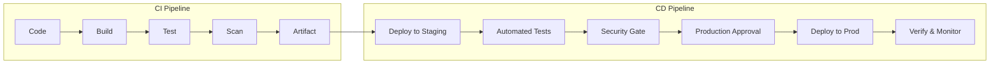

# CI/CD Philosophy for Banking GenAI Platforms

## Overview

CI/CD (Continuous Integration/Continuous Delivery) is the engineering practice that enables safe, rapid, and repeatable software deployments. In banking, CI/CD must balance speed with compliance, automation with control, and innovation with stability. This guide establishes the philosophy and principles for CI/CD in regulated GenAI environments.

## Core Principles



| Principle | Description | Banking Impact |
|-----------|-------------|----------------|
| Automate Everything | Manual steps are eliminated | Reduces human error |
| Fast Feedback | Fail fast, fail early | Catches issues before prod |
| Reproducible Builds | Same input = same output | Audit compliance |
| Immutable Artifacts | Build once, deploy anywhere | Traceability |
| Deploy Small | Small, frequent changes | Lower risk per deployment |
| Rollback Ready | Every deploy can be undone | Fast incident recovery |
| Compliance Built-In | Security in the pipeline | Meets regulatory requirements |

## CI/CD Pipeline Stages

```yaml
# Banking GenAI CI/CD Pipeline

stages:
  1. Source:
     - Pull Request triggers pipeline
     - Branch protection rules enforced
     - Code ownership review
  
  2. Build:
     - Compile and package application
     - Build container image
     - Generate SBOM (Software Bill of Materials)
     - Tag with git commit SHA
  
  3. Test:
     - Unit tests (must pass)
     - Integration tests (must pass)
     - API contract tests (must pass)
     - Performance tests (warning)
     - GenAI evaluation tests (accuracy, hallucination rate)
  
  4. Security:
     - SAST (Static Application Security Testing)
     - SCA (Software Composition Analysis)
     - Container image scanning
     - Secret detection
     - Infrastructure-as-code scanning
  
  5. Deploy to Staging:
     - Deploy to staging environment
     - Smoke tests
     - End-to-end tests
     - GenAI response quality tests
  
  6. Production Approval:
     - Automated: For low-risk changes
     - Manual: For production deployments
     - CAB approval: For regulated changes
  
  7. Deploy to Production:
     - Rolling/canary/blue-green deployment
     - Health checks
     - Automated rollback on failure
  
  8. Post-Deployment:
     - Monitoring verification
     - Alert check
     - Automated rollback if SLO breached
```

## Branching Strategy

```
Main Branch (production-ready)
  ├── Feature branches (short-lived)
  ├── Release branches (for staging)
  └── Hotfix branches (emergency fixes)

Rules:
- All changes via Pull Request
- Minimum 2 approvals for main
- CI must pass before merge
- No direct pushes to main
```

## Compliance and Audit

```yaml
audit_requirements:
  - "Every deployment linked to a ticket/change request"
  - "Build artifacts signed and verified"
  - "Pipeline execution logs retained for 1 year"
  - "Approval records immutable"
  - "SBOM generated for every build"
  - "Security scan results reviewed before prod"
  - "Rollback procedure documented for each deployment"
  - "Deployment window adhered to (if required)"
```

## Cross-References

- **GitHub Workflows**: See [github-workflows.md](github-workflows.md) for CI implementation
- **CI/CD Design**: See [ci-cd-design.md](ci-cd-design.md) for pipeline architecture
- **Production Approvals**: See [production-approvals.md](production-approvals.md) for approval gates

## Interview Questions

1. **What are the core principles of CI/CD? Why do they matter in banking?**
2. **How do you balance deployment speed with compliance requirements?**
3. **What stages should a CI/CD pipeline have for a GenAI application?**
4. **How do you ensure reproducibility in CI/CD builds?**
5. **What audit requirements would a regulator expect from your CI/CD pipeline?**
6. **How do you handle emergency hotfixes in a regulated CI/CD process?**

## Checklist: CI/CD Philosophy

- [ ] Pipeline fully automated (no manual steps)
- [ ] Build artifacts immutable and versioned
- [ ] Security scanning integrated into pipeline
- [ ] Deployments small and frequent
- [ ] Rollback capability for every deployment
- [ ] Compliance checks built into pipeline
- [ ] Pipeline execution logs retained
- [ ] All changes via Pull Request
- [ ] Branch protection rules enforced
- [ ] Post-deployment monitoring automated
