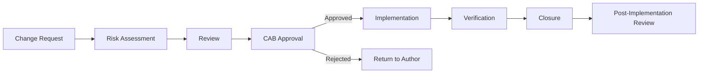

# Change Management in Regulated Environments

## Overview

Change management ensures that all infrastructure and software changes are documented, reviewed, approved, and tracked. In banking, regulatory requirements (SOX, PCI-DSS, GDPR) mandate formal change management processes.

## Change Management Process



## Change Types

| Type | Description | Approval | Lead Time |
|------|-------------|----------|-----------|
| Standard | Pre-approved, low risk | Automated | None |
| Normal | Requires review | CAB | 1-2 weeks |
| Emergency | Urgent fix needed | Emergency CAB | ASAP |
| Major | Significant impact | Senior management | 2-4 weeks |

## Automated Change Management

```yaml
# Change request auto-generation from PR
# .github/workflows/change-request.yml
name: Change Request
on:
  pull_request:
    types: [opened]
    branches: [main]

jobs:
  create-change-request:
    runs-on: ubuntu-latest
    steps:
      - name: Create Change Request
        uses: actions/github-script@v7
        with:
          script: |
            const pr = context.payload.pull_request;
            
            // Determine risk level
            const risk = determineRisk(pr);
            
            // Create change request ticket
            await github.rest.issues.create({
              owner: 'bank',
              repo: 'change-management',
              title: `CR-${new Date().getFullYear()}-${String(count).padStart(4, '0')}: ${pr.title}`,
              body: generateChangeRequest(pr, risk),
              labels: [risk === 'high' ? 'cab-required' : 'auto-approved']
            });
            
            // Add comment to PR
            await github.rest.issues.createComment({
              ...context.repo,
              issue_number: pr.number,
              body: `Change request created: CR-xxx. Risk: ${risk}`
            });
```

## Compliance Requirements

```yaml
sox_compliance:
  - "All changes to financial systems documented"
  - "Segregation of duties (developer != approver)"
  - "Audit trail of all changes"
  - "Quarterly access review"

pci_dss:
  - "Change management procedure documented"
  - "Changes tested in non-production"
  - "Emergency changes documented within 24 hours"
  - "Annual procedure review"

gdpr:
  - "Changes affecting personal data documented"
  - "Data protection impact assessment for major changes"
  - "DPO consultation for high-risk changes"
```

## Cross-References

- **Production Approvals**: See [production-approvals.md](production-approvals.md) for approval gates
- **Release Processes**: See [release-processes.md](release-processes.md) for versioning

## Interview Questions

1. **What is change management? Why is it required in banking?**
2. **Compare standard, normal, and emergency changes.**
3. **How do you automate change management in CI/CD?**
4. **What compliance frameworks require change management?**
5. **How do you handle emergency changes that bypass normal process?**
6. **What is segregation of duties in change management?**

## Checklist: Change Management

- [ ] Change management procedure documented
- [ ] All changes tracked with unique IDs
- [ ] Risk assessment automated
- [ ] Approval workflow enforced
- [ ] Emergency change process defined
- [ ] Segregation of duties enforced
- [ ] Change records retained for audit period
- [ ] Post-implementation review completed
- [ ] Failed changes documented with lessons learned
- [ ] Procedure reviewed and updated annually
