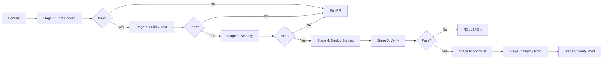

# CI/CD Pipeline Design: Stages, Gates, and Parallelism

## Overview

Well-designed CI/CD pipelines balance speed, reliability, and compliance. This guide covers pipeline architecture, stage design, quality gates, and parallelism for banking GenAI platforms.

## Pipeline Architecture



## Stage Design

```yaml
# Pipeline stage organization

Stage 1: Fast Checks (2-5 minutes)
├── Lint/format check
├── Type check
├── License check
└── Commit message check

Stage 2: Build & Test (10-20 minutes) [Parallel]
├── Build container image
├── Unit tests
├── Integration tests
├── API contract tests
└── GenAI evaluation tests

Stage 3: Security (5-10 minutes) [Parallel]
├── SAST (code analysis)
├── SCA (dependency scan)
├── Container image scan
├── Secret detection
└── IaC security scan

Stage 4: Deploy Staging (5-10 minutes)
├── Deploy to staging
├── Smoke tests
└── End-to-end tests

Stage 5: Verify Staging (5-10 minutes)
├── Performance tests
├── Load tests
├── GenAI quality tests
└── Business logic validation

Stage 6: Approval Gate
├── Automated: Low-risk changes
├── Manual: Production deployments
└── CAB: Regulated changes

Stage 7: Deploy Production (10-30 minutes)
├── Canary deployment
├── Verification
├── Progressive rollout
└── Auto-rollback on failure

Stage 8: Post-Deployment (5 minutes)
├── Monitor SLOs
├── Check alerts
└── Notify stakeholders
```

## Parallelism Optimization

```yaml
# GitHub Actions parallelism
jobs:
  # Run in parallel after build
  test-unit:
    needs: build
    runs-on: ubuntu-latest
    strategy:
      matrix:
        shard: [1, 2, 3, 4]
    steps:
      - run: pytest --shard=${{ matrix.shard }}
  
  test-integration:
    needs: build
    runs-on: ubuntu-latest
    steps:
      - run: pytest tests/integration/
  
  security-scan:
    needs: build
    runs-on: ubuntu-latest
    steps:
      - run: trivy scan
  
  genai-eval:
    needs: build
    runs-on: ubuntu-latest
    steps:
      - run: python scripts/evaluate_genai.py
```

## Quality Gates

```yaml
quality_gates:
  unit_tests:
    - "All tests pass"
    - "Coverage >= 80%"
    - "No flaky test failures"
  
  security:
    - "Zero CRITICAL vulnerabilities"
    - "Zero HIGH vulnerabilities in production code"
    - "No exposed secrets or credentials"
    - "SBOM generated"
  
  performance:
    - "P95 latency < 2 seconds"
    - "Error rate < 0.1%"
    - "Throughput >= baseline"
  
  genai_quality:
    - "Hallucination rate < 2%"
    - "Response relevance > 85%"
    - "Toxicity score < 0.01"
    - "Response time < 5 seconds"
```

## Cross-References

- **Testing in Pipelines**: See [testing-in-pipelines.md](testing-in-pipelines.md) for test stages
- **Progressive Delivery**: See [progressive-delivery.md](progressive-delivery.md) for deployment patterns

## Interview Questions

1. **How do you design a CI/CD pipeline for fast feedback?**
2. **What stages should run in parallel vs sequentially?**
3. **What quality gates should block a production deployment?**
4. **How do you handle flaky tests in CI/CD pipelines?**
5. **How do you optimize pipeline execution time?**
6. **What metrics should determine whether to promote a canary?**

## Checklist: Pipeline Design

- [ ] Fast checks run first (fail fast)
- [ ] Independent stages run in parallel
- [ ] Quality gates defined for each stage
- [ ] Security scanning before deployment
- [ ] Automated rollback capability
- [ ] Pipeline execution time monitored
- [ ] Flaky tests quarantined
- [ ] Pipeline resource usage optimized
- [ ] Artifact caching between runs
- [ ] Clear pass/fail criteria for each stage
