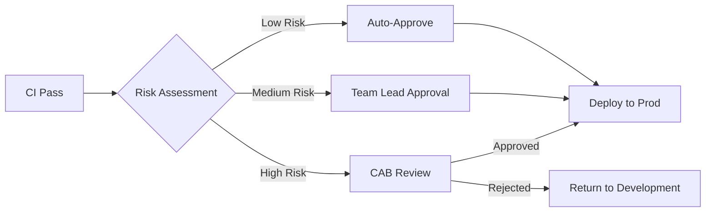

# Production Approval Gates and CAB Process

## Overview

Production approval gates ensure that changes are reviewed before reaching production. In banking, the Change Advisory Board (CAB) reviews and approves regulated changes. This guide covers automated and manual approval patterns.

## Approval Flow



## Risk Classification

```yaml
risk_levels:
  low:
    criteria:
      - "Bug fix only, no new features"
      - "No database changes"
      - "No infrastructure changes"
      - "Security scan clean"
      - "All tests passing"
      - "Rollback procedure tested"
    approval: "Automated (CI gates only)"
  
  medium:
    criteria:
      - "New features with feature flags"
      - "Non-breaking database migrations"
      - "Configuration changes only"
    approval: "Team lead + SRE review"
  
  high:
    criteria:
      - "Breaking API changes"
      - "Database schema changes"
      - "Infrastructure changes"
      - "Security patches"
      - "GenAI model changes"
    approval: "CAB review required"
```

## GitHub Environments

```yaml
# GitHub environment protection rules
environments:
  production:
    protection_rules:
      required_reviewers: 2
      reviewers:
        - type: Team
          name: sre-team
        - type: Team
          name: genai-leads
      wait_timer: 5  # Minutes before deployment
      restrictions:
        teams:
          - release-managers
    
  staging:
    protection_rules:
      required_reviewers: 1
      reviewers:
        - type: Team
          name: genai-team
```

## CAB Process

```
CAB Meeting (Weekly):
1. Change request reviewed (description, risk, rollback)
2. Impact assessment (affected services, customers)
3. Timing review (deployment window, blackout periods)
4. Stakeholder notification verified
5. Approval/rejection decision
6. If approved: deployment scheduled
7. If rejected: issues documented, returned to team

Change Request Template:
- Change ID: CR-2025-0015
- Title: Deploy GenAI API v1.3.0
- Description: Add new embedding model support
- Risk: Medium
- Impact: All GenAI API users
- Rollback: Revert to v1.2.0 image
- Deployment Window: Saturday 02:00-04:00 UTC
- Stakeholders Notified: Yes
- Testing Completed: Staging verified
- Approval: Pending CAB
```

## Cross-References

- **Change Management**: See [change-management.md](change-management.md) for regulated changes
- **Release Communication**: See [release-communication.md](release-communication.md) for stakeholder updates

## Interview Questions

1. **What is a CAB? When is CAB approval required?**
2. **How do you classify change risk in CI/CD?**
3. **How do you automate approval gates in GitHub Actions?**
4. **What information should a change request include?**
5. **How do you handle emergency changes that bypass CAB?**
6. **What is your process for post-deployment verification?**

## Checklist: Production Approvals

- [ ] Risk classification defined and automated
- [ ] Approval gates configured per environment
- [ ] CAB meeting scheduled regularly
- [ ] Change request template used
- [ ] Rollback procedure included in change request
- [ ] Stakeholder notification verified
- [ ] Deployment window respected
- [ ] Emergency change process documented
- [ ] Post-deployment review completed
- [ ] Approval records retained for audit
