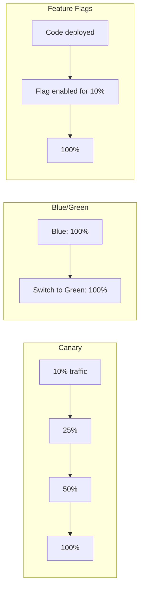

# Progressive Delivery: Canary and Blue/Green

## Overview

Progressive delivery deploys changes incrementally, reducing blast radius and enabling fast rollback. This guide covers canary, blue/green, and feature flag patterns for banking GenAI platforms.

## Progressive Delivery Patterns



## Feature Flags

```python
"""Feature flags for progressive delivery."""
import hashlib

class FeatureFlagManager:
    """Manage feature flags for gradual rollout."""
    
    def __init__(self, flags: dict):
        self.flags = flags
    
    def is_enabled(self, flag_name: str, user_id: str = None) -> bool:
        """Check if a feature flag is enabled."""
        flag = self.flags.get(flag_name, {})
        
        if not flag.get('enabled', False):
            return False
        
        # Percentage rollout
        if 'percentage' in flag:
            if user_id:
                # Consistent hashing for same user
                hash_value = int(hashlib.md5(
                    f"{flag_name}:{user_id}".encode()
                ).hexdigest(), 16) % 100
                return hash_value < flag['percentage']
            return False
        
        return flag.get('enabled', False)

# Usage
flags = FeatureFlagManager({
    'new_genai_model': {
        'enabled': True,
        'percentage': 25,  # 25% of users
    },
    'new_ui': {
        'enabled': True,
        'percentage': 100,
    },
})

if flags.is_enabled('new_genai_model', user_id):
    # Use new model
    pass
else:
    # Use old model
    pass
```

## Cross-References

- **Canary Releases**: See [canary-releases.md](../kubernetes-openshift/canary-releases.md) for K8s canary
- **Rollbacks**: See [rollbacks.md](rollbacks.md) for rollback strategies

## Interview Questions

1. **What is progressive delivery? How does it differ from traditional deployment?**
2. **When would you use canary vs blue/green vs feature flags?**
3. **How do you measure success during a canary deployment?**
4. **How do feature flags enable progressive delivery?**
5. **What are the risks of feature flags?**
6. **How do you clean up old feature flags?**

## Checklist: Progressive Delivery

- [ ] Deployment strategy chosen (canary recommended)
- [ ] Traffic splitting configured
- [ ] Verification metrics defined
- [ ] Automated rollback on failure
- [ ] Feature flag platform selected
- [ ] Flag cleanup process defined
- [ ] Team trained on progressive delivery
- [ ] Monitoring dashboards for deployment health
