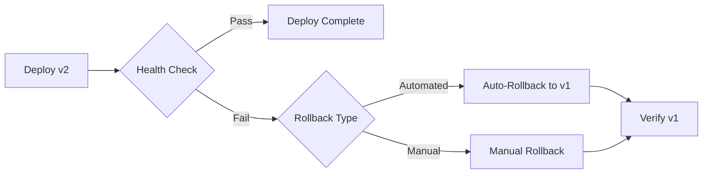

# Rollback Strategies in CI/CD

## Overview

Rollback strategies ensure that failed deployments can be quickly reverted to a known-good state. In banking, fast rollback is critical for minimizing customer impact during incidents.

## Rollback Strategies



| Strategy | Speed | Automation | Best For |
|----------|-------|------------|----------|
| Automated rollback | Seconds | Full | Canary failures |
| Manual rollback | Minutes | Partial | Complex failures |
| Database migration rollback | Minutes-Hours | Partial | Schema changes |
| Blue/green switch | Seconds | Full | Major releases |

## Automated Rollback

```yaml
# Argo Rollouts with automated rollback
apiVersion: argoproj.io/v1alpha1
kind: Rollout
metadata:
  name: genai-api
spec:
  strategy:
    canary:
      steps:
        - setWeight: 20
        - pause: {duration: 5m}
        - analysis:
            templates:
              - templateName: canary-check
            failingFast: 2  # Auto-rollback after 2 failures
      abortScaleDownDelaySeconds: 30  # Scale down canary quickly

# Rollback analysis template
apiVersion: argoproj.io/v1alpha1
kind: AnalysisTemplate
metadata:
  name: canary-check
spec:
  metrics:
    - name: error-rate
      interval: 1m
      failureCondition: result[0] > 0.05
      failingLimit: 2  # Fail after 2 consecutive failures
      provider:
        prometheus:
          query: |
            sum(rate(http_requests_total{status=~"5.."}[1m]))
            / sum(rate(http_requests_total[1m]))
```

## Manual Rollback Procedure

```bash
# Kubernetes rollback
# 1. Identify the previous good revision
kubectl rollout history deployment/genai-api -n banking-genai

# 2. Rollback
kubectl rollout undo deployment/genai-api -n banking-genai

# 3. Verify
kubectl rollout status deployment/genai-api -n banking-genai

# 4. Check health
curl -s https://genai-api.bank.com/health | jq

# 5. Monitor for 15 minutes
kubectl logs -f deployment/genai-api -n banking-genai
```

## Cross-References

- **Progressive Delivery**: See [progressive-delivery.md](progressive-delivery.md) for deployment patterns
- **Blue-Green**: See [blue-green-deployments.md](../kubernetes-openshift/blue-green-deployments.md) for instant switch

## Interview Questions

1. **What rollback strategies do you use for Kubernetes deployments?**
2. **When should rollback be automated vs manual?**
3. **How do you rollback a database migration?**
4. **What triggers an automated rollback?**
5. **How do you test your rollback procedure?**
6. **What is the difference between rollback and rollforward?**

## Checklist: Rollback Readiness

- [ ] Automated rollback for canary deployments
- [ ] Manual rollback procedure documented
- [ ] Rollback tested quarterly
- [ ] Database migration rollback scripts ready
- [ ] Previous image versions retained
- [ ] Rollback triggers defined (error rate, latency)
- [ ] Team trained on rollback procedures
- [ ] Rollback monitoring and alerting
- [ ] Post-rollback incident review scheduled
