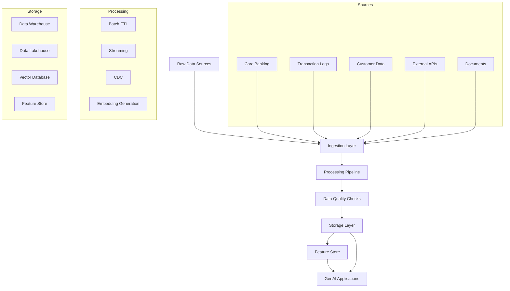
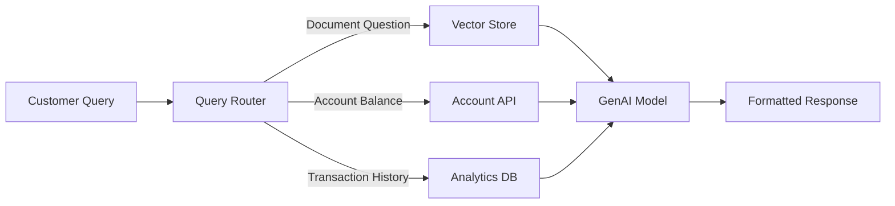

# Data Engineering for GenAI Banking Platforms

## Overview

Data engineering forms the backbone of any enterprise GenAI platform, especially in banking where data quality, lineage, and governance are non-negotiable. This module covers the complete data engineering stack required to build, operate, and scale GenAI-powered systems in a regulated financial environment.



## Why Data Engineering Matters for GenAI

In banking, GenAI applications -- RAG systems, intelligent agents, document processing -- depend entirely on the quality of underlying data. Poor data engineering leads to:

- **Hallucinations from stale data**: Models retrieving outdated account balances or transaction records
- **Compliance failures**: Missing audit trails for PII handling in training pipelines
- **Latency issues**: Embedding generation taking hours instead of minutes
- **Data leakage**: Cross-tenant data mixing in multi-tenant feature stores

## Core Competencies

### 1. SQL Fundamentals and Advanced Analytics

Every data engineer must master SQL before touching distributed systems.

**Key Topics**:
- Joins, aggregations, and set operations
- Window functions for time-series analysis
- CTEs and recursive queries for hierarchical data
- Query optimization and execution plans

**Banking Context**: Query optimization matters when analyzing millions of daily transactions. A poorly written join between `transactions` (50M rows) and `accounts` (2M rows) can lock tables for minutes, impacting real-time fraud detection.

```sql
-- Banking example: Customer 30-day rolling transaction summary
SELECT 
    c.customer_id,
    c.customer_name,
    t.txn_date,
    SUM(t.amount) OVER (
        PARTITION BY c.customer_id 
        ORDER BY t.txn_date 
        ROWS BETWEEN 29 PRECEDING AND CURRENT ROW
    ) AS rolling_30d_total,
    COUNT(*) OVER (
        PARTITION BY c.customer_id 
        ORDER BY t.txn_date 
        ROWS BETWEEN 29 PRECEDING AND CURRENT ROW
    ) AS rolling_30d_count
FROM customers c
JOIN transactions t ON c.customer_id = t.customer_id
WHERE t.txn_date >= CURRENT_DATE - INTERVAL '90 days'
ORDER BY c.customer_id, t.txn_date;
```

### 2. Pipeline Architecture

Reliable pipelines require idempotency, error handling, and monitoring.

**Key Topics**:
- Exactly-once vs at-least-once processing
- Dead letter queues and retry strategies
- Pipeline observability with metrics and alerting
- Data contract enforcement

### 3. Modern Data Stack

**Batch Processing**:
- Apache Spark for large-scale transformations
- Airflow for orchestration
- dbt for transformations-in-SQL

**Streaming**:
- Kafka for event ingestion
- Flink for stream processing
- CDC for database replication

### 4. GenAI-Specific Data Engineering

**Document Processing Pipelines**:
```python
# Production document cleaning pipeline for RAG
from langchain.text_splitter import RecursiveCharacterTextSplitter
from typing import List, Dict
import hashlib
import logging

logger = logging.getLogger(__name__)

class BankingDocumentProcessor:
    """Process banking documents for vector embedding."""
    
    def __init__(self, chunk_size: int = 1000, chunk_overlap: int = 200):
        self.splitter = RecursiveCharacterTextSplitter(
            chunk_size=chunk_size,
            chunk_overlap=chunk_overlap,
            separators=["\n\n", "\n", ". ", " ", ""]
        )
    
    def clean_document(self, doc: Dict) -> Dict:
        """Clean and normalize banking document text."""
        text = doc["content"]
        # Remove redundant whitespace
        text = " ".join(text.split())
        # Mask PII (account numbers, SSNs)
        text = self._mask_pii(text)
        return {**doc, "content": text, "processed_at": datetime.utcnow()}
    
    def _mask_pii(self, text: str) -> str:
        """Mask account numbers and SSNs."""
        import re
        text = re.sub(r'\b\d{10,16}\b', '[ACCOUNT_REDACTED]', text)
        text = re.sub(r'\b\d{3}-\d{2}-\d{4}\b', '[SSN_REDACTED]', text)
        return text
    
    def create_chunks(self, doc: Dict) -> List[Dict]:
        """Split document into embedding-ready chunks."""
        cleaned = self.clean_document(doc)
        chunks = self.splitter.split_text(cleaned["content"])
        
        return [{
            "document_id": doc["id"],
            "chunk_index": i,
            "content": chunk,
            "chunk_hash": hashlib.sha256(chunk.encode()).hexdigest(),
            "metadata": {
                "doc_type": doc.get("type", "unknown"),
                "source": doc.get("source", "unknown"),
                "banking_entity": doc.get("entity_id"),
            }
        } for i, chunk in enumerate(chunks)]
```

## Cross-References

- **Advanced SQL**: See [advanced-sql.md](advanced-sql.md) for CTEs and window functions
- **Query Optimization**: See [query-optimization.md](query-optimization.md) for EXPLAIN plans
- **Data Quality**: See [data-quality.md](data-quality.md) for validation frameworks
- **Embedding Pipelines**: See [embedding-pipelines.md](embedding-pipelines.md) for vector generation
- **Data Governance**: See [data-governance.md](data-governance.md) for ownership models

## Interview Preparation

### Common Questions

1. **How do you ensure exactly-once processing in a payment pipeline?**
   - Use idempotent writes with unique transaction IDs
   - Implement two-phase commit for distributed transactions
   - Use Kafka transactions with exactly-once semantics

2. **Design a data pipeline for real-time fraud detection**
   - Kafka for ingesting transaction events
   - Flink for stream processing with windowed aggregations
   - Feature store for customer behavior baselines
   - ML model inference within 100ms SLA

3. **How do you handle schema evolution in CDC pipelines?**
   - Use schema registry with compatibility checks
   - Implement backward-compatible changes without breaking consumers
   - Version schemas and maintain transformation compatibility layers

4. **What is your approach to data quality in GenAI training data?**
   - Automated validation at ingestion (schema, completeness)
   - Anomaly detection on numerical distributions
   - Human-in-the-loop review for flagged records
   - Continuous monitoring of embedding distributions

### System Design Exercise

**Scenario**: Design the data architecture for a banking GenAI assistant that answers customer queries about their accounts, transactions, and financial products.

**Requirements**:
- Answer from internal documentation (RAG)
- Access real-time account balances
- Process natural language queries about transaction history
- Comply with data retention and privacy regulations
- Sub-2-second response time p95

**Key Design Decisions**:
- Separate vector store (for documents) from transactional DB
- CDC pipeline to sync account data to analytics layer
- Embedding batch job runs nightly for new documents
- Query router determines if RAG or SQL query is needed
- Caching layer for frequently asked questions



## Practical Checklists

### Pipeline Health Checklist
- [ ] Idempotent writes (no duplicates on replay)
- [ ] Dead letter queue with alerting
- [ ] Schema validation at every ingestion point
- [ ] Data quality metrics tracked and alerting configured
- [ ] PII masking verified before data leaves secure zone
- [ ] Lineage tracking enabled for all datasets
- [ ] Monitoring dashboards for throughput and latency
- [ ] Backup and restore procedures tested quarterly

### GenAI Data Prep Checklist
- [ ] Document format normalization (PDF, HTML, markdown)
- [ ] Text cleaning and deduplication
- [ ] PII detection and masking
- [ ] Chunking strategy validated against retrieval quality
- [ ] Embedding model versioning and reproducibility
- [ ] Vector index freshness SLA defined and monitored
- [ ] Retrieval quality metrics (hit rate, MRR, NDCG)

## Summary

Data engineering for banking GenAI platforms requires combining traditional data engineering rigor with ML-specific pipeline requirements. The regulatory environment demands traceability and quality guarantees that most data teams take for granted, making this an excellent training ground for senior engineers who want to operate at the highest level.
