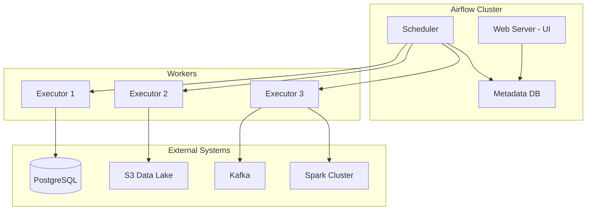

# Apache Airflow for Banking Data Orchestration

## Overview

Apache Airflow is the industry-standard orchestration platform for defining, scheduling, and monitoring data pipelines as code. In banking environments, Airflow manages everything from daily ETL jobs to real-time CDC synchronization and GenAI embedding refreshes.

## Airflow Architecture



## DAG Design Patterns

### Daily Banking Data Pipeline

```python
"""
DAG: daily_banking_etl
Description: Orchestrates daily data pipeline for banking analytics
Owner: data-engineering@bank.com
SLA: Complete by 06:00 UTC
"""
from datetime import datetime, timedelta
from airflow import DAG
from airflow.providers.postgres.operators.postgres import PostgresOperator
from airflow.providers.amazon.aws.transfers.s3_to_postgres import S3ToPostgresOperator
from airflow.operators.python import PythonOperator
from airflow.sensors.external_task import ExternalTaskSensor
from airflow.utils.task_group import TaskGroup

default_args = {
    'owner': 'data-engineering',
    'depends_on_past': True,  # Wait for previous run to succeed
    'email': ['data-alerts@bank.com'],
    'email_on_failure': True,
    'email_on_retry': False,
    'retries': 3,
    'retry_delay': timedelta(minutes=10),
    'retry_exponential_backoff': True,
    'max_retry_delay': timedelta(minutes=60),
    'sla': timedelta(hours=4),
}

with DAG(
    dag_id='daily_banking_etl',
    default_args=default_args,
    description='Daily ETL for banking analytics and GenAI pipelines',
    schedule_interval='0 2 * * *',  # Run at 02:00 UTC daily
    start_date=datetime(2025, 1, 1),
    catchup=False,
    tags=['banking', 'etl', 'daily', 'compliance'],
    max_active_runs=1,
    concurrency=10,
) as dag:
    
    # Wait for source data to arrive
    wait_for_core_banking = ExternalTaskSensor(
        task_id='wait_for_core_banking_dump',
        external_dag_id='core_banking_data_export',
        external_task_id='export_complete',
        execution_delta=timedelta(hours=1),
        timeout=timedelta(hours=2).total_seconds(),
        poke_interval=300,
        mode='reschedule',
    )
    
    wait_for_transactions = ExternalTaskSensor(
        task_id='wait_for_transaction_feed',
        external_dag_id='transaction_stream_processor',
        external_task_id='daily_batch_complete',
        execution_delta=timedelta(minutes=30),
        timeout=timedelta(hours=1).total_seconds(),
        poke_interval=300,
    )
    
    # Task Group: Data Ingestion
    with TaskGroup('data_ingestion', tooltip='Ingest raw data') as ingestion_group:
        load_accounts = PostgresOperator(
            task_id='load_accounts',
            postgres_conn_id='analytics_db',
            sql='''
                DELETE FROM staging_accounts 
                WHERE load_date = '{{ ds }}';
                
                INSERT INTO staging_accounts
                SELECT *, '{{ ds }}' AS load_date
                FROM raw_core_banking.accounts
                WHERE updated_date = '{{ ds }}';
            ''',
        )
        
        load_customers = PostgresOperator(
            task_id='load_customers',
            postgres_conn_id='analytics_db',
            sql='''
                DELETE FROM staging_customers 
                WHERE load_date = '{{ ds }}';
                
                INSERT INTO staging_customers
                SELECT *, '{{ ds }}' AS load_date
                FROM raw_core_banking.customers
                WHERE updated_date = '{{ ds }}';
            ''',
        )
    
    # Task Group: Transformations
    with TaskGroup('transformations', tooltip='Transform data') as transform_group:
        transform_transactions = PostgresOperator(
            task_id='transform_transactions',
            postgres_conn_id='analytics_db',
            sql='sql/transform/transform_transactions.sql',
            params={'run_date': '{{ ds }}'},
        )
        
        calculate_daily_balances = PostgresOperator(
            task_id='calculate_daily_balances',
            postgres_conn_id='analytics_db',
            sql='sql/transform/calculate_daily_balances.sql',
            params={'run_date': '{{ ds }}'},
        )
        
        build_customer_360 = PythonOperator(
            task_id='build_customer_360',
            python_callable=build_customer_360_view,
            op_kwargs={'run_date': '{{ ds }}'},
            retries=2,
        )
    
    # Task Group: Quality Checks
    with TaskGroup('quality_checks', tooltip='Validate data') as quality_group:
        check_row_counts = PythonOperator(
            task_id='check_row_counts',
            python_callable=validate_row_counts,
            op_kwargs={'run_date': '{{ ds }}'},
        )
        
        check_null_rates = PythonOperator(
            task_id='check_null_rates',
            python_callable=validate_null_rates,
            op_kwargs={'run_date': '{{ ds }}'},
        )
        
        check_freshness = PythonOperator(
            task_id='check_data_freshness',
            python_callable=validate_data_freshness,
            op_kwargs={'run_date': '{{ ds }}'},
        )
    
    # Refresh GenAI embeddings
    refresh_embeddings = PythonOperator(
        task_id='refresh_product_embeddings',
        python_callable=refresh_banking_product_embeddings,
        op_kwargs={'run_date': '{{ ds }}'},
        queue='gpu_workers',
    )
    
    # Update materialized views
    refresh_mv = PostgresOperator(
        task_id='refresh_materialized_views',
        postgres_conn_id='analytics_db',
        sql='''
            REFRESH MATERIALIZED VIEW CONCURRENTLY mv_daily_transaction_summary;
            REFRESH MATERIALIZED VIEW CONCURRENTLY mv_customer_segmentation;
            REFRESH MATERIALIZED VIEW CONCURRENTLY mv_product_recommendations;
        ''',
    )
    
    # Define dependencies
    wait_for_core_banking >> ingestion_group
    wait_for_transactions >> ingestion_group
    ingestion_group >> transform_group
    transform_group >> quality_group
    quality_group >> refresh_embeddings
    quality_group >> refresh_mv
    refresh_embeddings >> refresh_mv
```

## Custom Operators

```python
"""Custom Airflow operators for banking-specific operations."""
from airflow.models import BaseOperator
from airflow.utils.decorators import apply_defaults
import psycopg2
import logging

logger = logging.getLogger(__name__)

class BankingDataQualityOperator(BaseOperator):
    """Validate banking data quality with configurable checks."""
    
    @apply_defaults
    def __init__(
        self,
        postgres_conn_id: str,
        checks: list,
        fail_on_error: bool = True,
        **kwargs
    ):
        super().__init__(**kwargs)
        self.postgres_conn_id = postgres_conn_id
        self.checks = checks
        self.fail_on_error = fail_on_error
    
    def execute(self, context):
        hook = self.get_hook()
        conn = hook.get_conn()
        results = []
        
        for check in self.checks:
            query = check['query']
            expected = check.get('expected')
            threshold = check.get('threshold')
            
            with conn.cursor() as cur:
                cur.execute(query)
                result = cur.fetchone()[0]
            
            passed = True
            if expected is not None and result != expected:
                passed = False
            if threshold is not None and result > threshold:
                passed = False
            
            results.append({
                'check': check['name'],
                'result': result,
                'passed': passed,
            })
            
            if not passed and self.fail_on_error:
                raise ValueError(
                    f"Data quality check failed: {check['name']}. "
                    f"Got {result}"
                )
        
        return results

class PGVectorRefreshOperator(BaseOperator):
    """Refresh pgvector embeddings for GenAI retrieval."""
    
    @apply_defaults
    def __init__(
        self,
        postgres_conn_id: str,
        embedding_model: str = 'text-embedding-3-large',
        batch_size: int = 100,
        **kwargs
    ):
        super().__init__(**kwargs)
        self.postgres_conn_id = postgres_conn_id
        self.embedding_model = embedding_model
        self.batch_size = batch_size
    
    def execute(self, context):
        from openai import OpenAI
        import numpy as np
        
        client = OpenAI()
        hook = self.get_hook()
        conn = hook.get_conn()
        
        # Fetch documents needing embedding update
        with conn.cursor() as cur:
            cur.execute("""
                SELECT id, content 
                FROM banking_documents 
                WHERE embedding IS NULL 
                   OR embedding_version != %s
                ORDER BY created_at
                LIMIT 1000
            """, (self.embedding_model,))
            
            documents = cur.fetchall()
        
        logger.info(f"Refreshing embeddings for {len(documents)} documents")
        
        for i in range(0, len(documents), self.batch_size):
            batch = documents[i:i + self.batch_size]
            texts = [doc[1] for doc in batch]
            
            response = client.embeddings.create(
                input=texts,
                model=self.embedding_model
            )
            
            embeddings = [e.embedding for e in response.data]
            
            with conn.cursor() as cur:
                for doc, embedding in zip(batch, embeddings):
                    cur.execute("""
                        UPDATE banking_documents 
                        SET embedding = %s::vector,
                            embedding_version = %s,
                            embedding_updated_at = NOW()
                        WHERE id = %s
                    """, (embedding, self.embedding_model, doc[0]))
            
            conn.commit()
            logger.info(f"Processed batch {i // self.batch_size + 1}")
        
        logger.info("Embedding refresh complete")
```

## Sensors and Wait Strategies

```python
# Sensor for file availability in S3
from airflow.providers.amazon.aws.sensors.s3 import S3KeySensor

wait_for_statement_file = S3KeySensor(
    task_id='wait_for_daily_statements',
    bucket_key='banking/statements/{{ ds }}/statements.csv',
    bucket_name='banking-data-lake',
    aws_conn_id='aws_default',
    timeout=3600,
    poke_interval=300,
    mode='reschedule',  # Free up worker slot while waiting
)

# Sensor for database table freshness
from airflow.sensors.sql import SqlSensor

wait_for_table_update = SqlSensor(
    task_id='wait_for_transactions_table_update',
    conn_id='analytics_db',
    sql="""
        SELECT COUNT(*) FROM pipeline_run_status
        WHERE pipeline_name = 'transaction_loader'
          AND status = 'COMPLETE'
          AND run_date = '{{ ds }}'
    """,
    expected='1',
    timeout=7200,
    poke_interval=600,
)
```

## Retry Strategies

```python
"""
Retry strategy guidelines for Airflow DAGs:

1. Transient failures (network, timeout): Retry with backoff
2. Data quality failures: Do NOT retry, alert immediately
3. Dependency failures: Retry with longer timeout
4. Resource failures (OOM, disk): Retry on different worker
"""

# Exponential backoff retry
from airflow.utils.task_group import TaskGroup
from datetime import timedelta

retry_args = {
    'retries': 3,
    'retry_delay': timedelta(minutes=5),
    'retry_exponential_backoff': True,
    'max_retry_delay': timedelta(minutes=60),
}

# Different retry strategies for different task types
api_call_task = PythonOperator(
    task_id='fetch_from_api',
    python_callable=fetch_banking_api,
    retries=5,  # API calls may have transient issues
    retry_delay=timedelta(minutes=2),
    retry_exponential_backoff=True,
)

data_quality_task = PythonOperator(
    task_id='validate_data',
    python_callable=check_quality,
    retries=0,  # Data quality failures should NOT be retried
    email_on_failure=True,
)

heavy_computation = PythonOperator(
    task_id='run_ml_model',
    python_callable=run_inference,
    retries=1,  # Expensive computation, minimal retries
    retry_delay=timedelta(minutes=30),
    pool='gpu_pool',  # Use dedicated resource pool
)
```

## Cross-References

- **Data Pipelines**: See [data-pipelines.md](data-pipelines.md) for architecture
- **Kafka**: See [kafka.md](kafka.md) for streaming sources
- **Data Quality**: See [data-quality.md](data-quality.md) for validation checks

## Interview Questions

1. **How do you handle backfilling in Airflow when a DAG has been broken for 30 days?**
2. **Design an Airflow DAG for a daily banking reconciliation pipeline with quality gates.**
3. **When would you use `catchup=False` vs `catchup=True`? What are the implications?**
4. **How do you pass data between tasks in Airflow? What are the limitations?**
5. **What is the difference between `depends_on_past` and `wait_for_downstream`?**
6. **How do you handle secrets and credentials in Airflow for production banking pipelines?**

## Checklist: Airflow Best Practices

- [ ] Use `depends_on_past` for pipelines that require sequential execution
- [ ] Set appropriate SLAs and alerting for time-sensitive jobs
- [ ] Use TaskGroups to organize related tasks visually
- [ ] Implement `mode='reschedule'` for long-waiting sensors
- [ ] Never store credentials in DAG files (use Airflow Connections)
- [ ] Use XComs sparingly (they store data in metadata DB)
- [ ] Test DAGs with `airflow tasks test` before deploying
- [ ] Document DAG ownership, SLA, and runbooks in docstrings
- [ ] Set `max_active_runs` to prevent resource exhaustion
- [ ] Use pools to limit concurrent resource-intensive tasks
