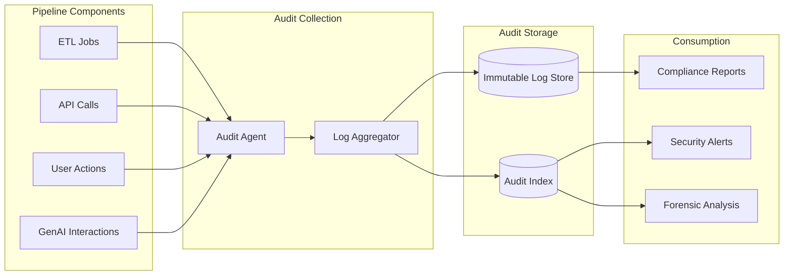

# Audit Logging in Data Pipelines

## Overview

Audit logging tracks every data operation in banking pipelines for compliance, debugging, and forensic analysis. Regulators require complete audit trails showing who accessed what data, when, and why. For GenAI platforms, audit logging extends to tracking training data proven, retrieval sources, prompt history, and model output accountability. This guide covers audit logging architecture, immutable storage, and compliance reporting.

## Audit Logging Architecture



## Audit Log Schema

```sql
-- Comprehensive audit log table
CREATE TABLE audit_logs (
    audit_id UUID PRIMARY KEY DEFAULT gen_random_uuid(),
    
    -- Event details
    event_type VARCHAR(50) NOT NULL,  -- READ, WRITE, DELETE, EXPORT, LOGIN
    event_sub_type VARCHAR(50),        -- TABLE_READ, API_CALL, MODEL_INVOKE
    
    -- Actor
    actor_id VARCHAR(100) NOT NULL,    -- User ID, service account, pipeline name
    actor_type VARCHAR(20) NOT NULL,   -- USER, SERVICE, PIPELINE
    actor_role VARCHAR(50),            -- Role at time of action
    
    -- Resource
    resource_type VARCHAR(50) NOT NULL, -- TABLE, ROW, FILE, MODEL, PROMPT
    resource_id VARCHAR(200),           -- Specific resource identifier
    resource_name VARCHAR(200),         -- Human-readable name
    
    -- Action details
    action VARCHAR(20) NOT NULL,       -- SELECT, INSERT, UPDATE, DELETE
    description TEXT,                   -- Human-readable description
    metadata JSONB,                     -- Additional context
    
    -- Data specifics
    data_classification VARCHAR(20),    -- PUBLIC, INTERNAL, CONFIDENTIAL, RESTRICTED
    pii_accessed BOOLEAN DEFAULT false, -- Was PII accessed?
    record_count BIGINT,               -- Number of records affected
    
    -- Outcome
    status VARCHAR(20) DEFAULT 'SUCCESS',
    error_message TEXT,
    
    -- Context
    source_ip INET,
    user_agent TEXT,
    session_id VARCHAR(100),
    request_id VARCHAR(100),           -- Correlate with application logs
    
    -- Timestamps
    event_timestamp TIMESTAMPTZ DEFAULT NOW(),
    
    -- Integrity
    previous_hash VARCHAR(64),         -- Chain hash for tamper detection
    record_hash VARCHAR(64) GENERATED ALWAYS AS (
        encode(sha256((
            audit_id::text || event_type || actor_id || resource_type || 
            resource_id || action || event_timestamp::text || previous_hash
        )::bytea), 'hex')
    ) STORED
);

-- Indexes for common queries
CREATE INDEX idx_audit_actor_time ON audit_logs (actor_id, event_timestamp DESC);
CREATE INDEX idx_audit_resource_time ON audit_logs (resource_type, resource_id, event_timestamp DESC);
CREATE INDEX idx_audit_event_type ON audit_logs (event_type, event_timestamp DESC);
CREATE INDEX idx_audit_metadata ON audit_logs USING gin (metadata);
```

## Audit Logging in Python Pipelines

```python
"""
Audit logging for data pipeline operations.
Every data access, transformation, and write is logged.
"""
import hashlib
import json
import logging
import uuid
from datetime import datetime
from typing import Optional, Dict, Any
from dataclasses import dataclass, asdict
import psycopg2

logger = logging.getLogger(__name__)

@dataclass
class AuditEvent:
    """Represents an audit event."""
    event_type: str
    event_sub_type: str
    actor_id: str
    actor_type: str
    actor_role: str
    resource_type: str
    resource_id: str
    resource_name: str
    action: str
    description: str
    metadata: Dict[str, Any]
    data_classification: str
    pii_accessed: bool
    record_count: Optional[int]
    status: str
    error_message: Optional[str]
    source_ip: Optional[str]
    session_id: Optional[str]
    request_id: Optional[str]
    event_timestamp: datetime
    previous_hash: Optional[str]

class AuditLogger:
    """Immutable audit logging for data pipelines."""
    
    def __init__(self, db_config: dict):
        self.db_config = db_config
        self.previous_hash = self._get_last_hash()
    
    def _get_last_hash(self) -> Optional[str]:
        """Get the hash of the last audit record for chaining."""
        conn = psycopg2.connect(**self.db_config)
        with conn.cursor() as cur:
            cur.execute("""
                SELECT record_hash FROM audit_logs 
                ORDER BY event_timestamp DESC LIMIT 1
            """)
            result = cur.fetchone()
        conn.close()
        return result[0] if result else None
    
    def log(
        self,
        event_type: str,
        actor_id: str,
        resource_type: str,
        resource_id: str,
        action: str,
        description: str = "",
        metadata: Optional[Dict] = None,
        data_classification: str = "INTERNAL",
        pii_accessed: bool = False,
        record_count: Optional[int] = None,
        status: str = "SUCCESS",
        error_message: Optional[str] = None,
        **kwargs
    ) -> str:
        """Log an audit event with hash chaining."""
        event = AuditEvent(
            event_type=event_type,
            event_sub_type=kwargs.get('event_sub_type', ''),
            actor_id=actor_id,
            actor_type=kwargs.get('actor_type', 'SERVICE'),
            actor_role=kwargs.get('actor_role', ''),
            resource_type=resource_type,
            resource_id=resource_id,
            resource_name=kwargs.get('resource_name', ''),
            action=action,
            description=description,
            metadata=metadata or {},
            data_classification=data_classification,
            pii_accessed=pii_accessed,
            record_count=record_count,
            status=status,
            error_message=error_message,
            source_ip=kwargs.get('source_ip'),
            session_id=kwargs.get('session_id'),
            request_id=kwargs.get('request_id'),
            event_timestamp=datetime.utcnow(),
            previous_hash=self.previous_hash,
        )
        
        # Store in database
        audit_id = self._store_event(event)
        
        # Update chain hash
        self.previous_hash = event.record_hash
        
        # Also write to file for tamper detection
        self._write_to_file(event)
        
        return audit_id
    
    def _store_event(self, event: AuditEvent) -> str:
        """Store event in database."""
        conn = psycopg2.connect(**self.db_config)
        with conn.cursor() as cur:
            cur.execute("""
                INSERT INTO audit_logs (
                    event_type, event_sub_type, actor_id, actor_type,
                    actor_role, resource_type, resource_id, resource_name,
                    action, description, metadata, data_classification,
                    pii_accessed, record_count, status, error_message,
                    source_ip, session_id, request_id, event_timestamp,
                    previous_hash
                ) VALUES (%s, %s, %s, %s, %s, %s, %s, %s, %s, %s, %s, %s,
                          %s, %s, %s, %s, %s, %s, %s, %s, %s)
                RETURNING audit_id
            """, (
                event.event_type, event.event_sub_type, event.actor_id,
                event.actor_type, event.actor_role, event.resource_type,
                event.resource_id, event.resource_name, event.action,
                event.description, json.dumps(event.metadata),
                event.data_classification, event.pii_accessed,
                event.record_count, event.status, event.error_message,
                event.source_ip, event.session_id, event.request_id,
                event.event_timestamp, event.previous_hash,
            ))
            audit_id = cur.fetchone()[0]
        conn.commit()
        conn.close()
        return str(audit_id)
    
    def _write_to_file(self, event: AuditEvent):
        """Write event to append-only file for tamper detection."""
        import os
        log_dir = '/var/log/audit'
        os.makedirs(log_dir, exist_ok=True)
        
        log_file = os.path.join(log_dir, f"audit-{datetime.utcnow().strftime('%Y-%m-%d')}.jsonl")
        
        with open(log_file, 'a') as f:
            f.write(json.dumps(asdict(event), default=str) + '\n')

# Usage in data pipeline
audit = AuditLogger(db_config)

def load_customer_data(pipeline_name: str, customer_id: int):
    """Load customer data with audit logging."""
    audit.log(
        event_type="DATA_ACCESS",
        actor_id=pipeline_name,
        actor_type="PIPELINE",
        resource_type="TABLE",
        resource_id="customers",
        action="SELECT",
        description=f"Loading customer data for customer {customer_id}",
        metadata={"customer_id": customer_id, "pipeline": pipeline_name},
        data_classification="CONFIDENTIAL",
        pii_accessed=True,
        record_count=1,
    )
    
    # Actual data access
    data = fetch_customer(customer_id)
    return data
```

## GenAI Audit Logging

```python
"""Audit logging for GenAI interactions."""

class GenAIAuditLogger:
    """Audit GenAI operations for compliance."""
    
    def __init__(self, audit_logger: AuditLogger):
        self.audit = audit_logger
    
    def log_prompt(self, user_id: str, prompt: str, model: str) -> str:
        """Log a user prompt."""
        return self.audit.log(
            event_type="GENAI_INTERACTION",
            event_sub_type="PROMPT",
            actor_id=user_id,
            actor_type="USER",
            resource_type="MODEL",
            resource_id=model,
            action="INVOKE",
            description=f"User invoked {model} with prompt",
            metadata={
                "prompt_hash": hashlib.sha256(prompt.encode()).hexdigest(),
                "prompt_length": len(prompt),
                "model": model,
            },
            pii_accessed=self._contains_pii(prompt),
        )
    
    def log_response(
        self, 
        user_id: str, 
        response: str, 
        model: str,
        request_id: str,
        sources: list = None,
    ) -> str:
        """Log a model response."""
        return self.audit.log(
            event_type="GENAI_INTERACTION",
            event_sub_type="RESPONSE",
            actor_id=model,
            actor_type="SERVICE",
            resource_type="MODEL",
            resource_id=model,
            action="RESPOND",
            description=f"Model {model} responded to user {user_id}",
            metadata={
                "response_hash": hashlib.sha256(response.encode()).hexdigest(),
                "response_length": len(response),
                "request_id": request_id,
                "sources": sources or [],
            },
            pii_accessed=self._contains_pii(response),
        )
    
    def log_retrieval(
        self, 
        user_id: str,
        query: str,
        retrieved_chunks: list,
        request_id: str,
    ) -> str:
        """Log RAG retrieval."""
        return self.audit.log(
            event_type="GENAI_RETRIEVAL",
            event_sub_type="VECTOR_SEARCH",
            actor_id=user_id,
            actor_type="USER",
            resource_type="VECTOR_STORE",
            resource_id="document_chunks",
            action="QUERY",
            description=f"Retrieved {len(retrieved_chunks)} chunks for query",
            metadata={
                "query_hash": hashlib.sha256(query.encode()).hexdigest(),
                "chunks_retrieved": len(retrieved_chunks),
                "chunk_ids": [c['chunk_id'] for c in retrieved_chunks[:10]],
                "request_id": request_id,
            },
        )
```

## Compliance Reporting

```sql
-- Generate audit report for regulatory review
SELECT 
    DATE(event_timestamp) AS event_date,
    event_type,
    action,
    actor_id,
    actor_type,
    resource_type,
    resource_name,
    COUNT(*) AS event_count,
    SUM(CASE WHEN pii_accessed THEN 1 ELSE 0 END) AS pii_access_count,
    SUM(CASE WHEN status = 'FAILED' THEN 1 ELSE 0 END) AS failure_count
FROM audit_logs
WHERE event_timestamp >= CURRENT_DATE - INTERVAL '30 days'
GROUP BY 
    DATE(event_timestamp), event_type, action, 
    actor_id, actor_type, resource_type, resource_name
ORDER BY event_date DESC, event_count DESC;

-- Track PII access
SELECT 
    actor_id,
    COUNT(*) AS pii_access_count,
    COUNT(DISTINCT resource_type || ':' || resource_id) AS unique_resources,
    MIN(event_timestamp) AS first_access,
    MAX(event_timestamp) AS last_access
FROM audit_logs
WHERE pii_accessed = true
  AND event_timestamp >= CURRENT_DATE - INTERVAL '90 days'
GROUP BY actor_id
ORDER BY pii_access_count DESC;

-- Detect anomalous access patterns
WITH daily_access AS (
    SELECT 
        actor_id,
        DATE(event_timestamp) AS access_date,
        COUNT(*) AS daily_events
    FROM audit_logs
    WHERE event_timestamp >= CURRENT_DATE - INTERVAL '90 days'
    GROUP BY actor_id, DATE(event_timestamp)
),
actor_baselines AS (
    SELECT 
        actor_id,
        AVG(daily_events) AS avg_daily,
        STDDEV(daily_events) AS stddev_daily
    FROM daily_access
    GROUP BY actor_id
)
SELECT 
    da.actor_id,
    da.access_date,
    da.daily_events,
    ab.avg_daily,
    ab.stddev_daily,
    ROUND(
        (da.daily_events - ab.avg_daily) / NULLIF(ab.stddev_daily, 0), 2
    ) AS z_score
FROM daily_access da
JOIN actor_baselines ab ON da.actor_id = ab.actor_id
WHERE ab.stddev_daily > 0
  AND (da.daily_events - ab.avg_daily) / ab.stddev_daily > 3.0
ORDER BY z_score DESC;
```

## Cross-References

- **Data Governance**: See [data-governance.md](data-governance.md) for compliance framework
- **Data Lineage**: See [data-lineage.md](data-lineage.md) for data flow tracking
- **Security Scanning**: See [security-scanning.md](../cicd-devops/security-scanning.md) for pipeline security

## Interview Questions

1. **How do you ensure audit logs cannot be tampered with?**
2. **What events should you audit in a data pipeline?**
3. **How do you design audit logging that doesn't impact pipeline performance?**
4. **A regulator requests all access to customer PII in the last 90 days. How do you respond?**
5. **How do you detect anomalous data access patterns from audit logs?**
6. **What is hash chaining and how does it protect audit integrity?**

## Checklist: Audit Logging

- [ ] All data access operations logged (read, write, delete, export)
- [ ] GenAI interactions logged (prompts, responses, retrievals)
- [ ] Audit records include actor, resource, action, timestamp
- [ ] Hash chaining implemented for tamper detection
- [ ] Audit logs stored in append-only format
- [ ] PII access specifically tracked and reportable
- [ ] Failed operations logged with error details
- [ ] Audit log retention policy defined and enforced
- [ ] Compliance reporting queries tested
- [ ] Anomaly detection on audit patterns
- [ ] Regular audit log integrity verification
