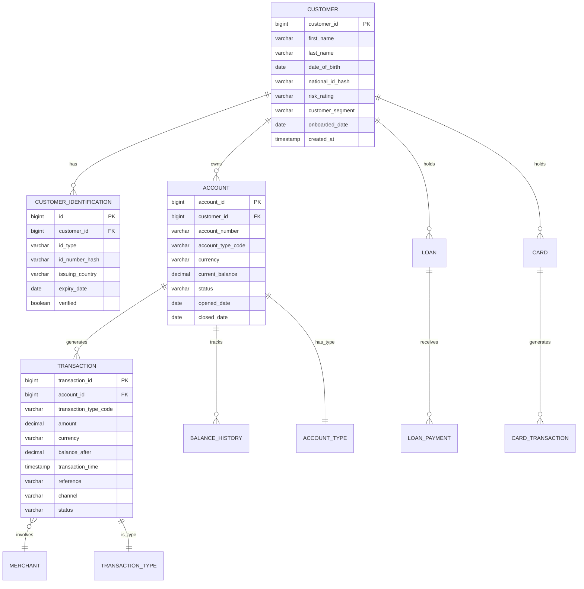

# Banking Data Architecture

## Overview

Banking data architecture is fundamentally different from typical tech company data architecture. Banking systems handle money movement, regulatory reporting, and customer financial records where accuracy, auditability, and consistency are non-negotiable. This guide covers banking-specific data models, core banking data structures, and regulatory data requirements.

## Core Banking Data Model



## Core Banking Systems Integration

```python
"""
Integration patterns with core banking systems.
Core banking systems (Temenos T24, Fiserv, Jack Henry) are typically 
legacy systems with complex data models requiring careful integration.
"""

# Core banking data extraction pattern
CORE_BANKING_EXTRACTION = """
-- Extract daily snapshot from core banking
-- Core systems often have complex, normalized schemas

-- Customer master
SELECT 
    CUST_NO AS customer_id,
    CUST_TYPE AS customer_type,
    CUST_STATUS AS status,
    DATE_OPENED AS onboarded_date,
    RISK_CLASS AS risk_rating,
    SEGMENT AS customer_segment
FROM CUSTOMER
WHERE RECORD_STATUS = 'OPEN';

-- Account master
SELECT 
    ACCT_NO AS account_id,
    CUST_NO AS customer_id,
    ACCT_TYPE AS account_type,
    CCY AS currency,
    ACCT_BALANCE AS current_balance,
    LEDGER_BALANCE AS ledger_balance,
    ACCT_STATUS AS status,
    DATE_OPENED AS opened_date
FROM ACCOUNT
WHERE RECORD_STATUS = 'OPEN';

-- Daily transactions (from overnight batch)
SELECT 
    TXN_ID AS transaction_id,
    ACCT_NO AS account_id,
    TXN_TYPE AS transaction_type,
    LCY_AMOUNT AS amount,
    CCY AS currency,
    POSTING_DATE AS transaction_date,
    VALUE_DATE AS value_date,
    REFERENCE AS reference,
    NARRATIVE AS description
FROM ACCOUNT_TRANSACTIONS
WHERE POSTING_DATE = @BATCH_DATE
  AND POSTING_STATUS = 'POSTED';
"""

# Modernized data model for analytics
ANALYTICS_MODEL = """
-- Star schema for banking analytics
-- Fact tables: transactions, balances, events
-- Dimension tables: customer, account, product, date, branch

CREATE TABLE fact_transactions (
    transaction_id BIGINT PRIMARY KEY,
    date_key INT,
    customer_key INT,
    account_key INT,
    product_key INT,
    branch_key INT,
    transaction_type_key INT,
    channel_key INT,
    
    amount DECIMAL(15, 2),
    currency VARCHAR(3),
    balance_after DECIMAL(15, 2),
    is_international BOOLEAN,
    is_recurring BOOLEAN,
    
    -- Audit
    source_system VARCHAR(50),
    extracted_at TIMESTAMPTZ,
    processed_at TIMESTAMPTZ
);

CREATE TABLE dim_customer (
    customer_key INT PRIMARY KEY,
    customer_id VARCHAR(50),
    segment VARCHAR(20),
    risk_rating VARCHAR(10),
    age_band VARCHAR(10),
    region VARCHAR(50),
    is_active BOOLEAN,
    relationship_years INT,
    product_count INT,
    valid_from DATE,
    valid_to DATE,
    is_current BOOLEAN
);
"""
```

## Regulatory Data Requirements

```yaml
# Regulatory reporting data requirements
regulatory_reports:
  basel_iii:
    frequency: quarterly
    data_required:
      - "Capital adequacy ratios"
      - "Risk-weighted assets by category"
      - "Liquidity coverage ratio (LCR)"
      - "Net stable funding ratio (NSFR)"
      - "Leverage ratio"
    retention: 10 years
    audit: external
    
  aml_reporting:
    frequency: continuous
    data_required:
      - "Transactions above $10,000 threshold"
      - "Suspicious activity patterns"
      - "Customer risk scores"
      - "PEP (Politically Exposed Person) flags"
      - "Sanctions screening results"
    retention: 7 years
    audit: regulatory
    
  gdpr:
    frequency: on_request
    data_required:
      - "All personal data for a customer"
      - "Data processing purposes"
      - "Third-party data sharing records"
      - "Consent records"
    retention: "Until consent withdrawn + legal hold"
    audit: internal + external
    
  cfpb_reporting:
    frequency: monthly
    data_required:
      - "Consumer complaint data"
      - "Loan performance metrics"
      - "Fair lending analysis"
      - "HMDA (Home Mortgage Disclosure Act) data"
    retention: 5 years
    audit: regulatory

# Data retention matrix by data type
data_retention:
  transaction_records: 7 years
  customer_identification: 7 years after relationship end
  account_statements: 7 years
  credit_reports: 7 years
  audit_logs: 10 years
  kyc_documents: 7 years after relationship end
  communication_records: 5 years
  system_logs: 3 years
  training_data_for_models: 5 years after model retirement
```

## Multi-Entity Banking

```sql
-- Banking institutions often manage multiple legal entities
-- with separate books but consolidated reporting

-- Legal entity structure
CREATE TABLE legal_entity (
    entity_id BIGINT PRIMARY KEY,
    entity_code VARCHAR(10) UNIQUE,
    entity_name VARCHAR(100),
    jurisdiction VARCHAR(50),
    regulatory_status VARCHAR(20),
    parent_entity_id BIGINT REFERENCES legal_entity(entity_id),
    consolidated BOOLEAN
);

-- Accounts belong to specific legal entities
CREATE TABLE accounts (
    account_id BIGINT PRIMARY KEY,
    entity_id BIGINT REFERENCES legal_entity(entity_id),
    customer_id BIGINT,
    account_number VARCHAR(20),
    account_type VARCHAR(20),
    currency VARCHAR(3),
    balance DECIMAL(15, 2),
    status VARCHAR(20)
);

-- Inter-entity transactions
CREATE TABLE interentity_transactions (
    transaction_id BIGINT PRIMARY KEY,
    from_entity_id BIGINT REFERENCES legal_entity(entity_id),
    to_entity_id BIGINT REFERENCES legal_entity(entity_id),
    from_account_id BIGINT REFERENCES accounts(account_id),
    to_account_id BIGINT REFERENCES accounts(account_id),
    amount DECIMAL(15, 2),
    currency VARCHAR(3),
    purpose VARCHAR(100),
    transaction_date DATE,
    approved_by VARCHAR(50),
    approval_date DATE
);

-- Consolidated reporting
CREATE VIEW consolidated_balance_sheet AS
SELECT 
    le.entity_code,
    le.entity_name,
    le.jurisdiction,
    COUNT(DISTINCT a.account_id) AS total_accounts,
    SUM(CASE WHEN a.balance > 0 THEN a.balance ELSE 0 END) AS total_assets,
    SUM(CASE WHEN a.balance < 0 THEN ABS(a.balance) ELSE 0 END) AS total_liabilities,
    SUM(a.balance) AS net_position
FROM legal_entity le
LEFT JOIN accounts a ON le.entity_id = a.entity_id
GROUP BY le.entity_code, le.entity_name, le.jurisdiction;
```

## Cross-References

- **Advanced SQL**: See [advanced-sql.md](advanced-sql.md) for complex queries
- **Data Governance**: See [data-governance.md](data-governance.md) for ownership
- **Schema Design**: See [schema-design.md](schema-design.md) for design patterns

## Interview Questions

1. **How does a core banking data model differ from a typical e-commerce data model?**
2. **Design a data model for a multi-entity banking institution with consolidated reporting.**
3. **What data is required for Basel III regulatory reporting?**
4. **How do you handle historical data when a customer's risk rating changes?**
5. **What are the data challenges in integrating with legacy core banking systems?**
6. **Design a data architecture for real-time payment processing with fraud detection.**

## Checklist: Banking Data Architecture

- [ ] Core banking data model documented and mapped to analytics schema
- [ ] Regulatory reporting data requirements identified and tracked
- [ ] Data retention policies aligned with regulatory requirements
- [ ] Multi-entity support designed into data model
- [ ] Audit trail implemented for all financial records
- [ ] Customer 360 view integrating all banking products
- [ ] Real-time data needs identified (fraud, payments, notifications)
- [ ] Historical data strategy defined (type 2 dimensions for SCD)
- [ ] Data lineage from core banking to analytics documented
- [ ] Disaster recovery plan for critical banking data tested
