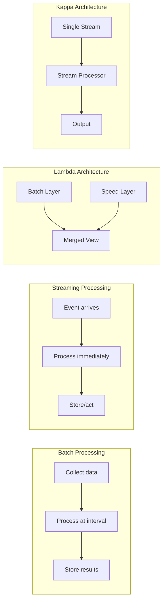

# Batch vs Streaming Processing for Banking Data

## Overview

Choosing between batch and streaming processing is a fundamental architectural decision in banking data platforms. Batch processing excels at accurate, cost-effective analysis of large datasets. Streaming enables real-time fraud detection, instant notifications, and live dashboards. Modern banking platforms use both, with careful consideration of tradeoffs, complexity, and operational overhead.

## Comparison



| Dimension | Batch | Streaming |
|-----------|-------|-----------|
| Latency | Minutes to hours | Milliseconds to seconds |
| Throughput | Very high | High |
| Complexity | Low | High |
| Cost | Lower | Higher (always-on) |
| Fault Tolerance | Simple (re-run) | Complex (exactly-once) |
| Windowing | Natural (daily, hourly) | Requires windowing logic |
| Backfilling | Native | Requires replay |
| Use Cases | Reporting, ML training | Fraud detection, alerts |

## Batch Processing Patterns

### Daily Banking Reconciliation

```python
"""
Batch pipeline: Daily reconciliation of banking transactions.
Runs nightly, processes full day's data, produces authoritative numbers.
"""
from pyspark.sql import SparkSession
from pyspark.sql.functions import *

spark = SparkSession.builder.appName("daily-reconciliation").getOrCreate()

def run_daily_reconciliation(run_date: str):
    """Process full day's transactions and reconcile."""
    # Read full day's data
    transactions = spark.read.parquet(
        f"s3://banking-data-lake/transactions/date={run_date}/"
    )
    accounts = spark.read.parquet("s3://banking-data-lake/accounts/")
    
    # Reconcile account balances
    daily_changes = (transactions
        .groupBy("account_id")
        .agg(
            sum(when(col("type") == "DEPOSIT", col("amount")).otherwise(0)).alias("total_deposits"),
            sum(when(col("type") == "WITHDRAWAL", col("amount")).otherwise(0)).alias("total_withdrawals"),
        )
    )
    
    previous_balances = spark.read.parquet(
        "s3://banking-data-lake/account_balances/"
    ).filter(col("date") == f"{run_date} - 1 day")
    
    reconciled = (previous_balances
        .join(daily_changes, "account_id", "left")
        .na.fill({"total_deposits": 0, "total_withdrawals": 0})
        .withColumn(
            "new_balance",
            col("previous_balance") + col("total_deposits") - col("total_withdrawals")
        )
        .withColumn("reconciliation_date", lit(run_date))
    )
    
    # Write authoritative results
    reconciled.write.mode("overwrite").parquet(
        f"s3://banking-data-lake/reconciled_balances/date={run_date}/"
    )
    
    # Generate variance report
    expected = spark.read.parquet(
        f"s3://banking-data-lake/expected_balances/date={run_date}/"
    )
    
    variances = reconciled.join(expected, "account_id").withColumn(
        "variance", col("new_balance") - col("expected_balance")
    ).filter(abs(col("variance")) > 0.01)
    
    variances.write.mode("overwrite").parquet(
        f"s3://banking-data-lake/variance_reports/date={run_date}/"
    )

# Scheduled via Airflow to run at 02:00 UTC daily
```

## Streaming Processing Patterns

### Real-Time Fraud Detection

```python
"""
Streaming pipeline: Real-time fraud detection on transaction events.
Must respond within 100ms of transaction arrival.
"""
from confluent_kafka import Consumer, Producer
import json
import time
from collections import defaultdict, deque
import threading

class RealTimeFraudDetector:
    """Detect fraudulent transactions in real-time."""
    
    def __init__(self, window_size_seconds=300):
        self.window_size = window_size_seconds
        # Recent transactions per account
        self.account_history = defaultdict(lambda: deque(maxlen=100))
        # Risk scores and thresholds
        self.risk_threshold = 0.7
        
        self.kafka_consumer = Consumer({
            'bootstrap.servers': 'kafka-1:9092',
            'group.id': 'fraud-detector',
            'auto.offset.reset': 'latest',
            'enable.auto.commit': False,
        })
        
        self.kafka_producer = Producer({
            'bootstrap.servers': 'kafka-1:9092',
            'acks': 'all',
        })
        
        self.consumer_lock = threading.Lock()
    
    def score_transaction(self, txn: dict) -> float:
        """Score a transaction for fraud likelihood."""
        score = 0.0
        account_id = txn['account_id']
        history = self.account_history[account_id]
        
        # Rule 1: Velocity check (too many transactions)
        recent_count = len([
            t for t in history 
            if time.time() - t['processed_at'] < self.window_size
        ])
        if recent_count > 10:
            score += 0.3
        
        # Rule 2: Amount anomaly
        if history:
            amounts = [t['amount'] for t in history]
            avg_amount = sum(amounts) / len(amounts)
            if txn['amount'] > avg_amount * 5:
                score += 0.3
        
        # Rule 3: Unusual time
        txn_hour = txn.get('timestamp_hour', 12)
        if txn_hour < 5 or txn_hour > 23:  # Unusual hours
            score += 0.15
        
        # Rule 4: New merchant
        known_merchants = {t.get('merchant_id') for t in history}
        if txn.get('merchant_id') and txn['merchant_id'] not in known_merchants:
            score += 0.1
        
        # Rule 5: International transaction
        if txn.get('is_international'):
            score += 0.15
        
        return min(score, 1.0)
    
    def process_transaction(self, txn: dict):
        """Process a single transaction."""
        start_time = time.time()
        
        # Score for fraud
        risk_score = self.score_transaction(txn)
        
        # Update history
        txn['processed_at'] = time.time()
        txn['risk_score'] = risk_score
        self.account_history[txn['account_id']].append(txn)
        
        # Alert if high risk
        if risk_score >= self.risk_threshold:
            alert = {
                'transaction_id': txn['transaction_id'],
                'account_id': txn['account_id'],
                'risk_score': risk_score,
                'rules_triggered': self.get_triggered_rules(txn),
                'action': 'BLOCK',  # or 'REVIEW'
                'timestamp': time.time(),
            }
            self.kafka_producer.produce(
                topic='fraud-alerts',
                value=json.dumps(alert).encode()
            )
        
        processing_time = (time.time() - start_time) * 1000
        if processing_time > 50:
            logger.warning(f"Slow processing: {processing_time:.0f}ms")
    
    def run(self):
        """Main processing loop."""
        self.kafka_consumer.subscribe(['banking-transactions'])
        
        while True:
            msg = self.kafka_consumer.poll(timeout=1.0)
            if msg is None:
                continue
            if msg.error():
                continue
            
            txn = json.loads(msg.value())
            self.process_transaction(txn)
            self.kafka_consumer.commit()
```

## Kappa Architecture: Stream-Only

```python
"""
Kappa Architecture: All processing as streams.
Historical data is replayed through the same stream processor.
Simplifies architecture but requires robust stream infrastructure.
"""

# The same stream processor handles both:
# 1. Real-time transactions (live data)
# 2. Historical backfill (replaying from Kafka)

# Kafka topic retention = 7 years (compliance requirement)
# To backfill: reset consumer group offset and replay

# Benefits:
# - Single code path for real-time and historical
# - No batch/streaming reconciliation needed
# - Simpler operations

# Drawbacks:
# - Kafka storage cost for 7 years of data
# - Replaying 7 years takes significant time
# - Some computations (joins with dimension data) are harder
```

## Making the Choice

```
Decision Framework:

1. What is the SLA for data freshness?
   - Hours/days -> Batch
   - Seconds -> Streaming
   - Both -> Lambda or Kappa

2. What is the computation complexity?
   - Full dataset scans (ML training) -> Batch
   - Per-event decisions (fraud) -> Streaming
   - Windowed aggregations -> Either

3. What is the data volume?
   - Massive (PB scale) -> Batch (cost-effective)
   - Moderate -> Streaming is feasible

4. What is the team's operational capacity?
   - Small team, limited ops -> Batch first
   - Mature platform team -> Streaming

5. Banking-specific requirements:
   - End-of-day reconciliation -> Batch
   - Real-time fraud detection -> Streaming
   - Regulatory reporting (EOD) -> Batch
   - Customer notifications -> Streaming

Most banking platforms: Batch + Streaming (hybrid)
```

## Cross-References

- **Spark/PySpark**: See [spark-pyspark.md](spark-pyspark.md) for batch processing
- **Kafka**: See [kafka.md](kafka.md) for streaming infrastructure
- **Warehouses vs Lakehouses**: See [warehouses-lakehouses.md](warehouses-lakehouses.md) for storage

## Interview Questions

1. **When would you choose batch over streaming for a banking pipeline?**
2. **What is Lambda architecture and why is it being replaced by Kappa?**
3. **Your streaming pipeline processes 1M events/sec but starts dropping messages. What do you do?**
4. **How do you ensure batch and streaming results agree in a Lambda architecture?**
5. **Design a real-time fraud detection system. What are the latency requirements?**
6. **When does the complexity of streaming NOT justify the latency benefit?**

## Checklist: Batch vs Streaming Decision

- [ ] SLA requirements defined (latency, accuracy)
- [ ] Data volume and velocity characterized
- [ ] Computational complexity assessed
- [ ] Team operational capacity evaluated
- [ ] Cost comparison calculated
- [ ] Fault tolerance requirements defined
- [ ] Compliance requirements mapped (EOD reporting needs batch)
- [ ] Hybrid approach considered (batch for accuracy, streaming for speed)
- [ ] Replay/backfill strategy defined for streaming
- [ ] Monitoring and alerting plan documented
