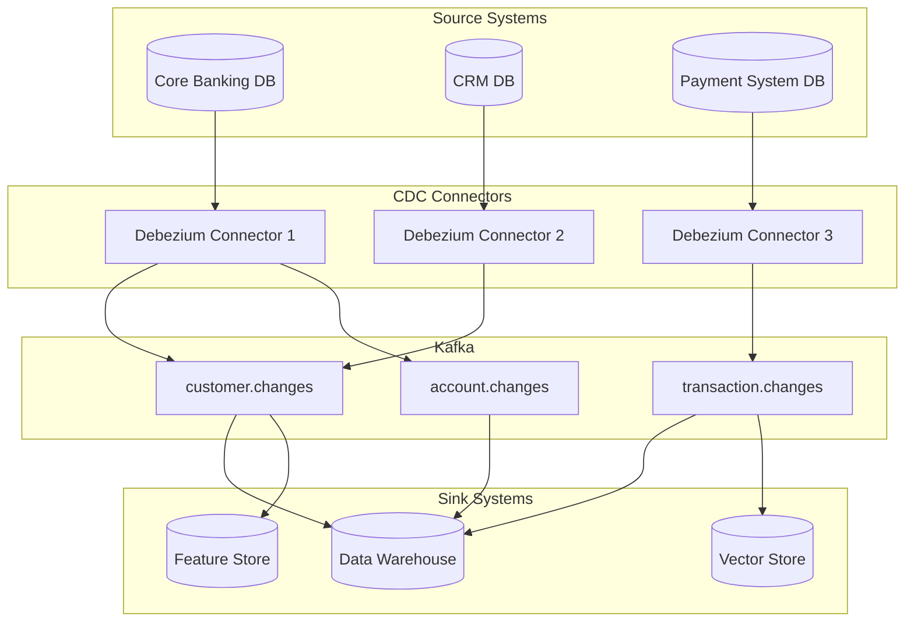

# Change Data Capture (CDC) for Banking Data Synchronization

## Overview

Change Data Capture (CDC) is a pattern that tracks and propagates data changes from source databases to downstream systems in near real-time. In banking, CDC is essential for:
- Replicating core banking data to analytics warehouses without impacting production
- Syncing customer data across multiple systems (CRM, mobile app, GenAI assistant)
- Feeding real-time fraud detection systems with the latest transaction data
- Maintaining audit trails for regulatory compliance

This guide covers CDC architectures, Debezium implementation, and operational patterns for banking environments.

## CDC Architecture



## Debezium Setup

### Connector Configuration

```json
{
    "name": "core-banking-connector",
    "config": {
        "connector.class": "io.debezium.connector.postgresql.PostgresConnector",
        "tasks.max": "1",
        "database.hostname": "core-banking-db.internal",
        "database.port": "5432",
        "database.user": "cdc_user",
        "database.password": "${CDC_PASSWORD}",
        "database.dbname": "core_banking",
        "database.server.name": "cb-prod",
        "schema.include.list": "public,banking",
        "table.include.list": "public.customers,public.accounts,banking.transactions",
        "plugin.name": "pgoutput",
        "publication.name": "cdc_publication",
        "publication.autocreate.mode": "filtered",
        "slot.name": "core_banking_cdc",
        "snapshot.mode": "initial",
        "snapshot.locking.mode": "minimal",
        "tombstones.on.delete": true,
        "key.converter": "org.apache.kafka.connect.json.JsonConverter",
        "key.converter.schemas.enable": false,
        "value.converter": "org.apache.kafka.connect.json.JsonConverter",
        "value.converter.schemas.enable": false,
        "transforms": "unwrap,route",
        "transforms.unwrap.type": "io.debezium.transforms.ExtractNewRecordState",
        "transforms.unwrap.delete.handling.mode": "rewrite",
        "transforms.unwrap.add.fields": "op,source.ts_ms,source.table",
        "transforms.route.type": "org.apache.kafka.connect.transforms.RegexRouter",
        "transforms.route.regex": "([^.]+)\\.([^.]+)\\.([^.]+)",
        "transforms.route.replacement": "banking.$3.changes",
        "heartbeat.interval.ms": 10000,
        "poll.interval.ms": 500,
        "max.batch.size": 16384,
        "max.queue.size": 65536
    }
}
```

### Understanding CDC Events

```json
// Insert Event
{
    "id": 1001,
    "customer_id": 5001,
    "amount": 5000.00,
    "transaction_type": "DEPOSIT",
    "transaction_time": "2025-01-15T10:30:00Z",
    "__op": "c",
    "__source_ts_ms": 1705312200000,
    "__table": "transactions",
    "__deleted": false
}

// Update Event (before and after state)
{
    "before": {
        "account_id": 2001,
        "balance": 10000.00,
        "status": "ACTIVE",
        "updated_at": "2025-01-14T15:00:00Z"
    },
    "after": {
        "account_id": 2001,
        "balance": 15000.00,
        "status": "ACTIVE",
        "updated_at": "2025-01-15T10:30:00Z"
    },
    "__op": "u",
    "__source_ts_ms": 1705312200000,
    "__table": "accounts",
    "__deleted": false
}

// Delete Event
{
    "transaction_id": 9001,
    "__op": "d",
    "__source_ts_ms": 1705312200000,
    "__table": "transactions",
    "__deleted": true
}
```

## CDC Consumer: Applying Changes to Data Warehouse

```python
"""CDC consumer that applies changes to the data warehouse."""
from confluent_kafka import Consumer
import psycopg2
import json
import logging
from datetime import datetime

logger = logging.getLogger(__name__)

class CDCApplier:
    """Apply CDC events to the target data warehouse."""
    
    def __init__(self, kafka_config: dict, db_config: dict):
        self.consumer = Consumer(kafka_config)
        self.db = psycopg2.connect(**db_config)
        self.batch_size = 1000
        self.batch = []
    
    def get_table_mapping(self, table_name: str) -> str:
        """Map source table to target table."""
        mapping = {
            'transactions': 'dwh.stg_transactions',
            'accounts': 'dwh.stg_accounts',
            'customers': 'dwh.stg_customers',
        }
        return mapping.get(table_name)
    
    def apply_insert(self, table: str, record: dict):
        """Handle insert operation."""
        target = self.get_table_mapping(table)
        columns = list(record.keys())
        placeholders = ['%s'] * len(columns)
        
        query = f"""
            INSERT INTO {target} ({', '.join(columns)})
            VALUES ({', '.join(placeholders)})
            ON CONFLICT DO NOTHING
        """
        values = [record.get(col) for col in columns]
        
        with self.db.cursor() as cur:
            cur.execute(query, values)
    
    def apply_update(self, table: str, before: dict, after: dict):
        """Handle update operation."""
        target = self.get_table_mapping(table)
        
        # Build SET clause from changed fields
        set_clause = []
        values = []
        for key, new_value in after.items():
            set_clause.append(f"{key} = %s")
            values.append(new_value)
        
        # Use primary key for WHERE
        pk = after.get('id') or after.get('account_id') or after.get('customer_id')
        query = f"UPDATE {target} SET {', '.join(set_clause)} WHERE id = %s"
        values.append(pk)
        
        with self.db.cursor() as cur:
            cur.execute(query, values)
    
    def apply_delete(self, table: str, record: dict):
        """Handle delete operation (soft delete for audit)."""
        target = self.get_table_mapping(table)
        pk = record.get('id') or record.get('account_id') or record.get('customer_id')
        
        # Soft delete: mark as deleted instead of removing
        query = f"""
            UPDATE {target} 
            SET is_deleted = true, deleted_at = %s
            WHERE id = %s
        """
        with self.db.cursor() as cur:
            cur.execute(query, (datetime.utcnow(), pk))
    
    def process_event(self, event: dict):
        """Process a single CDC event."""
        table = event.get('__table')
        operation = event.get('__op')
        
        if operation == 'c':  # Create
            self.apply_insert(table, event)
        elif operation == 'u':  # Update
            before = event.get('before', {})
            after = event.get('after', {})
            self.apply_update(table, after)
        elif operation == 'd':  # Delete
            self.apply_delete(table, event)
    
    def run(self):
        """Main CDC processing loop."""
        self.consumer.subscribe(['banking.transactions.changes', 
                                  'banking.accounts.changes',
                                  'banking.customers.changes'])
        
        batch_count = 0
        while True:
            msg = self.consumer.poll(timeout=1.0)
            if msg is None:
                if self.batch:
                    self.flush_batch()
                continue
            if msg.error():
                logger.error(f"Consumer error: {msg.error()}")
                continue
            
            event = json.loads(msg.value())
            self.process_event(event)
            self.batch.append(msg)
            batch_count += 1
            
            if batch_count >= self.batch_size:
                self.flush_batch()
                batch_count = 0
    
    def flush_batch(self):
        """Commit batch to database and Kafka."""
        try:
            self.db.commit()
            self.consumer.commit(asynchronous=False)
            logger.info(f"Committed batch of {len(self.batch)} events")
            self.batch.clear()
        except Exception as e:
            self.db.rollback()
            logger.error(f"Batch commit failed: {e}")
            raise
```

## Handling Schema Evolution in CDC

```python
"""Schema evolution handling for CDC pipelines."""
import json
from typing import Optional

class SchemaEvolutionHandler:
    """Handle schema changes in CDC streams without breaking consumers."""
    
    def __init__(self, schema_registry_url: str):
        self.schema_registry_url = schema_registry_url
        self.current_schemas = {}
    
    def check_schema_change(self, table: str, record: dict) -> bool:
        """Detect if the record schema has changed."""
        current_keys = set(record.keys())
        known_keys = self.current_schemas.get(table, set())
        
        if current_keys != known_keys:
            added = current_keys - known_keys
            removed = known_keys - current_keys
            
            if added:
                logger.info(f"Schema evolution [{table}]: Added columns {added}")
            if removed:
                logger.warning(f"Schema evolution [{table}]: Removed columns {removed}")
            
            self.current_schemas[table] = current_keys
            return True
        
        return False
    
    def apply_default_values(self, record: dict, target_columns: list) -> dict:
        """Fill missing columns with defaults for backward compatibility."""
        defaults = {
            'channel': 'unknown',
            'currency': 'USD',
            'status': 'PENDING',
            'description': '',
        }
        
        for col in target_columns:
            if col not in record:
                record[col] = defaults.get(col, None)
        
        return record
```

## CDC Monitoring

```sql
-- Monitor CDC lag
SELECT 
    slot_name,
    plugin,
    active,
    restart_lsn,
    confirmed_flush_lsn,
    pg_size_pretty(
        pg_wal_lsn_diff(confirmed_flush_lsn, restart_lsn)
    ) AS retained_wal_size,
    EXTRACT(EPOCH FROM (now() - backend_start)) AS slot_age_seconds
FROM pg_replication_slots
WHERE slot_name LIKE '%cdc%';

-- Alert when CDC lag exceeds threshold
-- (This should be monitored externally via Prometheus/Grafana)
```

## CDC Operational Patterns

### Initial Snapshot Strategy

```
1. Pre-snapshot: Quiesce writes (if possible) or accept inconsistency window
2. Snapshot: Use pg_dump or Debezium snapshot mode
   - minimal: No table locks, uses transaction snapshots
   - exported: Uses exported snapshot (consistent point)
   - initial: Full table scan with locks
3. Streaming: Switch to WAL-based CDC after snapshot
4. Backfill: Catch up any changes during snapshot window
```

### Handling CDC Failures

```python
class CDCRecoveryManager:
    """Manage CDC pipeline failures and recovery."""
    
    def handle_connector_failure(self, connector_name: str):
        """Restart failed Debezium connector."""
        # 1. Check connector status
        status = self.get_connector_status(connector_name)
        
        if status.get('task', {}).get('state') == 'FAILED':
            error = status['task']['trace']
            
            # 2. Log error details
            logger.error(f"Connector {connector_name} failed: {error}")
            
            # 3. Attempt restart
            self.restart_connector(connector_name)
            
            # 4. If restart fails, trigger full re-sync
            if not self.wait_for_running(connector_name, timeout=300):
                logger.critical(
                    f"Connector {connector_name} failed restart, "
                    "triggering full re-sync"
                )
                self.trigger_full_resync(connector_name)
    
    def handle_wal_growth(self):
        """Monitor and manage WAL growth from CDC slots."""
        # Check replication slot lag
        result = self.db.execute("""
            SELECT slot_name, 
                   pg_size_pretty(pg_wal_lsn_diff(
                       confirmed_flush_lsn, restart_lsn
                   )) AS lag
            FROM pg_replication_slots
            WHERE active = false
        """)
        
        for row in result:
            if row['lag'] > '10 GB':
                logger.warning(
                    f"Inactive slot {row['slot_name']} holding "
                    f"{row['lag']} of WAL"
                )
                # Alert operations team
                self.send_alert(
                    f"CDC WAL alert: {row['slot_name']} holding {row['lag']}"
                )
```

## Cross-References

- **Kafka**: See [kafka.md](kafka.md) for event streaming
- **Replication**: See [replication.md](../databases/replication.md) for database-level replication
- **Data Pipelines**: See [data-pipelines.md](data-pipelines.md) for pipeline design

## Interview Questions

1. **How does Debezium capture changes from PostgreSQL? What is the underlying mechanism?**
2. **Your CDC connector has fallen behind and WAL is growing rapidly. What do you do?**
3. **How do you handle schema changes (adding columns) in a running CDC pipeline?**
4. **What is the difference between logical replication and Debezium CDC?**
5. **Design a CDC architecture for syncing customer data across 5 different systems.**
6. **How do you ensure CDC consumers don't miss any changes during failover?**

## Checklist: CDC Production Readiness

- [ ] Debezium connectors configured with proper filtering
- [ ] Schema Registry for schema evolution management
- [ ] CDC lag monitoring and alerting
- [ ] WAL retention monitoring (prevent disk exhaustion)
- [ ] Connector restart automation with alerting
- [ ] Initial snapshot strategy documented and tested
- [ ] Dead letter queue for unprocessable events
- [ ] Idempotent consumers (reprocessing safe)
- [ ] Backfill procedure for historical data sync
- [ ] Runbook for common CDC failure scenarios
