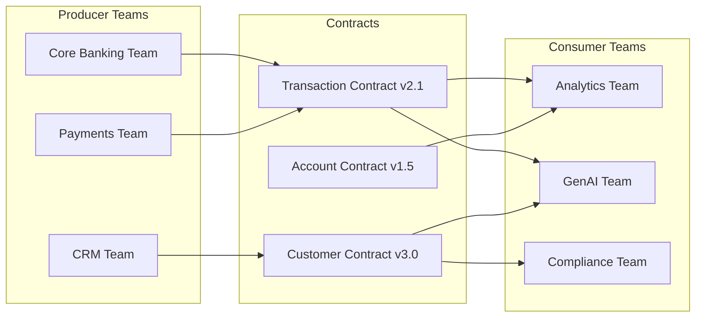

# Data Contracts for Banking Data Teams

## Overview

Data contracts are agreements between data producers and consumers that define the schema, quality guarantees, and SLAs for data products. In banking, where multiple teams (core banking, payments, analytics, GenAI) depend on shared data, contracts prevent breaking changes, clarify ownership, and enable independent deployment. Think of them as API contracts for data.

## Why Data Contracts Matter



Without contracts:
- Core banking team changes `account_type` from `enum` to `string`, breaking analytics
- Payments team adds `fee_amount` column, GenAI pipeline ignores it silently
- CRM team deprecates `phone_number`, notification service starts failing
- No one knows who owns a broken pipeline

With contracts:
- Schema changes require version bumps and consumer notification
- Breaking changes trigger deprecation periods
- Clear ownership and SLAs
- Automated contract validation in CI/CD

## Data Contract Specification

```yaml
# contracts/transactions_v2.yaml
data_contract:
  name: banking_transactions
  version: 2.1.0
  status: active
  owner: team-core-banking
  consumers:
    - team-analytics
    - team-genai
    - team-compliance
  
  # Schema definition
  schema:
    type: table
    columns:
      - name: transaction_id
        type: varchar(36)
        primary_key: true
        nullable: false
        description: "UUID v4 transaction identifier"
        pii: false
      
      - name: account_id
        type: bigint
        nullable: false
        foreign_key: accounts.account_id
        description: "Source account identifier"
        pii: false
      
      - name: customer_id
        type: bigint
        nullable: false
        foreign_key: customers.customer_id
        description: "Customer who owns the account"
        pii: false
      
      - name: amount
        type: decimal(15, 2)
        nullable: false
        constraints:
          - type: range
            min: 0.01
            max: 1000000.00
        description: "Transaction amount in account currency"
        pii: false
      
      - name: currency
        type: varchar(3)
        nullable: false
        constraints:
          - type: enum
            values: [USD, EUR, GBP, CHF, JPY]
        description: "ISO 4217 currency code"
        pii: false
      
      - name: transaction_type
        type: varchar(20)
        nullable: false
        constraints:
          - type: enum
            values: [DEPOSIT, WITHDRAWAL, TRANSFER, PAYMENT, REFUND, FEE, INTEREST, CHARGEBACK]
        description: "Type of transaction"
        pii: false
      
      - name: transaction_time
        type: timestamp with time zone
        nullable: false
        description: "When the transaction occurred (UTC)"
        pii: false
      
      - name: channel
        type: varchar(20)
        nullable: true
        constraints:
          - type: enum
            values: [BRANCH, ATM, ONLINE, MOBILE, API, BATCH]
        description: "Channel through which transaction was made"
        pii: false
      
      - name: merchant_id
        type: varchar(36)
        nullable: true
        description: "Merchant identifier (for payments)"
        pii: false

  # Quality guarantees
  quality:
    freshness:
      column: transaction_time
      max_age: 1 hour  # For streaming
      sla: 99.5%
    
    volume:
      min_rows_per_day: 100000
      max_deviation_from_average: 30%
    
    completeness:
      required_columns:
        - transaction_id
        - account_id
        - amount
        - transaction_time
      min_completeness: 99.9%
    
    uniqueness:
      columns: [transaction_id]
    
    validity:
      checks:
        - type: row_count
          min: 100000
          max: 10000000
          frequency: daily
        - type: null_check
          column: amount
          max_null_pct: 0.0
    
  # Service level objectives
  slos:
    availability: 99.9%
    freshness: "Data available within 5 minutes of transaction"
    retention: "7 years for compliance"
    response_time: "Query p95 < 5 seconds"
  
  # Change management
  change_policy:
    breaking_changes:
      notice_period: 90 days
      migration_support: true
      deprecation_process:
        - Announce change in #data-contracts channel
        - Update contract version (major bump)
        - Run both old and new schemas during deprecation
        - Remove old schema after all consumers migrated
        - Document in changelog
    
    non_breaking_changes:
      # Adding columns, extending enums
      notice_period: 14 days
      process: PR to contract repo, review by consumers
```

## Contract Validation in CI/CD

```yaml
# .github/workflows/validate-contract.yml
name: Validate Data Contract

on:
  pull_request:
    paths:
      - 'contracts/**'
      - 'dbt/models/**'

jobs:
  validate:
    runs-on: ubuntu-latest
    steps:
      - uses: actions/checkout@v4
      
      - name: Install Soda Core
        run: pip install soda-core-postgres
      
      - name: Validate schema matches contract
        run: |
          soda scan contracts/transactions_v2.yaml \
            -d analytics_db \
            --variable "table_name=stg_transactions"
      
      - name: Check for breaking changes
        run: |
          python scripts/check_breaking_changes.py \
            --old contracts/transactions_v2.0.0.yaml \
            --new contracts/transactions_v2.1.0.yaml
      
      - name: Notify consumers
        if: github.event_name == 'pull_request' && github.event.action == 'opened'
        run: |
          python scripts/notify_consumers.py \
            --contract contracts/transactions_v2.1.0.yaml \
            --pr-url ${{ github.event.pull_request.html_url }}
```

## Schema Evolution Strategies

```python
"""
Schema evolution compatibility patterns.
"""
from enum import Enum

class Compatibility(Enum):
    BACKWARD = "backward"        # New schema reads old data
    FORWARD = "forward"          # Old schema reads new data
    FULL = "full"                # Both directions compatible
    NONE = "none"                # Breaking change

def check_compatibility(old_schema: dict, new_schema: dict) -> Compatibility:
    """Check schema evolution compatibility."""
    old_cols = {col['name']: col for col in old_schema['columns']}
    new_cols = {col['name']: col for col in new_schema['columns']}
    
    breaking = []
    
    # Check removed columns
    for col_name in old_cols:
        if col_name not in new_cols:
            if not new_cols.get(col_name, {}).get('nullable', True):
                breaking.append(f"Non-nullable column removed: {col_name}")
    
    # Check type changes
    for col_name, new_col in new_cols.items():
        if col_name in old_cols:
            old_col = old_cols[col_name]
            if old_col['type'] != new_col['type']:
                breaking.append(f"Type changed: {col_name} {old_col['type']} -> {new_col['type']}")
    
    # Check constraint changes
    for col_name, new_col in new_cols.items():
        if col_name in old_cols:
            old_col = old_cols[col_name]
            old_constraints = old_col.get('constraints', [])
            new_constraints = new_col.get('constraints', [])
            
            # Check if enum values were removed
            old_enum = next((c['values'] for c in old_constraints if c['type'] == 'enum'), None)
            new_enum = next((c['values'] for c in new_constraints if c['type'] == 'enum'), None)
            
            if old_enum and new_enum:
                removed_values = set(old_enum) - set(new_enum)
                if removed_values:
                    breaking.append(f"Enum values removed from {col_name}: {removed_values}")
    
    if breaking:
        return Compatibility.NONE, breaking
    
    # Check for non-breaking changes
    added_cols = set(new_cols.keys()) - set(old_cols.keys())
    if added_cols:
        print(f"Non-breaking: Added columns: {added_cols}")
    
    return Compatibility.BACKWARD, []

# Safe schema changes (backward compatible):
# - Adding nullable columns
# - Adding columns with defaults
# - Extending enum values (adding new values)
# - Relaxing constraints (wider range)

# Breaking changes (require version bump):
# - Removing columns
# - Changing column types
# - Adding non-nullable columns without defaults
# - Restricting enum values (removing values)
# - Tightening constraints (narrower range)
# - Renaming columns
```

## Cross-References

- **Data Quality**: See [data-quality.md](data-quality.md) for validation
- **Data Lineage**: See [data-lineage.md](data-lineage.md) for dependency tracking
- **Data Governance**: See [data-governance.md](data-governance.md) for ownership

## Interview Questions

1. **What is a data contract and how does it differ from a database schema?**
2. **How do you handle a breaking schema change when 5 teams depend on your data?**
3. **What are backward, forward, and full compatibility in schema evolution?**
4. **How would you enforce data contracts in a CI/CD pipeline?**
5. **A producer team wants to remove a column that one consumer still uses. How do you resolve this?**
6. **How do data contracts relate to data quality checks?**

## Checklist: Data Contract Implementation

- [ ] Contract specification files in version-controlled repository
- [ ] Schema validation runs in CI/CD for all producers
- [ ] Consumer notification process for schema changes
- [ ] Breaking change deprecation policy documented
- [ ] Contract versioning follows semantic versioning
- [ ] Automated compatibility checking on PR
- [ ] Data contract registry with search and discovery
- [ ] Ownership clearly defined for each contract
- [ ] SLA monitoring and alerting per contract
- [ ] Regular contract review with consumers
