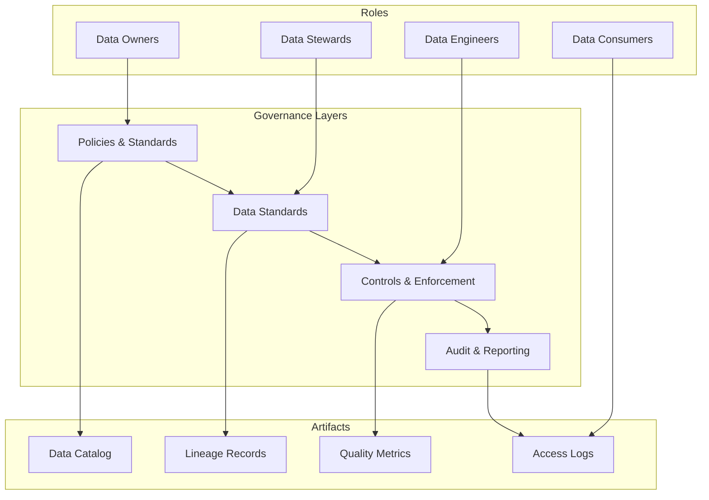

# Data Governance for Banking GenAI Platforms

## Overview

Data governance defines who owns data, who can access it, how it is protected, and how compliance is enforced. In banking, governance is not optional -- regulators (OCC, FDIC, ECB) require documented data ownership, access controls, retention policies, and audit trails. For GenAI platforms, governance extends to training data provenance, model output accountability, and PII handling in prompts and responses.

## Governance Framework



## Data Ownership Model

```yaml
# Data ownership registry
data_assets:
  - asset: banking.transactions
    owner:
      team: core-banking
      role: data-owner
      name: "Jane Smith"
      email: jane.smith@bank.com
    steward:
      name: "John Doe"
      email: john.doe@bank.com
    classification: CONFIDENTIAL
    retention: 7 years
    pii_contains: true
    pii_fields: [account_id, customer_id]
    
    consumers:
      - team: analytics
        purpose: "Business reporting and dashboards"
        access_level: read
        approved_by: jane.smith@bank.com
        approved_date: "2025-01-01"
      
      - team: genai
        purpose: "RAG retrieval for customer queries"
        access_level: read_anonymized
        approved_by: jane.smith@bank.com
        approved_date: "2025-01-15"
      
      - team: compliance
        purpose: "Regulatory reporting"
        access_level: read_full
        approved_by: jane.smith@bank.com
        approved_date: "2025-01-01"
    
    sla:
      availability: 99.9%
      freshness: "5 minutes for streaming, 1 hour for batch"
      quality: "99.5% completeness, 99.9% accuracy"
    
    compliance:
      regulations: [GDPR, CCPA, BCBS-239, SOX]
      audit_frequency: quarterly
      last_audit: "2025-01-10"
      next_audit: "2025-04-10"
```

## Data Classification

```python
"""
Data classification and handling rules for banking data.
Each classification level has specific security and access requirements.
"""
from enum import Enum
from dataclasses import dataclass
from typing import List

class ClassificationLevel(Enum):
    PUBLIC = "public"
    INTERNAL = "internal"
    CONFIDENTIAL = "confidential"
    RESTRICTED = "restricted"  # PII, financial records

@dataclass
class ClassificationPolicy:
    level: ClassificationLevel
    encryption_required: bool
    access_audit_required: bool
    max_retention_days: int
    pii_masking_required: bool
    genai_usage_allowed: bool
    approval_required: bool

CLASSIFICATION_POLICIES = {
    ClassificationLevel.PUBLIC: ClassificationPolicy(
        level=ClassificationLevel.PUBLIC,
        encryption_required=False,
        access_audit_required=False,
        max_retention_days=None,
        pii_masking_required=False,
        genai_usage_allowed=True,
        approval_required=False,
    ),
    ClassificationLevel.INTERNAL: ClassificationPolicy(
        level=ClassificationLevel.INTERNAL,
        encryption_required=True,
        access_audit_required=True,
        max_retention_days=365 * 5,
        pii_masking_required=False,
        genai_usage_allowed=True,
        approval_required=True,
    ),
    ClassificationLevel.CONFIDENTIAL: ClassificationPolicy(
        level=ClassificationLevel.CONFIDENTIAL,
        encryption_required=True,
        access_audit_required=True,
        max_retention_days=365 * 7,
        pii_masking_required=True,
        genai_usage_allowed=False,  # Requires explicit approval
        approval_required=True,
    ),
    ClassificationLevel.RESTRICTED: ClassificationPolicy(
        level=ClassificationLevel.RESTRICTED,
        encryption_required=True,
        access_audit_required=True,
        max_retention_days=365 * 10,
        pii_masking_required=True,
        genai_usage_allowed=False,  # Explicit compliance review required
        approval_required=True,
    ),
}

def classify_data(columns: List[str], sample_data: dict) -> ClassificationLevel:
    """Classify data based on column names and content."""
    pii_indicators = {
        'ssn', 'social_security', 'national_id',
        'account_number', 'credit_card', 'cvv',
        'password', 'pin', 'biometric',
    }
    
    financial_indicators = {
        'balance', 'salary', 'income', 'loan_amount',
        'transaction_amount', 'investment_value',
    }
    
    lower_columns = {col.lower() for col in columns}
    
    # Check for PII
    if lower_columns & pii_indicators:
        return ClassificationLevel.RESTRICTED
    
    # Check for financial data
    if lower_columns & financial_indicators:
        return ClassificationLevel.CONFIDENTIAL
    
    # Check for internal banking data
    if any('customer' in col for col in lower_columns):
        return ClassificationLevel.INTERNAL
    
    return ClassificationLevel.PUBLIC

def get_genai_clearance(classification: ClassificationLevel) -> bool:
    """Check if data can be used in GenAI pipelines."""
    policy = CLASSIFICATION_POLICIES.get(classification)
    if not policy:
        return False
    
    if not policy.genai_usage_allowed:
        return False
    
    if policy.pii_masking_required:
        # Only allowed after PII masking
        return True
    
    return policy.genai_usage_allowed
```

## Access Control and Approval Workflow

```python
"""Data access request and approval workflow."""
from datetime import datetime, timedelta
from enum import Enum
from typing import Optional

class AccessRequestStatus(Enum):
    PENDING = "pending"
    APPROVED = "approved"
    DENIED = "denied"
    EXPIRED = "expired"
    REVOKED = "revoked"

class DataAccessRequest:
    """Track data access requests with approval workflow."""
    
    def __init__(
        self,
        requestor: str,
        team: str,
        data_asset: str,
        purpose: str,
        access_level: str,
        duration_days: int = 90,
        approver: Optional[str] = None,
    ):
        self.request_id = f"dar-{datetime.utcnow().strftime('%Y%m%d')}-{hash(requestor) % 10000}"
        self.requestor = requestor
        self.team = team
        self.data_asset = data_asset
        self.purpose = purpose
        self.access_level = access_level
        self.status = AccessRequestStatus.PENDING
        self.created_at = datetime.utcnow()
        self.expires_at = self.created_at + timedelta(days=duration_days)
        self.approver = approver
        self.approved_at = None
        self.review_notes = []
    
    def approve(self, approver: str, notes: str = "") -> bool:
        """Approve the access request."""
        if self.status != AccessRequestStatus.PENDING:
            raise ValueError(f"Cannot approve request in status {self.status}")
        
        self.status = AccessRequestStatus.APPROVED
        self.approver = approver
        self.approved_at = datetime.utcnow()
        self.review_notes.append(f"Approved by {approver}: {notes}")
        
        # Log approval for audit
        audit_log = {
            'event': 'ACCESS_APPROVED',
            'request_id': self.request_id,
            'approver': approver,
            'timestamp': self.approved_at.isoformat(),
            'notes': notes,
        }
        self._write_audit_log(audit_log)
        
        return True
    
    def is_valid(self) -> bool:
        """Check if the access grant is still valid."""
        if self.status != AccessRequestStatus.APPROVED:
            return False
        
        if datetime.utcnow() > self.expires_at:
            self.status = AccessRequestStatus.EXPIRED
            return False
        
        return True
    
    def _write_audit_log(self, log_entry: dict):
        """Write audit log entry (implementation depends on audit system)."""
        # Write to centralized audit logging system
        pass
```

## GenAI-Specific Governance

```yaml
# GenAI data governance rules
genai_governance:
  training_data:
    approval_required: true
    required_reviewers: [data-owner, compliance-officer]
    prohibited_sources:
      - "Customer PII (SSN, account numbers, passwords)"
      - "Unencrypted financial records"
      - "Third-party data without licensing agreement"
    
    required_documentation:
      - "Data source and provenance"
      - "PII screening results"
      - "Bias analysis"
      - "Consent verification (for customer data)"
    
  retrieval_data:
    vector_embeddings:
      - "Must source from approved data assets only"
      - "Embedding model version must be tracked"
      - "Retrieved chunks must be logged for audit"
    
    prompt_data:
      - "Customer prompts must not contain PII of other customers"
      - "Prompt logs must be retained for 90 days"
      - "Prompts must be anonymized before storage"
    
    response_data:
      - "Responses must include source citations"
      - "Responses must not contain raw PII"
      - "Response accuracy must be monitored"
      - "Hallucination rate must be tracked"
  
  model_outputs:
    - "GenAI outputs are classified as INTERNAL"
    - "Outputs must not be used for financial decisions without human review"
    - "Model version and prompt must be logged with each output"
    - "Quarterly bias review required"
```

## Cross-References

- **Data Lineage**: See [data-lineage.md](data-lineage.md) for tracking data flow
- **PII Masking**: See [pii-masking.md](pii-masking.md) for data protection
- **Data Contracts**: See [data-contracts.md](data-contracts.md) for schema agreements

## Interview Questions

1. **What is the difference between a data owner and a data steward?**
2. **How would you design a data access approval workflow for a banking GenAI platform?**
3. **What data classification levels would you define for a banking platform?**
4. **How do you ensure GenAI training data complies with GDPR "right to be forgotten"?**
5. **A regulator requests an audit of how customer data flows through your GenAI system. What do you provide?**
6. **How do you balance data accessibility with security in a regulated environment?**

## Checklist: Data Governance Program

- [ ] Data ownership assigned for every critical data asset
- [ ] Data classification policy defined and enforced
- [ ] Access request workflow implemented with audit trail
- [ ] PII detection and masking automated
- [ ] GenAI usage policy documented and approved
- [ ] Data retention policies enforced programmatically
- [ ] Regular access reviews scheduled (quarterly)
- [ ] Audit logging enabled for all data access
- [ ] Compliance reports generated automatically
- [ ] Data catalog maintained and searchable
- [ ] Stewardship responsibilities clearly defined
- [ ] Escalation process for governance violations
