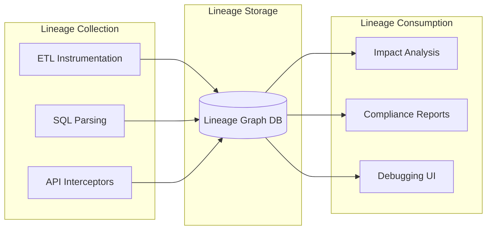

# Data Lineage for Banking Systems

## Overview

Data lineage tracks the lifecycle of data -- where it originates, how it transforms, and where it flows. In banking, lineage is a regulatory requirement (BCBS 239, GDPR Article 30) and a practical necessity for impact analysis, debugging, and trust in data-driven decisions. For GenAI systems, lineage answers critical questions: "Where did this training data come from?" and "Which downstream systems are affected if this source changes?"

## Lineage Architecture



## Implementing Lineage Tracking

### OpenLineage Standard

```python
"""
OpenLineage: Open standard for collecting lineage metadata.
Integrate with Airflow, dbt, Spark, and custom pipelines.
"""
from openlineage.client import OpenLineageClient
from openlineage.client.run import RunEvent, Run, Job, Dataset
from openlineage.client.facet import (
    SchemaDatasetFacet,
    SchemaField,
    SqlJobFacet,
    DocumentationJobFacet,
)
import uuid
from datetime import datetime

client = OpenLineageClient(url="http://marquez:5000")

def emit_lineage_event(
    job_name: str,
    input_datasets: list,
    output_datasets: list,
    sql_query: str = None,
    event_type: str = "COMPLETE"
):
    """Emit OpenLineage event for a pipeline job."""
    run = Run(runId=str(uuid.uuid4()))
    
    job_facets = {}
    if sql_query:
        job_facets['sql'] = SqlJobFacet(sql_query)
    job_facets['documentation'] = DocumentationJobFacet(
        f"Banking pipeline: {job_name}"
    )
    
    job = Job(
        namespace="banking-data-pipeline",
        name=job_name,
        facets=job_facets
    )
    
    # Build input datasets
    inputs = []
    for ds in input_datasets:
        inputs.append(Dataset(
            namespace=ds['namespace'],
            name=ds['name'],
            facets={
                'schema': SchemaDatasetFacet(fields=[
                    SchemaField(name=col, type=typ)
                    for col, typ in ds.get('schema', [])
                ])
            }
        ))
    
    # Build output datasets
    outputs = []
    for ds in output_datasets:
        outputs.append(Dataset(
            namespace=ds['namespace'],
            name=ds['name'],
            facets={
                'schema': SchemaDatasetFacet(fields=[
                    SchemaField(name=col, type=typ)
                    for col, typ in ds.get('schema', [])
                ])
            }
        ))
    
    event = RunEvent(
        eventType=event_type,
        eventTime=datetime.utcnow().isoformat(),
        run=run,
        job=job,
        inputs=inputs,
        outputs=outputs,
        producer="https://github.com/banking/data-pipeline"
    )
    
    client.emit(event)

# Usage in a dbt pipeline
emit_lineage_event(
    job_name="dim_customer_360",
    input_datasets=[
        {
            'namespace': 'postgresql://core-banking:5432',
            'name': 'raw_banking.customers',
            'schema': [('customer_id', 'bigint'), ('first_name', 'varchar'), ...]
        },
        {
            'namespace': 'postgresql://core-banking:5432',
            'name': 'raw_banking.accounts',
            'schema': [('account_id', 'bigint'), ('customer_id', 'bigint'), ...]
        },
    ],
    output_datasets=[
        {
            'namespace': 'postgresql://analytics-db:5432',
            'name': 'marts.dim_customer_360',
            'schema': [('customer_id', 'bigint'), ('total_balance', 'decimal'), ...]
        }
    ],
    sql_query="SELECT ... FROM stg_customers JOIN stg_accounts ...",
)
```

### SQL Parsing for Automatic Lineage

```python
"""
Parse SQL queries to extract table-level and column-level lineage.
Uses sqlglot for parsing and builds lineage edges.
"""
import sqlglot
from sqlglot import exp
from typing import Dict, List, Set, Tuple

class SQLLineageExtractor:
    """Extract lineage from SQL statements."""
    
    def extract_lineage(self, sql: str) -> dict:
        """Parse SQL and extract input-output relationships."""
        parsed = sqlglot.parse(sql, read='postgres')
        
        lineage = {
            'inputs': set(),
            'outputs': set(),
            'column_mapping': [],
        }
        
        for statement in parsed:
            self._extract_tables(statement, lineage)
            self._extract_columns(statement, lineage)
        
        return lineage
    
    def _extract_tables(self, expression: exp.Expression, lineage: dict):
        """Extract input and output tables."""
        # Output tables (INSERT INTO, CREATE TABLE)
        for insert in expression.find_all(exp.Insert):
            table = insert.this
            if isinstance(table, exp.Table):
                lineage['outputs'].add(f"{table.db}.{table.name}")
        
        # Input tables (FROM, JOIN)
        for table in expression.find_all(exp.Table):
            if isinstance(table, exp.Table):
                lineage['inputs'].add(f"{table.db}.{table.name}")
    
    def _extract_columns(self, expression: exp.Expression, lineage: dict):
        """Extract column-level lineage mappings."""
        # Simplified: track SELECT columns
        for select in expression.find_all(exp.Select):
            for col in select.expressions:
                if isinstance(col, exp.Column):
                    lineage['column_mapping'].append({
                        'source': f"{col.table}.{col.name}",
                        'target': 'output',
                    })

# Usage
extractor = SQLLineageExtractor()
sql = """
    INSERT INTO marts.dim_customer_360
    SELECT 
        c.customer_id,
        c.first_name,
        SUM(a.balance) AS total_balance
    FROM raw_banking.customers c
    JOIN raw_banking.accounts a ON c.customer_id = a.customer_id
    GROUP BY c.customer_id, c.first_name
"""

lineage = extractor.extract_lineage(sql)
print(f"Inputs: {lineage['inputs']}")
print(f"Outputs: {lineage['outputs']}")
```

## Impact Analysis

```python
"""
Impact analysis: Given a table or column change, determine 
all downstream dependencies.
"""
from collections import defaultdict, deque

class LineageGraph:
    """Graph-based data lineage for impact analysis."""
    
    def __init__(self):
        self.edges = defaultdict(set)  # source -> set of targets
        self.reverse_edges = defaultdict(set)  # target -> set of sources
    
    def add_edge(self, source: str, target: str):
        """Add a lineage edge."""
        self.edges[source].add(target)
        self.reverse_edges[target].add(source)
    
    def downstream_impact(self, node: str) -> Set[str]:
        """Find all downstream dependencies of a node."""
        impacted = set()
        queue = deque([node])
        
        while queue:
            current = queue.popleft()
            for target in self.edges.get(current, set()):
                if target not in impacted:
                    impacted.add(target)
                    queue.append(target)
        
        return impacted
    
    def upstream_lineage(self, node: str) -> Set[str]:
        """Find all upstream sources of a node."""
        sources = set()
        queue = deque([node])
        
        while queue:
            current = queue.popleft()
            for source in self.reverse_edges.get(current, set()):
                if source not in sources:
                    sources.add(source)
                    queue.append(source)
        
        return sources
    
    def impact_report(self, node: str) -> dict:
        """Generate a full impact analysis report."""
        downstream = self.downstream_impact(node)
        
        # Categorize by type
        dashboards = {d for d in downstream if d.startswith('dashboard.')}
        models = {m for m in downstream if m.startswith('marts.')}
        reports = {r for r in downstream if r.startswith('report.')}
        ml_features = {f for f in downstream if f.startswith('feature.')}
        
        return {
            'changed_node': node,
            'total_impacted': len(downstream),
            'dashboards': sorted(dashboards),
            'data_models': sorted(models),
            'reports': sorted(reports),
            'ml_features': sorted(ml_features),
        }

# Usage
graph = LineageGraph()
graph.add_edge('raw_banking.customers', 'staging.stg_customers')
graph.add_edge('raw_banking.accounts', 'staging.stg_accounts')
graph.add_edge('staging.stg_customers', 'marts.dim_customer_360')
graph.add_edge('staging.stg_accounts', 'marts.dim_customer_360')
graph.add_edge('marts.dim_customer_360', 'dashboard.customer_overview')
graph.add_edge('marts.dim_customer_360', 'feature.customer_features')
graph.add_edge('marts.dim_customer_360', 'report.regulatory_report_001')

# If raw_banking.customers schema changes, what breaks?
report = graph.impact_report('raw_banking.customers')
print(f"Impacted: {report['total_impacted']} downstream nodes")
print(f"Dashboards: {report['dashboards']}")
print(f"Reports: {report['reports']}")
```

## Compliance and Regulatory Lineage

```sql
-- GDPR data subject request: Trace all locations of a customer's data
WITH recursive_data_lineage AS (
    -- Start from the source table
    SELECT 
        'raw_banking.customers' AS table_name,
        'customer_id' AS column_name,
        1 AS depth,
        ARRAY['raw_banking.customers.customer_id'] AS path
    FROM dual
    
    UNION ALL
    
    -- Follow lineage edges
    SELECT 
        l.target_table,
        l.target_column,
        rld.depth + 1,
        rld.path || (l.target_table || '.' || l.target_column)
    FROM recursive_data_lineage rld
    JOIN lineage_edges l ON 
        l.source_table = (string_to_array(rld.path[array_length(rld.path, 1)], '.'))[1]
        AND l.source_column = (string_to_array(rld.path[array_length(rld.path, 1)], '.'))[2]
    WHERE rld.depth < 20  -- Prevent infinite recursion
)
SELECT DISTINCT
    table_name,
    column_name,
    depth,
    path
FROM recursive_data_lineage
ORDER BY depth, table_name;
```

## Cross-References

- **Data Contracts**: See [data-contracts.md](data-contracts.md) for schema management
- **Data Governance**: See [data-governance.md](data-governance.md) for ownership models
- **PII Masking**: See [pii-masking.md](pii-masking.md) for data protection tracking

## Interview Questions

1. **How would you build data lineage for a dbt project with 500+ models?**
2. **A regulatory audit requires proof of where customer PII flows. How do you respond?**
3. **What is OpenLineage and how does it differ from custom lineage tracking?**
4. **Your team wants to deprecate a source table. How do you assess the impact?**
5. **How do you handle lineage for streaming data pipelines?**
6. **What are the challenges of column-level vs table-level lineage?**

## Checklist: Data Lineage Implementation

- [ ] Lineage collection automated for all pipeline frameworks (Airflow, dbt, Spark)
- [ ] OpenLineage or compatible standard adopted
- [ ] Lineage graph stored in queryable database
- [ ] Impact analysis tool available to engineering team
- [ ] Column-level lineage captured for PII columns
- [ ] Compliance reporting built on lineage data
- [ ] Lineage data used in PR review process
- [ ] Dashboards showing lineage visualization
- [ ] Stale lineage detection and cleanup
- [ ] Lineage quality alerts for broken edges
