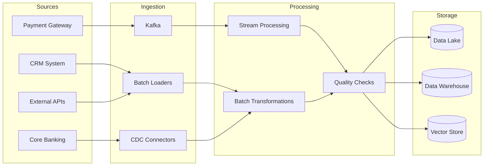

# Data Pipelines: Design, Reliability, and Monitoring

## Overview

Data pipelines are the circulatory system of a banking GenAI platform. They move data from source systems through transformation, validation, and storage layers, feeding both analytics dashboards and AI models. This guide covers pipeline architecture patterns, idempotency, error handling, and monitoring strategies used in production banking environments.

## Pipeline Architecture Patterns



## Idempotency: The Cornerstone of Reliable Pipelines

Idempotency ensures that running the same pipeline multiple times produces the same result as running it once. This is essential for recovery from failures, retries, and backfills.

### Idempotent Write Patterns

```sql
-- Pattern 1: INSERT ... ON CONFLICT (Upsert)
INSERT INTO daily_account_summary (account_id, summary_date, total_deposits, total_withdrawals)
VALUES (1001, '2025-01-15', 50000.00, 30000.00)
ON CONFLICT (account_id, summary_date) 
DO UPDATE SET
    total_deposits = EXCLUDED.total_deposits,
    total_withdrawals = EXCLUDED.total_withdrawals,
    updated_at = CURRENT_TIMESTAMP;

-- Pattern 2: DELETE then INSERT (for batch replacements)
BEGIN;
DELETE FROM daily_transaction_summary 
WHERE summary_date = '2025-01-15' 
  AND pipeline_run_id = 'run_20250115_v2';
INSERT INTO daily_transaction_summary 
    (summary_date, account_id, txn_count, total_amount, pipeline_run_id)
SELECT '2025-01-15', account_id, COUNT(*), SUM(amount), 'run_20250115_v2'
FROM raw_transactions
WHERE transaction_date = '2025-01-15'
GROUP BY account_id;
COMMIT;

-- Pattern 3: MERGE for complex upsert logic
MERGE INTO customer_360 target
USING staging_customer_updates source
ON target.customer_id = source.customer_id
WHEN MATCHED THEN
    UPDATE SET 
        target.email = source.email,
        target.phone = source.phone,
        target.address = source.address,
        target.updated_at = CURRENT_TIMESTAMP,
        target.update_source = 'pipeline_v2'
WHEN NOT MATCHED THEN
    INSERT (customer_id, email, phone, address, created_at, updated_at)
    VALUES (source.customer_id, source.email, source.phone, source.address, 
            CURRENT_TIMESTAMP, CURRENT_TIMESTAMP);
```

### Idempotent Stream Processing

```python
# Kafka stream processing with idempotent writes
from confluent_kafka import Consumer, Producer
from confluent_kafka.admin import AdminClient
import json
import hashlib
import psycopg2
from psycopg2.extras import execute_values

class IdempotentTransactionProcessor:
    """Process banking transactions from Kafka with idempotent writes."""
    
    def __init__(self, kafka_config: dict, db_config: dict):
        self.consumer = Consumer(kafka_config)
        self.producer = Producer(kafka_config)
        self.db = psycopg2.connect(**db_config)
        self.processed_offsets = set()
    
    def compute_dedup_key(self, event: dict) -> str:
        """Create deterministic deduplication key."""
        # Use business key: transaction_id + source + timestamp
        key_components = f"{event['transaction_id']}:{event['source']}:{event['timestamp']}"
        return hashlib.sha256(key_components.encode()).hexdigest()[:16]
    
    def process_batch(self, batch: list) -> None:
        """Process a batch of events with idempotent writes."""
        dedup_keys = []
        records = []
        
        for event in batch:
            dedup_key = self.compute_dedup_key(event)
            if dedup_key in self.processed_offsets:
                continue  # Already processed
            
            dedup_keys.append(dedup_key)
            records.append((
                event['transaction_id'],
                event['account_id'],
                event['amount'],
                event['currency'],
                event['transaction_type'],
                event['timestamp'],
                event['source'],
                dedup_key,
            ))
        
        if not records:
            return
        
        # Idempotent upsert using dedup_key
        query = """
            INSERT INTO processed_transactions 
                (transaction_id, account_id, amount, currency, 
                 transaction_type, transaction_time, source, dedup_key)
            VALUES %s
            ON CONFLICT (dedup_key) DO NOTHING
        """
        
        with self.db.cursor() as cur:
            execute_values(cur, query, records, page_size=1000)
            self.db.commit()
        
        self.processed_offsets.update(dedup_keys)
    
    def run(self):
        """Main processing loop."""
        self.consumer.subscribe(['banking-transactions'])
        
        while True:
            messages = []
            for _ in range(500):  # Batch size
                msg = self.consumer.poll(timeout=1.0)
                if msg is None:
                    break
                if msg.error():
                    continue
                messages.append(json.loads(msg.value()))
            
            if messages:
                self.process_batch(messages)
                self.consumer.commit()
```

## Error Handling Strategies

### Dead Letter Queue Pattern

```python
from datetime import datetime
import json
import logging

logger = logging.getLogger(__name__)

class PipelineErrorHandler:
    """Handle pipeline errors with dead letter queue and retry logic."""
    
    def __init__(self, dlq_producer, max_retries=3, retry_delay_seconds=60):
        self.dlq_producer = dlq_producer
        self.max_retries = max_retries
        self.retry_delay_seconds = retry_delay_seconds
    
    def process_with_retry(self, event: dict, process_fn) -> bool:
        """Attempt to process an event with exponential backoff."""
        retry_count = event.get('retry_count', 0)
        
        for attempt in range(retry_count, self.max_retries):
            try:
                process_fn(event)
                return True
            except TransientError as e:
                # Network timeout, temporary unavailability
                logger.warning(
                    f"Transient error on attempt {attempt + 1}: {e}"
                )
                if attempt < self.max_retries - 1:
                    delay = self.retry_delay_seconds * (2 ** attempt)
                    time.sleep(delay)
            except PermanentError as e:
                # Data validation failure, schema mismatch
                logger.error(f"Permanent error, sending to DLQ: {e}")
                self.send_to_dlq(event, error=str(e), error_type='PERMANENT')
                return False
        
        # Exhausted retries
        self.send_to_dlq(event, 
                        error=f"Exhausted {self.max_retries} retries",
                        error_type='MAX_RETRIES')
        return False
    
    def send_to_dlq(self, event: dict, error: str, error_type: str):
        """Send failed event to dead letter queue for investigation."""
        dlq_event = {
            **event,
            'dlq_metadata': {
                'error': error,
                'error_type': error_type,
                'failed_at': datetime.utcnow().isoformat(),
                'original_topic': event.get('topic', 'unknown'),
                'retry_count': event.get('retry_count', 0),
            }
        }
        self.dlq_producer.produce(
            topic='pipeline-dlq',
            value=json.dumps(dlq_event).encode()
        )
        self.dlq_producer.flush()
```

### Circuit Breaker for External Dependencies

```python
import time
from enum import Enum

class CircuitState(Enum):
    CLOSED = "closed"      # Normal operation
    OPEN = "open"          # Failing, rejecting calls
    HALF_OPEN = "half_open"  # Testing recovery

class CircuitBreaker:
    """Circuit breaker for external API calls in data pipelines."""
    
    def __init__(self, failure_threshold=5, recovery_timeout=300):
        self.failure_threshold = failure_threshold
        self.recovery_timeout = recovery_timeout
        self.state = CircuitState.CLOSED
        self.failure_count = 0
        self.last_failure_time = None
    
    def call(self, fn, *args, **kwargs):
        if self.state == CircuitState.OPEN:
            if time.time() - self.last_failure_time > self.recovery_timeout:
                self.state = CircuitState.HALF_OPEN
                logger.info("Circuit breaker transitioning to HALF_OPEN")
            else:
                raise CircuitOpenError("Circuit breaker is open, skipping call")
        
        try:
            result = fn(*args, **kwargs)
            self._on_success()
            return result
        except Exception as e:
            self._on_failure()
            raise
    
    def _on_success(self):
        self.failure_count = 0
        self.state = CircuitState.CLOSED
    
    def _on_failure(self):
        self.failure_count += 1
        self.last_failure_time = time.time()
        
        if self.failure_count >= self.failure_threshold:
            self.state = CircuitState.OPEN
            logger.warning(
                f"Circuit breaker OPEN after {self.failure_count} failures"
            )
```

## Pipeline Monitoring and Observability

### Metrics Collection

```python
from prometheus_client import Counter, Histogram, Gauge
import time

# Pipeline metrics
pipeline_records_processed = Counter(
    'pipeline_records_processed_total',
    'Total records processed by pipeline',
    ['pipeline_name', 'status']  # status: success, failed, skipped
)

pipeline_duration = Histogram(
    'pipeline_duration_seconds',
    'Pipeline execution duration',
    ['pipeline_name'],
    buckets=[60, 300, 600, 1800, 3600, 7200]
)

pipeline_lag = Gauge(
    'pipeline_lag_seconds',
    'Current pipeline processing lag',
    ['pipeline_name']
)

pipeline_data_quality = Gauge(
    'pipeline_data_quality_score',
    'Data quality score (0-100)',
    ['pipeline_name', 'metric_type']
)

class PipelineMetricsCollector:
    """Collect and expose pipeline metrics."""
    
    def __init__(self, pipeline_name: str):
        self.pipeline_name = pipeline_name
        self.start_time = None
    
    def start(self):
        self.start_time = time.time()
    
    def record_success(self, count: int = 1):
        pipeline_records_processed.labels(
            pipeline_name=self.pipeline_name,
            status='success'
        ).inc(count)
    
    def record_failure(self, count: int = 1):
        pipeline_records_processed.labels(
            pipeline_name=self.pipeline_name,
            status='failed'
        ).inc(count)
    
    def complete(self):
        if self.start_time:
            duration = time.time() - self.start_time
            pipeline_duration.labels(
                pipeline_name=self.pipeline_name
            ).observe(duration)
    
    def set_lag(self, lag_seconds: float):
        pipeline_lag.labels(
            pipeline_name=self.pipeline_name
        ).set(lag_seconds)
```

### Alerting Rules (Prometheus Format)

```yaml
# prometheus-alerts.yml
groups:
  - name: pipeline_alerts
    rules:
      - alert: PipelineHighLag
        expr: pipeline_lag_seconds > 3600
        for: 15m
        labels:
          severity: warning
        annotations:
          summary: "Pipeline {{ $labels.pipeline_name }} lagging by {{ $value }}s"
          description: "Pipeline lag has exceeded 1 hour threshold"
      
      - alert: PipelineFailureRate
        expr: |
          rate(pipeline_records_processed_total{status="failed"}[5m])
          / rate(pipeline_records_processed_total[5m])
          > 0.05
        for: 5m
        labels:
          severity: critical
        annotations:
          summary: "High failure rate in {{ $labels.pipeline_name }}"
          description: "Failure rate is {{ $value | humanizePercentage }}"
      
      - alert: PipelineStale
        expr: |
          time() - pipeline_duration_seconds_timestamp
          > 7200
        labels:
          severity: warning
        annotations:
          summary: "Pipeline {{ $labels.pipeline_name }} has not completed in 2 hours"
      
      - alert: DataQualityDegraded
        expr: pipeline_data_quality_score < 95
        for: 10m
        labels:
          severity: warning
        annotations:
          summary: "Data quality degraded in {{ $labels.pipeline_name }}"
          description: "Quality score {{ $value }} is below 95%"
```

## Cross-References

- **Airflow**: See [airflow.md](airflow.md) for orchestration
- **Kafka**: See [kafka.md](kafka.md) for streaming ingestion
- **Data Quality**: See [data-quality.md](data-quality.md) for validation
- **CDC**: See [cdc.md](cdc.md) for change data capture

## Interview Questions

1. **How do you ensure exactly-once processing in a distributed pipeline?**
2. **Design a pipeline that can recover from a 6-hour outage without duplicating data.**
3. **What is a dead letter queue and when should you use it?**
4. **How do you monitor pipeline health? What metrics and alerts do you set up?**
5. **Your pipeline is running 10x slower than usual. How do you diagnose the issue?**
6. **Explain the circuit breaker pattern and when it applies to data pipelines.**

## Checklist: Pipeline Reliability

- [ ] All writes are idempotent (upserts, dedup keys)
- [ ] Dead letter queue captures all failed records with context
- [ ] Retry logic with exponential backoff for transient errors
- [ ] Circuit breaker for external API dependencies
- [ ] Pipeline lag metrics with alerting thresholds
- [ ] Data quality checks at ingestion and output
- [ ] End-to-end pipeline duration tracking
- [ ] Runbook for common failure scenarios
- [ ] Backfill procedure documented and tested
- [ ] Schema validation at every pipeline boundary
