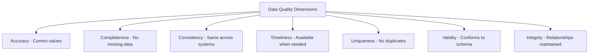

# Data Quality for Banking GenAI Pipelines

## Overview

Data quality is non-negotiable in banking. Poor quality data leads to incorrect financial decisions, regulatory penalties, and broken GenAI responses. In GenAI systems specifically, bad data amplifies through retrieval-augmented generation -- feeding garbage to the model produces confident but wrong answers at scale. This guide covers data quality frameworks, validation strategies, anomaly detection, and monitoring patterns for production banking data pipelines.

## Data Quality Dimensions



## Great Expectations Framework

```python
"""
Great Expectations: Define, validate, and document data quality expectations.
"""
import great_expectations as gx
from great_expectations.core import ExpectationSuite
from great_expectations.expectations.expectations import (
    expect_column_values_to_not_be_null,
    expect_column_values_to_be_between,
    expect_column_values_to_be_in_set,
    expect_table_row_count_to_equal,
    expect_column_values_to_match_regex,
    expect_column_mean_to_be_between,
    expect_column_values_to_be_unique,
)

# Create DataContext
context = gx.get_context()

# Define expectations for banking transactions
suite = ExpectationSuite(name="banking_transactions_suite")

suite.add_expectation(
    expect_column_values_to_not_be_null(column="transaction_id")
)
suite.add_expectation(
    expect_column_values_to_not_be_null(column="account_id")
)
suite.add_expectation(
    expect_column_values_to_not_be_null(column="amount")
)
suite.add_expectation(
    expect_column_values_to_be_between(
        column="amount",
        min_value=0.01,
        max_value=1000000.00,
        mostly=0.99  # 99% of values should be in range
    )
)
suite.add_expectation(
    expect_column_values_to_be_in_set(
        column="currency",
        value_set=["USD", "EUR", "GBP", "CHF", "JPY"]
    )
)
suite.add_expectation(
    expect_column_values_to_be_in_set(
        column="transaction_type",
        value_set=[
            "DEPOSIT", "WITHDRAWAL", "TRANSFER", "PAYMENT",
            "REFUND", "FEE", "INTEREST", "CHARGEBACK"
        ]
    )
)
suite.add_expectation(
    expect_column_values_to_match_regex(
        column="account_number",
        regex=r"^\d{10,16}$"
    )
)
suite.add_expectation(
    expect_column_values_to_be_unique(column="transaction_id")
)
suite.add_expectation(
    expect_column_mean_to_be_between(
        column="amount",
        min_value=10,
        max_value=50000,
        mostly=0.95
    )
)

# Save suite
context.add_or_update_expectation_suite(expectation_suite=suite)

# Validate data
from great_expectations.core import ExpectationSuiteValidationResult

validator = context.get_validator(
    batch_request=context.build_batch_request(
        datasource_name="banking_data",
        data_asset_name="daily_transactions"
    ),
    expectation_suite_name="banking_transactions_suite"
)

results = validator.validate()

# Check results
if not results["success"]:
    failed_expectations = [
        exp for exp in results["results"] if not exp["success"]
    ]
    for failure in failed_expectations:
        logger.error(
            f"FAILED: {failure['expectation_config']['type']}"
            f" - {failure['expectation_config']['kwargs']}"
        )
    raise ValueError(f"Data quality check failed: {len(failed_expectations)} issues")
```

## dbt Data Quality Tests

```yaml
# models/schema.yml
version: 2

models:
  - name: stg_transactions
    columns:
      - name: transaction_id
        tests:
          - unique
          - not_null
      - name: account_id
        tests:
          - not_null
          - relationships:
              to: ref('stg_accounts')
              field: account_id
      - name: amount
        tests:
          - not_null
          - dbt_utils.expression_is_true:
              expression: "> 0"
      - name: currency
        tests:
          - accepted_values:
              values: ['USD', 'EUR', 'GBP', 'CHF', 'JPY']
      - name: transaction_type
        tests:
          - accepted_values:
              values:
                - DEPOSIT
                - WITHDRAWAL
                - TRANSFER
                - PAYMENT
                - REFUND
                - FEE
                - INTEREST
                - CHARGEBACK

  - name: dim_customer_360
    columns:
      - name: customer_id
        tests:
          - unique
          - not_null
      - name: total_balance
        tests:
          - not_null
          - dbt_utils.expression_is_true:
              expression: ">= 0"
      - name: email
        tests:
          - dbt_expectations.expect_column_values_to_match_regex:
              regex: "^[^@]+@[^@]+\\.[^@]+$"
```

## Anomaly Detection for Banking Data

```python
"""
Statistical anomaly detection for banking data quality monitoring.
Detects unusual patterns that may indicate data corruption,
pipeline issues, or genuine business anomalies.
"""
import numpy as np
import pandas as pd
from scipy import stats
from sklearn.ensemble import IsolationForest
import logging

logger = logging.getLogger(__name__)

class BankingDataAnomalyDetector:
    """Detect anomalies in banking data pipelines."""
    
    def __init__(self, contamination=0.01):
        self.contamination = contamination
        self.model = IsolationForest(
            contamination=contamination,
            random_state=42,
            n_estimators=100
        )
    
    def statistical_checks(self, df: pd.DataFrame, column: str) -> dict:
        """Apply statistical checks to a numerical column."""
        values = df[column].dropna()
        
        # Z-score check
        z_scores = np.abs(stats.zscore(values))
        z_score_anomalies = (z_scores > 3).sum()
        
        # IQR check
        Q1 = values.quantile(0.25)
        Q3 = values.quantile(0.75)
        IQR = Q3 - Q1
        lower_bound = Q1 - 1.5 * IQR
        upper_bound = Q3 + 1.5 * IQR
        iqr_anomalies = ((values < lower_bound) | (values > upper_bound)).sum()
        
        # Benford's Law check (for fraud detection)
        first_digits = values.abs().astype(str).str[0].astype(int)
        benford_expected = np.log10(1 + 1 / np.arange(1, 10))
        benford_actual = first_digits.value_counts(normalize=True).sort_index()
        benford_chi2 = stats.chisquare(
            benford_actual.values, 
            benford_expected[:len(benford_actual)] * len(first_digits)
        )
        
        return {
            'column': column,
            'row_count': len(values),
            'z_score_anomalies': int(z_score_anomalies),
            'z_score_anomaly_pct': round(z_score_anomalies / len(values) * 100, 2),
            'iqr_anomalies': int(iqr_anomalies),
            'iqr_anomaly_pct': round(iqr_anomalies / len(values) * 100, 2),
            'benford_chi2_stat': round(benford_chi2.statistic, 2),
            'benford_chi2_pvalue': round(benford_chi2.pvalue, 4),
            'mean': round(values.mean(), 2),
            'std': round(values.std(), 2),
            'min': values.min(),
            'max': values.max(),
        }
    
    def distribution_drift(self, baseline: pd.Series, current: pd.Series) -> dict:
        """Detect distribution drift between baseline and current data."""
        # Kolmogorov-Smirnov test
        ks_stat, ks_pvalue = stats.ks_2samp(baseline, current)
        
        # Earth Mover's Distance (Wasserstein)
        emd = stats.wasserstein_distance(baseline, current)
        
        # Mean shift
        mean_shift = abs(current.mean() - baseline.mean())
        mean_shift_pct = mean_shift / baseline.mean() * 100 if baseline.mean() != 0 else 0
        
        return {
            'ks_statistic': round(ks_stat, 4),
            'ks_pvalue': round(ks_pvalue, 4),
            'drift_detected': ks_pvalue < 0.05,
            'wasserstein_distance': round(emd, 4),
            'mean_shift': round(mean_shift, 2),
            'mean_shift_pct': round(mean_shift_pct, 2),
        }
    
    def detect_ml_anomalies(self, df: pd.DataFrame, numeric_columns: list) -> pd.DataFrame:
        """Use Isolation Forest to detect multivariate anomalies."""
        features = df[numeric_columns].dropna()
        
        # Fit and predict
        predictions = self.model.fit_predict(features)
        scores = self.model.decision_function(features)
        
        # Add to original dataframe
        result = df.copy()
        result['anomaly_score'] = scores
        result['is_anomaly'] = predictions == -1
        
        anomaly_count = result['is_anomaly'].sum()
        logger.info(f"Detected {anomaly_count} anomalies ({anomaly_count/len(result)*100:.2f}%)")
        
        return result

# Usage
detector = BankingDataAnomalyDetector()

# Check daily transaction amounts
daily_amounts = pd.read_csv('daily_transactions.csv')['amount']
results = detector.statistical_checks(daily_amounts.to_frame(), 'amount')

# Alert if anomaly rate exceeds threshold
if results['z_score_anomaly_pct'] > 1.0:
    logger.critical(
        f"High anomaly rate: {results['z_score_anomaly_pct']}% "
        f"of transactions have z-score > 3"
    )
```

## Data Quality Monitoring Dashboard

```python
"""Prometheus metrics for data quality monitoring."""
from prometheus_client import Gauge, Counter, Histogram

# Quality metrics
dq_completeness = Gauge(
    'dq_completeness_ratio',
    'Percentage of non-null values',
    ['table', 'column']
)

dq_freshness = Gauge(
    'dq_freshness_hours',
    'Hours since last data update',
    ['table']
)

dq_row_count = Gauge(
    'dq_row_count',
    'Current row count',
    ['table']
)

dq_row_count_change = Gauge(
    'dq_row_count_change_pct',
    'Percentage change in row count vs previous period',
    ['table']
)

dq_validation_errors = Counter(
    'dq_validation_errors_total',
    'Total validation errors',
    ['table', 'test_name', 'severity']
)

dq_anomaly_rate = Gauge(
    'dq_anomaly_rate_pct',
    'Percentage of anomalous records',
    ['table', 'detection_method']
)

def report_quality_metrics(table: str, df: pd.DataFrame, baseline_counts: int):
    """Report data quality metrics to monitoring system."""
    # Completeness
    for col in df.columns:
        completeness = 1.0 - df[col].isna().mean()
        dq_completeness.labels(table=table, column=col).set(completeness)
    
    # Row count
    dq_row_count.labels(table=table).set(len(df))
    
    # Row count change
    if baseline_counts > 0:
        change_pct = (len(df) - baseline_counts) / baseline_counts * 100
        dq_row_count_change.labels(table=table).set(change_pct)
    
    # Freshness (example)
    last_update = df['updated_at'].max()
    freshness_hours = (pd.Timestamp.utcnow() - last_update).total_seconds() / 3600
    dq_freshness.labels(table=table).set(freshness_hours)
```

## Quality Gates in CI/CD

```yaml
# GitHub Actions: Data quality gate
name: Data Quality Check

on:
  workflow_dispatch:
  schedule:
    - cron: '0 6 * * *'  # Run daily at 6 AM

jobs:
  quality-check:
    runs-on: ubuntu-latest
    steps:
      - uses: actions/checkout@v4
      
      - name: Run dbt tests
        run: |
          dbt test --select tag:critical
          if [ $? -ne 0 ]; then
            echo "Critical data quality tests failed!"
            exit 1
          fi
      
      - name: Run Great Expectations
        run: |
          python -c "
          import great_expectations as gx
          context = gx.get_context()
          results = context.run_checkpoint(checkpoint_name='banking_daily')
          if not results['success']:
              raise ValueError('Data quality checkpoint failed')
          "
      
      - name: Check row counts
        run: |
          python scripts/check_row_counts.py
        env:
          DATABASE_URL: ${{ secrets.ANALYTICS_DB_URL }}
      
      - name: Alert on failure
        if: failure()
        run: |
          curl -X POST ${{ SLACK_WEBHOOK }} \
            -H 'Content-Type: application/json' \
            -d '{"text": "Data quality checks FAILED in banking pipeline"}'
```

## Cross-References

- **Data Pipelines**: See [data-pipelines.md](data-pipelines.md) for pipeline design
- **Data Contracts**: See [data-contracts.md](data-contracts.md) for schema enforcement
- **PII Masking**: See [pii-masking.md](pii-masking.md) for data protection

## Interview Questions

1. **How do you measure data quality? What dimensions matter most in banking?**
2. **Your daily transaction count dropped by 30% compared to the previous day. How do you investigate?**
3. **What is Great Expectations and how does it integrate into data pipelines?**
4. **How do you detect distribution drift in streaming data?**
5. **Design a data quality monitoring system for a GenAI retrieval pipeline.**
6. **What is Benford's Law and how is it used in fraud detection?**

## Checklist: Data Quality Program

- [ ] Automated schema validation at every ingestion point
- [ ] Completeness checks for critical columns
- [ ] Range and distribution checks for numerical columns
- [ ] Referential integrity tests for foreign keys
- [ ] Freshness monitoring with SLA alerts
- [ ] Anomaly detection with statistical methods
- [ ] Distribution drift detection for ML features
- [ ] Quality metrics exposed to monitoring dashboards
- [ ] Quality gates in CI/CD pipelines
- [ ] Runbook for investigating quality failures
- [ ] Data quality SLAs defined and communicated
- [ ] Ownership assigned for each dataset
