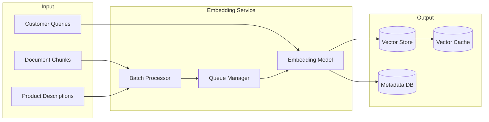

# Embedding Generation Pipelines

## Overview

Embedding pipelines transform text, images, or structured data into dense vector representations that power semantic search, RAG retrieval, clustering, and recommendation systems. In banking GenAI platforms, embeddings enable customers to ask natural language questions about their accounts, products, and financial documents. This guide covers batch and streaming embedding generation, monitoring, versioning, and infrastructure patterns.

## Embedding Pipeline Architecture



## Batch Embedding Pipeline

```python
"""
Batch embedding pipeline for banking document corpus.
Handles thousands of documents with retry, monitoring, and idempotency.
"""
import asyncio
import logging
from datetime import datetime
from typing import List, Dict, Optional
from dataclasses import dataclass
from openai import AsyncOpenAI
import psycopg2
from psycopg2.extras import execute_values

logger = logging.getLogger(__name__)

@dataclass
class EmbeddingJob:
    """Track an embedding batch job."""
    job_id: str
    model: str
    model_version: str
    total_items: int
    processed_items: int = 0
    failed_items: int = 0
    status: str = 'PENDING'  # PENDING, RUNNING, COMPLETE, FAILED
    started_at: Optional[datetime] = None
    completed_at: Optional[datetime] = None

class EmbeddingPipeline:
    """Production embedding pipeline for banking documents."""
    
    def __init__(
        self,
        db_config: dict,
        embedding_config: dict,
        batch_size: int = 200,
        max_concurrent: int = 10,
    ):
        self.db_config = db_config
        self.client = AsyncOpenAI(
            api_key=embedding_config.get('api_key'),
            base_url=embedding_config.get('base_url'),
        )
        self.model = embedding_config.get('model', 'text-embedding-3-large')
        self.dimensions = embedding_config.get('dimensions', 1536)
        self.batch_size = batch_size
        self.semaphore = asyncio.Semaphore(max_concurrent)
        
        # Metrics
        self.total_tokens = 0
        self.total_api_calls = 0
        self.total_errors = 0
    
    async def run(self, items: List[Dict]) -> EmbeddingJob:
        """Run the embedding pipeline."""
        job = EmbeddingJob(
            job_id=f"emb-{datetime.utcnow().strftime('%Y%m%d-%H%M%S')}",
            model=self.model,
            model_version=self.model,
            total_items=len(items),
            started_at=datetime.utcnow(),
            status='RUNNING',
        )
        
        logger.info(f"Starting embedding job {job.job_id}: {len(items)} items")
        
        # Filter out already embedded items (idempotency)
        items_to_process = await self._filter_already_embedded(items)
        logger.info(f"Items to process: {len(items_to_process)} (skipped {len(items) - len(items_to_process)})")
        
        # Process in batches
        tasks = []
        for i in range(0, len(items_to_process), self.batch_size):
            batch = items_to_process[i:i + self.batch_size]
            task = asyncio.create_task(self._process_batch(batch, job))
            tasks.append(task)
        
        results = await asyncio.gather(*tasks, return_exceptions=True)
        
        # Handle results
        for result in results:
            if isinstance(result, Exception):
                job.failed_items += self.batch_size
                logger.error(f"Batch failed: {result}")
        
        job.status = 'FAILED' if job.failed_items > 0 else 'COMPLETE'
        job.completed_at = datetime.utcnow()
        job.processed_items = len(items_to_process) - job.failed_items
        
        # Save job status
        await self._save_job_status(job)
        
        logger.info(
            f"Job {job.job_id} complete: "
            f"{job.processed_items} processed, "
            f"{job.failed_items} failed, "
            f"{self.total_tokens} tokens, "
            f"{self.total_api_calls} API calls"
        )
        
        return job
    
    async def _process_batch(
        self, batch: List[Dict], job: EmbeddingJob
    ) -> List[Dict]:
        """Process a batch of items through the embedding model."""
        async with self.semaphore:
            texts = [item['content'] for item in batch]
            ids = [item['id'] for item in batch]
            
            try:
                response = await self.client.embeddings.create(
                    input=texts,
                    model=self.model,
                )
                
                self.total_tokens += response.usage.total_tokens
                self.total_api_calls += 1
                
                # Store embeddings
                embeddings = [
                    (item_id, emb.embedding, self.model, datetime.utcnow())
                    for item_id, emb in zip(ids, response.data)
                ]
                
                await self._store_embeddings(embeddings)
                
                return embeddings
            
            except Exception as e:
                self.total_errors += 1
                logger.error(f"Embedding batch failed: {e}")
                raise
    
    async def _filter_already_embedded(self, items: List[Dict]) -> List[Dict]:
        """Filter out items that already have embeddings for this model."""
        ids = [item['id'] for item in items]
        
        conn = psycopg2.connect(**self.db_config)
        with conn.cursor() as cur:
            cur.execute("""
                SELECT DISTINCT item_id 
                FROM embeddings 
                WHERE model = %s 
                  AND item_id = ANY(%s)
            """, (self.model, ids))
            
            existing_ids = {row[0] for row in cur.fetchall()}
        
        conn.close()
        
        return [item for item in items if item['id'] not in existing_ids]
    
    async def _store_embeddings(self, embeddings: List[tuple]):
        """Store embeddings in PostgreSQL with pgvector."""
        conn = psycopg2.connect(**self.db_config)
        
        try:
            with conn.cursor() as cur:
                execute_values(
                    cur,
                    """
                    INSERT INTO embeddings 
                        (item_id, embedding, model, created_at)
                    VALUES %s
                    ON CONFLICT (item_id, model) DO UPDATE SET
                        embedding = EXCLUDED.embedding,
                        model_version = EXCLUDED.model_version,
                        created_at = EXCLUDED.created_at
                    """,
                    embeddings,
                    page_size=100,
                )
            conn.commit()
        except Exception as e:
            conn.rollback()
            raise
        finally:
            conn.close()
    
    async def _save_job_status(self, job: EmbeddingJob):
        """Save job status to tracking table."""
        conn = psycopg2.connect(**self.db_config)
        with conn.cursor() as cur:
            cur.execute("""
                INSERT INTO embedding_jobs 
                    (job_id, model, model_version, total_items, 
                     processed_items, failed_items, status,
                     started_at, completed_at, total_tokens, total_api_calls)
                VALUES (%s, %s, %s, %s, %s, %s, %s, %s, %s, %s, %s)
            """, (
                job.job_id, job.model, job.model_version, job.total_items,
                job.processed_items, job.failed_items, job.status,
                job.started_at, job.completed_at,
                self.total_tokens, self.total_api_calls,
            ))
        conn.commit()
        conn.close()
```

## Embedding Monitoring

```python
"""Embedding pipeline monitoring and quality tracking."""
from prometheus_client import Counter, Histogram, Gauge
import numpy as np

# Metrics
embedding_latency = Histogram(
    'embedding_latency_seconds',
    'Time to generate embeddings',
    ['model', 'batch_size']
)

embedding_error_rate = Counter(
    'embedding_errors_total',
    'Total embedding errors',
    ['model', 'error_type']
)

embedding_dimension_check = Gauge(
    'embedding_dimension_verified',
    'Whether embedding dimensions match expected',
    ['model']
)

embedding_distribution_drift = Gauge(
    'embedding_distribution_drift',
    'KL divergence from baseline embedding distribution',
    ['model']
)

class EmbeddingQualityMonitor:
    """Monitor embedding quality and detect issues."""
    
    def __init__(self, expected_dimension: int):
        self.expected_dimension = expected_dimension
        self.baseline_stats = None
    
    def validate_embeddings(self, embeddings: list) -> dict:
        """Validate a batch of embeddings."""
        issues = []
        
        # Dimension check
        for i, emb in enumerate(embeddings):
            if len(emb) != self.expected_dimension:
                issues.append({
                    'type': 'WRONG_DIMENSION',
                    'index': i,
                    'expected': self.expected_dimension,
                    'actual': len(emb),
                })
        
        # Null/NaN check
        for i, emb in enumerate(embeddings):
            if any(v is None or (isinstance(v, float) and np.isnan(v)) for v in emb):
                issues.append({
                    'type': 'CONTAINS_NULL',
                    'index': i,
                })
        
        # Magnitude check (embeddings should have reasonable magnitude)
        for i, emb in enumerate(embeddings):
            magnitude = np.linalg.norm(emb)
            if magnitude < 0.001 or magnitude > 100:
                issues.append({
                    'type': 'UNUSUAL_MAGNITUDE',
                    'index': i,
                    'magnitude': float(magnitude),
                })
        
        # Zero vector check
        for i, emb in enumerate(embeddings):
            if np.allclose(emb, 0):
                issues.append({
                    'type': 'ZERO_VECTOR',
                    'index': i,
                })
        
        return {
            'total': len(embeddings),
            'issues': issues,
            'valid_count': len(embeddings) - len(issues),
            'valid_rate': (len(embeddings) - len(issues)) / len(embeddings) if embeddings else 0,
        }
    
    def detect_distribution_drift(
        self, current_embeddings: np.ndarray
    ) -> float:
        """Detect if current embedding distribution differs from baseline."""
        if self.baseline_stats is None:
            # Establish baseline
            self.baseline_stats = {
                'mean': np.mean(current_embeddings, axis=0),
                'std': np.std(current_embeddings, axis=0),
            }
            return 0.0
        
        # Compare distributions
        current_mean = np.mean(current_embeddings, axis=0)
        baseline_mean = self.baseline_stats['mean']
        
        drift = np.linalg.norm(current_mean - baseline_mean)
        
        embedding_distribution_drift.labels(model='text-embedding-3-large').set(drift)
        
        if drift > 1.0:  # Threshold
            logger.warning(f"Embedding distribution drift detected: {drift:.4f}")
        
        return float(drift)
```

## Cross-References

- **GenAI Data Prep**: See [genai-data-prep.md](genai-data-prep.md) for document processing
- **pgvector**: See [pgvector.md](../databases/pgvector.md) for vector storage
- **GPU Workloads**: See [gpu-workloads.md](../kubernetes-openshift/gpu-workloads.md) for GPU serving

## Interview Questions

1. **How do you design an idempotent embedding pipeline?**
2. **Your embedding model version changes. What is the migration strategy?**
3. **How do you detect and handle embedding API rate limits?**
4. **What metrics do you track for embedding pipeline health?**
5. **How do you choose between OpenAI embeddings vs open-source models (SentenceTransformers)?**
6. **How do you handle embedding generation for 1M documents with a 24-hour SLA?**

## Checklist: Embedding Pipeline Production Readiness

- [ ] Idempotent writes (re-running doesn't duplicate)
- [ ] Batch processing with configurable batch size
- [ ] Rate limiting and retry with exponential backoff
- [ ] Embedding validation (dimensions, nulls, magnitude)
- [ ] Distribution drift detection
- [ ] Job tracking with status and metrics
- [ ] Cost tracking (tokens, API calls, estimated cost)
- [ ] Model versioning in storage schema
- [ ] Stale embedding detection and re-embedding trigger
- [ ] Monitoring dashboards for latency, errors, and quality
